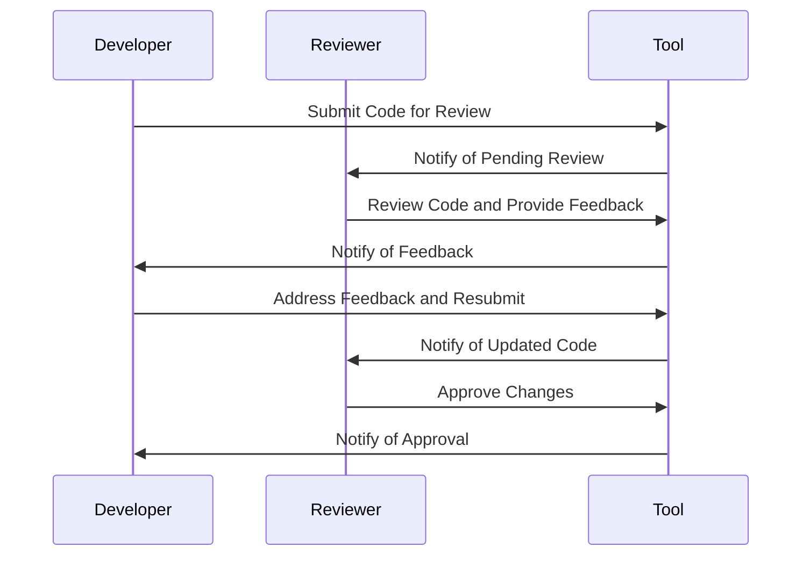

## 19.4 Code Review Practices

Code review is a critical practice in software development that involves the systematic examination of code by peers to identify mistakes overlooked in the initial development phase. In the context of Haxe, a cross-platform toolkit, code reviews are essential for maintaining high-quality, efficient, and portable code. This section delves into the best practices for conducting effective code reviews, the tools available, and the benefits they bring to a development team.

### Introduction to Code Review

Code review is more than just a quality assurance step; it is a collaborative process that fosters knowledge sharing, improves code quality, and ensures adherence to coding standards. By integrating code reviews into your development workflow, you can catch errors early, promote best practices, and facilitate team learning.

### Implementing Code Reviews

#### Establish Guidelines

1. **Define Objectives:** Clearly outline what the code review aims to achieve. This could include checking for logic errors, ensuring code readability, verifying adherence to coding standards, and assessing the overall design.

2. **Create a Checklist:** Develop a checklist that reviewers can use to ensure consistency. This checklist might include items such as:
   - Adherence to naming conventions
   - Proper use of Haxe language features
   - Code readability and maintainability
   - Test coverage and quality
   - Performance considerations

3. **Set Expectations:** Communicate the expected turnaround time for reviews and the level of detail required. This helps manage workloads and ensures timely feedback.

#### Use Tools

1. **Version Control Systems:** Utilize platforms like GitHub, GitLab, or Bitbucket, which offer built-in code review features. These tools allow for inline comments, pull request reviews, and integration with CI/CD pipelines.

2. **Automated Code Review Tools:** Consider using tools like SonarQube or Codacy that can automatically analyze code for potential issues, style violations, and security vulnerabilities.

3. **Code Review Plugins:** Leverage IDE plugins that facilitate code reviews directly within the development environment, providing a seamless experience for developers.

### Benefits of Code Reviews

#### Knowledge Sharing

- **Team Awareness:** Code reviews ensure that all team members are aware of code changes, fostering a collaborative environment where knowledge is shared and collective ownership of the codebase is encouraged.

- **Skill Development:** Junior developers can learn from more experienced team members through the feedback provided during reviews, accelerating their professional growth.

#### Quality Improvement

- **Error Detection:** Code reviews help catch errors that automated tests might miss, such as logic flaws, edge cases, and potential performance bottlenecks.

- **Best Practices Promotion:** By reviewing code, teams can ensure that best practices are consistently applied, leading to a more maintainable and scalable codebase.

### Code Review Process

#### Preparing for a Code Review

1. **Self-Review:** Before submitting code for review, conduct a self-review to catch obvious errors and ensure the code meets the team's standards.

2. **Documentation:** Provide clear documentation and comments within the code to help reviewers understand the context and purpose of the changes.

3. **Test Coverage:** Ensure that the code is well-tested and that tests are included with the submission. This demonstrates that the code works as intended and reduces the reviewer's burden.

#### Conducting the Review

1. **Focus on the Code, Not the Author:** Keep feedback objective and focused on the code itself, avoiding personal criticism.

2. **Be Constructive:** Provide actionable feedback that helps the author improve their code. Highlight what is done well in addition to areas for improvement.

3. **Prioritize Issues:** Address critical issues first, such as security vulnerabilities or major logic errors, before moving on to minor style or formatting concerns.

#### Post-Review Actions

1. **Address Feedback:** The author should address all feedback provided during the review, making necessary changes and responding to comments.

2. **Follow-Up:** Once changes are made, a follow-up review may be necessary to ensure all issues have been resolved satisfactorily.

3. **Continuous Improvement:** Use insights gained from code reviews to refine guidelines and processes, fostering a culture of continuous improvement.

### Code Review Best Practices

#### Encourage a Positive Culture

- **Foster Respect:** Encourage a respectful and supportive environment where feedback is given and received constructively.

- **Celebrate Successes:** Acknowledge and celebrate well-written code and innovative solutions, reinforcing positive behavior.

#### Balance Review Depth and Speed

- **Avoid Overloading Reviewers:** Ensure that code reviews are manageable in size and scope, preventing reviewer fatigue and ensuring thoroughness.

- **Set Time Limits:** Establish reasonable time limits for reviews to maintain momentum and prevent bottlenecks in the development process.

#### Tailor Reviews to the Team's Needs

- **Adapt Guidelines:** Regularly review and adapt code review guidelines to meet the evolving needs of the team and project.

- **Customize Tools:** Configure code review tools to align with the team's workflow and preferences, maximizing their effectiveness.

### Code Review in Cross-Platform Development

In Haxe development, where code is often intended to run on multiple platforms, code reviews play a crucial role in ensuring cross-platform compatibility and performance. Reviewers should pay special attention to:

- **Platform-Specific Code:** Identify and isolate platform-specific code, ensuring it is well-documented and justified.

- **Conditional Compilation:** Verify that conditional compilation directives are used correctly to manage platform differences.

- **Performance Considerations:** Assess the performance implications of code changes on different target platforms, optimizing where necessary.

### Code Review Tools and Techniques

#### Code Review Tools

1. **GitHub Pull Requests:** GitHub's pull request feature allows for inline comments, discussions, and approvals, making it a popular choice for code reviews.

2. **GitLab Merge Requests:** Similar to GitHub, GitLab offers merge requests with robust code review capabilities, including inline comments and discussions.

3. **Bitbucket Pull Requests:** Bitbucket provides a comprehensive code review experience with inline comments, approvals, and integration with Jira for issue tracking.

#### Automated Code Review Tools

1. **SonarQube:** A popular tool for continuous inspection of code quality, SonarQube provides detailed reports on code issues, vulnerabilities, and technical debt.

2. **Codacy:** Codacy offers automated code reviews with support for multiple languages, including Haxe, providing insights into code quality and style adherence.

3. **Review Board:** An open-source tool that facilitates code reviews with features like inline comments, defect tracking, and integration with version control systems.

### Code Review Metrics

To measure the effectiveness of code reviews, consider tracking the following metrics:

- **Review Coverage:** The percentage of code changes that undergo review.
- **Review Turnaround Time:** The average time taken to complete a code review.
- **Defect Density:** The number of defects identified per lines of code reviewed.
- **Feedback Quality:** The usefulness and clarity of feedback provided during reviews.

### Try It Yourself

To practice code review, consider the following exercise:

1. **Select a Codebase:** Choose a small Haxe project or a portion of a larger project to review.

2. **Conduct a Self-Review:** Perform a self-review of the code, identifying areas for improvement.

3. **Peer Review:** Pair up with a colleague to conduct a peer review, providing constructive feedback and discussing potential improvements.

4. **Implement Changes:** Make the necessary changes based on the feedback received and conduct a follow-up review to ensure all issues are resolved.

### Visualizing the Code Review Process

**Diagram Description:** This sequence diagram illustrates the typical flow of a code review process, from submission to approval.

### Conclusion

Code reviews are an indispensable part of the software development lifecycle, especially in the context of cross-platform development with Haxe. By implementing effective code review practices, teams can enhance code quality, promote collaboration, and ensure the successful delivery of robust, maintainable software. Remember, the journey of mastering code reviews is ongoing, and continuous learning and adaptation are key to success.

## Quiz Time!



### What is the primary goal of a code review?

- [x] To identify mistakes overlooked in the initial development phase
- [ ] To replace automated testing
- [ ] To increase the number of lines of code
- [ ] To reduce the number of developers needed

> **Explanation:** The primary goal of a code review is to identify mistakes overlooked in the initial development phase, ensuring code quality and adherence to standards.

### Which tool is commonly used for code reviews in GitHub?

- [x] Pull Requests
- [ ] Issues
- [ ] Wikis
- [ ] Projects

> **Explanation:** GitHub's Pull Requests feature is commonly used for code reviews, allowing for inline comments and discussions.

### What should be included in a code review checklist?

- [x] Adherence to naming conventions
- [x] Proper use of Haxe language features
- [x] Code readability and maintainability
- [ ] Number of lines of code

> **Explanation:** A code review checklist should include items like adherence to naming conventions, proper use of language features, and code readability, but not the number of lines of code.

### What is a benefit of code reviews?

- [x] Knowledge sharing among team members
- [ ] Increasing code complexity
- [ ] Reducing code readability
- [ ] Decreasing collaboration

> **Explanation:** Code reviews promote knowledge sharing among team members, enhancing collaboration and code quality.

### What is a key consideration in cross-platform code reviews?

- [x] Platform-specific code
- [ ] Code length
- [ ] Number of comments
- [ ] Use of global variables

> **Explanation:** In cross-platform code reviews, it's important to pay attention to platform-specific code to ensure compatibility and performance.

### Which of the following is an automated code review tool?

- [x] SonarQube
- [ ] GitHub
- [ ] Slack
- [ ] Trello

> **Explanation:** SonarQube is an automated code review tool that provides insights into code quality and potential issues.

### What is a common metric for measuring code review effectiveness?

- [x] Review Coverage
- [ ] Number of developers
- [ ] Code length
- [ ] Number of comments

> **Explanation:** Review Coverage, the percentage of code changes that undergo review, is a common metric for measuring code review effectiveness.

### What should be the focus of feedback during a code review?

- [x] The code itself, not the author
- [ ] The author's personality
- [ ] The author's previous work
- [ ] The author's coding style

> **Explanation:** Feedback during a code review should focus on the code itself, not the author, to maintain objectivity and professionalism.

### What is the role of self-review in the code review process?

- [x] To catch obvious errors before submitting for peer review
- [ ] To replace peer review
- [ ] To increase code complexity
- [ ] To reduce the number of tests

> **Explanation:** Self-review helps catch obvious errors before submitting code for peer review, improving the overall quality of the submission.

### True or False: Code reviews are only beneficial for junior developers.

- [ ] True
- [x] False

> **Explanation:** Code reviews are beneficial for developers of all experience levels, as they promote knowledge sharing, collaboration, and code quality.


