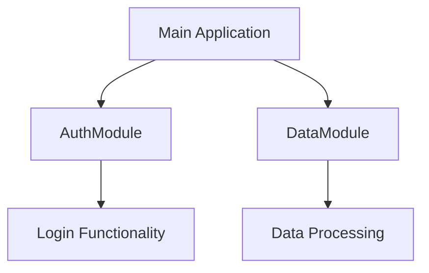
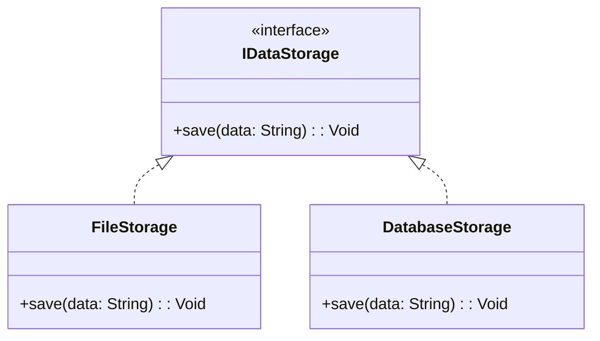

## 19.5 Scalability and Flexibility in Design

In the rapidly evolving landscape of software development, scalability and flexibility are paramount. As systems grow in complexity and user demand increases, the ability to scale and adapt becomes crucial. This section delves into strategies and considerations for achieving scalability and flexibility in software design using Haxe, a powerful cross-platform language. We will explore modular architecture, loose coupling, and asynchronous processing, and provide practical insights into anticipating growth and performance testing.

### Understanding Scalability and Flexibility

**Scalability** refers to a system's ability to handle increased load without compromising performance. It involves designing systems that can grow in capacity and functionality as needed. **Flexibility**, on the other hand, is about adaptability—how easily a system can accommodate changes in requirements or technology.

#### Key Concepts

- **Horizontal Scaling**: Adding more nodes to a system to distribute load.
- **Vertical Scaling**: Increasing the capacity of existing nodes.
- **Elasticity**: The ability to scale resources up or down dynamically.
- **Modularity**: Designing systems in self-contained units that can be independently developed and maintained.

### Strategies for Scalability and Flexibility

#### Modular Architecture

**Modular architecture** involves designing systems as a collection of independent modules. Each module encapsulates a specific functionality and interacts with others through well-defined interfaces. This approach enhances both scalability and flexibility by allowing individual modules to be developed, tested, and deployed independently.

**Benefits of Modular Architecture:**

- **Ease of Maintenance**: Isolate changes to specific modules without affecting the entire system.
- **Reusability**: Use modules across different projects or systems.
- **Parallel Development**: Enable teams to work on different modules simultaneously.

**Example: Modular Architecture in Haxe**

```haxe
// Define a module for user authentication
class AuthModule {
    public function new() {}

    public function login(username: String, password: String): Bool {
        // Authentication logic
        return true;
    }
}

// Define a module for data processing
class DataModule {
    public function new() {}

    public function processData(data: Array<Int>): Array<Int> {
        // Data processing logic
        return data.map(x -> x * 2);
    }
}

// Main application
class Main {
    static function main() {
        var auth = new AuthModule();
        var data = new DataModule();

        if (auth.login("user", "pass")) {
            var processedData = data.processData([1, 2, 3]);
            trace(processedData);
        }
    }
}
```

In this example, `AuthModule` and `DataModule` are independent modules that can be developed and tested separately. The `Main` class orchestrates their interaction.

#### Loose Coupling

**Loose coupling** minimizes dependencies between components, allowing them to change independently. This is achieved by defining clear interfaces and using dependency injection, where components are provided with their dependencies rather than creating them internally.

**Benefits of Loose Coupling:**

- **Flexibility**: Easily swap out components without affecting others.
- **Testability**: Isolate components for unit testing.
- **Scalability**: Distribute components across different servers or services.

**Example: Loose Coupling in Haxe**

```haxe
// Define an interface for data storage
interface IDataStorage {
    function save(data: String): Void;
}

// Implement the interface for file storage
class FileStorage implements IDataStorage {
    public function new() {}

    public function save(data: String): Void {
        // Save data to a file
        trace("Data saved to file: " + data);
    }
}

// Implement the interface for database storage
class DatabaseStorage implements IDataStorage {
    public function new() {}

    public function save(data: String): Void {
        // Save data to a database
        trace("Data saved to database: " + data);
    }
}

// Main application
class Main {
    static function main() {
        var storage: IDataStorage = new FileStorage();
        storage.save("Sample data");

        // Swap out the storage implementation
        storage = new DatabaseStorage();
        storage.save("Sample data");
    }
}
```

In this example, `IDataStorage` is an interface that defines a contract for data storage. `FileStorage` and `DatabaseStorage` are implementations that can be swapped out without changing the rest of the application.

#### Asynchronous Processing

**Asynchronous processing** involves performing tasks without blocking the main execution thread. This is crucial for scalability, as it allows systems to handle multiple tasks concurrently, improving responsiveness and throughput.

**Benefits of Asynchronous Processing:**

- **Improved Performance**: Handle more requests simultaneously.
- **Resource Efficiency**: Utilize system resources more effectively.
- **User Experience**: Provide a smoother and more responsive interface.

**Example: Asynchronous Processing in Haxe**

```haxe
import haxe.Timer;

// Simulate an asynchronous task
function asyncTask(callback: () -> Void): Void {
    Timer.delay(() -> {
        trace("Task completed");
        callback();
    }, 1000);
}

// Main application
class Main {
    static function main() {
        trace("Starting task...");
        asyncTask(() -> trace("Callback executed"));
        trace("Task started");
    }
}
```

In this example, `asyncTask` simulates an asynchronous operation using `Timer.delay`. The main execution continues while the task completes in the background.

### Considerations for Scalability and Flexibility

#### Anticipate Growth

When designing systems, it's essential to anticipate future growth. This involves understanding potential bottlenecks and designing with scalability in mind from the outset.

**Strategies to Anticipate Growth:**

- **Load Testing**: Simulate increased load to identify performance limits.
- **Capacity Planning**: Estimate future resource requirements based on growth projections.
- **Scalable Infrastructure**: Use cloud services that offer elastic scaling.

#### Performance Testing

Regular performance testing is crucial to ensure that systems can handle increased loads. This involves monitoring key metrics such as response time, throughput, and resource utilization.

**Performance Testing Techniques:**

- **Stress Testing**: Determine the system's breaking point by applying extreme load.
- **Load Testing**: Assess performance under expected load conditions.
- **Benchmarking**: Compare performance against industry standards or competitors.

### Visualizing Scalability and Flexibility

To better understand the concepts of scalability and flexibility, let's visualize them using diagrams.

#### Modular Architecture Diagram



**Diagram Description:** This diagram illustrates a modular architecture where the main application interacts with independent modules for authentication and data processing.

#### Loose Coupling Diagram



**Diagram Description:** This class diagram shows the loose coupling achieved through the `IDataStorage` interface, allowing different storage implementations to be used interchangeably.

### Try It Yourself

Experiment with the code examples provided:

- **Modify the `AuthModule`** to include additional authentication methods, such as OAuth.
- **Implement a new storage type** in the loose coupling example, such as cloud storage.
- **Change the delay in `asyncTask`** to see how it affects the application's responsiveness.

### References and Links

- [Haxe Documentation](https://haxe.org/documentation/)
- [Design Patterns in Haxe](https://haxe.org/manual/design-patterns.html)
- [Asynchronous Programming in Haxe](https://haxe.org/manual/async.html)

### Knowledge Check

- **What are the benefits of modular architecture?**
- **How does loose coupling enhance flexibility?**
- **Why is asynchronous processing important for scalability?**

### Embrace the Journey

Remember, scalability and flexibility are ongoing processes. As you continue to develop and refine your systems, keep exploring new strategies and technologies. Stay curious, experiment, and enjoy the journey of mastering Haxe for cross-platform development.

## Quiz Time!



### What is the primary benefit of modular architecture in software design?

- [x] It allows for independent development and maintenance of components.
- [ ] It reduces the overall size of the codebase.
- [ ] It eliminates the need for testing.
- [ ] It automatically scales the application.

> **Explanation:** Modular architecture allows for independent development and maintenance of components, making it easier to manage and scale the system.

### How does loose coupling contribute to system flexibility?

- [x] By minimizing dependencies between components.
- [ ] By increasing the number of components.
- [ ] By using more complex algorithms.
- [ ] By reducing the need for interfaces.

> **Explanation:** Loose coupling minimizes dependencies between components, allowing them to change independently and enhancing system flexibility.

### What is a key advantage of asynchronous processing?

- [x] It improves system responsiveness and throughput.
- [ ] It simplifies the codebase.
- [ ] It reduces the need for error handling.
- [ ] It eliminates the need for testing.

> **Explanation:** Asynchronous processing improves system responsiveness and throughput by allowing tasks to be handled concurrently.

### Which of the following is a technique for performance testing?

- [x] Load Testing
- [ ] Code Refactoring
- [ ] Interface Design
- [ ] Modularization

> **Explanation:** Load testing is a technique used to assess system performance under expected load conditions.

### What is the purpose of capacity planning?

- [x] To estimate future resource requirements based on growth projections.
- [ ] To reduce the number of system components.
- [ ] To eliminate the need for testing.
- [ ] To simplify the codebase.

> **Explanation:** Capacity planning involves estimating future resource requirements based on growth projections to ensure scalability.

### What does horizontal scaling involve?

- [x] Adding more nodes to a system to distribute load.
- [ ] Increasing the capacity of existing nodes.
- [ ] Reducing the number of system components.
- [ ] Simplifying the codebase.

> **Explanation:** Horizontal scaling involves adding more nodes to a system to distribute load and improve scalability.

### What is elasticity in the context of scalability?

- [x] The ability to scale resources up or down dynamically.
- [ ] The ability to reduce system complexity.
- [ ] The ability to eliminate testing requirements.
- [ ] The ability to simplify code.

> **Explanation:** Elasticity refers to the ability to scale resources up or down dynamically, allowing systems to adapt to changing demands.

### Why is performance testing important for scalable systems?

- [x] To ensure systems can handle increased loads.
- [ ] To reduce the number of system components.
- [ ] To simplify the codebase.
- [ ] To eliminate the need for testing.

> **Explanation:** Performance testing is important to ensure systems can handle increased loads and maintain performance as demand grows.

### What is the role of interfaces in achieving loose coupling?

- [x] They define clear contracts for component interaction.
- [ ] They increase the number of system components.
- [ ] They simplify the codebase.
- [ ] They eliminate the need for testing.

> **Explanation:** Interfaces define clear contracts for component interaction, allowing for loose coupling and flexibility in system design.

### True or False: Vertical scaling involves adding more nodes to a system.

- [ ] True
- [x] False

> **Explanation:** Vertical scaling involves increasing the capacity of existing nodes, not adding more nodes to the system.


