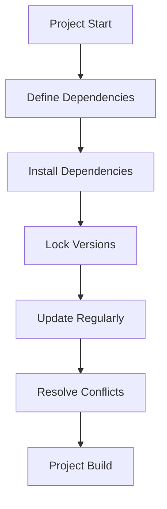
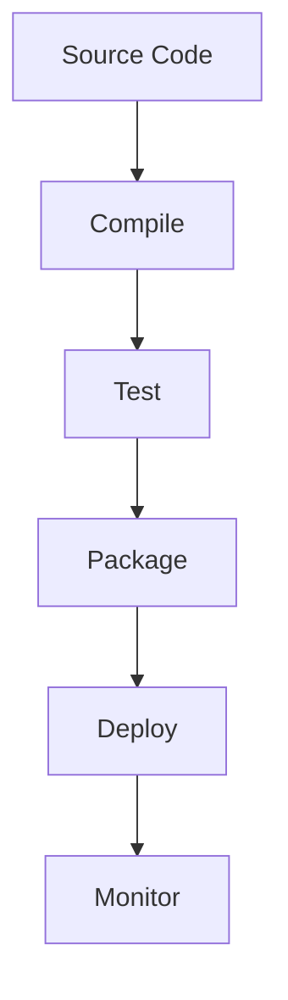

## 19.6 Dependency Management and Build Tools

In the realm of software development, managing dependencies and utilizing build tools effectively are crucial for maintaining clean, efficient, and scalable projects. This is especially true in Haxe, a language celebrated for its cross-platform capabilities. In this section, we will delve into the tools and best practices that will empower you to master dependency management and build processes in Haxe.

### Understanding Dependency Management

Dependency management is the process of handling external libraries and modules that your project relies on. Proper management ensures that your project remains stable, maintainable, and free from conflicts. In Haxe, the primary tool for managing dependencies is **Haxelib**.

#### Haxelib: The Haxe Library Manager

Haxelib is the official package manager for Haxe. It allows you to easily install, update, and manage libraries. Here's a quick overview of how to use Haxelib:

- **Installing a Library**: Use the `haxelib install` command to add a library to your project.

  ```bash
  haxelib install openfl
  ```

- **Listing Installed Libraries**: Use `haxelib list` to see all the libraries currently installed.

  ```bash
  haxelib list
  ```

- **Updating a Library**: To update a library to its latest version, use `haxelib upgrade`.

  ```bash
  haxelib upgrade openfl
  ```

- **Removing a Library**: If you need to remove a library, use `haxelib remove`.

  ```bash
  haxelib remove openfl
  ```

#### Best Practices for Dependency Management

1. **Version Control**: Always specify and lock dependency versions to ensure consistency across different environments. This can be done using the `haxelib.json` file in your project.

   ```json
   {
     "name": "myproject",
     "dependencies": {
       "openfl": "8.9.7",
       "lime": "7.7.0"
     }
   }
   ```

2. **Isolation**: Use virtual environments or containers to avoid conflicts between different projects. Tools like Docker can be invaluable for this purpose.

3. **Regular Updates**: Regularly update your dependencies to benefit from the latest features and security patches, but ensure compatibility with your existing codebase.

### Build Systems in Haxe

For complex projects, especially those that span multiple platforms, a robust build system is essential. Haxe supports several build systems, including `lix`, `Gradle`, and `Maven`.

#### Lix: A Modern Build Tool for Haxe

Lix is a powerful tool for managing Haxe projects, offering features like version management and dependency resolution. Here's how you can get started with Lix:

- **Installing Lix**: First, install Lix using npm.

  ```bash
  npm install -g lix
  ```

- **Initializing a Project**: Use `lix init` to set up a new Haxe project.

  ```bash
  lix init myproject
  ```

- **Managing Dependencies**: Lix allows you to specify dependencies in a `haxeshim.json` file.

  ```json
  {
    "dependencies": {
      "haxe": "4.2.3",
      "openfl": "8.9.7"
    }
  }
  ```

- **Building the Project**: Use `lix build` to compile your project.

  ```bash
  lix build
  ```

#### Gradle and Maven: Integrating with Java Ecosystems

For projects that require integration with Java ecosystems, Gradle and Maven are excellent choices. They provide powerful dependency management and build automation capabilities.

- **Gradle**: Use Gradle's Haxe plugin to manage Haxe projects alongside Java projects.

  ```groovy
  plugins {
    id 'org.haxe.gradle' version '1.0.0'
  }

  haxe {
    sourceSets {
      main {
        haxe {
          srcDirs = ['src']
        }
      }
    }
  }
  ```

- **Maven**: Similarly, Maven can be configured to handle Haxe projects using custom plugins.

  ```xml
  <build>
    <plugins>
      <plugin>
        <groupId>org.haxe</groupId>
        <artifactId>haxe-maven-plugin</artifactId>
        <version>1.0.0</version>
      </plugin>
    </plugins>
  </build>
  ```

### Best Practices for Build Tools

1. **Consistency**: Ensure that your build process is consistent across all environments. Use configuration files to define build settings and dependencies.

2. **Automation**: Automate your build process as much as possible. This reduces the risk of human error and speeds up development.

3. **Continuous Integration**: Integrate your build system with a CI/CD pipeline to automatically test and deploy your code.

### Visualizing Dependency Management and Build Processes

To better understand the flow of dependency management and build processes, let's visualize these concepts using Mermaid.js diagrams.

#### Dependency Management Flow



**Diagram Description**: This flowchart illustrates the typical steps involved in managing dependencies, from defining and installing them to resolving conflicts and building the project.

#### Build Process Flow



**Diagram Description**: This diagram represents the build process, starting from compiling the source code to deploying and monitoring the application.

### Try It Yourself

To solidify your understanding, try modifying the code examples provided. For instance, change the version numbers in the `haxelib.json` or `haxeshim.json` files and observe how the build process is affected. Experiment with different build tools to see which best fits your project's needs.

### References and Further Reading

- [Haxelib Documentation](https://lib.haxe.org/documentation/)
- [Lix Documentation](https://github.com/lix-pm/lix.client)
- [Gradle Haxe Plugin](https://plugins.gradle.org/plugin/org.haxe.gradle)
- [Maven Haxe Plugin](https://maven.apache.org/plugins/)

### Knowledge Check

- What is the primary tool for managing dependencies in Haxe?
- How can you lock dependency versions in a Haxe project?
- What are the benefits of using a build system like Lix?
- How can Docker help in managing dependencies?
- Why is it important to automate the build process?

### Embrace the Journey

Remember, mastering dependency management and build tools is a journey. As you progress, you'll find more efficient ways to manage your projects and streamline your workflows. Keep experimenting, stay curious, and enjoy the process!

## Quiz Time!



### What is the primary tool for managing dependencies in Haxe?

- [x] Haxelib
- [ ] Gradle
- [ ] Maven
- [ ] Docker

> **Explanation:** Haxelib is the official package manager for Haxe, used to manage libraries and dependencies.

### Which command is used to install a library using Haxelib?

- [x] `haxelib install`
- [ ] `haxelib add`
- [ ] `haxelib get`
- [ ] `haxelib fetch`

> **Explanation:** The `haxelib install` command is used to add a library to your project.

### What is the purpose of specifying and locking dependency versions?

- [x] To ensure consistency across different environments
- [ ] To increase the size of the project
- [ ] To make the project run slower
- [ ] To confuse developers

> **Explanation:** Locking dependency versions ensures that the same versions are used across all environments, preventing compatibility issues.

### Which tool can be used to create isolated environments for Haxe projects?

- [x] Docker
- [ ] Gradle
- [ ] Maven
- [ ] Haxelib

> **Explanation:** Docker can be used to create isolated environments, avoiding conflicts between different projects.

### What is the benefit of automating the build process?

- [x] Reduces the risk of human error
- [ ] Increases the complexity of the project
- [ ] Makes the project harder to maintain
- [ ] Slows down development

> **Explanation:** Automating the build process reduces the risk of human error and speeds up development.

### Which build tool is specifically designed for Haxe projects?

- [x] Lix
- [ ] Gradle
- [ ] Maven
- [ ] Docker

> **Explanation:** Lix is a modern build tool specifically designed for managing Haxe projects.

### How can you update a library to its latest version using Haxelib?

- [x] `haxelib upgrade`
- [ ] `haxelib update`
- [ ] `haxelib refresh`
- [ ] `haxelib renew`

> **Explanation:** The `haxelib upgrade` command is used to update a library to its latest version.

### What is the role of a CI/CD pipeline in the build process?

- [x] To automatically test and deploy code
- [ ] To manually test code
- [ ] To slow down the build process
- [ ] To increase the number of bugs

> **Explanation:** A CI/CD pipeline automates the testing and deployment of code, ensuring a smooth and efficient build process.

### True or False: Gradle and Maven can be used to integrate Haxe projects with Java ecosystems.

- [x] True
- [ ] False

> **Explanation:** Gradle and Maven are build tools that can be used to manage Haxe projects alongside Java projects, providing powerful dependency management and build automation capabilities.

### What is the first step in the dependency management flow?

- [x] Define Dependencies
- [ ] Install Dependencies
- [ ] Lock Versions
- [ ] Update Regularly

> **Explanation:** The first step in managing dependencies is to define them, specifying which libraries and modules your project will rely on.


