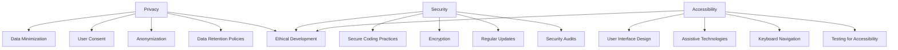

## 19.7 Ethical Considerations in Development

In the rapidly evolving world of software development, ethical considerations have become paramount. As developers, we wield significant power in shaping the digital landscape, and with this power comes the responsibility to ensure that our creations are not only functional and efficient but also ethical. This section delves into the critical areas of concern—privacy, security, and accessibility—and provides guidelines for implementing inclusive design and transparency in your Haxe projects.

### Areas of Concern

#### Privacy

Privacy is a fundamental human right, and as software developers, we must prioritize the protection of user data. In an era where data breaches and unauthorized data collection are rampant, respecting privacy laws and implementing robust data protection measures are essential.

**Key Considerations:**

- **Data Minimization:** Collect only the data necessary for the functionality of your application. Avoid gathering excessive information that could compromise user privacy.
  
- **User Consent:** Obtain explicit consent from users before collecting, processing, or sharing their data. Ensure that consent mechanisms are clear and not buried in lengthy terms and conditions.

- **Anonymization:** Where possible, anonymize user data to protect identities. This can involve removing personally identifiable information (PII) or using pseudonyms.

- **Data Retention Policies:** Establish clear data retention policies and ensure that data is not kept longer than necessary. Implement mechanisms for users to request data deletion.

**Code Example: Implementing Privacy in Haxe**

```haxe
class UserDataManager {
    private var userData:Map<String, Dynamic>;

    public function new() {
        userData = new Map<String, Dynamic>();
    }

    // Collect only necessary data
    public function collectData(userId:String, data:Dynamic):Void {
        if (isDataNecessary(data)) {
            userData.set(userId, anonymizeData(data));
        }
    }

    // Check if data is necessary
    private function isDataNecessary(data:Dynamic):Bool {
        // Implement logic to determine necessity
        return true;
    }

    // Anonymize data
    private function anonymizeData(data:Dynamic):Dynamic {
        // Implement anonymization logic
        return data;
    }

    // Delete user data upon request
    public function deleteUserData(userId:String):Void {
        userData.remove(userId);
    }
}
```

#### Security

Security is another critical ethical consideration in software development. As developers, we must prioritize the security of our applications to prevent misuse and protect users from potential harm.

**Key Considerations:**

- **Secure Coding Practices:** Follow secure coding practices to minimize vulnerabilities. This includes input validation, proper error handling, and avoiding hard-coded credentials.

- **Encryption:** Use encryption to protect sensitive data both at rest and in transit. This ensures that even if data is intercepted, it cannot be easily accessed.

- **Regular Updates:** Keep your software and dependencies up to date to protect against known vulnerabilities. Implement automated testing to ensure updates do not introduce new issues.

- **Security Audits:** Conduct regular security audits and penetration testing to identify and address potential vulnerabilities.

**Code Example: Implementing Security in Haxe**

```haxe
class SecureDataHandler {
    private var encryptedData:Map<String, String>;

    public function new() {
        encryptedData = new Map<String, String>();
    }

    // Encrypt data before storing
    public function storeData(userId:String, data:String):Void {
        var encrypted:String = encryptData(data);
        encryptedData.set(userId, encrypted);
    }

    // Encrypt data using a simple algorithm (for demonstration purposes)
    private function encryptData(data:String):String {
        // Implement encryption logic
        return Base64.encode(data);
    }

    // Decrypt data when retrieving
    public function retrieveData(userId:String):String {
        var encrypted:String = encryptedData.get(userId);
        return decryptData(encrypted);
    }

    // Decrypt data using a simple algorithm (for demonstration purposes)
    private function decryptData(data:String):String {
        // Implement decryption logic
        return Base64.decode(data);
    }
}
```

#### Accessibility

Accessibility ensures that applications are usable by people with disabilities. It is an ethical imperative to design software that is inclusive and accessible to all users, regardless of their abilities.

**Key Considerations:**

- **User Interface Design:** Design interfaces that are easy to navigate and understand. Use clear labels, sufficient contrast, and scalable fonts.

- **Assistive Technologies:** Ensure compatibility with assistive technologies such as screen readers, voice recognition software, and alternative input devices.

- **Keyboard Navigation:** Provide keyboard shortcuts and ensure that all functionalities are accessible via keyboard.

- **Testing for Accessibility:** Conduct accessibility testing using tools and real users to identify and address barriers.

**Code Example: Implementing Accessibility in Haxe**

```haxe
class AccessibleUI {
    public function new() {
        // Initialize UI components
    }

    // Create a button with accessible features
    public function createAccessibleButton(label:String, action:Void->Void):Button {
        var button = new Button();
        button.label = label;
        button.onClick = action;

        // Ensure high contrast and scalable font
        button.style = {
            fontSize: "1.5em",
            color: "#000000",
            backgroundColor: "#FFFFFF"
        };

        // Add keyboard shortcut
        button.addEventListener(KeyboardEvent.KEY_DOWN, function(event:KeyboardEvent) {
            if (event.keyCode == Keyboard.ENTER) {
                action();
            }
        });

        return button;
    }
}
```

### Guidelines

#### Inclusive Design

Inclusive design is about considering diverse user needs and creating solutions that work for everyone. It involves understanding the different ways people interact with technology and designing with empathy.

**Principles of Inclusive Design:**

- **User Diversity:** Recognize and respect the diversity of users, including differences in abilities, cultures, and contexts.

- **Flexibility:** Design flexible solutions that can be adapted to different user needs and preferences.

- **Equity:** Ensure that all users have equal access to information and functionality.

- **Participation:** Involve users in the design process to gain insights into their needs and preferences.

**Code Example: Implementing Inclusive Design in Haxe**

```haxe
class InclusiveApp {
    public function new() {
        // Initialize application
    }

    // Create a flexible UI component
    public function createFlexibleComponent():Dynamic {
        var component = new DynamicComponent();
        
        // Allow customization of appearance and behavior
        component.customizeAppearance({color: "#0000FF", fontSize: "1.2em"});
        component.customizeBehavior({onClick: this.handleClick});

        return component;
    }

    // Handle click event
    private function handleClick():Void {
        // Implement click handling logic
    }
}
```

#### Transparency

Transparency involves being clear about data usage and policies. Users should be informed about what data is collected, how it is used, and who it is shared with.

**Principles of Transparency:**

- **Clear Communication:** Use simple and clear language to explain data practices. Avoid jargon and legalese that can confuse users.

- **Open Policies:** Make privacy policies and terms of service easily accessible and understandable.

- **User Control:** Provide users with control over their data, including options to opt-out of data collection and request data deletion.

- **Accountability:** Be accountable for data practices and address user concerns promptly.

**Code Example: Implementing Transparency in Haxe**

```haxe
class TransparentDataPolicy {
    public function new() {
        // Initialize data policy
    }

    // Display data usage policy
    public function displayPolicy():Void {
        trace("We collect data to improve user experience. Your data is never shared without consent.");
    }

    // Allow users to opt-out of data collection
    public function optOut(userId:String):Void {
        // Implement opt-out logic
        trace("User " + userId + " has opted out of data collection.");
    }
}
```

### Visualizing Ethical Considerations

To better understand the interplay between privacy, security, and accessibility, let's visualize these concepts using a Venn diagram.



**Diagram Description:** This Venn diagram illustrates the overlap between privacy, security, and accessibility, highlighting the shared goal of ethical development. Each area has specific considerations, but together they contribute to creating software that respects user rights and promotes inclusivity.

### References and Links

- [General Data Protection Regulation (GDPR)](https://gdpr-info.eu/)
- [Web Content Accessibility Guidelines (WCAG)](https://www.w3.org/WAI/standards-guidelines/wcag/)
- [OWASP Secure Coding Practices](https://owasp.org/www-project-secure-coding-practices-quick-reference-guide/)
- [Inclusive Design Principles](https://inclusivedesignprinciples.org/)

### Knowledge Check

- **Question:** What is the primary goal of data minimization in privacy protection?
  - **Answer:** To collect only the data necessary for the functionality of the application, reducing the risk of privacy breaches.

- **Question:** Why is encryption important in software security?
  - **Answer:** Encryption protects sensitive data from unauthorized access, ensuring that even if data is intercepted, it cannot be easily read.

- **Question:** What is the significance of inclusive design in accessibility?
  - **Answer:** Inclusive design ensures that software is usable by a diverse range of users, including those with disabilities, by considering their needs and preferences.

### Embrace the Journey

Remember, ethical development is an ongoing journey. As you progress in your career, continue to prioritize privacy, security, and accessibility in your projects. Stay informed about emerging ethical considerations and strive to create software that makes a positive impact on society. Keep experimenting, stay curious, and enjoy the journey!

## Quiz Time!



### What is the primary goal of data minimization in privacy protection?

- [x] To collect only the data necessary for the functionality of the application
- [ ] To collect as much data as possible for analysis
- [ ] To store data indefinitely
- [ ] To share data with third parties

> **Explanation:** Data minimization aims to reduce the risk of privacy breaches by collecting only the necessary data.

### Why is encryption important in software security?

- [x] It protects sensitive data from unauthorized access
- [ ] It increases the speed of data processing
- [ ] It allows data to be shared more easily
- [ ] It reduces the cost of data storage

> **Explanation:** Encryption ensures that even if data is intercepted, it cannot be easily read, protecting sensitive information.

### What is the significance of inclusive design in accessibility?

- [x] It ensures software is usable by a diverse range of users
- [ ] It focuses solely on visual design
- [ ] It prioritizes speed over usability
- [ ] It excludes users with disabilities

> **Explanation:** Inclusive design considers the needs and preferences of all users, including those with disabilities.

### Which of the following is a key consideration for privacy?

- [x] User Consent
- [ ] Hard-coded credentials
- [ ] Regular software updates
- [ ] Keyboard navigation

> **Explanation:** User consent is crucial for respecting privacy laws and ensuring users are aware of data collection practices.

### What is a principle of transparency in software development?

- [x] Clear Communication
- [ ] Data Hoarding
- [ ] Obfuscation of Terms
- [ ] Exclusive Design

> **Explanation:** Transparency involves using simple and clear language to explain data practices to users.

### How can developers ensure accessibility in their applications?

- [x] By conducting accessibility testing
- [ ] By focusing only on visual design
- [ ] By ignoring keyboard navigation
- [ ] By excluding assistive technologies

> **Explanation:** Accessibility testing helps identify and address barriers, ensuring applications are usable by people with disabilities.

### What is a benefit of secure coding practices?

- [x] Minimizing vulnerabilities
- [ ] Increasing data collection
- [ ] Reducing software updates
- [ ] Limiting user access

> **Explanation:** Secure coding practices help minimize vulnerabilities, protecting applications from potential threats.

### Which of the following is an example of inclusive design?

- [x] Designing flexible solutions for different user needs
- [ ] Creating a one-size-fits-all interface
- [ ] Prioritizing speed over usability
- [ ] Excluding users with disabilities

> **Explanation:** Inclusive design involves creating flexible solutions that can be adapted to different user needs and preferences.

### What is a key aspect of data retention policies?

- [x] Ensuring data is not kept longer than necessary
- [ ] Storing data indefinitely
- [ ] Sharing data with third parties
- [ ] Collecting as much data as possible

> **Explanation:** Data retention policies ensure that data is not kept longer than necessary, protecting user privacy.

### True or False: Ethical development is an ongoing journey.

- [x] True
- [ ] False

> **Explanation:** Ethical development is an ongoing journey, requiring continuous learning and adaptation to emerging ethical considerations.


