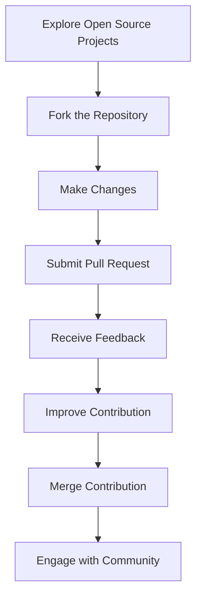

## 19.8 Continuous Learning and Community Involvement

In the ever-evolving landscape of software development, continuous learning and active community involvement are crucial for maintaining relevance and enhancing expertise. As a Haxe developer, embracing these practices not only helps you stay updated with the latest advancements but also opens doors to collaboration and innovation. In this section, we'll explore various strategies for continuous learning and community involvement, focusing on the Haxe ecosystem.

### Approaches to Continuous Learning

#### Stay Updated with Haxe and Related Technologies

To remain at the forefront of Haxe development, it's essential to stay informed about updates and trends in the language and its ecosystem. Here are some effective ways to do so:

1. **Follow Official Channels**: Regularly visit the [Haxe Foundation's website](https://haxe.org) and subscribe to their newsletters. Follow their social media accounts for announcements and updates.

2. **Read Documentation and Release Notes**: Thoroughly read the official Haxe documentation and release notes for new versions. Understanding changes and improvements can help you leverage new features effectively.

3. **Engage with Blogs and Articles**: Follow blogs and articles written by Haxe experts. Websites like [Medium](https://medium.com) and [Dev.to](https://dev.to) often feature insightful content on Haxe development.

4. **Watch Tutorials and Webinars**: Platforms like [YouTube](https://www.youtube.com) and [Udemy](https://www.udemy.com) offer video tutorials and webinars on Haxe. Visual learning can be particularly effective for grasping complex concepts.

5. **Participate in Online Courses**: Enroll in online courses that cover Haxe and related technologies. Websites like [Coursera](https://www.coursera.org) and [edX](https://www.edx.org) offer courses that can deepen your understanding.

#### Contribute to Open Source Projects

Contributing to open-source projects is a powerful way to enhance your skills and give back to the community. Here's how you can get involved:

1. **Find Projects of Interest**: Explore platforms like [GitHub](https://github.com) and [GitLab](https://gitlab.com) to find Haxe projects that align with your interests and expertise.

2. **Start with Documentation**: If you're new to open source, begin by contributing to documentation. This helps you familiarize yourself with the project's structure and community.

3. **Fix Bugs and Add Features**: As you gain confidence, start fixing bugs or adding new features. This hands-on experience is invaluable for learning and growth.

4. **Engage with Maintainers**: Communicate with project maintainers and other contributors. This interaction can provide insights into best practices and coding standards.

5. **Share Your Own Projects**: If you have developed a Haxe project, consider open-sourcing it. This not only showcases your work but also invites collaboration and feedback.

#### Networking and Community Engagement

Building a network of like-minded professionals can lead to collaboration opportunities and career growth. Here are some ways to engage with the Haxe community:

1. **Join Forums and Discussion Groups**: Participate in forums like [Haxe Community](https://community.haxe.org) and [Stack Overflow](https://stackoverflow.com) to ask questions, share knowledge, and connect with other developers.

2. **Attend Conferences and Meetups**: Attend Haxe conferences and local meetups to learn from experts and network with peers. Events like [Haxe Summit](https://summit.haxe.org) provide valuable learning and networking opportunities.

3. **Engage on Social Media**: Follow Haxe-related hashtags and accounts on platforms like [Twitter](https://twitter.com) and [LinkedIn](https://www.linkedin.com) to stay informed and connect with other developers.

4. **Collaborate on Projects**: Collaborate with other developers on projects, whether through hackathons or informal collaborations. This can lead to innovative solutions and new friendships.

5. **Mentor and Teach**: Share your knowledge by mentoring newcomers or teaching Haxe through workshops or online courses. Teaching is a great way to reinforce your own understanding.

### Benefits of Continuous Learning and Community Involvement

#### Skill Development

Continuous learning and community involvement offer numerous benefits for skill development:

- **Enhanced Expertise**: Staying updated with the latest advancements in Haxe and related technologies ensures that your skills remain sharp and relevant.

- **Broadened Knowledge**: Engaging with the community exposes you to diverse perspectives and approaches, broadening your understanding of software development.

- **Problem-Solving Skills**: Contributing to open-source projects and collaborating with others helps you develop strong problem-solving skills.

#### Collaboration Opportunities

Active community involvement opens doors to collaboration opportunities:

- **Networking**: Building a network of professionals can lead to job opportunities, partnerships, and collaborations on exciting projects.

- **Feedback and Support**: Engaging with the community provides access to feedback and support, helping you improve your work and overcome challenges.

- **Innovation**: Collaborating with others can lead to innovative solutions and new ideas, driving the development of cutting-edge software.

### Code Examples and Exercises

To illustrate the importance of continuous learning and community involvement, let's explore a simple Haxe project that you can contribute to and learn from.

#### Sample Code Snippet

```haxe
// A simple Haxe program to calculate the factorial of a number

class FactorialCalculator {
    public static function main() {
        var number = 5;
        var result = factorial(number);
        trace("Factorial of " + number + " is: " + result);
    }

    // Function to calculate factorial
    static function factorial(n: Int): Int {
        if (n <= 1) return 1;
        return n * factorial(n - 1);
    }
}
```

**Try It Yourself**: Modify the code to calculate the factorial of a number entered by the user. Experiment with error handling for invalid inputs.

#### Exercise: Contribute to an Open Source Project

1. **Find a Haxe Project**: Search for a Haxe project on GitHub that interests you.

2. **Explore the Codebase**: Familiarize yourself with the project's structure and documentation.

3. **Identify an Issue**: Look for open issues that you can work on, such as bug fixes or feature requests.

4. **Make a Contribution**: Fork the repository, make your changes, and submit a pull request.

5. **Engage with the Community**: Communicate with the project's maintainers and other contributors to receive feedback and improve your contribution.

### Visualizing Community Involvement

To better understand the process of community involvement and contribution, let's visualize it using a flowchart.



**Description**: This flowchart illustrates the process of contributing to an open-source project, from exploring projects to engaging with the community.

### References and Links

- [Haxe Foundation](https://haxe.org)
- [GitHub](https://github.com)
- [Haxe Community Forum](https://community.haxe.org)
- [Haxe Summit](https://summit.haxe.org)
- [Stack Overflow](https://stackoverflow.com)

### Knowledge Check

To reinforce your understanding of continuous learning and community involvement, consider the following questions and challenges:

1. **What are some effective ways to stay updated with Haxe and related technologies?**

2. **How can contributing to open-source projects enhance your skills?**

3. **What are the benefits of networking and community engagement for Haxe developers?**

4. **Try modifying the sample code to handle invalid inputs gracefully.**

5. **Identify a Haxe project on GitHub and explore its codebase. What improvements can you suggest?**

### Embrace the Journey

Remember, continuous learning and community involvement are ongoing processes. As you engage with the Haxe community and contribute to projects, you'll not only enhance your skills but also build meaningful connections and drive innovation. Keep experimenting, stay curious, and enjoy the journey!

## Quiz Time!



### What is a key benefit of staying updated with Haxe and related technologies?

- [x] Enhanced expertise
- [ ] Increased salary
- [ ] Guaranteed job security
- [ ] Reduced workload

> **Explanation:** Staying updated with Haxe and related technologies enhances your expertise and keeps your skills relevant.

### How can contributing to open-source projects benefit you?

- [x] Develop problem-solving skills
- [ ] Guarantee a job offer
- [ ] Reduce coding errors
- [ ] Eliminate the need for documentation

> **Explanation:** Contributing to open-source projects helps develop problem-solving skills and provides valuable learning experiences.

### What is a recommended way to engage with the Haxe community?

- [x] Join forums and discussion groups
- [ ] Avoid social media
- [ ] Work in isolation
- [ ] Ignore feedback

> **Explanation:** Joining forums and discussion groups allows you to connect with other developers and engage with the Haxe community.

### What is the first step in contributing to an open-source project?

- [x] Explore open-source projects
- [ ] Submit a pull request
- [ ] Make changes
- [ ] Engage with the community

> **Explanation:** The first step is to explore open-source projects to find one that aligns with your interests and expertise.

### Which platform is recommended for finding Haxe projects to contribute to?

- [x] GitHub
- [ ] LinkedIn
- [ ] Twitter
- [ ] Facebook

> **Explanation:** GitHub is a popular platform for finding open-source projects, including those related to Haxe.

### What is a benefit of networking with other Haxe developers?

- [x] Collaboration opportunities
- [ ] Guaranteed promotions
- [ ] Reduced workload
- [ ] Elimination of bugs

> **Explanation:** Networking with other Haxe developers can lead to collaboration opportunities and career growth.

### How can you start contributing to open-source projects if you're new?

- [x] Start with documentation
- [ ] Fix complex bugs
- [ ] Add new features
- [ ] Submit large pull requests

> **Explanation:** Starting with documentation is a great way to familiarize yourself with a project and begin contributing.

### What is a benefit of engaging with the community?

- [x] Access to feedback and support
- [ ] Guaranteed job offers
- [ ] Reduced coding errors
- [ ] Elimination of deadlines

> **Explanation:** Engaging with the community provides access to feedback and support, helping you improve your work.

### What is an effective way to stay informed about Haxe updates?

- [x] Follow official channels
- [ ] Avoid reading documentation
- [ ] Ignore release notes
- [ ] Work in isolation

> **Explanation:** Following official channels and reading documentation helps you stay informed about Haxe updates.

### True or False: Continuous learning and community involvement are one-time processes.

- [ ] True
- [x] False

> **Explanation:** Continuous learning and community involvement are ongoing processes that require regular engagement and effort.


