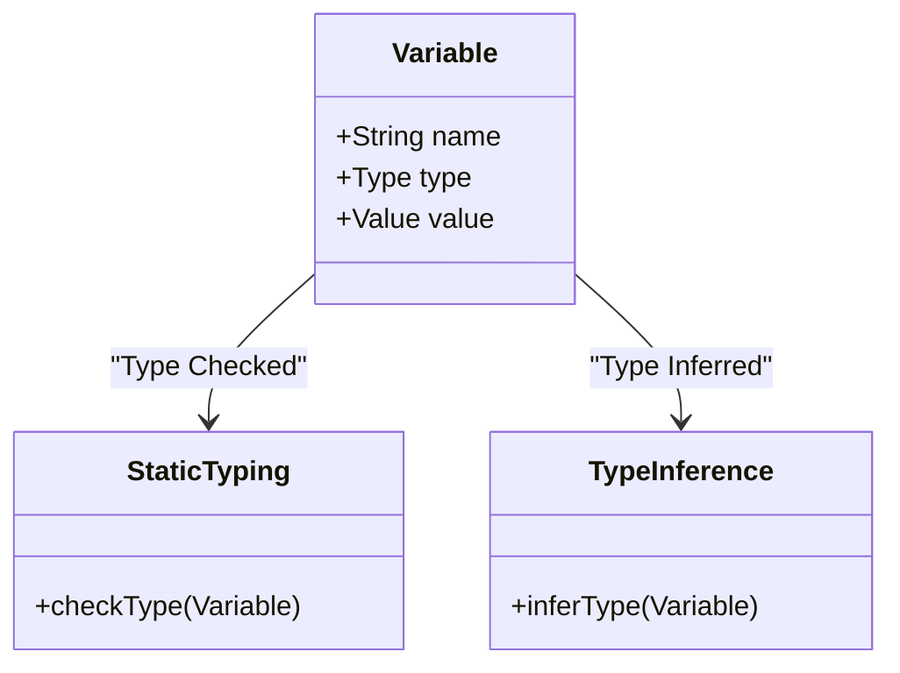

## 2.1 Static Typing and Type Inference

In the realm of software development, ensuring code reliability and maintainability is paramount. Haxe, a versatile language designed for cross-platform development, provides robust static typing and type inference mechanisms that significantly contribute to these goals. In this section, we will delve into the concepts of static typing and type inference in Haxe, exploring their mechanics, benefits, and practical applications in cross-platform development.

### Understanding Static Typing

Static typing is a feature of programming languages where variable types are known at compile time. This means that the type of every variable is checked before the program runs, which helps catch errors early in the development process. In Haxe, static typing is a core feature that enhances code safety and reliability.

#### How Static Typing Works in Haxe

In Haxe, you declare the type of a variable explicitly when you define it. This declaration allows the compiler to enforce type constraints, ensuring that only compatible types are assigned to variables. Here's a simple example:

```haxe
class Main {
    static function main() {
        var message:String = "Hello, Haxe!";
        var number:Int = 42;
        // Uncommenting the following line will cause a compile-time error
        // number = "This will not compile!";
    }
}
```

In this example, `message` is explicitly declared as a `String`, and `number` as an `Int`. Attempting to assign a `String` to `number` would result in a compile-time error, preventing potential runtime issues.

#### Benefits of Static Typing

Static typing offers several advantages, particularly in large-scale and cross-platform projects:

- **Early Error Detection:** By catching type mismatches at compile time, static typing reduces the likelihood of runtime errors, leading to more stable applications.
- **Improved Code Readability:** Explicit type declarations make the code more readable and self-documenting, as developers can easily understand the intended use of each variable.
- **Enhanced Tooling Support:** Static typing enables advanced features in IDEs, such as autocompletion, refactoring tools, and static analysis, which improve developer productivity.

### Type Inference Mechanics

While static typing requires explicit type declarations, Haxe also supports type inference, which allows the compiler to deduce the type of a variable based on its initial value. This feature reduces verbosity without sacrificing the benefits of static typing.

#### How Type Inference Works in Haxe

Type inference in Haxe is straightforward. When you assign a value to a variable without specifying its type, the compiler infers the type from the value. Consider the following example:

```haxe
class Main {
    static function main() {
        var inferredMessage = "Hello, Haxe!"; // Inferred as String
        var inferredNumber = 42; // Inferred as Int
        var inferredList = [1, 2, 3]; // Inferred as Array<Int>
    }
}
```

In this code, the types of `inferredMessage`, `inferredNumber`, and `inferredList` are automatically inferred by the compiler. This reduces the need for explicit type annotations, making the code cleaner and more concise.

#### Benefits of Type Inference

Type inference offers several benefits that complement static typing:

- **Reduced Boilerplate:** By inferring types, Haxe reduces the need for repetitive type annotations, leading to more concise code.
- **Flexibility:** Developers can focus on the logic of their code without worrying about explicit type declarations, while still benefiting from the safety of static typing.
- **Consistency:** Type inference ensures that inferred types are consistent with the assigned values, maintaining type safety across the codebase.

### Benefits in Cross-Platform Development

Haxe's static typing and type inference are particularly advantageous in cross-platform development, where code needs to behave consistently across different targets. Let's explore how these features contribute to cross-platform success.

#### Ensuring Consistency Across Targets

In cross-platform development, ensuring that code behaves the same way on different platforms is crucial. Static typing helps achieve this by enforcing type constraints that are consistent across all targets. This means that a type-safe Haxe program will compile and run reliably, whether it's targeting JavaScript, C++, or any other supported platform.

#### Simplifying Code Maintenance

Static typing and type inference simplify code maintenance by making the codebase more predictable and easier to understand. When developers can rely on consistent type behavior, they can make changes with confidence, knowing that the compiler will catch any type-related issues.

#### Enhancing Performance

Static typing can also lead to performance optimizations. By knowing the types of variables at compile time, the Haxe compiler can generate more efficient code for each target platform. This can result in faster execution and reduced resource consumption, which are critical factors in cross-platform applications.

### Code Examples and Exercises

To solidify your understanding of static typing and type inference in Haxe, let's explore some practical examples and exercises.

#### Example: Type Safety in Function Parameters

Consider a function that calculates the area of a rectangle. Using static typing, we can ensure that the function receives the correct types of arguments:

```haxe
class Main {
    static function main() {
        trace(calculateArea(5, 10)); // Outputs: 50
        // Uncommenting the following line will cause a compile-time error
        // trace(calculateArea("5", "10"));
    }

    static function calculateArea(width:Int, height:Int):Int {
        return width * height;
    }
}
```

In this example, the `calculateArea` function expects two `Int` parameters. Attempting to pass `String` arguments will result in a compile-time error, ensuring type safety.

#### Exercise: Implementing a Type-Safe Stack

Create a simple stack implementation in Haxe that uses static typing to ensure type safety. Here's a starting point:

```haxe
class Stack<T> {
    private var elements:Array<T> = [];

    public function push(element:T):Void {
        elements.push(element);
    }

    public function pop():T {
        if (elements.length == 0) {
            throw "Stack is empty!";
        }
        return elements.pop();
    }

    public function isEmpty():Bool {
        return elements.length == 0;
    }
}

class Main {
    static function main() {
        var intStack = new Stack<Int>();
        intStack.push(1);
        intStack.push(2);
        trace(intStack.pop()); // Outputs: 2

        var stringStack = new Stack<String>();
        stringStack.push("Hello");
        stringStack.push("World");
        trace(stringStack.pop()); // Outputs: World
    }
}
```

**Try It Yourself:** Modify the `Stack` class to include a `peek` method that returns the top element without removing it. Ensure that the method is type-safe.

### Visualizing Static Typing and Type Inference

To better understand the relationship between static typing and type inference, let's visualize the process using a class diagram.



**Diagram Description:** This class diagram illustrates the interaction between variables, static typing, and type inference in Haxe. Variables have a name, type, and value. Static typing checks the type of a variable, while type inference deduces the type based on the variable's value.

### References and Further Reading

For more information on static typing and type inference, consider exploring the following resources:

- [Haxe Manual: Types](https://haxe.org/manual/types.html)
- [MDN Web Docs: Static Typing](https://developer.mozilla.org/en-US/docs/Glossary/Static_typing)
- [Wikipedia: Type Inference](https://en.wikipedia.org/wiki/Type_inference)

### Knowledge Check

Before we conclude, let's reinforce your understanding with a few questions:

1. What is the primary advantage of static typing in Haxe?
2. How does type inference reduce code verbosity?
3. Why is static typing beneficial in cross-platform development?

### Embrace the Journey

Remember, mastering static typing and type inference in Haxe is just the beginning of your journey in cross-platform development. As you continue to explore Haxe's features, you'll discover new ways to write efficient, maintainable, and reliable code. Keep experimenting, stay curious, and enjoy the process!

## Quiz Time!



### What is static typing?

- [x] A feature where variable types are known at compile time.
- [ ] A feature where variable types are determined at runtime.
- [ ] A feature that allows dynamic type changes.
- [ ] A feature that removes type constraints.

> **Explanation:** Static typing ensures that variable types are known and checked at compile time, which helps catch errors early.

### How does type inference benefit developers?

- [x] It reduces the need for explicit type annotations.
- [ ] It allows variables to change types dynamically.
- [ ] It increases code verbosity.
- [ ] It removes the need for type safety.

> **Explanation:** Type inference reduces the need for explicit type annotations, making code cleaner while maintaining type safety.

### Why is static typing advantageous in cross-platform development?

- [x] It ensures consistent behavior across different platforms.
- [ ] It allows for platform-specific optimizations.
- [ ] It enables dynamic type changes.
- [ ] It reduces compile-time checks.

> **Explanation:** Static typing enforces type constraints that are consistent across all platforms, ensuring reliable behavior.

### What happens if you assign a String to an Int variable in Haxe?

- [x] A compile-time error occurs.
- [ ] The String is automatically converted to an Int.
- [ ] The program crashes at runtime.
- [ ] The assignment is ignored.

> **Explanation:** Assigning a String to an Int variable results in a compile-time error due to type mismatch.

### What is the role of type inference in Haxe?

- [x] To deduce variable types based on initial values.
- [ ] To allow variables to change types dynamically.
- [ ] To enforce strict type annotations.
- [ ] To remove type constraints.

> **Explanation:** Type inference deduces variable types based on their initial values, reducing the need for explicit annotations.

### How does static typing improve code readability?

- [x] By making the code more self-documenting.
- [ ] By allowing dynamic type changes.
- [ ] By removing type constraints.
- [ ] By increasing code verbosity.

> **Explanation:** Static typing makes code more self-documenting by clearly indicating the intended use of each variable.

### What is a key benefit of static typing in large-scale projects?

- [x] Early error detection.
- [ ] Increased runtime flexibility.
- [ ] Reduced compile-time checks.
- [ ] Dynamic type changes.

> **Explanation:** Static typing helps catch type mismatches early, reducing runtime errors and improving stability.

### How does type inference affect code maintenance?

- [x] It simplifies code maintenance by reducing boilerplate.
- [ ] It complicates code maintenance by allowing dynamic types.
- [ ] It increases the need for type annotations.
- [ ] It removes type safety.

> **Explanation:** Type inference simplifies code maintenance by reducing boilerplate, making the codebase more concise.

### What is the relationship between static typing and type inference?

- [x] Type inference complements static typing by deducing types.
- [ ] Type inference replaces static typing.
- [ ] Static typing allows dynamic type changes.
- [ ] Type inference removes type constraints.

> **Explanation:** Type inference complements static typing by deducing types, reducing the need for explicit annotations.

### True or False: Static typing can lead to performance optimizations.

- [x] True
- [ ] False

> **Explanation:** Static typing allows the compiler to generate more efficient code, leading to potential performance optimizations.




