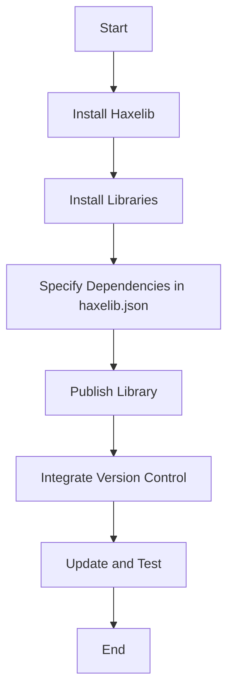

## 2.10 Dependency Management with Haxelib

As we delve deeper into mastering Haxe, understanding how to manage dependencies effectively is crucial for building scalable and maintainable applications. Haxelib, the official package manager for Haxe, plays a pivotal role in this process. It simplifies the installation, management, and publication of libraries, ensuring that your projects remain organized and efficient. In this section, we will explore the intricacies of using Haxelib for dependency management, including installing and publishing libraries, managing dependencies, and integrating version control systems.

### Introduction to Haxelib

Haxelib is the backbone of dependency management in Haxe. It allows developers to easily share and reuse code across different projects, promoting a modular and efficient development process. By leveraging Haxelib, you can access a vast repository of libraries and tools that enhance the functionality of your Haxe applications.

#### Key Features of Haxelib

- **Centralized Repository:** Haxelib provides a centralized repository where developers can publish and discover libraries.
- **Version Management:** It supports versioning, allowing you to specify and manage different versions of libraries.
- **Cross-Platform Support:** Haxelib is designed to work seamlessly across all platforms supported by Haxe.
- **Ease of Use:** With simple command-line instructions, Haxelib makes it easy to install, update, and manage libraries.

### Installing and Using Haxelib

To get started with Haxelib, you first need to ensure that it is installed on your system. Haxelib is typically included with the Haxe installation, but you can verify its presence by running the following command in your terminal or command prompt:

```bash
haxelib version
```

If Haxelib is installed, this command will display the current version. If not, you may need to reinstall Haxe or manually install Haxelib.

#### Installing Libraries with Haxelib

Once Haxelib is set up, you can begin installing libraries. The basic syntax for installing a library is:

```bash
haxelib install <library_name>
```

For example, to install the popular `openfl` library, you would use:

```bash
haxelib install openfl
```

This command downloads the library and its dependencies from the Haxelib repository and installs them on your system.

#### Managing Installed Libraries

To view all installed libraries, use the following command:

```bash
haxelib list
```

This command displays a list of all libraries installed on your system, along with their versions.

#### Updating Libraries

Keeping your libraries up-to-date is essential for maintaining compatibility and security. To update a specific library, use:

```bash
haxelib update <library_name>
```

To update all installed libraries, simply run:

```bash
haxelib update
```

### Publishing Libraries with Haxelib

Publishing your libraries to Haxelib allows other developers to benefit from your work. Before publishing, ensure that your library is well-documented and tested.

#### Preparing Your Library for Publication

1. **Create a `haxelib.json` File:** This file contains metadata about your library, such as its name, version, author, and dependencies. Here is an example:

    ```json
    {
      "name": "mylibrary",
      "version": "1.0.0",
      "license": "MIT",
      "tags": ["utility", "cross-platform"],
      "description": "A useful library for Haxe developers.",
      "contributors": ["Your Name"],
      "dependencies": {
        "anotherlib": ""
      }
    }
    ```

2. **Organize Your Files:** Ensure that your library files are organized in a logical structure. Typically, source files are placed in a `src` directory.

3. **Test Your Library:** Thoroughly test your library to ensure it works as expected across all target platforms.

#### Publishing Your Library

Once your library is ready, you can publish it using the following command:

```bash
haxelib submit
```

This command packages your library and uploads it to the Haxelib repository. You will need to provide your Haxelib account credentials during this process.

### Managing Dependencies in Your Project

Specifying and managing dependencies is a critical aspect of project configuration. Haxelib allows you to define dependencies in your `haxelib.json` file, ensuring that all necessary libraries are installed automatically.

#### Specifying Dependencies

In your `haxelib.json` file, you can specify dependencies as follows:

```json
"dependencies": {
  "openfl": "",
  "lime": "7.9.0"
}
```

In this example, the project depends on the `openfl` library (any version) and the `lime` library (specifically version 7.9.0).

#### Installing Project Dependencies

To install all dependencies specified in your `haxelib.json` file, navigate to your project directory and run:

```bash
haxelib install
```

This command reads the `haxelib.json` file and installs all listed dependencies.

### Version Control Integration

Integrating version control systems with Haxelib enhances collaboration and ensures consistency across development environments. Git is a popular choice for version control, and it can be used alongside Haxelib to manage dependencies.

#### Using Git Submodules

Git submodules allow you to include external repositories within your project. This is useful for managing dependencies that are not available on Haxelib or for using specific versions of libraries.

To add a submodule, use the following command:

```bash
git submodule add <repository_url> <path>
```

For example:

```bash
git submodule add https://github.com/openfl/openfl.git libs/openfl
```

This command adds the `openfl` repository as a submodule in the `libs/openfl` directory.

#### Managing Submodules

After adding submodules, you need to initialize and update them:

```bash
git submodule init
git submodule update
```

These commands ensure that the submodules are cloned and updated to the correct versions.

### Best Practices for Dependency Management

1. **Regularly Update Dependencies:** Keep your libraries up-to-date to benefit from the latest features and security patches.
2. **Use Semantic Versioning:** Follow semantic versioning conventions to manage library versions effectively.
3. **Document Dependencies:** Clearly document all dependencies and their versions in your project documentation.
4. **Test After Updates:** Always test your project after updating dependencies to catch any compatibility issues early.

### Visualizing Dependency Management Workflow

To better understand the workflow of managing dependencies with Haxelib, let's visualize the process using a Mermaid.js flowchart.



**Figure 1:** This flowchart illustrates the typical workflow for managing dependencies with Haxelib, from installation to publication and version control integration.

### Try It Yourself

To solidify your understanding of Haxelib, try the following exercises:

1. **Install a New Library:** Choose a library from the Haxelib repository and install it in a new project. Experiment with its features and explore its documentation.

2. **Publish a Simple Library:** Create a simple Haxe library, prepare it for publication, and submit it to Haxelib. Ensure you follow best practices for documentation and testing.

3. **Integrate a Git Submodule:** Add a Git submodule to an existing project and explore how it integrates with Haxelib for dependency management.

### Knowledge Check

Before moving on, let's review some key concepts:

- **What is Haxelib, and why is it important for Haxe development?**
- **How do you specify and manage dependencies in a Haxe project?**
- **What are the benefits of integrating version control with Haxelib?**

### Embrace the Journey

Remember, mastering dependency management with Haxelib is a journey. As you continue to explore and experiment, you'll gain deeper insights into how to build robust and scalable Haxe applications. Keep learning, stay curious, and enjoy the process!

## Quiz Time!



### What is the primary role of Haxelib in Haxe development?

- [x] Managing libraries and dependencies
- [ ] Compiling Haxe code
- [ ] Debugging Haxe applications
- [ ] Optimizing performance

> **Explanation:** Haxelib is the official package manager for Haxe, primarily used for managing libraries and dependencies.

### How do you install a library using Haxelib?

- [x] `haxelib install <library_name>`
- [ ] `haxe install <library_name>`
- [ ] `haxelib add <library_name>`
- [ ] `haxe add <library_name>`

> **Explanation:** The command `haxelib install <library_name>` is used to install a library from the Haxelib repository.

### What file is used to specify dependencies in a Haxe project?

- [x] `haxelib.json`
- [ ] `package.json`
- [ ] `dependencies.json`
- [ ] `config.json`

> **Explanation:** The `haxelib.json` file is used to specify dependencies and other metadata for a Haxe project.

### What command updates all installed libraries in Haxelib?

- [x] `haxelib update`
- [ ] `haxelib upgrade`
- [ ] `haxelib refresh`
- [ ] `haxelib renew`

> **Explanation:** The command `haxelib update` updates all installed libraries to their latest versions.

### Which version control system is commonly used with Haxelib for managing dependencies?

- [x] Git
- [ ] SVN
- [ ] Mercurial
- [ ] CVS

> **Explanation:** Git is commonly used with Haxelib for managing dependencies, often through submodules.

### How do you add a Git submodule to a project?

- [x] `git submodule add <repository_url> <path>`
- [ ] `git add submodule <repository_url> <path>`
- [ ] `git submodule init <repository_url> <path>`
- [ ] `git add <repository_url> <path>`

> **Explanation:** The command `git submodule add <repository_url> <path>` is used to add a Git submodule to a project.

### What is the purpose of the `haxelib submit` command?

- [x] To publish a library to the Haxelib repository
- [ ] To install a library from the Haxelib repository
- [ ] To update a library in the Haxelib repository
- [ ] To remove a library from the Haxelib repository

> **Explanation:** The `haxelib submit` command is used to publish a library to the Haxelib repository.

### What should you do after updating dependencies in your project?

- [x] Test the project for compatibility issues
- [ ] Delete the old dependencies
- [ ] Reinstall the Haxe compiler
- [ ] Change the project configuration

> **Explanation:** After updating dependencies, it's important to test the project to ensure there are no compatibility issues.

### What is semantic versioning?

- [x] A versioning convention that uses major, minor, and patch numbers
- [ ] A method for optimizing code performance
- [ ] A technique for debugging applications
- [ ] A strategy for managing code repositories

> **Explanation:** Semantic versioning is a versioning convention that uses major, minor, and patch numbers to indicate changes.

### True or False: Haxelib can only be used for Haxe projects targeting JavaScript.

- [ ] True
- [x] False

> **Explanation:** False. Haxelib is designed to work across all platforms supported by Haxe, not just JavaScript.


