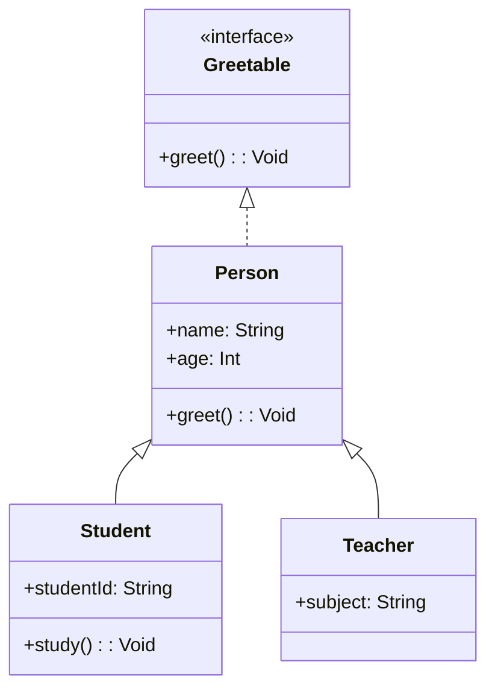

## 2.2 Classes, Interfaces, and Inheritance

In this section, we delve into the core concepts of object-oriented programming (OOP) in Haxe: classes, interfaces, and inheritance. These constructs are fundamental to building scalable and maintainable software systems. By understanding how to effectively use these features, you can leverage Haxe's cross-platform capabilities to their fullest potential.

### Class Definitions in Haxe

Classes are the building blocks of object-oriented programming. They encapsulate data and behavior, providing a blueprint for creating objects. In Haxe, defining a class is straightforward and similar to other OOP languages like Java or C#. Let's explore the syntax and structure of classes in Haxe.

#### Syntax and Structure of Classes

A class in Haxe is defined using the `class` keyword, followed by the class name. Here's a simple example:

```haxe
class Person {
    // Fields
    public var name:String;
    public var age:Int;

    // Constructor
    public function new(name:String, age:Int) {
        this.name = name;
        this.age = age;
    }

    // Method
    public function greet():Void {
        trace("Hello, my name is " + name + " and I am " + age + " years old.");
    }
}
```

**Explanation:**

- **Fields:** `name` and `age` are fields of the class, representing the state of a `Person` object.
- **Constructor:** The `new` function initializes the object with a name and age.
- **Method:** `greet` is a method that outputs a greeting message.

#### Try It Yourself

Experiment with the `Person` class by adding more fields or methods. For example, add a method to update the age or a field to store the person's address.

### Interfaces and Type Contracts

Interfaces define a contract that classes can implement. They specify what methods a class should have without dictating how they should be implemented. This allows for flexibility and decoupling in your code design.

#### Defining Interfaces

In Haxe, interfaces are defined using the `interface` keyword. Here's an example:

```haxe
interface Greetable {
    public function greet():Void;
}
```

**Explanation:**

- **Method Signature:** The `greet` method is declared without an implementation, serving as a contract for implementing classes.

#### Implementing Interfaces

A class implements an interface using the `implements` keyword. Here's how the `Person` class can implement the `Greetable` interface:

```haxe
class Person implements Greetable {
    public var name:String;
    public var age:Int;

    public function new(name:String, age:Int) {
        this.name = name;
        this.age = age;
    }

    public function greet():Void {
        trace("Hello, my name is " + name + " and I am " + age + " years old.");
    }
}
```

**Try It Yourself**

Create a new interface, `Identifiable`, with a method `getId():String`. Implement this interface in the `Person` class and provide a unique ID for each person.

### Inheritance Hierarchies

Inheritance allows a class to inherit fields and methods from another class, promoting code reuse and establishing a hierarchy. In Haxe, inheritance is achieved using the `extends` keyword.

#### Extending Classes

Let's create a `Student` class that extends the `Person` class:

```haxe
class Student extends Person {
    public var studentId:String;

    public function new(name:String, age:Int, studentId:String) {
        super(name, age);
        this.studentId = studentId;
    }

    public function study():Void {
        trace(name + " is studying.");
    }
}
```

**Explanation:**

- **Inheritance:** `Student` inherits fields and methods from `Person`.
- **Super Constructor:** `super` is used to call the constructor of the parent class.
- **Additional Method:** `study` is a new method specific to `Student`.

#### Overriding Methods

A subclass can override methods of its superclass to provide specific behavior. Here's how `Student` can override the `greet` method:

```haxe
override public function greet():Void {
    trace("Hello, I am " + name + ", a student with ID " + studentId + ".");
}
```

**Try It Yourself**

Create a `Teacher` class that extends `Person`. Add a `subject` field and override the `greet` method to include the subject they teach.

### Best Practices

While inheritance is a powerful tool, it can lead to tightly coupled code if not used carefully. Here are some best practices to consider:

- **Favor Composition Over Inheritance:** Use composition to combine behaviors rather than relying solely on inheritance. This reduces coupling and increases flexibility.
- **Use Interfaces for Flexibility:** Interfaces allow you to define contracts that multiple classes can implement, promoting decoupling and reusability.
- **Limit Inheritance Depth:** Deep inheritance hierarchies can become difficult to manage. Keep them shallow to maintain clarity.

### Visualizing Inheritance and Interfaces

To better understand the relationships between classes and interfaces, let's visualize them using a class diagram.



**Diagram Explanation:**

- **Interfaces:** `Greetable` is an interface implemented by `Person`.
- **Inheritance:** `Student` and `Teacher` extend `Person`, inheriting its fields and methods.

### References and Links

For further reading on classes, interfaces, and inheritance in Haxe, consider the following resources:

- [Haxe Manual: Classes](https://haxe.org/manual/types-class.html)
- [Haxe Manual: Interfaces](https://haxe.org/manual/types-interface.html)
- [Haxe Manual: Inheritance](https://haxe.org/manual/types-inheritance.html)

### Knowledge Check

Let's reinforce your understanding with some questions:

1. What is the purpose of a constructor in a class?
2. How do interfaces promote decoupling in software design?
3. What is the difference between `extends` and `implements` in Haxe?
4. Why is it recommended to favor composition over inheritance?

### Embrace the Journey

Remember, mastering classes, interfaces, and inheritance is just the beginning of your journey in Haxe. As you continue to explore these concepts, you'll build more complex and robust applications. Keep experimenting, stay curious, and enjoy the journey!

## Quiz Time!



### What is the primary purpose of a class in Haxe?

- [x] To encapsulate data and behavior
- [ ] To define a contract for other classes
- [ ] To provide a template for interfaces
- [ ] To manage memory allocation

> **Explanation:** A class encapsulates data and behavior, serving as a blueprint for creating objects.

### How do interfaces in Haxe promote flexibility?

- [x] By defining method signatures without implementations
- [ ] By allowing multiple inheritance
- [ ] By providing default method implementations
- [ ] By enforcing strict type checking

> **Explanation:** Interfaces define method signatures without implementations, allowing different classes to implement them in various ways.

### What keyword is used to inherit from a class in Haxe?

- [x] extends
- [ ] implements
- [ ] inherits
- [ ] derives

> **Explanation:** The `extends` keyword is used to inherit from a class in Haxe.

### Which of the following is a best practice when using inheritance?

- [x] Favor composition over inheritance
- [ ] Use deep inheritance hierarchies
- [ ] Avoid using interfaces
- [ ] Always override superclass methods

> **Explanation:** Favoring composition over inheritance reduces coupling and increases flexibility.

### What is the role of the `super` keyword in Haxe?

- [x] To call the constructor of the parent class
- [ ] To define a superclass
- [ ] To implement an interface
- [ ] To override a method

> **Explanation:** The `super` keyword is used to call the constructor of the parent class.

### What is an advantage of using interfaces in Haxe?

- [x] They allow for multiple classes to implement the same contract
- [ ] They provide default implementations for methods
- [ ] They enforce strict inheritance rules
- [ ] They automatically generate code

> **Explanation:** Interfaces allow multiple classes to implement the same contract, promoting flexibility and decoupling.

### How can a class implement multiple interfaces in Haxe?

- [x] By separating interface names with commas
- [ ] By using multiple `implements` keywords
- [ ] By extending multiple classes
- [ ] By using the `interface` keyword

> **Explanation:** A class can implement multiple interfaces by separating their names with commas.

### What is a constructor's primary function in a class?

- [x] To initialize an object's state
- [ ] To define the class's methods
- [ ] To implement interfaces
- [ ] To manage memory allocation

> **Explanation:** A constructor's primary function is to initialize an object's state.

### Which keyword is used to implement an interface in Haxe?

- [x] implements
- [ ] extends
- [ ] inherits
- [ ] derives

> **Explanation:** The `implements` keyword is used to implement an interface in Haxe.

### True or False: Inheritance should always be preferred over composition.

- [ ] True
- [x] False

> **Explanation:** Composition is often preferred over inheritance to reduce coupling and increase flexibility.



By mastering these concepts, you're well on your way to becoming an expert in Haxe's object-oriented design. Keep exploring and applying these principles to build robust and maintainable software.
