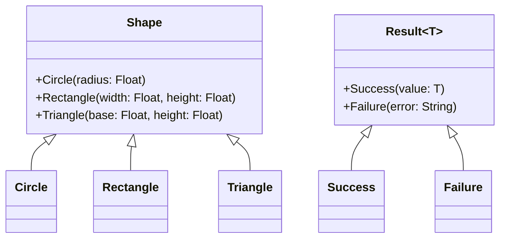

## 2.3 Enums and Algebraic Data Types

Enums and Algebraic Data Types (ADTs) are powerful constructs in Haxe that allow developers to model complex data structures and implement pattern matching with ease. In this section, we will delve into the intricacies of these constructs, exploring their syntax, usage, and benefits in cross-platform software development.

### Understanding Enums in Haxe

Enums in Haxe are more than just a list of named constants. They can have constructors and parameters, making them versatile tools for representing data with multiple variants. This feature allows enums to encapsulate data and behavior, similar to classes but with a focus on representing distinct states or variations.

#### Defining Enums

To define an enum in Haxe, you use the `enum` keyword followed by the name of the enum and its variants. Each variant can have parameters, allowing you to store additional data.

```haxe
enum Shape {
  Circle(radius: Float);
  Rectangle(width: Float, height: Float);
  Triangle(base: Float, height: Float);
}
```

In this example, `Shape` is an enum with three variants: `Circle`, `Rectangle`, and `Triangle`. Each variant has parameters that store relevant data.

#### Pattern Matching with Enums

Haxe provides a powerful `switch` statement that allows for exhaustive pattern matching on enums. This feature ensures that all possible cases are handled, reducing the risk of runtime errors.

```haxe
function describeShape(shape: Shape): String {
  return switch (shape) {
    case Circle(radius): "A circle with radius " + radius;
    case Rectangle(width, height): "A rectangle with width " + width + " and height " + height;
    case Triangle(base, height): "A triangle with base " + base + " and height " + height;
  }
}
```

In this function, we use a `switch` statement to match against each variant of the `Shape` enum. The compiler checks that all possible cases are covered, providing a safety net for developers.

### Algebraic Data Types (ADTs)

Algebraic Data Types are a powerful concept in functional programming languages, and Haxe supports them through its enum system. ADTs allow you to model data that can take on different forms, each with its own associated data.

#### Modeling Complex Data Structures

ADTs are particularly useful for modeling complex data structures that have multiple variations. By using enums with constructors, you can create a type-safe representation of your data.

```haxe
enum Result<T> {
  Success(value: T);
  Failure(error: String);
}
```

In this example, `Result` is an ADT that can either be a `Success` with a value of type `T` or a `Failure` with an error message. This pattern is commonly used for error handling and result representation.

#### Benefits of Using ADTs

- **Type Safety:** ADTs provide compile-time checks, ensuring that all possible cases are handled.
- **Clarity:** The use of enums with constructors makes the code more readable and self-documenting.
- **Flexibility:** ADTs can represent complex data structures with ease, allowing for more expressive code.

### Practical Implementation Strategies

To effectively use enums and ADTs in Haxe, consider the following strategies:

- **Leverage Pattern Matching:** Use `switch` statements to handle all possible cases of an enum, ensuring exhaustive checks.
- **Encapsulate Data:** Use enums with constructors to encapsulate data and behavior, reducing the need for additional classes.
- **Model Variations:** Use ADTs to model data with multiple variations, improving code clarity and maintainability.

### Real-World Examples

Let's explore some real-world examples where enums and ADTs can be applied effectively.

#### Example 1: Modeling a Traffic Light System

```haxe
enum TrafficLight {
  Red;
  Yellow;
  Green;
}

function nextLight(current: TrafficLight): TrafficLight {
  return switch (current) {
    case Red: Green;
    case Yellow: Red;
    case Green: Yellow;
  }
}
```

In this example, we model a traffic light system using an enum. The `nextLight` function uses pattern matching to determine the next state of the traffic light.

#### Example 2: Handling HTTP Responses

```haxe
enum HttpResponse {
  Ok(body: String);
  NotFound;
  Error(message: String);
}

function handleResponse(response: HttpResponse): String {
  return switch (response) {
    case Ok(body): "Response received: " + body;
    case NotFound: "Resource not found.";
    case Error(message): "Error occurred: " + message;
  }
}
```

Here, we model HTTP responses using an ADT. The `handleResponse` function uses pattern matching to handle each possible response type.

### Visualizing Enums and ADTs

To better understand the relationship between enums and ADTs, let's visualize them using a class diagram.



This diagram illustrates how enums and ADTs can be represented as class hierarchies, with each variant acting as a subclass.

### Try It Yourself

To deepen your understanding of enums and ADTs, try modifying the code examples provided. For instance, add a new variant to the `Shape` enum or create a new ADT for handling user authentication states.

### References and Further Reading

- [Haxe Manual: Enums](https://haxe.org/manual/types-enum.html)
- [Haxe Manual: Pattern Matching](https://haxe.org/manual/lf-pattern-matching.html)
- [Functional Programming Concepts](https://en.wikipedia.org/wiki/Functional_programming)

### Knowledge Check

- What are the benefits of using enums with constructors in Haxe?
- How does pattern matching enhance the safety and readability of your code?
- Can you think of a scenario where ADTs would be particularly useful?

### Embrace the Journey

Remember, mastering enums and ADTs in Haxe is just the beginning. As you continue to explore these concepts, you'll unlock new ways to model data and implement pattern matching in your applications. Keep experimenting, stay curious, and enjoy the journey!

## Quiz Time!



### What is the primary advantage of using enums with constructors in Haxe?

- [x] They allow for encapsulating data and behavior.
- [ ] They make the code run faster.
- [ ] They reduce the number of lines of code.
- [ ] They eliminate the need for classes.

> **Explanation:** Enums with constructors allow for encapsulating data and behavior, making the code more expressive and type-safe.

### How does pattern matching with enums improve code safety?

- [x] It ensures all possible cases are handled.
- [ ] It makes the code shorter.
- [ ] It automatically fixes errors.
- [ ] It improves performance.

> **Explanation:** Pattern matching ensures all possible cases are handled, reducing the risk of runtime errors.

### Which of the following is an example of an Algebraic Data Type in Haxe?

- [x] `enum Result<T> { Success(value: T); Failure(error: String); }`
- [ ] `class Result { var value: String; }`
- [ ] `typedef Result = { value: String; }`
- [ ] `var result: String = "Success";`

> **Explanation:** The `Result` enum with constructors is an example of an Algebraic Data Type, representing data with multiple variations.

### What is the purpose of the `switch` statement in pattern matching?

- [x] To match against each variant of an enum.
- [ ] To iterate over a list.
- [ ] To declare a variable.
- [ ] To import a module.

> **Explanation:** The `switch` statement is used to match against each variant of an enum, allowing for exhaustive checks.

### In the context of Haxe, what does ADT stand for?

- [x] Algebraic Data Type
- [ ] Abstract Data Type
- [ ] Advanced Data Type
- [ ] Array Data Type

> **Explanation:** In Haxe, ADT stands for Algebraic Data Type, which is a way to model data with multiple forms.

### Which of the following is a benefit of using ADTs?

- [x] Type safety and compile-time checks.
- [ ] Faster execution time.
- [ ] Reduced memory usage.
- [ ] Automatic code generation.

> **Explanation:** ADTs provide type safety and compile-time checks, ensuring that all possible cases are handled.

### What is a common use case for ADTs in Haxe?

- [x] Error handling and result representation.
- [ ] Memory management.
- [ ] Network communication.
- [ ] User interface design.

> **Explanation:** ADTs are commonly used for error handling and result representation, providing a type-safe way to model different outcomes.

### How can you visualize the relationship between enums and ADTs?

- [x] Using a class diagram.
- [ ] Using a flowchart.
- [ ] Using a pie chart.
- [ ] Using a bar graph.

> **Explanation:** A class diagram can be used to visualize the relationship between enums and ADTs, showing how each variant acts as a subclass.

### What is the role of constructors in enums?

- [x] To store additional data for each variant.
- [ ] To initialize the enum.
- [ ] To compile the code.
- [ ] To execute the program.

> **Explanation:** Constructors in enums are used to store additional data for each variant, allowing for more expressive data modeling.

### True or False: Enums in Haxe can only represent a list of named constants.

- [ ] True
- [x] False

> **Explanation:** False. Enums in Haxe can have constructors and parameters, allowing them to represent more complex data structures.


