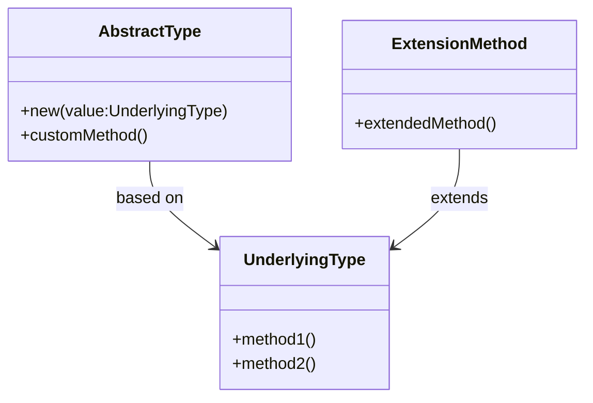

## 2.5 Abstract Types and Type Extensions

In the realm of Haxe programming, abstract types and type extensions are powerful tools that allow developers to create custom behaviors and extend existing types without the need for inheritance. These features are particularly useful in encapsulating implementation details, enforcing invariants, and enhancing code maintainability and readability. In this section, we will delve into the intricacies of abstract types and type extensions, providing you with the knowledge and skills to leverage these features effectively in your cross-platform development projects.

### Introduction to Abstract Types

Abstract types in Haxe provide a way to define new types that have custom behaviors, which can differ significantly from their underlying representations. This feature allows developers to create types that behave in specific ways while hiding the complexity of their underlying data structures. Abstract types are particularly useful when you want to enforce certain invariants or encapsulate implementation details, making your code more robust and easier to maintain.

#### Defining Abstract Types

To define an abstract type in Haxe, you use the `abstract` keyword followed by the new type name and its underlying type. Here's a simple example:

```haxe
abstract PositiveInt(Int) from Int to Int {
    public inline function new(value:Int) {
        if (value < 0) throw "Value must be positive";
        this = value;
    }
}
```

In this example, we define an abstract type `PositiveInt` that is based on the `Int` type. The constructor ensures that only positive integers can be assigned to this type, enforcing an invariant that the value must always be positive.

#### Implicit and Explicit Casts

Haxe allows for implicit and explicit casts between abstract types and their underlying types. This feature provides flexibility in how abstract types interact with other types in your code.

- **Implicit Casts:** These occur automatically when the compiler can safely convert between types without losing information.

- **Explicit Casts:** These require the use of the `cast` keyword to convert between types, often used when there is a risk of losing information or when the conversion is not straightforward.

Here's an example demonstrating both implicit and explicit casts:

```haxe
abstract PositiveInt(Int) from Int to Int {
    public inline function new(value:Int) {
        if (value < 0) throw "Value must be positive";
        this = value;
    }
}

class Main {
    static function main() {
        var a:PositiveInt = 5; // Implicit cast from Int to PositiveInt
        var b:Int = a; // Implicit cast from PositiveInt to Int
        var c:PositiveInt = cast 10; // Explicit cast using 'cast' keyword
    }
}
```

### Extension Methods

Extension methods in Haxe allow you to add new methods to existing types without modifying their original definitions or using inheritance. This feature is particularly useful when you want to enhance the functionality of a type without altering its core behavior.

#### Creating Extension Methods

To create an extension method, you define a function that takes the type you want to extend as its first parameter, using the `@:extension` metadata. Here's an example:

```haxe
@:extension
class StringExtensions {
    public static function isPalindrome(s:String):Bool {
        return s == s.split("").reverse().join("");
    }
}

class Main {
    static function main() {
        var word = "racecar";
        trace(word.isPalindrome()); // Outputs: true
    }
}
```

In this example, we define an extension method `isPalindrome` for the `String` type, allowing us to check if a string is a palindrome.

#### Benefits of Extension Methods

- **Non-Intrusive:** Extension methods do not modify the original type, preserving its integrity.
- **Reusability:** They can be reused across different projects and contexts.
- **Encapsulation:** They encapsulate additional functionality without cluttering the original type's definition.

### Use Cases for Abstract Types and Type Extensions

Abstract types and type extensions are versatile tools that can be applied in various scenarios to improve code quality and maintainability.

#### Encapsulating Implementation Details

Abstract types allow you to hide the complexity of underlying data structures, providing a clean and simple interface for interacting with the data. This encapsulation makes it easier to change the implementation without affecting the rest of the codebase.

#### Enforcing Invariants

By defining custom behaviors and constraints, abstract types can enforce invariants that ensure the data remains valid throughout its lifecycle. This enforcement reduces the risk of errors and improves the reliability of your code.

#### Enhancing Code Readability

Extension methods can enhance code readability by providing intuitive and descriptive methods that convey the intent of the code more clearly. This readability makes it easier for other developers to understand and maintain the code.

### Practical Implementation Strategies

When implementing abstract types and type extensions, it's important to follow best practices to ensure your code remains efficient and maintainable.

#### Best Practices for Abstract Types

- **Define Clear Invariants:** Clearly define the invariants you want to enforce and ensure they are consistently applied.
- **Use Inline Functions:** Use inline functions for performance-critical operations to minimize overhead.
- **Document Your Code:** Provide clear documentation for your abstract types, explaining their purpose and usage.

#### Best Practices for Extension Methods

- **Avoid Overuse:** Use extension methods judiciously to avoid cluttering the global namespace.
- **Name Methods Intuitively:** Choose descriptive names for your extension methods to convey their functionality clearly.
- **Test Thoroughly:** Ensure your extension methods are thoroughly tested to prevent unexpected behavior.

### Code Examples and Exercises

To reinforce your understanding of abstract types and type extensions, let's explore some practical examples and exercises.

#### Example: Creating a Safe Division Abstract Type

```haxe
abstract SafeDivision(Float) from Float to Float {
    public inline function new(value:Float) {
        if (value == 0) throw "Division by zero is not allowed";
        this = value;
    }

    public function divideBy(divisor:SafeDivision):SafeDivision {
        return this / divisor;
    }
}

class Main {
    static function main() {
        var dividend:SafeDivision = 10.0;
        var divisor:SafeDivision = 2.0;
        var result = dividend.divideBy(divisor);
        trace(result); // Outputs: 5.0
    }
}
```

#### Exercise: Implementing a Temperature Conversion Extension

Create an extension method for the `Float` type that converts a temperature from Celsius to Fahrenheit.

```haxe
@:extension
class TemperatureExtensions {
    public static function toFahrenheit(celsius:Float):Float {
        return celsius * 9 / 5 + 32;
    }
}

class Main {
    static function main() {
        var tempCelsius:Float = 25.0;
        trace(tempCelsius.toFahrenheit()); // Outputs: 77.0
    }
}
```

### Visualizing Abstract Types and Type Extensions

To better understand the relationship between abstract types, their underlying types, and extension methods, let's visualize these concepts using a class diagram.



**Diagram Description:** This diagram illustrates the relationship between an abstract type, its underlying type, and an extension method. The abstract type is based on the underlying type, while the extension method extends the functionality of the underlying type.

### References and Further Reading

For more information on abstract types and type extensions in Haxe, consider exploring the following resources:

- [Haxe Manual: Abstract Types](https://haxe.org/manual/types-abstract.html)
- [Haxe Manual: Type Extensions](https://haxe.org/manual/types-extensions.html)
- [MDN Web Docs: Type Systems](https://developer.mozilla.org/en-US/docs/Web/JavaScript/Data_structures)

### Knowledge Check

To test your understanding of abstract types and type extensions, consider the following questions and exercises:

1. **What are the key benefits of using abstract types in Haxe?**
2. **How do extension methods differ from traditional inheritance?**
3. **Implement an abstract type that represents a non-negative integer.**
4. **Create an extension method for the `Array` type that returns the sum of its elements.**

### Embrace the Journey

Remember, mastering abstract types and type extensions is just one step in your journey to becoming an expert Haxe developer. As you continue to explore and experiment with these features, you'll discover new ways to enhance your code and tackle complex challenges. Keep learning, stay curious, and enjoy the journey!

## Quiz Time!



### What is an abstract type in Haxe?

- [x] A type with custom behaviors differing from its underlying representation
- [ ] A type that cannot be instantiated
- [ ] A type that is only used for inheritance
- [ ] A type that is automatically generated

> **Explanation:** An abstract type in Haxe is a type that allows for custom behaviors while hiding the complexity of its underlying representation.

### How do you define an abstract type in Haxe?

- [x] Using the `abstract` keyword followed by the new type name and its underlying type
- [ ] Using the `class` keyword followed by the new type name
- [ ] Using the `interface` keyword followed by the new type name
- [ ] Using the `typedef` keyword followed by the new type name

> **Explanation:** Abstract types are defined using the `abstract` keyword, specifying the new type name and its underlying type.

### What is the purpose of extension methods in Haxe?

- [x] To add new methods to existing types without modifying their original definitions
- [ ] To create new types that inherit from existing types
- [ ] To override existing methods in a type
- [ ] To automatically generate new methods for a type

> **Explanation:** Extension methods allow you to add new methods to existing types without altering their original definitions.

### How do you create an extension method in Haxe?

- [x] Define a function with the `@:extension` metadata, taking the type to extend as the first parameter
- [ ] Define a function within the class you want to extend
- [ ] Use the `override` keyword to create an extension method
- [ ] Use the `abstract` keyword to define an extension method

> **Explanation:** Extension methods are created by defining a function with the `@:extension` metadata, specifying the type to extend as the first parameter.

### What is a key benefit of using abstract types?

- [x] Encapsulation of implementation details
- [ ] Automatic code generation
- [ ] Simplifying inheritance hierarchies
- [ ] Reducing code duplication

> **Explanation:** Abstract types encapsulate implementation details, providing a clean interface for interacting with the data.

### Which of the following is a use case for extension methods?

- [x] Enhancing code readability
- [ ] Creating new classes
- [ ] Simplifying inheritance
- [ ] Reducing memory usage

> **Explanation:** Extension methods enhance code readability by providing intuitive and descriptive methods.

### What is the difference between implicit and explicit casts in Haxe?

- [x] Implicit casts occur automatically, while explicit casts require the `cast` keyword
- [ ] Implicit casts require the `cast` keyword, while explicit casts occur automatically
- [ ] Implicit casts are used for primitive types, while explicit casts are used for complex types
- [ ] Implicit casts are used for complex types, while explicit casts are used for primitive types

> **Explanation:** Implicit casts occur automatically when safe, while explicit casts require the `cast` keyword.

### What should you consider when naming extension methods?

- [x] Choose descriptive names that convey functionality clearly
- [ ] Use short, generic names
- [ ] Avoid using verbs in method names
- [ ] Use the same name as existing methods

> **Explanation:** Descriptive names help convey the functionality of extension methods clearly.

### True or False: Abstract types can enforce invariants in Haxe.

- [x] True
- [ ] False

> **Explanation:** Abstract types can enforce invariants by defining custom behaviors and constraints.

### What is a best practice for using abstract types?

- [x] Define clear invariants and document their purpose
- [ ] Use them to replace all classes in your code
- [ ] Avoid using inline functions
- [ ] Use them only for primitive types

> **Explanation:** Defining clear invariants and documenting their purpose is a best practice for using abstract types.


