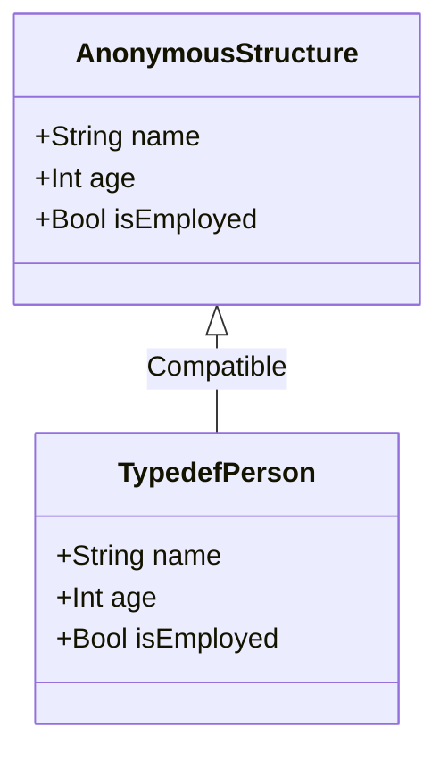

## 2.6 Anonymous Structures and Typedefs

In the realm of Haxe programming, anonymous structures and typedefs play a pivotal role in enhancing code clarity and flexibility. As expert developers, understanding these concepts allows us to leverage Haxe's structural typing system effectively, enabling us to create robust, maintainable, and cross-platform applications. In this section, we will delve into the intricacies of anonymous structures and typedefs, exploring their definitions, applications, and best practices.

### Defining Anonymous Structures

Anonymous structures in Haxe are akin to ad-hoc object types with specific fields. They allow us to define objects on the fly without the need for a formal class declaration. This feature is particularly useful when we need lightweight, temporary data structures or when working with APIs that return JSON-like data.

#### Creating Anonymous Structures

To create an anonymous structure, we simply define an object with named fields and their corresponding values. Here's a basic example:

```haxe
var person = {
    name: "Alice",
    age: 30,
    isEmployed: true
};

// Accessing fields
trace(person.name); // Outputs: Alice
trace(person.age); // Outputs: 30
trace(person.isEmployed); // Outputs: true
```

In this example, `person` is an anonymous structure with fields `name`, `age`, and `isEmployed`. We can access these fields using dot notation.

#### Advantages of Anonymous Structures

1. **Flexibility**: Anonymous structures provide flexibility in defining data structures without the overhead of class definitions.
2. **Conciseness**: They allow for concise code, especially when dealing with simple data representations.
3. **Ease of Use**: Ideal for quick prototyping and handling data from external sources like JSON.

#### Limitations of Anonymous Structures

While anonymous structures offer flexibility, they come with certain limitations:

- **Lack of Type Safety**: Since they are not tied to a specific class, type safety is reduced.
- **Limited Reusability**: They are not reusable across different parts of the application like classes or typedefs.

### Typedefs for Clarity

Typedefs in Haxe serve as type aliases, simplifying complex types and improving code readability. They allow us to define a new name for an existing type, making it easier to work with intricate data structures.

#### Defining Typedefs

A typedef is defined using the `typedef` keyword, followed by the new type name and the structure it represents. Here's an example:

```haxe
typedef Person = {
    var name: String;
    var age: Int;
    var isEmployed: Bool;
};

var employee: Person = {
    name: "Bob",
    age: 25,
    isEmployed: false
};

// Accessing fields
trace(employee.name); // Outputs: Bob
trace(employee.age); // Outputs: 25
trace(employee.isEmployed); // Outputs: false
```

In this example, `Person` is a typedef representing an anonymous structure with fields `name`, `age`, and `isEmployed`. We can now use `Person` as a type throughout our code, enhancing readability and maintainability.

#### Benefits of Using Typedefs

1. **Improved Readability**: Typedefs provide meaningful names to complex types, making the code easier to understand.
2. **Reusability**: They allow for the reuse of complex type definitions across different parts of the application.
3. **Type Safety**: Typedefs enhance type safety by enforcing structure consistency.

#### Typedefs and Structural Typing

Haxe's structural typing system allows typedefs to be used interchangeably with compatible structures. This means that as long as an object has the required fields, it can be assigned to a typedef, regardless of its origin.

```haxe
typedef Point = {
    var x: Float;
    var y: Float;
};

var p1: Point = { x: 10.5, y: 20.5 };
var p2 = { x: 5.0, y: 15.0 }; // Compatible with Point

// Assigning p2 to a Point variable
var p3: Point = p2;
trace(p3.x); // Outputs: 5.0
trace(p3.y); // Outputs: 15.0
```

In this example, `p2` is an anonymous structure compatible with the `Point` typedef, demonstrating Haxe's structural typing capabilities.

### Structural Typing

Structural typing in Haxe is a powerful feature that allows for flexibility in type assignments. Unlike nominal typing, which relies on explicit type declarations, structural typing focuses on the shape of the data.

#### Leveraging Structural Typing

With structural typing, we can assign objects to variables of a typedef as long as they have the required fields, regardless of their original type. This is particularly useful in scenarios where we interact with external data sources or APIs.

```haxe
typedef Rectangle = {
    var width: Float;
    var height: Float;
};

function calculateArea(rect: Rectangle): Float {
    return rect.width * rect.height;
}

var rect1 = { width: 10.0, height: 5.0 };
var rect2 = { width: 7.5, height: 3.5, color: "red" }; // Extra field

trace(calculateArea(rect1)); // Outputs: 50.0
trace(calculateArea(rect2)); // Outputs: 26.25
```

In this example, `rect2` has an extra field `color`, but it can still be used with the `calculateArea` function because it satisfies the `Rectangle` typedef's structure.

### Best Practices for Anonymous Structures and Typedefs

1. **Use Typedefs for Complex Structures**: When dealing with complex data structures, define typedefs to improve readability and maintainability.
2. **Leverage Structural Typing**: Take advantage of Haxe's structural typing to write flexible and reusable code.
3. **Avoid Overusing Anonymous Structures**: While they are useful for quick prototyping, overusing anonymous structures can lead to less maintainable code.
4. **Document Typedefs**: Provide clear documentation for typedefs to ensure that their purpose and structure are well understood by other developers.

### Try It Yourself

To deepen your understanding of anonymous structures and typedefs, try modifying the code examples provided. Experiment with adding new fields, creating additional typedefs, and using structural typing in different scenarios. This hands-on approach will solidify your grasp of these concepts and their applications.

### Visualizing Structural Typing

To better understand how structural typing works in Haxe, let's visualize the relationship between anonymous structures and typedefs using a class diagram.



In this diagram, `AnonymousStructure` represents an anonymous structure with fields `name`, `age`, and `isEmployed`. `TypedefPerson` is a typedef with the same fields, illustrating their compatibility through structural typing.

### References and Links

For further reading on Haxe's anonymous structures and typedefs, consider exploring the following resources:

- [Haxe Manual: Anonymous Structures](https://haxe.org/manual/types-anonymous-structure.html)
- [Haxe Manual: Typedefs](https://haxe.org/manual/types-typedef.html)
- [MDN Web Docs: JavaScript Data Structures](https://developer.mozilla.org/en-US/docs/Web/JavaScript/Data_structures)

### Knowledge Check

To reinforce your understanding of anonymous structures and typedefs, consider the following questions:

1. What are the advantages of using anonymous structures in Haxe?
2. How do typedefs improve code readability and maintainability?
3. Explain how structural typing works in Haxe.
4. What are some best practices for using typedefs in Haxe?

### Embrace the Journey

Remember, mastering anonymous structures and typedefs in Haxe is just the beginning of your journey as an expert developer. As you continue to explore Haxe's features, you'll unlock new possibilities for creating efficient, cross-platform applications. Keep experimenting, stay curious, and enjoy the journey!

## Quiz Time!



### What is an anonymous structure in Haxe?

- [x] An ad-hoc object type with specific fields
- [ ] A predefined class with methods
- [ ] A type alias for complex types
- [ ] A static method in a class

> **Explanation:** An anonymous structure is an ad-hoc object type with specific fields, allowing for flexible data representation without formal class definitions.

### How do typedefs improve code readability?

- [x] By providing meaningful names to complex types
- [ ] By reducing the number of lines in the code
- [ ] By eliminating the need for comments
- [ ] By automatically generating documentation

> **Explanation:** Typedefs improve code readability by providing meaningful names to complex types, making the code easier to understand and maintain.

### What is structural typing in Haxe?

- [x] A type system that focuses on the shape of data
- [ ] A method for defining class hierarchies
- [ ] A way to enforce strict type safety
- [ ] A technique for optimizing code performance

> **Explanation:** Structural typing in Haxe is a type system that focuses on the shape of data, allowing for flexible type assignments based on structure compatibility.

### Which of the following is a benefit of using typedefs?

- [x] Enhanced type safety
- [ ] Increased code complexity
- [ ] Reduced code execution speed
- [ ] Automatic error correction

> **Explanation:** Typedefs enhance type safety by enforcing structure consistency, making the code more reliable and less prone to errors.

### Can an object with extra fields be assigned to a typedef in Haxe?

- [x] Yes, as long as it has the required fields
- [ ] No, it must match the typedef exactly
- [ ] Only if the extra fields are of type String
- [ ] Only if the extra fields are optional

> **Explanation:** In Haxe, an object with extra fields can be assigned to a typedef as long as it has the required fields, thanks to structural typing.

### What is a limitation of anonymous structures?

- [x] Lack of type safety
- [ ] Inability to define methods
- [ ] Requirement for explicit class definitions
- [ ] Automatic memory management

> **Explanation:** A limitation of anonymous structures is the lack of type safety, as they are not tied to a specific class or typedef.

### How can typedefs be documented effectively?

- [x] By providing clear documentation for their purpose and structure
- [ ] By using inline comments for each field
- [ ] By including them in the main class file
- [ ] By generating automated documentation

> **Explanation:** Typedefs can be documented effectively by providing clear documentation for their purpose and structure, ensuring that other developers understand their use.

### What is the primary use of anonymous structures?

- [x] Quick prototyping and handling external data
- [ ] Defining complex class hierarchies
- [ ] Optimizing code performance
- [ ] Automating code generation

> **Explanation:** The primary use of anonymous structures is for quick prototyping and handling external data, providing flexibility without the need for formal class definitions.

### How does structural typing enhance code flexibility?

- [x] By allowing type assignments based on structure compatibility
- [ ] By enforcing strict type hierarchies
- [ ] By reducing the need for typedefs
- [ ] By automatically generating type aliases

> **Explanation:** Structural typing enhances code flexibility by allowing type assignments based on structure compatibility, enabling the use of objects with compatible fields.

### True or False: Typedefs can only be used with primitive types in Haxe.

- [ ] True
- [x] False

> **Explanation:** False. Typedefs can be used with any type in Haxe, including complex structures and anonymous types.


