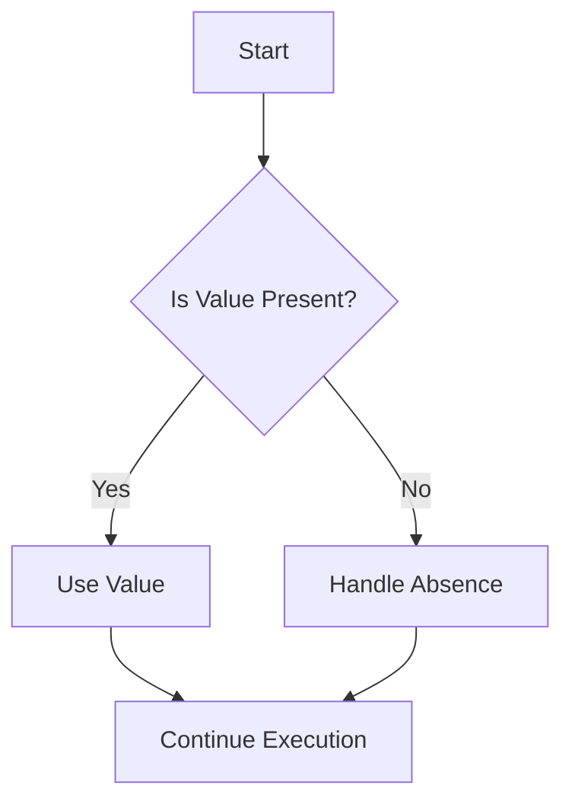

## 2.7 Null Safety and Option Types

In the world of software development, null reference errors are notorious for causing unexpected crashes and bugs. Haxe, with its cross-platform capabilities, provides robust mechanisms to handle null values effectively, ensuring that your applications are both reliable and maintainable. In this section, we will delve into the strategies for preventing null reference errors in Haxe, focusing on the use of `Null<T>` and `Option<T>` types. We will also explore best practices for handling null values, emphasizing the importance of preferring non-nullable types and explicitly managing `null` when necessary.

### Understanding Null Safety

Null safety is a programming concept aimed at reducing the occurrence of null reference errors, which occur when a program attempts to access or modify an object that has not been initialized. These errors can lead to application crashes and are often difficult to debug. Haxe provides several features to enhance null safety, making it easier for developers to write robust code.

### Handling Null Values in Haxe

#### Strategies to Prevent Null Reference Errors

1. **Avoid Nulls When Possible**: The best way to prevent null reference errors is to avoid using nulls altogether. Instead, use default values or design your code to handle missing data gracefully.

2. **Use Non-Nullable Types**: Haxe's type system allows you to define non-nullable types, ensuring that a variable must always hold a valid value. This can be achieved by avoiding the use of `Null<T>` unless absolutely necessary.

3. **Explicit Null Checks**: When dealing with nullable types, always perform explicit null checks before accessing the value. This ensures that your code can handle null values gracefully without crashing.

4. **Leverage Option Types**: Haxe provides `Option<T>` as a way to represent optional values explicitly. This type forces you to handle the presence or absence of a value, reducing the risk of null reference errors.

### Option Types in Haxe

#### Using `Null<T>`

The `Null<T>` type in Haxe is used to indicate that a variable of type `T` can also hold a `null` value. This is particularly useful when interfacing with platforms or libraries that require nullable types.

```haxe
class Example {
    static function main() {
        var nullableInt: Null<Int> = null;
        if (nullableInt != null) {
            trace("Value: " + nullableInt);
        } else {
            trace("Value is null");
        }
    }
}
```

In this example, `nullableInt` is declared as `Null<Int>`, meaning it can either hold an integer value or be `null`. The explicit null check ensures that we only access the value if it is not `null`.

#### Using `Option<T>`

The `Option<T>` type is a more robust way to handle optional values in Haxe. It is an algebraic data type that can either be `Some(value)` or `None`, representing the presence or absence of a value, respectively.

```haxe
class Example {
    static function main() {
        var optionalValue: Option<Int> = Some(42);
        switch (optionalValue) {
            case Some(value):
                trace("Value: " + value);
            case None:
                trace("No value");
        }
    }
}
```

In this example, `optionalValue` is of type `Option<Int>`, and we use a `switch` statement to handle both cases: when a value is present (`Some(value)`) and when it is absent (`None`). This approach enforces explicit handling of both scenarios, reducing the likelihood of null reference errors.

### Best Practices for Null Safety

1. **Prefer Non-Nullable Types**: Whenever possible, design your code to use non-nullable types. This reduces the need for null checks and makes your code more predictable.

2. **Use `Option<T>` for Optional Values**: When a value can be optional, use `Option<T>` instead of `Null<T>`. This makes the optional nature of the value explicit and forces you to handle both cases.

3. **Handle `null` Explicitly**: If you must use `Null<T>`, always perform explicit null checks before accessing the value. This ensures that your code can handle null values gracefully.

4. **Leverage Haxe's Type System**: Haxe's powerful type system can help you enforce null safety by using type constraints and generics. Use these features to your advantage to write safer code.

5. **Document Nullable Types**: When using nullable types, document their usage clearly in your code. This helps other developers understand the potential for null values and handle them appropriately.

### Visualizing Null Safety and Option Types

To better understand how null safety and option types work in Haxe, let's visualize the flow of handling optional values using a Mermaid.js flowchart.



**Figure 1: Flowchart for Handling Optional Values in Haxe**

This flowchart illustrates the decision-making process when dealing with optional values in Haxe. If a value is present, it is used; otherwise, the absence is handled explicitly.

### Try It Yourself

To solidify your understanding of null safety and option types in Haxe, try modifying the code examples provided. Experiment with different scenarios, such as:

- Changing the type of `nullableInt` to a non-nullable type and observing the compiler errors.
- Using `Option<T>` with different data types and handling both `Some` and `None` cases.
- Implementing a function that returns an `Option<T>` and using it in your code.

### References and Links

For further reading on null safety and option types in Haxe, consider the following resources:

- [Haxe Manual: Nullability](https://haxe.org/manual/types-nullability.html)
- [Haxe Manual: Option Type](https://haxe.org/manual/types-option.html)
- [MDN Web Docs: Null](https://developer.mozilla.org/en-US/docs/Web/JavaScript/Reference/Global_Objects/null)

### Knowledge Check

To reinforce your understanding of null safety and option types in Haxe, consider the following questions:

1. What is the primary purpose of null safety in programming?
2. How does Haxe's `Option<T>` type differ from `Null<T>`?
3. Why is it important to prefer non-nullable types in your code?
4. How can you handle the absence of a value when using `Option<T>`?
5. What are some best practices for handling null values in Haxe?

### Embrace the Journey

Remember, mastering null safety and option types in Haxe is just one step in your journey to becoming an expert cross-platform software engineer. As you continue to explore Haxe's powerful features, you'll gain the skills needed to write robust, maintainable code that runs seamlessly across platforms. Keep experimenting, stay curious, and enjoy the journey!

## Quiz Time!



### What is the primary purpose of null safety in programming?

- [x] To reduce the occurrence of null reference errors
- [ ] To increase code complexity
- [ ] To make code execution slower
- [ ] To remove all null values from the code

> **Explanation:** Null safety aims to reduce null reference errors, which can cause unexpected crashes and bugs.

### How does Haxe's `Option<T>` type differ from `Null<T>`?

- [x] `Option<T>` explicitly represents the presence or absence of a value
- [ ] `Option<T>` can only hold integer values
- [ ] `Null<T>` is used for non-nullable types
- [ ] `Option<T>` is not supported in Haxe

> **Explanation:** `Option<T>` is an algebraic data type that explicitly represents optional values, while `Null<T>` indicates that a type can hold a null value.

### Why is it important to prefer non-nullable types in your code?

- [x] To reduce the need for null checks and make code more predictable
- [ ] To increase the number of null reference errors
- [ ] To make code execution slower
- [ ] To remove all optional values from the code

> **Explanation:** Using non-nullable types reduces the need for null checks, making the code more predictable and less prone to errors.

### How can you handle the absence of a value when using `Option<T>`?

- [x] Use a `switch` statement to handle `Some` and `None` cases
- [ ] Ignore the absence and proceed with execution
- [ ] Use `Null<T>` instead
- [ ] Throw an exception

> **Explanation:** A `switch` statement can be used to handle both `Some` and `None` cases explicitly.

### What are some best practices for handling null values in Haxe?

- [x] Prefer non-nullable types and use `Option<T>` for optional values
- [ ] Use `Null<T>` for all variables
- [ ] Avoid explicit null checks
- [ ] Ignore null values in your code

> **Explanation:** Best practices include preferring non-nullable types, using `Option<T>` for optional values, and handling nulls explicitly.

### What is the benefit of using `Option<T>` over `Null<T>`?

- [x] It forces explicit handling of both presence and absence of values
- [ ] It allows for more null reference errors
- [ ] It makes code execution slower
- [ ] It is not supported in Haxe

> **Explanation:** `Option<T>` forces explicit handling of both `Some` and `None` cases, reducing the risk of null reference errors.

### What does the `Some(value)` case represent in `Option<T>`?

- [x] The presence of a value
- [ ] The absence of a value
- [ ] A null value
- [ ] An error state

> **Explanation:** `Some(value)` represents the presence of a value in `Option<T>`.

### What does the `None` case represent in `Option<T>`?

- [x] The absence of a value
- [ ] The presence of a value
- [ ] A null value
- [ ] An error state

> **Explanation:** `None` represents the absence of a value in `Option<T>`.

### Can `Null<T>` be used with non-nullable types in Haxe?

- [ ] True
- [x] False

> **Explanation:** `Null<T>` is used to indicate that a type can hold a null value, which is not applicable to non-nullable types.

### Is it possible to avoid all null reference errors by using null safety features?

- [ ] True
- [x] False

> **Explanation:** While null safety features significantly reduce the risk of null reference errors, they cannot eliminate them entirely. Proper handling and best practices are still necessary.


