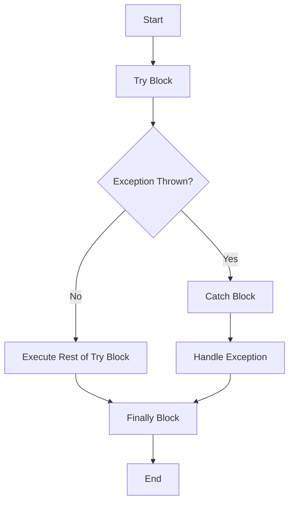

## 2.8 Exception Handling Mechanisms

In the realm of software development, handling exceptions effectively is crucial for building robust applications. Haxe, with its cross-platform capabilities, offers a powerful set of tools for managing exceptions. In this section, we will delve into the intricacies of exception handling in Haxe, exploring try-catch-finally blocks, custom exceptions, and error propagation. By mastering these concepts, you will be equipped to write resilient code that gracefully handles unexpected situations across multiple platforms.

### Understanding Exception Handling

Exception handling is a mechanism that allows developers to manage errors and exceptional conditions in a controlled manner. It provides a way to separate error-handling code from regular code, improving readability and maintainability. In Haxe, exceptions are objects that represent an error or unexpected event that occurs during program execution.

### Try-Catch-Finally Blocks

The try-catch-finally construct is the cornerstone of exception handling in Haxe. It allows you to define a block of code to be executed, specify how to handle exceptions that may arise, and ensure that certain cleanup code runs regardless of whether an exception is thrown.

#### Try Block

The try block contains the code that may throw an exception. It is the section where you anticipate potential errors and want to handle them gracefully.

```haxe
try {
    // Code that may throw an exception
    var result = riskyOperation();
    trace("Operation successful: " + result);
} catch (e:Dynamic) {
    // Handle the exception
    trace("An error occurred: " + e);
} finally {
    // Cleanup code
    trace("Cleanup complete.");
}
```

In this example, `riskyOperation()` is a function that might throw an exception. If an exception occurs, the catch block is executed, allowing you to handle the error. The finally block runs regardless of whether an exception was thrown, making it ideal for resource cleanup.

#### Catch Block

The catch block is where you handle exceptions. In Haxe, you can catch exceptions of specific types or use a generic catch-all approach. The type of the exception is specified in parentheses after the `catch` keyword.

```haxe
try {
    // Code that may throw an exception
} catch (e:SpecificException) {
    // Handle specific exception type
    trace("Caught SpecificException: " + e.message);
} catch (e:Dynamic) {
    // Handle any other exception
    trace("Caught an unexpected exception: " + e);
}
```

By catching specific exception types, you can tailor your error-handling logic to different scenarios, providing more precise control over how exceptions are managed.

#### Finally Block

The finally block is optional but highly recommended. It is executed after the try and catch blocks, regardless of whether an exception was thrown. This makes it ideal for releasing resources, closing files, or performing other cleanup tasks.

```haxe
try {
    // Code that may throw an exception
} catch (e:Dynamic) {
    // Handle the exception
} finally {
    // Cleanup code
    trace("Executing cleanup tasks.");
}
```

### Custom Exceptions

In many cases, the built-in exceptions provided by Haxe may not be sufficient to represent domain-specific errors. Creating custom exceptions allows you to define error types that are meaningful to your application.

#### Defining Custom Exceptions

To create a custom exception in Haxe, define a new class that extends the `haxe.Exception` class. This allows you to add additional properties or methods to your exception class.

```haxe
class MyCustomException extends haxe.Exception {
    public var errorCode:Int;

    public function new(message:String, errorCode:Int) {
        super(message);
        this.errorCode = errorCode;
    }
}
```

In this example, `MyCustomException` includes an additional `errorCode` property, providing more context about the error.

#### Throwing and Catching Custom Exceptions

Once you have defined a custom exception, you can throw it using the `throw` keyword and catch it in a try-catch block.

```haxe
try {
    throw new MyCustomException("Something went wrong", 404);
} catch (e:MyCustomException) {
    trace("Caught MyCustomException: " + e.message + " (Error code: " + e.errorCode + ")");
}
```

By using custom exceptions, you can convey more detailed information about errors, making it easier to diagnose and resolve issues.

### Error Propagation

Error propagation is the process of passing exceptions up the call stack until they are caught and handled. In Haxe, you can choose to catch exceptions at the point where they occur or allow them to propagate to a higher level in the call stack.

#### Deciding When to Catch or Rethrow Exceptions

When designing your exception-handling strategy, consider the following guidelines:

- **Catch exceptions when you can handle them meaningfully.** If you can recover from an error or provide a useful response, catch the exception and handle it locally.
- **Rethrow exceptions when you cannot handle them.** If an exception cannot be resolved at the current level, rethrow it to allow higher-level code to handle it.

```haxe
try {
    // Code that may throw an exception
} catch (e:SpecificException) {
    if (canHandle(e)) {
        // Handle the exception
    } else {
        // Rethrow the exception
        throw e;
    }
}
```

By carefully considering when to catch or rethrow exceptions, you can create a robust error-handling strategy that minimizes the impact of errors on your application.

### Visualizing Exception Handling Flow

To better understand the flow of exception handling in Haxe, let's visualize the process using a flowchart.



This flowchart illustrates the sequence of events in a try-catch-finally construct. If an exception is thrown, the catch block is executed. Regardless of whether an exception occurs, the finally block is executed before the program continues.

### Best Practices for Exception Handling

To effectively manage exceptions in Haxe, consider the following best practices:

- **Use specific exception types.** Catch specific exceptions to handle different error scenarios appropriately.
- **Avoid catching generic exceptions.** Catching all exceptions can mask underlying issues and make debugging difficult.
- **Log exceptions.** Record exception details to aid in diagnosing and resolving issues.
- **Use finally blocks for cleanup.** Ensure resources are released and cleanup tasks are performed, even if an exception occurs.
- **Document exception behavior.** Clearly document which exceptions a function may throw and how they should be handled.

### Try It Yourself

To reinforce your understanding of exception handling in Haxe, try modifying the following code example:

```haxe
class Main {
    static function main() {
        try {
            var result = divide(10, 0);
            trace("Result: " + result);
        } catch (e:DivisionByZeroException) {
            trace("Cannot divide by zero: " + e.message);
        } finally {
            trace("Execution complete.");
        }
    }

    static function divide(a:Int, b:Int):Int {
        if (b == 0) throw new DivisionByZeroException("Division by zero is not allowed.");
        return a / b;
    }
}

class DivisionByZeroException extends haxe.Exception {
    public function new(message:String) {
        super(message);
    }
}
```

**Experiment with the following:**

- Modify the `divide` function to throw a different custom exception for negative divisors.
- Add additional catch blocks to handle different types of exceptions.
- Implement logging to record exception details.

### Knowledge Check

Before we conclude, let's summarize the key takeaways:

- Exception handling in Haxe is managed using try-catch-finally blocks.
- Custom exceptions allow you to define domain-specific error types.
- Error propagation involves deciding when to catch or rethrow exceptions.
- Best practices include using specific exception types, logging exceptions, and using finally blocks for cleanup.

Remember, mastering exception handling is a journey. As you continue to develop your skills, you'll become more adept at writing resilient code that gracefully handles unexpected situations.

## Quiz Time!



### What is the primary purpose of the try block in Haxe?

- [x] To contain code that may throw an exception
- [ ] To handle exceptions that are thrown
- [ ] To clean up resources
- [ ] To log exceptions

> **Explanation:** The try block contains the code that may throw an exception, allowing you to handle it in the catch block.

### What is the role of the catch block in exception handling?

- [ ] To execute code regardless of exceptions
- [x] To handle exceptions that are thrown
- [ ] To define custom exceptions
- [ ] To propagate exceptions

> **Explanation:** The catch block is used to handle exceptions that are thrown in the try block.

### What is the purpose of the finally block?

- [ ] To handle exceptions
- [x] To execute cleanup code
- [ ] To define custom exceptions
- [ ] To propagate exceptions

> **Explanation:** The finally block is used to execute cleanup code, regardless of whether an exception was thrown.

### How do you create a custom exception in Haxe?

- [ ] By using the `try` keyword
- [x] By extending the `haxe.Exception` class
- [ ] By using the `finally` keyword
- [ ] By using the `catch` keyword

> **Explanation:** Custom exceptions are created by defining a new class that extends the `haxe.Exception` class.

### When should you rethrow an exception?

- [x] When you cannot handle it meaningfully
- [ ] When you can handle it locally
- [ ] When you want to log it
- [ ] When you want to execute cleanup code

> **Explanation:** Rethrow exceptions when you cannot handle them meaningfully at the current level, allowing higher-level code to manage them.

### What is error propagation?

- [ ] Creating custom exceptions
- [ ] Logging exceptions
- [x] Passing exceptions up the call stack
- [ ] Executing cleanup code

> **Explanation:** Error propagation involves passing exceptions up the call stack until they are caught and handled.

### Why is it important to use specific exception types?

- [x] To handle different error scenarios appropriately
- [ ] To catch all exceptions
- [ ] To execute cleanup code
- [ ] To log exceptions

> **Explanation:** Using specific exception types allows you to handle different error scenarios appropriately.

### What should you avoid when catching exceptions?

- [ ] Logging exceptions
- [x] Catching all exceptions generically
- [ ] Using specific exception types
- [ ] Executing cleanup code

> **Explanation:** Avoid catching all exceptions generically, as it can mask underlying issues and make debugging difficult.

### What is a best practice for documenting exception behavior?

- [x] Clearly document which exceptions a function may throw
- [ ] Avoid documenting exceptions
- [ ] Use generic exception types
- [ ] Log exceptions

> **Explanation:** Clearly document which exceptions a function may throw and how they should be handled.

### True or False: The finally block is optional in Haxe.

- [x] True
- [ ] False

> **Explanation:** The finally block is optional but recommended for executing cleanup code.



Remember, this is just the beginning. As you progress, you'll build more complex and resilient applications. Keep experimenting, stay curious, and enjoy the journey!
