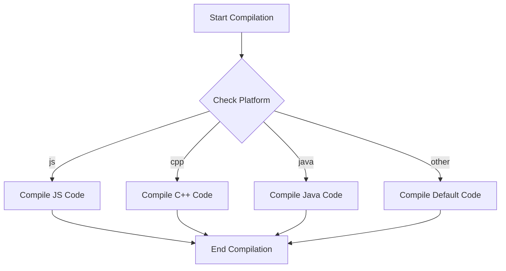

## 2.9 Conditional Compilation and Cross-Platform Development

In the realm of cross-platform development, Haxe stands out as a versatile language that allows developers to write code once and deploy it across multiple platforms. A crucial feature that facilitates this capability is **conditional compilation**. This section will delve into the intricacies of conditional compilation in Haxe, exploring how it enables developers to tailor code for different platforms while maintaining a single codebase. We will cover compiler flags and directives, platform-specific code blocks, and best practices for minimizing platform-specific code to ensure portability.

### Understanding Conditional Compilation

Conditional compilation is a powerful feature that allows developers to include or exclude parts of the code based on certain conditions. This is particularly useful in cross-platform development, where different platforms may require different implementations of the same functionality.

#### Compiler Flags and Directives

Haxe uses a set of compiler directives to manage conditional compilation. The primary directives are `#if`, `#elseif`, `#else`, and `#end`. These directives enable developers to specify conditions under which certain blocks of code should be compiled.

- **`#if`**: This directive checks if a condition is true. If the condition is met, the code block following the directive is compiled.
- **`#elseif`**: This directive provides an alternative condition if the previous `#if` or `#elseif` condition was not met.
- **`#else`**: This directive specifies a block of code to compile if none of the preceding conditions were met.
- **`#end`**: This directive marks the end of a conditional compilation block.

#### Example of Conditional Compilation

```haxe
class Main {
    static function main() {
        #if js
            trace("Running on JavaScript platform");
        #elseif cpp
            trace("Running on C++ platform");
        #else
            trace("Running on an unsupported platform");
        #end
    }
}
```

In this example, the `trace` function outputs a message depending on the target platform. If the code is compiled for JavaScript, it will output "Running on JavaScript platform". If compiled for C++, it will output "Running on C++ platform". If neither condition is met, it defaults to "Running on an unsupported platform".

### Platform-Specific Code Blocks

One of the key advantages of Haxe is its ability to target multiple platforms, such as JavaScript, C++, Java, Python, and more. However, each platform may have its own specific requirements or APIs. Conditional compilation allows developers to write platform-specific code blocks within the same codebase.

#### Targeting Specific Platforms

Haxe provides predefined compiler flags for each target platform. These flags can be used within `#if` directives to conditionally compile code for specific platforms. Some common platform flags include:

- **`js`**: JavaScript
- **`cpp`**: C++
- **`java`**: Java
- **`cs`**: C#
- **`python`**: Python

#### Example of Platform-Specific Code

```haxe
class PlatformSpecific {
    static function performTask() {
        #if js
            jsSpecificTask();
        #elseif cpp
            cppSpecificTask();
        #elseif java
            javaSpecificTask();
        #end
    }

    static function jsSpecificTask() {
        trace("Executing JavaScript-specific task");
    }

    static function cppSpecificTask() {
        trace("Executing C++-specific task");
    }

    static function javaSpecificTask() {
        trace("Executing Java-specific task");
    }
}
```

In this example, the `performTask` function calls different methods depending on the target platform. This allows developers to implement platform-specific logic while maintaining a unified codebase.

### Best Practices for Conditional Compilation

While conditional compilation is a powerful tool, it should be used judiciously to maintain code readability and portability. Here are some best practices to consider:

#### Minimize Platform-Specific Code

- **Encapsulate Platform Differences**: Use abstraction layers or interfaces to encapsulate platform-specific code. This reduces the need for conditional compilation and makes the codebase easier to maintain.
  
- **Use Conditional Compilation Sparingly**: Overusing conditional compilation can lead to complex and difficult-to-maintain code. Aim to keep the majority of the code platform-agnostic.

- **Document Conditional Code**: Clearly document any platform-specific code and the reasons for its existence. This helps other developers understand the code and reduces the risk of errors during future modifications.

#### Maintain Portability

- **Test Across Platforms**: Regularly test the code on all target platforms to ensure consistent behavior and performance.

- **Leverage Haxe's Standard Library**: Whenever possible, use Haxe's standard library functions, which are designed to be cross-platform, instead of platform-specific APIs.

### Visualizing Conditional Compilation

To better understand how conditional compilation works, let's visualize the process using a flowchart. This diagram illustrates the decision-making process during compilation based on platform flags.



**Diagram Description**: This flowchart shows the flow of conditional compilation based on platform flags. The compiler checks the platform and compiles the corresponding code block.

### Try It Yourself

To solidify your understanding of conditional compilation, try modifying the code examples provided. Experiment with adding new platform-specific tasks or changing the conditions to see how the output changes. This hands-on approach will help you grasp the nuances of conditional compilation in Haxe.

### References and Links

For more information on conditional compilation and cross-platform development in Haxe, consider exploring the following resources:

- [Haxe Manual: Conditional Compilation](https://haxe.org/manual/lf-condition-compilation.html)
- [MDN Web Docs: Cross-Browser Testing](https://developer.mozilla.org/en-US/docs/Learn/Tools_and_testing/Cross_browser_testing)
- [W3Schools: JavaScript Conditional Statements](https://www.w3schools.com/js/js_if_else.asp)

### Knowledge Check

To reinforce your understanding of conditional compilation and cross-platform development, consider the following questions and exercises:

- What are the main directives used in Haxe for conditional compilation?
- How can you minimize platform-specific code while maintaining portability?
- Create a simple Haxe program that uses conditional compilation to output different messages for JavaScript and Python platforms.

### Embrace the Journey

Remember, mastering conditional compilation and cross-platform development is a journey. As you continue to experiment and learn, you'll become more adept at creating efficient, maintainable, and portable software solutions. Keep exploring, stay curious, and enjoy the process!

## Quiz Time!



### What is the primary purpose of conditional compilation in Haxe?

- [x] To include or exclude parts of the code based on certain conditions
- [ ] To compile code faster
- [ ] To improve code readability
- [ ] To manage memory usage

> **Explanation:** Conditional compilation allows developers to include or exclude parts of the code based on specific conditions, which is particularly useful for cross-platform development.

### Which directive is used to mark the end of a conditional compilation block in Haxe?

- [ ] #if
- [ ] #elseif
- [ ] #else
- [x] #end

> **Explanation:** The `#end` directive is used to mark the end of a conditional compilation block in Haxe.

### How can you target JavaScript-specific code in Haxe?

- [ ] Use `#if cpp`
- [x] Use `#if js`
- [ ] Use `#if java`
- [ ] Use `#if python`

> **Explanation:** The `#if js` directive is used to target JavaScript-specific code in Haxe.

### What is a best practice for maintaining portability in cross-platform development?

- [x] Minimize platform-specific code
- [ ] Use as many platform-specific APIs as possible
- [ ] Avoid testing on all platforms
- [ ] Write separate codebases for each platform

> **Explanation:** Minimizing platform-specific code helps maintain portability and makes the codebase easier to manage.

### What should you do to ensure consistent behavior across platforms?

- [x] Regularly test the code on all target platforms
- [ ] Only test on the primary platform
- [ ] Use platform-specific APIs
- [ ] Avoid using Haxe's standard library

> **Explanation:** Regularly testing the code on all target platforms ensures consistent behavior and performance.

### Which of the following is a predefined compiler flag for targeting C++ in Haxe?

- [ ] js
- [x] cpp
- [ ] java
- [ ] python

> **Explanation:** The `cpp` flag is used to target C++ in Haxe.

### What is the role of the `#elseif` directive in Haxe?

- [ ] To end a conditional compilation block
- [x] To provide an alternative condition if the previous condition was not met
- [ ] To include code unconditionally
- [ ] To define a new platform

> **Explanation:** The `#elseif` directive provides an alternative condition if the previous `#if` or `#elseif` condition was not met.

### Why should you document platform-specific code?

- [x] To help other developers understand the code
- [ ] To make the code run faster
- [ ] To increase code complexity
- [ ] To avoid using Haxe's standard library

> **Explanation:** Documenting platform-specific code helps other developers understand the code and reduces the risk of errors during future modifications.

### What is a potential downside of overusing conditional compilation?

- [x] It can lead to complex and difficult-to-maintain code
- [ ] It makes the code run slower
- [ ] It reduces code readability
- [ ] It increases memory usage

> **Explanation:** Overusing conditional compilation can lead to complex and difficult-to-maintain code, making it harder to manage.

### True or False: Conditional compilation can be used to manage memory usage in Haxe.

- [ ] True
- [x] False

> **Explanation:** Conditional compilation is not used to manage memory usage; it is used to include or exclude code based on conditions.



By mastering conditional compilation and cross-platform development in Haxe, you can create robust and versatile applications that run seamlessly across multiple platforms. Keep experimenting and refining your skills to become an expert in this domain!
