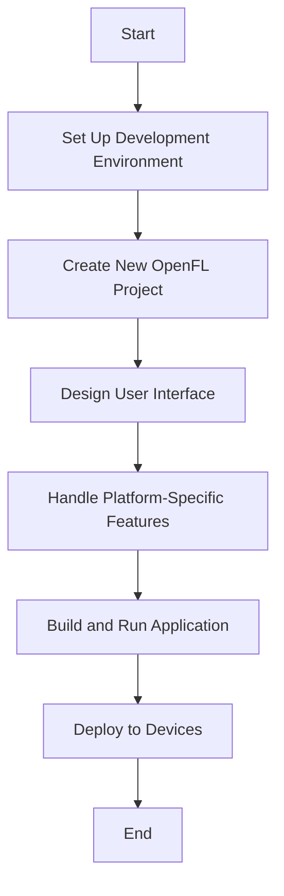

## 20.1 Developing a Cross-Platform Mobile Application

In today's fast-paced digital world, developing applications that can run seamlessly across multiple platforms is crucial. Haxe, with its robust cross-platform capabilities, offers an excellent solution for building mobile applications that target both iOS and Android platforms. This section will guide you through the process of developing a cross-platform mobile application using Haxe, focusing on key considerations such as UI frameworks and platform-specific features, and highlighting the outcomes of reduced development time and consistent user experience.

### Introduction to Cross-Platform Mobile Development

Cross-platform mobile development refers to the practice of building applications that can run on multiple mobile operating systems, such as iOS and Android, using a single codebase. This approach offers several advantages, including reduced development time, cost savings, and a consistent user experience across platforms. Haxe, with its ability to compile to multiple target languages, is particularly well-suited for cross-platform development.

### Key Considerations for Cross-Platform Mobile Development

#### UI Frameworks

One of the primary challenges in cross-platform mobile development is creating a user interface (UI) that feels native on each platform. Haxe provides several UI frameworks that can help achieve this goal:

- **OpenFL**: OpenFL is a popular framework for building cross-platform applications with a focus on 2D graphics. It provides a familiar API similar to Adobe Flash, making it easy to create rich, interactive UIs. OpenFL supports both iOS and Android, allowing you to create native-like interfaces with a single codebase.

- **Kha**: Kha is another powerful framework for cross-platform development. It is designed for high-performance applications and games, offering advanced graphics capabilities and support for multiple platforms, including iOS and Android. Kha's low-level access to hardware features makes it ideal for applications that require high performance and custom rendering.

#### Platform-Specific Features

While cross-platform development aims to minimize platform-specific code, there are often cases where you need to handle differences in OS capabilities. Haxe allows you to use conditional compilation to include platform-specific code only when necessary. This approach ensures that your application can take advantage of unique features on each platform without compromising the shared codebase.

### Building a Cross-Platform Mobile Application with Haxe

Let's walk through the process of building a simple cross-platform mobile application using Haxe. We'll use OpenFL as our UI framework and demonstrate how to handle platform-specific features.

#### Setting Up Your Development Environment

Before we start coding, we need to set up our development environment. Follow these steps to get started:

1. **Install Haxe**: Download and install Haxe from the [official website](https://haxe.org/download/).

2. **Install OpenFL**: Open a terminal and run the following command to install OpenFL:

   ```bash
   haxelib install openfl
   ```

3. **Set Up Your IDE**: Choose an integrated development environment (IDE) that supports Haxe, such as Visual Studio Code or IntelliJ IDEA, and configure it for Haxe development.

#### Creating a New OpenFL Project

Once your environment is set up, you can create a new OpenFL project:

1. **Create a New Project**: Run the following command to create a new OpenFL project:

   ```bash
   openfl create project MyCrossPlatformApp
   ```

2. **Navigate to the Project Directory**: Change to the newly created project directory:

   ```bash
   cd MyCrossPlatformApp
   ```

3. **Open the Project in Your IDE**: Open the project in your chosen IDE to start coding.

#### Designing the User Interface

With the project set up, let's design a simple user interface. We'll create a basic application with a button that displays a message when clicked.

1. **Open the Main Class**: Open the `Main.hx` file in your IDE. This file contains the entry point for your application.

2. **Add a Button to the Stage**: Use the following code to add a button to the stage:

   ```haxe
   package;

   import openfl.display.Sprite;
   import openfl.events.MouseEvent;
   import openfl.text.TextField;
   import openfl.text.TextFormat;

   class Main extends Sprite {
       
       public function new() {
           super();
           initialize();
       }

       private function initialize():Void {
           var button:Sprite = new Sprite();
           button.graphics.beginFill(0xFFCC00);
           button.graphics.drawRect(0, 0, 200, 50);
           button.graphics.endFill();
           button.x = (stage.stageWidth - button.width) / 2;
           button.y = (stage.stageHeight - button.height) / 2;
           button.buttonMode = true;
           button.addEventListener(MouseEvent.CLICK, onButtonClick);
           addChild(button);

           var label:TextField = new TextField();
           label.defaultTextFormat = new TextFormat("Arial", 20, 0x000000, true);
           label.text = "Click Me!";
           label.width = button.width;
           label.height = button.height;
           label.selectable = false;
           button.addChild(label);
       }

       private function onButtonClick(event:MouseEvent):Void {
           trace("Button clicked!");
       }
   }
   ```

   **Explanation**: This code creates a simple button using the `Sprite` class. The button is centered on the stage and displays the text "Click Me!". When the button is clicked, a message is traced to the console.

#### Handling Platform-Specific Features

To demonstrate handling platform-specific features, let's add a feature that displays a different message depending on the platform.

1. **Use Conditional Compilation**: Modify the `onButtonClick` function to include platform-specific code:

   ```haxe
   private function onButtonClick(event:MouseEvent):Void {
       #if android
       trace("Button clicked on Android!");
       #elseif ios
       trace("Button clicked on iOS!");
       #else
       trace("Button clicked on an unknown platform!");
       #end
   }
   ```

   **Explanation**: This code uses Haxe's conditional compilation feature to include platform-specific code. The `#if`, `#elseif`, and `#else` directives allow you to specify different code blocks for different platforms.

#### Building and Running the Application

With the code complete, it's time to build and run the application on both iOS and Android.

1. **Build for Android**: Run the following command to build the application for Android:

   ```bash
   openfl build android
   ```

2. **Build for iOS**: Run the following command to build the application for iOS:

   ```bash
   openfl build ios
   ```

3. **Deploy to Devices**: Use your IDE or command line tools to deploy the application to an Android or iOS device for testing.

### Outcomes of Cross-Platform Development with Haxe

By using Haxe for cross-platform mobile development, you can achieve several key outcomes:

- **Reduced Development Time**: With a shared codebase, you can minimize duplicated effort and focus on building features that work across platforms.

- **Consistent User Experience**: By using frameworks like OpenFL, you can create native-like interfaces that provide a consistent user experience on both iOS and Android.

- **Flexibility and Scalability**: Haxe's ability to compile to multiple target languages allows you to easily extend your application to other platforms in the future.

### Visualizing the Cross-Platform Development Process

To better understand the cross-platform development process, let's visualize the workflow using a flowchart.



**Description**: This flowchart illustrates the steps involved in developing a cross-platform mobile application using Haxe. It begins with setting up the development environment and ends with deploying the application to devices.

### Try It Yourself

Now that you've seen how to build a cross-platform mobile application with Haxe, try experimenting with the code. Here are some suggestions:

- **Modify the Button**: Change the button's color, size, or position to see how it affects the UI.

- **Add More Features**: Implement additional features, such as a text input field or a second button, to enhance the application.

- **Explore Other Frameworks**: Try using Kha instead of OpenFL to see how it affects performance and capabilities.

### Knowledge Check

Before we wrap up, let's review some key concepts:

- **What are the benefits of cross-platform mobile development?**

- **How does Haxe's conditional compilation feature help in handling platform-specific code?**

- **What are the differences between OpenFL and Kha?**

### Conclusion

Developing cross-platform mobile applications with Haxe offers a powerful way to reach both iOS and Android users with a single codebase. By leveraging frameworks like OpenFL and Kha, you can create native-like interfaces and handle platform-specific features efficiently. Remember, this is just the beginning. As you continue to explore Haxe's capabilities, you'll discover even more ways to optimize your development process and deliver high-quality applications across multiple platforms.

## Quiz Time!



### What is a primary advantage of cross-platform mobile development?

- [x] Reduced development time
- [ ] Increased complexity
- [ ] Platform-specific code duplication
- [ ] Limited user experience

> **Explanation:** Cross-platform mobile development reduces development time by allowing developers to use a single codebase for multiple platforms.

### Which Haxe framework is known for its focus on 2D graphics?

- [x] OpenFL
- [ ] Kha
- [ ] Unity
- [ ] Flutter

> **Explanation:** OpenFL is a framework that focuses on 2D graphics and provides a familiar API similar to Adobe Flash.

### How does Haxe handle platform-specific features?

- [x] Conditional compilation
- [ ] Separate codebases
- [ ] Manual code duplication
- [ ] Platform-specific libraries

> **Explanation:** Haxe uses conditional compilation to include platform-specific code only when necessary.

### What command is used to create a new OpenFL project?

- [x] openfl create project MyCrossPlatformApp
- [ ] haxelib new project MyCrossPlatformApp
- [ ] haxe create project MyCrossPlatformApp
- [ ] openfl new MyCrossPlatformApp

> **Explanation:** The command `openfl create project MyCrossPlatformApp` is used to create a new OpenFL project.

### Which framework is designed for high-performance applications and games?

- [ ] OpenFL
- [x] Kha
- [ ] React Native
- [ ] Xamarin

> **Explanation:** Kha is designed for high-performance applications and games, offering advanced graphics capabilities.

### What is the purpose of the `#if` directive in Haxe?

- [x] To include platform-specific code
- [ ] To define a new variable
- [ ] To create a loop
- [ ] To handle exceptions

> **Explanation:** The `#if` directive in Haxe is used for conditional compilation to include platform-specific code.

### What is a key outcome of using Haxe for cross-platform development?

- [x] Consistent user experience
- [ ] Increased development cost
- [ ] Platform-specific UI
- [ ] Limited scalability

> **Explanation:** Haxe allows for a consistent user experience across platforms by using a shared codebase.

### Which command builds an OpenFL project for Android?

- [x] openfl build android
- [ ] haxe build android
- [ ] openfl compile android
- [ ] haxelib build android

> **Explanation:** The command `openfl build android` is used to build an OpenFL project for Android.

### What is the role of the `trace` function in Haxe?

- [x] To output messages to the console
- [ ] To create a new variable
- [ ] To handle exceptions
- [ ] To define a class

> **Explanation:** The `trace` function in Haxe is used to output messages to the console for debugging purposes.

### True or False: Haxe can only compile to JavaScript.

- [ ] True
- [x] False

> **Explanation:** False. Haxe can compile to multiple target languages, including JavaScript, C++, C#, Java, Python, and more.


