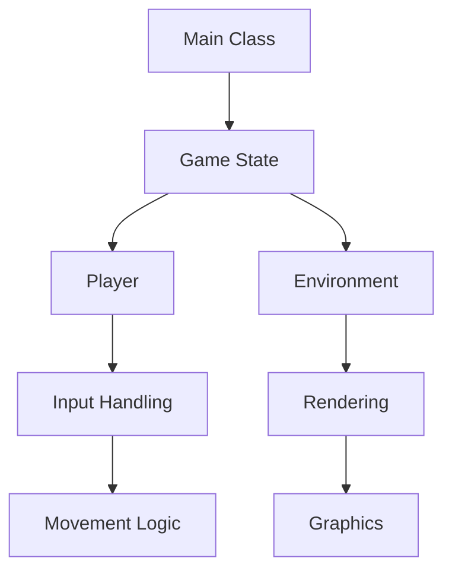

## 20.2 Building a Game with HaxeFlixel or Heaps

In this section, we will delve into the exciting world of game development using Haxe, focusing on two popular game engines: HaxeFlixel and Heaps. Whether you're aiming to create a 2D or 3D game, these engines provide robust frameworks to bring your vision to life. We'll cover key considerations such as asset management and performance optimization, and guide you through the process of deploying your game across multiple platforms.

### Introduction to HaxeFlixel and Heaps

HaxeFlixel and Heaps are two powerful game engines built on the Haxe programming language, each with its unique strengths and use cases.

- **HaxeFlixel** is a 2D game engine known for its simplicity and ease of use. It is ideal for creating platformers, shooters, and other 2D games. HaxeFlixel provides a rich set of features, including physics, tilemaps, and a flexible rendering system.

- **Heaps** is a versatile engine capable of handling both 2D and 3D games. It is particularly well-suited for projects that require complex graphics and high performance. Heaps offers advanced rendering capabilities, making it a great choice for developers looking to push the boundaries of visual fidelity.

### Getting Started with HaxeFlixel

#### Setting Up Your Development Environment

To begin developing with HaxeFlixel, follow these steps:

1. **Install Haxe and Haxelib**: Ensure you have Haxe installed on your system. Haxelib, the Haxe library manager, is included with the Haxe installation.

2. **Install HaxeFlixel**: Use Haxelib to install HaxeFlixel by running the following command in your terminal:

   ```bash
   haxelib install flixel
   ```

3. **Create a New Project**: Use the Flixel tools to create a new project template:

   ```bash
   flixel create MyGame
   ```

4. **Open Your Project**: Navigate to the newly created project directory and open it in your preferred code editor.

#### Building a Simple 2D Game

Let's create a simple 2D game using HaxeFlixel. We'll build a basic platformer where a character can move and jump.

**Main Class Setup**

Create a `Main.hx` file as the entry point for your game:

```haxe
package;

import flixel.FlxGame;

class Main extends FlxGame {
    public function new() {
        super(640, 480, PlayState);
    }
}
```

**Creating the PlayState**

The `PlayState` class will handle the game logic. Create a `PlayState.hx` file:

```haxe
package;

import flixel.FlxState;
import flixel.FlxSprite;
import flixel.FlxG;

class PlayState extends FlxState {
    private var player:FlxSprite;

    override public function create():Void {
        super.create();
        player = new FlxSprite(100, 100);
        player.makeGraphic(16, 16, FlxG.RED);
        add(player);
    }

    override public function update(elapsed:Float):Void {
        super.update(elapsed);
        if (FlxG.keys.pressed.LEFT) player.x -= 100 * elapsed;
        if (FlxG.keys.pressed.RIGHT) player.x += 100 * elapsed;
        if (FlxG.keys.pressed.UP) player.y -= 100 * elapsed;
        if (FlxG.keys.pressed.DOWN) player.y += 100 * elapsed;
    }
}
```

**Running Your Game**

Compile and run your game using the following command:

```bash
lime test neko
```

This command compiles your game to the Neko target, but you can also compile to other targets like HTML5 or Windows.

### Exploring Heaps for 3D Game Development

#### Setting Up Heaps

To start with Heaps, follow these steps:

1. **Install Heaps**: Use Haxelib to install Heaps:

   ```bash
   haxelib install heaps
   ```

2. **Create a New Project**: Set up a new Heaps project by creating a directory and initializing a basic project structure.

#### Building a Simple 3D Scene

Let's create a simple 3D scene using Heaps.

**Main Class Setup**

Create a `Main.hx` file:

```haxe
package;

import hxd.App;
import h3d.scene.Scene;
import h3d.scene.Camera;
import h3d.scene.Mesh;
import h3d.prim.Cube;

class Main extends App {
    var scene:Scene;
    var camera:Camera;

    override function init() {
        scene = new Scene();
        camera = new Camera();
        scene.addChild(camera);

        var cube = new Mesh(new Cube());
        scene.addChild(cube);
    }

    override function update(dt:Float) {
        scene.render(camera);
    }
}
```

**Running Your Scene**

Compile and run your Heaps project using:

```bash
haxe -main Main -lib heaps -js main.js
```

### Key Considerations in Game Development

#### Asset Management

Efficient asset management is crucial for game development. Here are some strategies:

- **Organize Assets**: Keep your assets organized in a structured directory. Use descriptive names and categorize them by type (e.g., sprites, sounds).

- **Optimize Asset Size**: Compress images and audio files to reduce loading times and memory usage.

- **Use Sprite Sheets**: Combine multiple images into a single sprite sheet to minimize draw calls and improve performance.

#### Performance Optimization

To ensure smooth gameplay, consider these optimization techniques:

- **Profile Your Game**: Use profiling tools to identify performance bottlenecks.

- **Optimize Rendering**: Reduce the number of draw calls and use efficient rendering techniques.

- **Manage Memory**: Monitor memory usage and implement garbage collection strategies to prevent leaks.

- **Leverage Haxe's Cross-Platform Capabilities**: Compile your game to different targets and test performance on each platform.

### Cross-Platform Deployment

One of Haxe's strengths is its ability to compile to multiple platforms. Here's how to deploy your game:

- **Desktop**: Use the `lime` tool to compile your game for Windows, macOS, or Linux.

- **Mobile**: Compile your game to Android or iOS using the appropriate toolchains.

- **Web**: Use the HTML5 target to deploy your game on the web. Ensure your game is optimized for different browsers.

### Community Engagement

Engaging with the Haxe gaming community can provide valuable support and exposure for your game:

- **Join Forums and Discord Channels**: Participate in discussions and seek advice from experienced developers.

- **Contribute to Open Source Projects**: Collaborate on HaxeFlixel or Heaps projects to gain experience and recognition.

- **Showcase Your Game**: Share your game on platforms like itch.io or Game Jolt to reach a wider audience.

### Try It Yourself

Experiment with the code examples provided in this guide. Try modifying the player controls, adding new game elements, or creating your own 3D scene. The best way to learn is by doing, so don't hesitate to explore and innovate.

### Visualizing Game Architecture

To better understand the architecture of a game built with HaxeFlixel or Heaps, let's visualize the components and their interactions.



**Diagram Description:** This diagram illustrates the flow of a typical game architecture. The `Main Class` initializes the `Game State`, which manages the `Player` and `Environment`. `Input Handling` affects the `Movement Logic`, while `Rendering` handles the `Graphics`.

### References and Links

- [HaxeFlixel Documentation](https://haxeflixel.com/documentation/)
- [Heaps Documentation](https://heaps.io/documentation/)
- [Haxe Manual](https://haxe.org/manual/)
- [OpenFL](https://www.openfl.org/)

### Knowledge Check

Before moving on, consider these questions to test your understanding:

- What are the key differences between HaxeFlixel and Heaps?
- How can you optimize asset management in your game?
- What strategies can you use to improve game performance?

### Embrace the Journey

Remember, game development is a journey filled with creativity and challenges. As you build your game, you'll learn new skills and techniques that will enhance your capabilities as a developer. Keep experimenting, stay curious, and enjoy the process!

## Quiz Time!



### What is the primary focus of HaxeFlixel?

- [x] 2D game development
- [ ] 3D game development
- [ ] Web applications
- [ ] Mobile applications

> **Explanation:** HaxeFlixel is primarily focused on 2D game development, providing tools and features specifically for creating 2D games.

### Which engine is suitable for both 2D and 3D game development?

- [ ] HaxeFlixel
- [x] Heaps
- [ ] OpenFL
- [ ] Lime

> **Explanation:** Heaps is a versatile engine capable of handling both 2D and 3D game development.

### What is a key benefit of using sprite sheets?

- [x] Reducing draw calls
- [ ] Increasing asset size
- [ ] Slowing down rendering
- [ ] Complicating asset management

> **Explanation:** Sprite sheets help reduce draw calls by combining multiple images into a single file, improving rendering performance.

### How can you deploy a Haxe game to the web?

- [ ] Compile to Neko
- [ ] Compile to C++
- [x] Compile to HTML5
- [ ] Compile to Java

> **Explanation:** Compiling to HTML5 allows you to deploy your Haxe game on the web, making it accessible in browsers.

### What is a recommended strategy for managing game assets?

- [x] Organizing assets in a structured directory
- [ ] Using random file names
- [ ] Storing all assets in a single folder
- [ ] Ignoring asset optimization

> **Explanation:** Organizing assets in a structured directory with descriptive names helps manage and locate resources efficiently.

### Which tool can you use to profile your game's performance?

- [ ] Haxelib
- [x] Profiling tools
- [ ] Sprite sheets
- [ ] Asset manager

> **Explanation:** Profiling tools help identify performance bottlenecks and optimize your game's performance.

### What is a benefit of engaging with the Haxe gaming community?

- [x] Gaining support and exposure
- [ ] Avoiding collaboration
- [ ] Keeping your game private
- [ ] Reducing game quality

> **Explanation:** Engaging with the community provides support, feedback, and exposure for your game, helping you improve and promote it.

### What is a key consideration when deploying a game on mobile platforms?

- [ ] Ignoring performance
- [x] Using appropriate toolchains
- [ ] Avoiding testing
- [ ] Compiling to Neko

> **Explanation:** Using appropriate toolchains ensures that your game is optimized and compatible with mobile platforms.

### What is the role of the `Main Class` in a game architecture?

- [x] Initializing the game state
- [ ] Handling player input
- [ ] Rendering graphics
- [ ] Managing assets

> **Explanation:** The `Main Class` initializes the game state, setting up the core components and logic for the game.

### True or False: Heaps is only suitable for 3D game development.

- [ ] True
- [x] False

> **Explanation:** False. Heaps is suitable for both 2D and 3D game development, offering flexibility for various types of projects.


