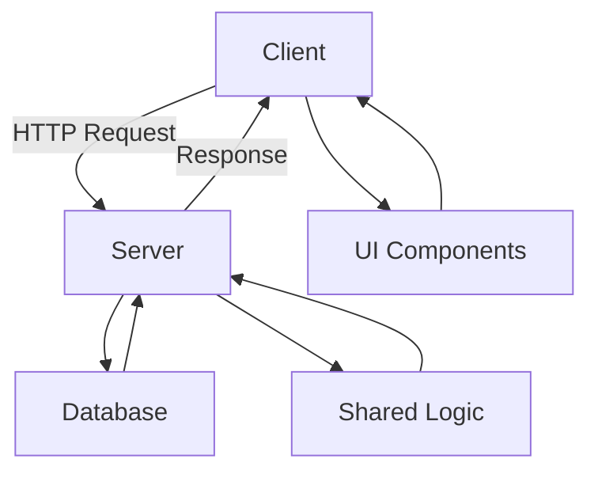

## 20.3 Creating a Complex Web Application with Haxe

Creating a complex web application with Haxe involves leveraging its cross-platform capabilities to build a feature-rich, efficient, and maintainable application. This section will guide you through the process of developing a web app using Haxe, integrating with popular frameworks, and ensuring SEO and accessibility. We'll explore key considerations such as framework integration, code reusability, and enhanced security.

### Introduction to Haxe for Web Development

Haxe is a versatile language that compiles to multiple targets, including JavaScript, making it an excellent choice for web development. Its strong typing system, powerful macro capabilities, and ability to share code between client and server make it ideal for building complex web applications.

#### Key Features of Haxe for Web Development

- **Cross-Platform Compilation:** Write code once and compile it to JavaScript for the web, or to other languages for different platforms.
- **Strong Typing:** Reduce runtime errors with Haxe's robust type system.
- **Macro System:** Automate code generation and manipulation at compile time.
- **Code Reusability:** Share code between client and server, enhancing maintainability and reducing duplication.

### Framework Integration

Integrating Haxe with popular web frameworks like React, Vue.js, or Node.js allows you to leverage existing ecosystems while benefiting from Haxe's unique features.

#### Using Haxe with React

React is a popular JavaScript library for building user interfaces. By using Haxe, you can write type-safe components and share logic between client and server.

```haxe
// Define a simple React component in Haxe
import react.ReactComponent;

class MyComponent extends ReactComponent {
  override function render() {
    return jsx('<div>Hello, {this.props.name}!</div>');
  }
}
```

#### Using Haxe with Vue.js

Vue.js is another popular framework that can be used with Haxe to create reactive web applications.

```haxe
// Define a Vue component in Haxe
import vue.VueComponent;

class MyVueComponent extends VueComponent {
  public var message:String = "Hello, Vue!";

  override function mounted() {
    trace("Component mounted!");
  }
}
```

#### Using Haxe with Node.js

Node.js allows you to run JavaScript on the server side. Haxe can compile to Node.js, enabling you to share code between client and server.

```haxe
// A simple Node.js server in Haxe
import js.node.Http;

class Server {
  static function main() {
    var server = Http.createServer((req, res) -> {
      res.writeHead(200, {'Content-Type': 'text/plain'});
      res.end('Hello, Haxe with Node.js!');
    });
    server.listen(8080);
    trace('Server running at http://localhost:8080/');
  }
}
```

### SEO and Accessibility

Ensuring your web application is SEO-friendly and accessible is crucial for reaching a wider audience and complying with web standards.

#### Implementing Server-Side Rendering

Server-side rendering (SSR) improves SEO by rendering pages on the server before sending them to the client. This ensures that search engines can index your content effectively.

```haxe
// Example of server-side rendering with Haxe and Node.js
import js.node.Http;
import js.node.fs.FileSystem;

class SSRServer {
  static function main() {
    var server = Http.createServer((req, res) -> {
      var html = FileSystem.readFileSync('index.html', 'utf8');
      res.writeHead(200, {'Content-Type': 'text/html'});
      res.end(html);
    });
    server.listen(8080);
    trace('SSR Server running at http://localhost:8080/');
  }
}
```

#### Enhancing Accessibility

Accessibility ensures that your application can be used by people with disabilities. Use semantic HTML, ARIA roles, and keyboard navigation to improve accessibility.

```html
<!-- Example of accessible HTML -->
<button aria-label="Close" onclick="closeDialog()">Close</button>
```

### Code Reusability

One of the significant advantages of using Haxe is the ability to share code between client and server. This reduces duplication and ensures consistency across your application.

#### Sharing Validation Logic

Validation logic is a common area where code can be shared between client and server. By writing validation functions in Haxe, you can ensure that both client-side and server-side validations are consistent.

```haxe
// Shared validation logic in Haxe
class Validator {
  public static function isValidEmail(email:String):Bool {
    return ~/^[a-zA-Z0-9._%+-]+@[a-zA-Z0-9.-]+\.[a-zA-Z]{2,}$/.match(email);
  }
}
```

#### Sharing Models

Define your data models in Haxe and use them on both client and server to ensure consistency.

```haxe
// Shared model definition in Haxe
class User {
  public var id:Int;
  public var name:String;
  public var email:String;

  public function new(id:Int, name:String, email:String) {
    this.id = id;
    this.name = name;
    this.email = email;
  }
}
```

### Enhanced Security

Haxe's type safety and compile-time checks help reduce vulnerabilities in your web application.

#### Utilizing Haxe's Type Safety

Haxe's strong typing system helps prevent common security issues such as SQL injection and cross-site scripting (XSS) by ensuring that data types are consistent and validated.

```haxe
// Example of type-safe SQL query in Haxe
import sys.db.Sql;

class Database {
  public static function getUserById(id:Int):User {
    var query = "SELECT * FROM users WHERE id = ?";
    var result = Sql.query(query, [id]);
    return new User(result.id, result.name, result.email);
  }
}
```

### Try It Yourself

Experiment with the code examples provided in this section. Try modifying the React and Vue components to add new features, or extend the Node.js server to handle different routes. Explore how you can share more code between client and server, and consider how Haxe's type safety can enhance the security of your application.

### Visualizing the Architecture

To better understand the architecture of a complex web application built with Haxe, let's visualize the flow of data and interactions between components.



**Diagram Description:** This diagram illustrates the interaction between the client, server, database, and shared logic in a Haxe web application. The client sends HTTP requests to the server, which processes them using shared logic and interacts with the database. The server then responds to the client, which updates the UI components.

### Knowledge Check

- **What are the benefits of using Haxe for web development?**
- **How can Haxe be integrated with popular frameworks like React and Vue.js?**
- **Why is server-side rendering important for SEO?**
- **How does Haxe's type safety enhance security?**

### Conclusion

Creating a complex web application with Haxe involves leveraging its cross-platform capabilities, strong typing, and macro system to build efficient and maintainable applications. By integrating with popular frameworks, ensuring SEO and accessibility, and sharing code between client and server, you can create a robust web application that meets modern standards.

Remember, this is just the beginning. As you progress, you'll build more complex and interactive web applications. Keep experimenting, stay curious, and enjoy the journey!

## Quiz Time!



### What is one of the key features of Haxe for web development?

- [x] Cross-Platform Compilation
- [ ] Dynamic Typing
- [ ] Manual Memory Management
- [ ] Lack of Framework Support

> **Explanation:** Haxe's cross-platform compilation allows developers to write code once and compile it to multiple targets, including JavaScript for web development.

### How can Haxe be integrated with React?

- [x] By writing type-safe components
- [ ] By using Haxe macros exclusively
- [ ] By avoiding JSX syntax
- [ ] By compiling to Python

> **Explanation:** Haxe can be used to write type-safe components in React, leveraging its strong typing system to ensure component integrity.

### What is the purpose of server-side rendering in web applications?

- [x] To improve SEO by rendering pages on the server
- [ ] To increase client-side processing
- [ ] To reduce server load
- [ ] To eliminate the need for JavaScript

> **Explanation:** Server-side rendering improves SEO by rendering pages on the server, making them more accessible to search engines.

### How does Haxe's type safety contribute to security?

- [x] By preventing common security issues like SQL injection
- [ ] By allowing dynamic typing
- [ ] By enabling manual memory management
- [ ] By supporting only client-side validation

> **Explanation:** Haxe's strong typing system helps prevent common security issues by ensuring data types are consistent and validated.

### What is a benefit of sharing code between client and server in Haxe?

- [x] Code Reusability
- [ ] Increased Code Duplication
- [ ] Reduced Maintainability
- [ ] Limited Platform Support

> **Explanation:** Sharing code between client and server enhances code reusability, reducing duplication and ensuring consistency.

### Which framework can Haxe be integrated with for building reactive web applications?

- [x] Vue.js
- [ ] Django
- [ ] Flask
- [ ] Laravel

> **Explanation:** Haxe can be integrated with Vue.js to create reactive web applications, leveraging its ecosystem and features.

### What is an example of enhancing accessibility in web applications?

- [x] Using semantic HTML and ARIA roles
- [ ] Disabling keyboard navigation
- [ ] Removing all images
- [ ] Using only CSS for layout

> **Explanation:** Enhancing accessibility involves using semantic HTML and ARIA roles to ensure applications are usable by people with disabilities.

### What is a common area where code can be shared between client and server?

- [x] Validation Logic
- [ ] UI Styling
- [ ] Database Configuration
- [ ] Network Protocols

> **Explanation:** Validation logic is a common area where code can be shared between client and server, ensuring consistency.

### What is a key consideration when integrating Haxe with Node.js?

- [x] Sharing code between client and server
- [ ] Avoiding JavaScript entirely
- [ ] Using only server-side rendering
- [ ] Compiling to Java

> **Explanation:** When integrating Haxe with Node.js, sharing code between client and server is a key consideration to enhance maintainability.

### True or False: Haxe's macro system is used for runtime code generation.

- [ ] True
- [x] False

> **Explanation:** Haxe's macro system is used for compile-time code generation, allowing developers to automate code manipulation before runtime.


