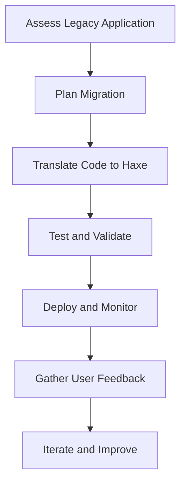

## 20.4 Migrating a Legacy Application to Haxe

Migrating a legacy application to Haxe can be a transformative process, offering the opportunity to modernize your codebase and expand your application's reach across multiple platforms. This guide will walk you through the key considerations, strategies, and steps involved in transitioning an existing application to Haxe, ensuring a smooth and successful migration.

### Understanding the Need for Migration

Before embarking on the migration journey, it's crucial to understand why you are considering this transition. Here are some common reasons:

- **Cross-Platform Capabilities:** Haxe allows you to compile your code to multiple targets, including JavaScript, C++, C#, Java, and Python, among others. This can significantly expand your application's reach.
- **Modernization:** Legacy applications often suffer from outdated codebases that are difficult to maintain and extend. Migrating to Haxe can breathe new life into your application.
- **Performance Optimization:** Haxe's static typing and powerful macro system can help optimize performance, making your application more efficient.

### Key Considerations for Migration

#### Code Translation

One of the first steps in migrating a legacy application is translating the existing code to Haxe. This involves mapping constructs from the legacy language to Haxe, ensuring that the functionality remains consistent.

- **Identify Language Constructs:** Start by identifying the constructs in the legacy language that need to be translated. This includes data types, control structures, and libraries.
- **Use Haxe's Features:** Leverage Haxe's features such as static typing, generics, and macros to improve code quality and performance.
- **Maintain Functionality:** Ensure that the translated code maintains the same functionality as the original. This may require writing tests to verify the behavior.

#### Incremental Migration

Migrating an entire application at once can be risky and overwhelming. Instead, consider an incremental approach:

- **Component-Based Migration:** Break down the application into smaller components and migrate them one at a time. This allows for easier testing and reduces the risk of introducing errors.
- **Parallel Development:** Maintain the legacy application while developing the Haxe version in parallel. This ensures that you can continue to support the existing application while working on the migration.
- **Testing and Validation:** After migrating each component, thoroughly test it to ensure it functions correctly within the new Haxe environment.

### Step-by-Step Migration Process

#### Step 1: Assess the Legacy Application

Begin by assessing the current state of the legacy application. Identify the following:

- **Core Functionality:** Determine the essential features and functionalities that must be preserved during migration.
- **Dependencies:** List all external libraries and dependencies used by the application. Check if Haxe has equivalent libraries or if you need to write custom solutions.
- **Code Quality:** Evaluate the quality of the existing codebase. Identify areas that require refactoring or improvement.

#### Step 2: Plan the Migration

Create a detailed migration plan that outlines the steps, timeline, and resources required for the migration. Consider the following:

- **Prioritize Components:** Decide which components to migrate first based on their importance and complexity.
- **Set Milestones:** Establish clear milestones to track progress and ensure the project stays on schedule.
- **Allocate Resources:** Assign team members to specific tasks and ensure they have the necessary skills and tools for the migration.

#### Step 3: Translate Code to Haxe

Begin translating the code from the legacy language to Haxe. Focus on one component at a time and follow these guidelines:

- **Use Haxe's Type System:** Take advantage of Haxe's static typing to catch errors early and improve code reliability.
- **Leverage Haxe Macros:** Use macros to automate repetitive tasks and optimize code generation.
- **Refactor and Improve:** As you translate the code, look for opportunities to refactor and improve the design using Haxe's features.

#### Step 4: Test and Validate

Testing is a critical part of the migration process. Ensure that each migrated component is thoroughly tested:

- **Unit Testing:** Write unit tests for individual functions and classes to verify their behavior.
- **Integration Testing:** Test the interaction between components to ensure they work together as expected.
- **Performance Testing:** Measure the performance of the migrated application and optimize as needed.

#### Step 5: Deploy and Monitor

Once the migration is complete, deploy the Haxe application and monitor its performance:

- **Deployment Strategy:** Choose a deployment strategy that minimizes downtime and ensures a smooth transition for users.
- **Monitoring Tools:** Use monitoring tools to track the application's performance and identify any issues that arise.
- **User Feedback:** Gather feedback from users to identify areas for improvement and ensure the application meets their needs.

### Outcomes of Migration

Migrating a legacy application to Haxe can yield several positive outcomes:

- **Extended Application Lifespan:** By modernizing the codebase, you can extend the application's lifespan and make it easier to maintain and enhance in the future.
- **Platform Expansion:** Haxe's cross-platform capabilities allow you to reach new audiences by targeting additional platforms, increasing the application's potential user base.
- **Improved Performance:** Haxe's features can help optimize performance, resulting in a faster and more efficient application.

### Visualizing the Migration Process

Below is a flowchart that illustrates the migration process from a legacy application to Haxe:

**Figure 1:** Visualizing the Migration Process from Legacy Application to Haxe

### Try It Yourself

To get hands-on experience with migrating a legacy application to Haxe, try the following exercise:

1. **Select a Small Project:** Choose a small legacy project or a component of a larger application to migrate to Haxe.
2. **Translate the Code:** Follow the steps outlined in this guide to translate the code to Haxe.
3. **Test the Migration:** Write tests to verify that the migrated code functions correctly.
4. **Experiment with Haxe Features:** Explore Haxe's features, such as macros and static typing, to improve the code.

### Knowledge Check

To reinforce your understanding of the migration process, consider the following questions:

- What are the key benefits of migrating a legacy application to Haxe?
- How can you ensure that the translated code maintains the same functionality as the original?
- Why is an incremental migration approach recommended?
- What are some common challenges you might encounter during the migration process?

### Conclusion

Migrating a legacy application to Haxe is a strategic decision that can unlock numerous benefits, from cross-platform capabilities to improved performance and maintainability. By following a structured migration process and leveraging Haxe's powerful features, you can successfully transition your application and position it for future growth and success.

Remember, this is just the beginning. As you progress, you'll gain more experience and confidence in working with Haxe, enabling you to tackle more complex projects and challenges. Keep experimenting, stay curious, and enjoy the journey!

## Quiz Time!



### What is one of the primary reasons for migrating a legacy application to Haxe?

- [x] Cross-platform capabilities
- [ ] Reducing code size
- [ ] Increasing code complexity
- [ ] Limiting platform reach

> **Explanation:** Haxe allows you to compile your code to multiple targets, significantly expanding your application's reach.

### What is the recommended approach for migrating a legacy application to Haxe?

- [x] Incremental migration
- [ ] Complete overhaul
- [ ] Code freeze
- [ ] Immediate deployment

> **Explanation:** Incremental migration involves gradually replacing components to mitigate risks and ensure a smooth transition.

### Which Haxe feature can help optimize performance during migration?

- [x] Static typing
- [ ] Dynamic typing
- [ ] Manual memory management
- [ ] Code obfuscation

> **Explanation:** Haxe's static typing helps catch errors early and improve code reliability, contributing to performance optimization.

### What is a critical step after translating code to Haxe?

- [x] Testing and validation
- [ ] Immediate deployment
- [ ] Code obfuscation
- [ ] Ignoring user feedback

> **Explanation:** Testing and validation ensure that the migrated code functions correctly and meets the desired requirements.

### What should be done after deploying the migrated Haxe application?

- [x] Monitor performance and gather user feedback
- [ ] Ignore user feedback
- [ ] Freeze development
- [ ] Remove all tests

> **Explanation:** Monitoring performance and gathering user feedback help identify areas for improvement and ensure the application meets user needs.

### What is a potential outcome of migrating a legacy application to Haxe?

- [x] Extended application lifespan
- [ ] Reduced application lifespan
- [ ] Increased code complexity
- [ ] Limited platform reach

> **Explanation:** By modernizing the codebase, you can extend the application's lifespan and make it easier to maintain and enhance.

### What is a key consideration when translating code from a legacy language to Haxe?

- [x] Maintaining functionality
- [ ] Increasing code complexity
- [ ] Ignoring existing tests
- [ ] Removing all comments

> **Explanation:** Ensuring that the translated code maintains the same functionality as the original is crucial for a successful migration.

### Why is it important to assess the legacy application before migration?

- [x] To identify core functionality and dependencies
- [ ] To immediately start coding
- [ ] To ignore existing issues
- [ ] To remove all documentation

> **Explanation:** Assessing the legacy application helps identify essential features, dependencies, and areas for improvement.

### What is the role of Haxe macros in the migration process?

- [x] Automating repetitive tasks and optimizing code generation
- [ ] Obfuscating code
- [ ] Increasing code complexity
- [ ] Removing all comments

> **Explanation:** Haxe macros can automate repetitive tasks and optimize code generation, improving the migration process.

### True or False: Migrating a legacy application to Haxe can help reach new audiences by targeting additional platforms.

- [x] True
- [ ] False

> **Explanation:** Haxe's cross-platform capabilities allow you to reach new audiences by targeting additional platforms.


