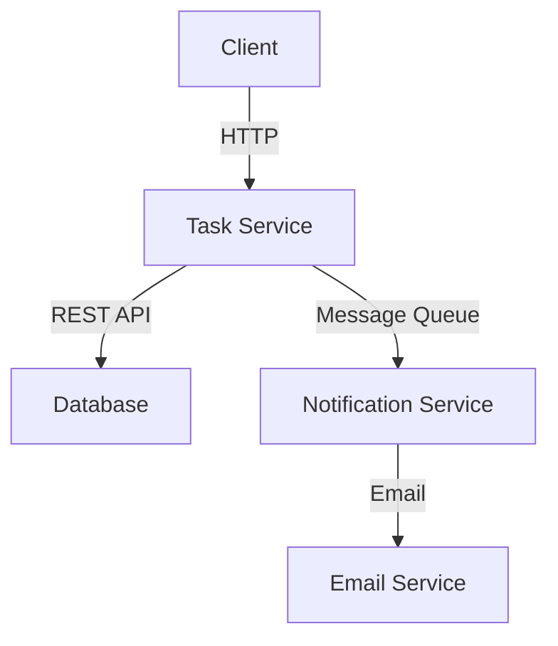

## 20.5 Implementing Microservices Architecture with Haxe

Microservices architecture is a design approach where a single application is composed of many loosely coupled and independently deployable smaller services. This architecture style has gained popularity due to its ability to improve scalability, resilience, and flexibility in software systems. In this section, we will explore how to implement a microservices architecture using Haxe, a versatile language known for its cross-platform capabilities.

### Introduction to Microservices Architecture

Microservices architecture is characterized by the following key principles:

- **Decentralization:** Each service is developed, deployed, and scaled independently.
- **Service Communication:** Services communicate with each other using lightweight protocols such as HTTP/REST, gRPC, or message brokers.
- **Autonomy:** Each service is responsible for its own data and business logic.
- **Resilience:** The failure of one service does not affect the entire system.
- **Scalability:** Services can be scaled independently based on demand.

### Why Use Haxe for Microservices?

Haxe is a powerful language that offers several features making it suitable for microservices architecture:

- **Cross-Platform Compilation:** Haxe can compile to multiple targets, including JavaScript, C++, C#, Java, and Python, allowing you to choose the best platform for each service.
- **Static Typing:** Haxe's strong typing system helps catch errors at compile time, improving code reliability.
- **Macro System:** Haxe's macro system allows for compile-time code generation and manipulation, which can be useful for creating boilerplate code or optimizing performance.
- **Multi-Paradigm Support:** Haxe supports object-oriented, functional, and imperative programming styles, providing flexibility in designing services.

### Key Considerations for Implementing Microservices with Haxe

#### Service Communication

Effective communication between services is crucial in a microservices architecture. Here are some strategies to consider:

- **RESTful APIs:** Use RESTful APIs for synchronous communication between services. Haxe's ability to compile to JavaScript makes it easy to build RESTful services using Node.js or other frameworks.
- **Message Brokers:** For asynchronous communication, consider using message brokers like RabbitMQ or Kafka. Haxe can interact with these systems through its various target languages.
- **gRPC:** For high-performance communication, gRPC can be used. Haxe can compile to languages that support gRPC, such as C++ or Java.

#### Deployment Strategies

Deploying microservices efficiently is essential for maintaining scalability and resilience:

- **Containerization:** Use Docker to containerize your services. This ensures consistency across development, testing, and production environments.
- **Orchestration:** Use Kubernetes or Docker Swarm to manage and orchestrate your containers, providing features like load balancing, scaling, and self-healing.
- **Continuous Integration/Continuous Deployment (CI/CD):** Implement CI/CD pipelines to automate the building, testing, and deployment of your services.

### Building a Microservice with Haxe

Let's walk through building a simple microservice using Haxe. We'll create a RESTful service that manages a list of tasks.

#### Step 1: Define the Service Interface

First, define the API for your service. We'll use a simple JSON-based REST API with the following endpoints:

- `GET /tasks`: Retrieve all tasks.
- `POST /tasks`: Create a new task.
- `PUT /tasks/{id}`: Update an existing task.
- `DELETE /tasks/{id}`: Delete a task.

#### Step 2: Implement the Service Logic

Create a Haxe class to handle the business logic for managing tasks. Here's a basic implementation:

```haxe
class TaskService {
    private var tasks:Map<Int, String> = new Map();

    public function new() {}

    public function getTasks():Array<String> {
        return tasks.iterator().toArray();
    }

    public function createTask(task:String):Int {
        var id = tasks.length + 1;
        tasks.set(id, task);
        return id;
    }

    public function updateTask(id:Int, task:String):Bool {
        if (tasks.exists(id)) {
            tasks.set(id, task);
            return true;
        }
        return false;
    }

    public function deleteTask(id:Int):Bool {
        return tasks.remove(id);
    }
}
```

#### Step 3: Set Up the Web Server

Use a Haxe-compatible web server framework to expose the service. For example, you can use Node.js as a target and a framework like Express.js:

```haxe
import js.node.Express;
import js.node.ExpressApp;
import js.node.ExpressRequest;
import js.node.ExpressResponse;

class TaskServer {
    static function main() {
        var app = new Express();
        var taskService = new TaskService();

        app.get("/tasks", function(req:ExpressRequest, res:ExpressResponse) {
            res.json(taskService.getTasks());
        });

        app.post("/tasks", function(req:ExpressRequest, res:ExpressResponse) {
            var task = req.body.task;
            var id = taskService.createTask(task);
            res.json({ id: id });
        });

        app.put("/tasks/:id", function(req:ExpressRequest, res:ExpressResponse) {
            var id = Std.parseInt(req.params.id);
            var task = req.body.task;
            var success = taskService.updateTask(id, task);
            res.json({ success: success });
        });

        app.delete("/tasks/:id", function(req:ExpressRequest, res:ExpressResponse) {
            var id = Std.parseInt(req.params.id);
            var success = taskService.deleteTask(id);
            res.json({ success: success });
        });

        app.listen(3000, function() {
            trace("Task server running on port 3000");
        });
    }
}
```

#### Step 4: Containerize the Service

Create a Dockerfile to containerize your service:

```dockerfile
FROM node:14

WORKDIR /usr/src/app

COPY package*.json ./
RUN npm install

COPY . .

RUN haxe build.hxml

CMD [ "node", "TaskServer.js" ]
```

#### Step 5: Deploy and Orchestrate

Deploy your containerized service using Docker Compose or Kubernetes. Here's a simple Docker Compose file:

```yaml
version: '3'
services:
  task-service:
    build: .
    ports:
      - "3000:3000"
```

### Visualizing Microservices Architecture

To better understand the architecture, let's visualize a simple microservices setup using Mermaid.js:



**Diagram Description:** This diagram illustrates a basic microservices architecture where a client interacts with a Task Service via HTTP. The Task Service communicates with a database to store tasks and sends messages to a Notification Service via a message queue. The Notification Service then interacts with an Email Service to send notifications.

### Try It Yourself

Experiment with the code examples by:

- Adding authentication to the service using JWT tokens.
- Implementing a new service for user management.
- Integrating a message broker for asynchronous communication.

### Key Takeaways

- **Service Communication:** Choose the appropriate communication protocol based on your needs (e.g., REST, gRPC, message brokers).
- **Deployment Strategies:** Use containerization and orchestration tools to manage your services efficiently.
- **Scalability and Resilience:** Design your services to be independently deployable and scalable to handle varying loads.

### Further Reading

- [Microservices Architecture on AWS](https://aws.amazon.com/microservices/)
- [Docker Documentation](https://docs.docker.com/)
- [Kubernetes Documentation](https://kubernetes.io/docs/home/)

## Quiz Time!



### What is a key characteristic of microservices architecture?

- [x] Decentralization
- [ ] Monolithic design
- [ ] Single point of failure
- [ ] Tight coupling

> **Explanation:** Microservices architecture is decentralized, allowing each service to be developed and deployed independently.

### Which communication protocol is commonly used for synchronous communication in microservices?

- [x] RESTful APIs
- [ ] Message brokers
- [ ] SMTP
- [ ] FTP

> **Explanation:** RESTful APIs are commonly used for synchronous communication between microservices.

### What is the benefit of using Docker for microservices?

- [x] Consistent deployment across environments
- [ ] Increased memory usage
- [ ] Slower deployment times
- [ ] Dependency on a single language

> **Explanation:** Docker ensures consistent deployment across different environments, making it ideal for microservices.

### Which tool is used for container orchestration?

- [x] Kubernetes
- [ ] Git
- [ ] Jenkins
- [ ] Nginx

> **Explanation:** Kubernetes is a popular tool for orchestrating containers in a microservices architecture.

### What is the role of a message broker in microservices?

- [x] Facilitating asynchronous communication
- [ ] Storing data persistently
- [ ] Compiling code
- [ ] Serving static files

> **Explanation:** Message brokers facilitate asynchronous communication between microservices.

### What is a key advantage of microservices architecture?

- [x] Independent scalability
- [ ] Single deployment unit
- [ ] Centralized data management
- [ ] Uniform technology stack

> **Explanation:** Microservices architecture allows each service to be scaled independently based on demand.

### Which Haxe feature is beneficial for microservices?

- [x] Cross-platform compilation
- [ ] Lack of static typing
- [ ] Single-paradigm support
- [ ] Limited target languages

> **Explanation:** Haxe's cross-platform compilation allows developers to choose the best platform for each service.

### What is the purpose of a Dockerfile?

- [x] Define how to build a Docker image
- [ ] Store application logs
- [ ] Manage network configurations
- [ ] Compile Haxe code

> **Explanation:** A Dockerfile defines the steps to build a Docker image for a service.

### Which of the following is a deployment strategy for microservices?

- [x] Continuous Integration/Continuous Deployment (CI/CD)
- [ ] Manual deployment
- [ ] Single server deployment
- [ ] Static hosting

> **Explanation:** CI/CD pipelines automate the building, testing, and deployment of microservices.

### True or False: In microservices architecture, the failure of one service affects the entire system.

- [ ] True
- [x] False

> **Explanation:** In microservices architecture, the failure of one service does not affect the entire system, enhancing resilience.



Remember, this is just the beginning. As you progress, you'll build more complex and interactive systems. Keep experimenting, stay curious, and enjoy the journey!
