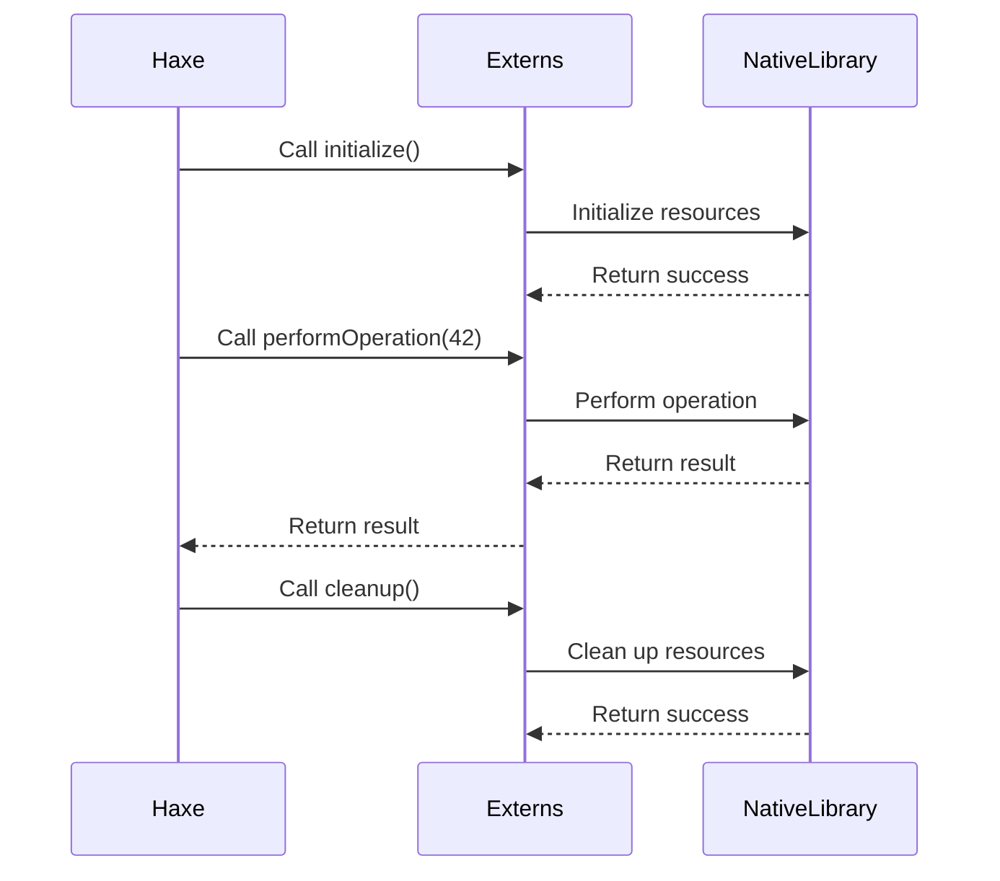

## 20.6 Integrating Haxe with Native Libraries

Integrating Haxe with native libraries is a powerful technique that allows developers to leverage existing, optimized code written in languages like C++ and Java. This integration can significantly enhance the functionality and performance of Haxe applications, enabling developers to utilize mature libraries without reinventing the wheel. In this section, we will explore the key considerations, techniques, and best practices for integrating Haxe with native libraries.

### Key Considerations

#### Externs and Bindings

To integrate native libraries with Haxe, you need to define externs and bindings accurately. Externs in Haxe are used to declare external interfaces, allowing Haxe code to interact with native code. This involves specifying the functions, classes, and data structures that will be accessed from the native library.

#### Memory Management

When working with native libraries, proper memory management is crucial. This includes handling resource allocation and deallocation to prevent memory leaks and ensure efficient use of system resources. Understanding the memory management model of the native language is essential for successful integration.

### Outcomes

#### Enhanced Functionality

By integrating native libraries, you can leverage existing, well-tested code to add advanced features and capabilities to your Haxe applications. This can save development time and effort, allowing you to focus on building unique aspects of your application.

#### Performance Gains

Native libraries are often optimized for performance, providing significant speed improvements over equivalent code written in higher-level languages. By utilizing these libraries, you can achieve performance gains in critical areas of your application.

### Integrating Haxe with C++ Libraries

Let's start by exploring how to integrate Haxe with C++ libraries. C++ is a popular choice for performance-critical applications, and many libraries are available for various domains, such as graphics, networking, and data processing.

#### Step 1: Define Externs

To use a C++ library in Haxe, you need to define externs that describe the C++ classes and functions you want to access. Here's an example of defining externs for a simple C++ library:

```haxe
// Define externs for a C++ library
@:native("MyCppLibrary")
extern class MyCppLibrary {
    public static function initialize():Void;
    public static function performOperation(value:Int):Int;
    public static function cleanup():Void;
}
```

In this example, we define a Haxe extern class `MyCppLibrary` with static functions that correspond to the C++ library's functions. The `@:native` metadata specifies the name of the C++ library.

#### Step 2: Create Bindings

Next, create bindings to link the Haxe externs with the C++ library. This involves compiling the C++ code into a shared library and ensuring that the Haxe application can access it. The process may vary depending on the target platform.

For example, on a Linux system, you can compile the C++ code into a shared library using the following command:

```bash
g++ -shared -o libmycpplibrary.so mycpplibrary.cpp
```

Then, ensure that the shared library is accessible to the Haxe application, either by placing it in a directory included in the system's library path or by specifying the library path explicitly.

#### Step 3: Use the Library in Haxe

Once the externs and bindings are set up, you can use the C++ library in your Haxe code. Here's an example of how to use the library:

```haxe
class Main {
    static function main() {
        // Initialize the C++ library
        MyCppLibrary.initialize();
        
        // Perform an operation using the C++ library
        var result = MyCppLibrary.performOperation(42);
        trace("Result from C++ library: " + result);
        
        // Clean up resources
        MyCppLibrary.cleanup();
    }
}
```

In this example, we initialize the C++ library, perform an operation, and then clean up resources. The `trace` function is used to output the result to the console.

### Integrating Haxe with Java Libraries

Java is another popular language with a rich ecosystem of libraries. Integrating Haxe with Java libraries can be particularly useful for Android development or when working with Java-based server environments.

#### Step 1: Define Externs

Similar to C++, you need to define externs for the Java classes and methods you want to access. Here's an example of defining externs for a Java library:

```haxe
// Define externs for a Java library
@:native("com.example.MyJavaLibrary")
extern class MyJavaLibrary {
    public static function initialize():Void;
    public static function performOperation(value:Int):Int;
    public static function cleanup():Void;
}
```

In this example, we define a Haxe extern class `MyJavaLibrary` with static functions that correspond to the Java library's methods. The `@:native` metadata specifies the fully qualified name of the Java class.

#### Step 2: Create Bindings

To create bindings for a Java library, you can use the Java Native Interface (JNI) or other interop mechanisms provided by the Haxe Java target. This involves compiling the Java code into a JAR file and ensuring that the Haxe application can access it.

For example, you can compile the Java code into a JAR file using the following command:

```bash
javac -d . MyJavaLibrary.java
jar cf myjavalibrary.jar com/example/MyJavaLibrary.class
```

Then, ensure that the JAR file is included in the classpath of the Haxe application.

#### Step 3: Use the Library in Haxe

Once the externs and bindings are set up, you can use the Java library in your Haxe code. Here's an example of how to use the library:

```haxe
class Main {
    static function main() {
        // Initialize the Java library
        MyJavaLibrary.initialize();
        
        // Perform an operation using the Java library
        var result = MyJavaLibrary.performOperation(42);
        trace("Result from Java library: " + result);
        
        // Clean up resources
        MyJavaLibrary.cleanup();
    }
}
```

In this example, we initialize the Java library, perform an operation, and then clean up resources. The `trace` function is used to output the result to the console.

### Visualizing the Integration Process

To better understand the integration process, let's visualize the interaction between Haxe and native libraries using a sequence diagram.



**Figure 1:** Interaction between Haxe and Native Libraries

This diagram illustrates the sequence of calls between the Haxe application, the externs, and the native library. It shows how the Haxe application interacts with the externs, which in turn call the native library functions.

### Best Practices for Integrating Haxe with Native Libraries

1. **Accurate Extern Definitions:** Ensure that externs accurately reflect the native library's interface, including function signatures and data types.

2. **Handle Exceptions:** Implement error handling to manage exceptions that may occur during interactions with the native library.

3. **Optimize Performance:** Profile the integrated application to identify performance bottlenecks and optimize the use of native libraries.

4. **Test Thoroughly:** Conduct comprehensive testing to ensure that the integration works correctly across all target platforms.

5. **Document Integration:** Provide clear documentation for the integration process, including setup instructions and usage examples.

### Try It Yourself

To deepen your understanding of integrating Haxe with native libraries, try modifying the code examples provided in this section. Experiment with different native libraries and explore how they can enhance your Haxe applications.

### Knowledge Check

- What are externs in Haxe, and why are they important for integrating native libraries?
- How can you manage memory effectively when working with native libraries in Haxe?
- What are some common challenges you might encounter when integrating Haxe with native libraries?

### Embrace the Journey

Remember, integrating Haxe with native libraries is a powerful technique that can unlock new possibilities for your applications. As you gain experience, you'll become more adept at leveraging native libraries to enhance functionality and performance. Keep experimenting, stay curious, and enjoy the journey!

## Quiz Time!



### What is the primary purpose of defining externs in Haxe?

- [x] To declare external interfaces for native libraries
- [ ] To manage memory allocation in Haxe
- [ ] To compile Haxe code into native binaries
- [ ] To optimize Haxe code for performance

> **Explanation:** Externs in Haxe are used to declare external interfaces, allowing Haxe code to interact with native libraries.

### Which of the following is a key consideration when integrating Haxe with native libraries?

- [x] Memory management
- [ ] Code obfuscation
- [ ] User interface design
- [ ] Network security

> **Explanation:** Proper memory management is crucial when working with native libraries to prevent memory leaks and ensure efficient resource use.

### How can you compile a C++ library into a shared library on a Linux system?

- [x] Use the command `g++ -shared -o libmycpplibrary.so mycpplibrary.cpp`
- [ ] Use the command `javac -d . MyJavaLibrary.java`
- [ ] Use the command `haxe -cpp mycpplibrary.cpp`
- [ ] Use the command `gcc -o mycpplibrary mycpplibrary.cpp`

> **Explanation:** The `g++ -shared` command is used to compile C++ code into a shared library on Linux.

### What is the role of the `@:native` metadata in Haxe externs?

- [x] It specifies the name of the native library or class
- [ ] It enables memory management features
- [ ] It compiles Haxe code into native binaries
- [ ] It optimizes Haxe code for performance

> **Explanation:** The `@:native` metadata specifies the name of the native library or class that the Haxe extern corresponds to.

### Which language is commonly used for Android development and can be integrated with Haxe?

- [x] Java
- [ ] Python
- [ ] Ruby
- [ ] JavaScript

> **Explanation:** Java is commonly used for Android development and can be integrated with Haxe for accessing Java libraries.

### What is a benefit of using native libraries in Haxe applications?

- [x] Enhanced functionality and performance
- [ ] Simplified user interface design
- [ ] Improved network security
- [ ] Easier code obfuscation

> **Explanation:** Native libraries can provide enhanced functionality and performance due to their optimized code.

### Which of the following is a best practice for integrating Haxe with native libraries?

- [x] Conduct comprehensive testing across all target platforms
- [ ] Use code obfuscation techniques
- [ ] Focus solely on user interface design
- [ ] Ignore memory management concerns

> **Explanation:** Comprehensive testing ensures that the integration works correctly across all target platforms.

### What is the Java Native Interface (JNI) used for?

- [x] Creating bindings for Java libraries
- [ ] Compiling Java code into native binaries
- [ ] Optimizing Java code for performance
- [ ] Managing memory allocation in Java

> **Explanation:** The Java Native Interface (JNI) is used for creating bindings to allow Java code to interact with native libraries.

### What is the purpose of the `trace` function in Haxe?

- [x] To output information to the console
- [ ] To manage memory allocation
- [ ] To compile Haxe code into native binaries
- [ ] To optimize Haxe code for performance

> **Explanation:** The `trace` function is used to output information, such as debugging messages, to the console.

### True or False: Integrating Haxe with native libraries can lead to performance gains.

- [x] True
- [ ] False

> **Explanation:** Integrating Haxe with native libraries can lead to performance gains due to the optimized nature of native code.


