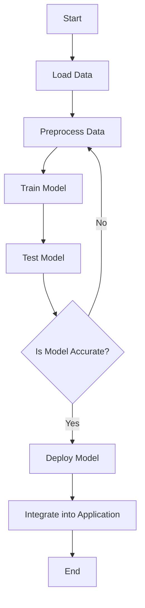

## 20.7 Machine Learning and Data Processing in Haxe

In the ever-evolving landscape of software development, machine learning (ML) and data processing have emerged as pivotal components for building intelligent, data-driven applications. Haxe, with its cross-platform capabilities, offers a unique opportunity to harness these technologies across multiple environments. In this section, we will explore how to apply Haxe to machine learning tasks and large-scale data processing, focusing on key considerations such as library support and efficient data handling. We will also discuss the outcomes of cross-platform processing and integration of results into applications.

### Introduction to Machine Learning and Data Processing in Haxe

Machine learning involves the use of algorithms and statistical models to enable computers to perform tasks without explicit instructions, relying instead on patterns and inference. Data processing, on the other hand, involves collecting, transforming, and analyzing data to extract useful information. Haxe, known for its ability to compile to multiple target languages, provides a versatile platform for implementing these tasks.

#### Why Use Haxe for Machine Learning and Data Processing?

- **Cross-Platform Compatibility:** Haxe's ability to compile to various languages such as JavaScript, C++, C#, Java, and Python makes it ideal for developing applications that require machine learning and data processing across different platforms.
- **Static Typing and Type Inference:** These features help in catching errors early in the development process, ensuring robust and reliable code.
- **Macro System:** Haxe's powerful macro system allows for compile-time code generation, which can be leveraged to optimize machine learning algorithms and data processing tasks.

### Key Considerations

#### Library Support

One of the primary considerations when implementing machine learning and data processing in Haxe is the availability of libraries. While Haxe does not have as extensive a library ecosystem as languages like Python, it is possible to either identify existing libraries or develop custom ones for specific ML algorithms.

- **Existing Libraries:** Explore libraries such as [HaxeML](https://github.com/HaxeML/HaxeML) for machine learning tasks. Although not as comprehensive as Python's scikit-learn or TensorFlow, these libraries provide a starting point for implementing basic ML algorithms in Haxe.
- **Interfacing with Other Languages:** Utilize Haxe's ability to interface with native libraries to leverage existing ML libraries in other languages. For example, you can call Python's ML libraries from Haxe using externs.

#### Data Handling

Efficient data handling is crucial for processing and analyzing large datasets. Haxe provides several features that can be utilized for efficient data processing:

- **Enums and Algebraic Data Types:** Use these to represent complex data structures in a type-safe manner.
- **Generics and Type Parameters:** These allow for the creation of reusable and flexible data processing functions.
- **Null Safety and Option Types:** These features help in avoiding null reference errors, which are common in data processing tasks.

### Implementing Machine Learning in Haxe

To illustrate how machine learning can be implemented in Haxe, let's consider a simple example of a linear regression algorithm. Linear regression is a basic ML algorithm used to model the relationship between a dependent variable and one or more independent variables.

#### Linear Regression Example

```haxe
class LinearRegression {
    private var weights:Array<Float>;
    private var learningRate:Float;
    private var iterations:Int;

    public function new(learningRate:Float, iterations:Int) {
        this.learningRate = learningRate;
        this.iterations = iterations;
    }

    public function train(features:Array<Array<Float>>, labels:Array<Float>):Void {
        var numFeatures = features[0].length;
        weights = new Array<Float>(numFeatures);
        for (i in 0...iterations) {
            var predictions = predict(features);
            var errors = labels.map((label, index) -> label - predictions[index]);
            for (j in 0...numFeatures) {
                var gradient = 0.0;
                for (k in 0...features.length) {
                    gradient += features[k][j] * errors[k];
                }
                weights[j] += learningRate * gradient / features.length;
            }
        }
    }

    public function predict(features:Array<Array<Float>>):Array<Float> {
        return features.map((feature) -> {
            var prediction = 0.0;
            for (i in 0...feature.length) {
                prediction += feature[i] * weights[i];
            }
            return prediction;
        });
    }
}
```

In this example, we define a `LinearRegression` class with methods to train the model and make predictions. The `train` method adjusts the weights of the model using gradient descent, while the `predict` method computes predictions based on the current weights.

### Data Processing in Haxe

Data processing involves transforming raw data into a format suitable for analysis. Haxe's features can be leveraged to efficiently process large datasets.

#### Data Transformation Example

Let's consider an example where we need to normalize a dataset. Normalization is a common preprocessing step in data processing that scales the data to a specific range, typically [0, 1].

```haxe
class DataProcessor {
    public static function normalize(data:Array<Array<Float>>):Array<Array<Float>> {
        var numFeatures = data[0].length;
        var minValues = new Array<Float>(numFeatures);
        var maxValues = new Array<Float>(numFeatures);

        for (i in 0...numFeatures) {
            minValues[i] = Math.POSITIVE_INFINITY;
            maxValues[i] = Math.NEGATIVE_INFINITY;
            for (j in 0...data.length) {
                if (data[j][i] < minValues[i]) minValues[i] = data[j][i];
                if (data[j][i] > maxValues[i]) maxValues[i] = data[j][i];
            }
        }

        return data.map((row) -> {
            return row.map((value, index) -> {
                (value - minValues[index]) / (maxValues[index] - minValues[index]);
            });
        });
    }
}
```

In this example, the `normalize` method computes the minimum and maximum values for each feature and scales the data accordingly.

### Cross-Platform Processing and Integration

One of the significant advantages of using Haxe for machine learning and data processing is the ability to run the same code across different platforms. This cross-platform capability allows for seamless integration of ML models and data processing results into applications targeting various environments.

#### Integrating ML Models into Applications

Once an ML model is trained and tested, it can be integrated into applications to provide intelligent features. For example, a trained linear regression model can be used in a web application to predict user behavior or in a mobile app to provide personalized recommendations.

- **Web Applications:** Compile Haxe code to JavaScript and integrate it into web applications to provide real-time predictions.
- **Mobile Applications:** Use Haxe to compile code to C# or Java and integrate ML models into mobile apps for on-device predictions.

### Visualizing Data Processing and Machine Learning Workflows

To better understand the workflow of data processing and machine learning in Haxe, let's visualize the process using a flowchart.



**Figure 1:** This flowchart illustrates the typical workflow of a machine learning project in Haxe, from loading and preprocessing data to training, testing, and deploying the model.

### Try It Yourself

To deepen your understanding, try modifying the code examples provided. For instance, experiment with different learning rates and iterations in the linear regression example to see how they affect the model's performance. You can also extend the `DataProcessor` class to include other preprocessing techniques such as standardization or one-hot encoding.

### References and Further Reading

- [HaxeML GitHub Repository](https://github.com/HaxeML/HaxeML)
- [Haxe Language Features](https://haxe.org/manual/introduction-features.html)
- [Machine Learning Basics](https://www.coursera.org/learn/machine-learning)
- [Data Processing Techniques](https://towardsdatascience.com/data-preprocessing-techniques-you-should-know-2f327c6e8a5)

### Knowledge Check

Before we conclude, let's reinforce what we've learned with a few questions and exercises.

- **Question:** What are the benefits of using Haxe for machine learning and data processing?
- **Exercise:** Implement a new machine learning algorithm in Haxe, such as logistic regression or decision trees.

### Embrace the Journey

Remember, mastering machine learning and data processing in Haxe is a journey. As you continue to explore and experiment, you'll discover new ways to leverage Haxe's unique features to build intelligent, cross-platform applications. Stay curious, keep learning, and enjoy the process!

## Quiz Time!



### What is one of the primary benefits of using Haxe for machine learning?

- [x] Cross-platform compatibility
- [ ] Extensive library support
- [ ] Built-in machine learning algorithms
- [ ] Automatic data processing

> **Explanation:** Haxe's ability to compile to multiple target languages makes it ideal for cross-platform compatibility, allowing machine learning applications to run on different systems.

### Which Haxe feature helps catch errors early in the development process?

- [x] Static typing
- [ ] Dynamic typing
- [ ] Automatic memory management
- [ ] Built-in debugging tools

> **Explanation:** Static typing in Haxe helps catch errors at compile time, ensuring more robust and reliable code.

### What is the purpose of the `normalize` method in the DataProcessor class?

- [x] To scale data to a specific range
- [ ] To remove duplicates from the dataset
- [ ] To sort the data in ascending order
- [ ] To convert data to a different format

> **Explanation:** The `normalize` method scales the data to a specific range, typically [0, 1], which is a common preprocessing step in data processing.

### How can Haxe's macro system be leveraged in machine learning?

- [x] For compile-time code generation
- [ ] For runtime error handling
- [ ] For automatic data visualization
- [ ] For dynamic memory allocation

> **Explanation:** Haxe's macro system allows for compile-time code generation, which can be used to optimize machine learning algorithms and data processing tasks.

### What is a common use case for integrating ML models into web applications?

- [x] Providing real-time predictions
- [ ] Storing user data
- [ ] Managing server resources
- [ ] Designing user interfaces

> **Explanation:** Integrating ML models into web applications can provide real-time predictions, enhancing the application's functionality and user experience.

### Which of the following is a preprocessing technique mentioned in the article?

- [x] Normalization
- [ ] Clustering
- [ ] Regression
- [ ] Classification

> **Explanation:** Normalization is a preprocessing technique that scales data to a specific range, making it suitable for analysis.

### What is the role of the `train` method in the LinearRegression class?

- [x] To adjust the model's weights using gradient descent
- [ ] To make predictions based on the current weights
- [ ] To initialize the model's parameters
- [ ] To evaluate the model's accuracy

> **Explanation:** The `train` method adjusts the model's weights using gradient descent, which is a key step in training a linear regression model.

### How can Haxe interface with native libraries for machine learning?

- [x] By using externs
- [ ] By using macros
- [ ] By using dynamic typing
- [ ] By using reflection

> **Explanation:** Haxe can interface with native libraries by using externs, allowing it to leverage existing machine learning libraries in other languages.

### What is the significance of the flowchart provided in the article?

- [x] It illustrates the typical workflow of a machine learning project in Haxe
- [ ] It shows the architecture of a web application
- [ ] It explains the process of data normalization
- [ ] It demonstrates the use of Haxe macros

> **Explanation:** The flowchart illustrates the typical workflow of a machine learning project in Haxe, from loading and preprocessing data to training, testing, and deploying the model.

### True or False: Haxe has an extensive library ecosystem for machine learning.

- [ ] True
- [x] False

> **Explanation:** Haxe does not have as extensive a library ecosystem for machine learning as languages like Python, but it can interface with native libraries to leverage existing ML libraries.


