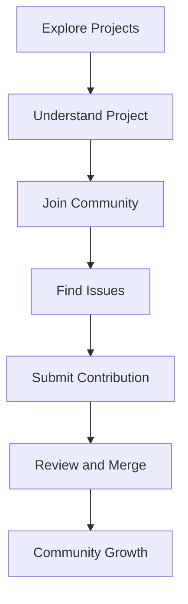

## 20.8 Open Source Contributions and Community Projects

Participating in open-source projects is a rewarding way to contribute to the Haxe community, enhance your skills, and gain recognition. In this section, we will explore the various aspects of open-source contributions, focusing on Haxe projects. We will cover how to collaborate effectively, adhere to project guidelines, and understand the benefits of contributing to open-source projects.

### Understanding Open Source Contributions

Open-source contributions involve participating in projects where the source code is freely available for anyone to use, modify, and distribute. Contributing to open-source projects can take many forms, including writing code, creating documentation, reporting bugs, and more.

#### Key Benefits of Contributing

1. **Skill Enhancement:** Working on real-world projects helps you improve your coding skills and learn new technologies.
2. **Networking:** Collaborating with other developers allows you to build professional relationships and expand your network.
3. **Recognition:** Contributions to popular projects can enhance your reputation in the developer community.
4. **Community Growth:** Your contributions help improve the software and benefit the entire community.

### Getting Started with Haxe Open Source Projects

To start contributing to Haxe open-source projects, you need to find projects that match your interests and skill level. Here are some steps to get started:

1. **Explore Haxe Projects:** Visit platforms like GitHub and search for Haxe projects. Look for projects that interest you and have active communities.
2. **Understand the Project:** Read the project's documentation, explore the codebase, and understand its goals and structure.
3. **Join the Community:** Participate in forums, mailing lists, or chat groups related to the project to connect with other contributors.

### Collaboration in Open Source Projects

Effective collaboration is crucial in open-source projects. Here are some tips for collaborating successfully:

#### Communication

- **Use Project Channels:** Communicate through the project's preferred channels, such as mailing lists, chat groups, or issue trackers.
- **Be Respectful:** Maintain a respectful tone in all communications and be open to feedback and suggestions.

#### Code Contribution

- **Follow Guidelines:** Adhere to the project's contribution guidelines, which may include coding standards, commit message formats, and more.
- **Write Clean Code:** Ensure your code is well-documented, tested, and follows the project's style guide.

#### Reviewing and Testing

- **Review Code:** Participate in code reviews to help maintain code quality and learn from others.
- **Test Thoroughly:** Test your contributions thoroughly to ensure they do not introduce bugs or regressions.

### Adhering to Project Guidelines

Each open-source project has its own set of guidelines for contributions. These guidelines help maintain consistency and quality across the project. Here are some common guidelines to follow:

1. **Contribution Process:** Understand the process for submitting contributions, which may involve creating pull requests, submitting patches, or using specific tools.
2. **Coding Standards:** Follow the project's coding standards, which may include naming conventions, indentation, and code organization.
3. **Documentation:** Ensure your contributions are well-documented, including code comments and updates to project documentation.

### Real-World Examples of Haxe Open Source Contributions

Let's explore some real-world examples of Haxe open-source contributions to understand how they have impacted the community:

#### Example 1: HaxeFlixel

HaxeFlixel is a popular open-source game development framework for Haxe. Contributors have added new features, fixed bugs, and improved documentation, making it a robust tool for game developers.

```haxe
// Example of a simple HaxeFlixel game setup
import flixel.FlxGame;
import flixel.FlxState;
import flixel.FlxG;

class Main extends FlxGame {
    public function new() {
        super(640, 480, PlayState);
    }
}

class PlayState extends FlxState {
    override public function create():Void {
        FlxG.bgColor = 0xff000000; // Set background color to black
    }
}
```

#### Example 2: OpenFL

OpenFL is an open-source implementation of the Flash API for Haxe. Contributors have worked on improving cross-platform support, adding new features, and optimizing performance.

```haxe
// Example of a simple OpenFL application
import openfl.display.Sprite;
import openfl.Lib;

class Main extends Sprite {
    public function new() {
        super();
        var circle = new Sprite();
        circle.graphics.beginFill(0xFF0000);
        circle.graphics.drawCircle(50, 50, 50);
        circle.graphics.endFill();
        addChild(circle);
    }
}

class ApplicationMain {
    public static function main() {
        Lib.current.addChild(new Main());
    }
}
```

### Visualizing the Contribution Process

To better understand the contribution process, let's visualize it using a flowchart:



**Caption:** This flowchart illustrates the typical process of contributing to an open-source project, from exploring projects to community growth.

### Best Practices for Open Source Contributions

To make meaningful contributions, follow these best practices:

1. **Start Small:** Begin with small contributions, such as fixing typos or small bugs, to familiarize yourself with the project.
2. **Be Consistent:** Regular contributions are more valuable than sporadic ones. Set aside time each week to contribute.
3. **Seek Feedback:** Actively seek feedback on your contributions to learn and improve.
4. **Mentor Others:** As you gain experience, help new contributors by answering questions and providing guidance.

### Challenges and How to Overcome Them

Contributing to open-source projects can be challenging. Here are some common challenges and how to overcome them:

#### Challenge 1: Understanding Complex Codebases

**Solution:** Start by reading the documentation and exploring the codebase. Focus on one module or feature at a time.

#### Challenge 2: Navigating Community Dynamics

**Solution:** Be patient and respectful. Listen to others and be open to different perspectives.

#### Challenge 3: Managing Time

**Solution:** Set realistic goals and prioritize your contributions. Use tools like calendars and to-do lists to manage your time effectively.

### Personal Development Through Open Source

Contributing to open-source projects can significantly enhance your personal development. Here are some ways it can benefit you:

1. **Skill Development:** Working on diverse projects helps you learn new technologies and improve your problem-solving skills.
2. **Portfolio Building:** Contributions to well-known projects can enhance your portfolio and make you more attractive to employers.
3. **Confidence Building:** Successfully contributing to projects boosts your confidence and encourages you to take on more challenging tasks.

### Community Growth and Impact

Your contributions not only benefit you but also help grow the Haxe community. Here's how:

1. **Improved Software:** Contributions lead to better software, benefiting all users.
2. **Increased Adoption:** High-quality projects attract more users and contributors, increasing the adoption of Haxe.
3. **Knowledge Sharing:** Open-source projects facilitate knowledge sharing, helping developers learn from each other.

### Try It Yourself

To get started with open-source contributions, try the following:

1. **Find a Haxe Project:** Search for Haxe projects on GitHub and find one that interests you.
2. **Fix a Bug:** Look for open issues labeled "good first issue" and try to fix a bug.
3. **Improve Documentation:** Review the project's documentation and suggest improvements or add missing information.

### Knowledge Check

Let's reinforce what we've learned with some questions and exercises:

1. **What are the benefits of contributing to open-source projects?**
2. **How can you find Haxe open-source projects to contribute to?**
3. **What are some common challenges in open-source contributions, and how can you overcome them?**

### Embrace the Journey

Remember, contributing to open-source projects is a journey. Start small, be consistent, and enjoy the process of learning and growing. As you contribute, you'll not only enhance your skills but also make a positive impact on the Haxe community. Keep experimenting, stay curious, and embrace the journey!

## Quiz Time!



### What is one of the key benefits of contributing to open-source projects?

- [x] Skill Enhancement
- [ ] Financial Gain
- [ ] Guaranteed Employment
- [ ] Immediate Recognition

> **Explanation:** Contributing to open-source projects helps improve your coding skills and learn new technologies, which is a key benefit.

### What is the first step in getting started with Haxe open-source projects?

- [ ] Submit a Pull Request
- [x] Explore Haxe Projects
- [ ] Write Documentation
- [ ] Fix Bugs

> **Explanation:** The first step is to explore Haxe projects to find ones that match your interests and skill level.

### Which of the following is a best practice for open-source contributions?

- [ ] Start with large contributions
- [x] Start Small
- [ ] Avoid Feedback
- [ ] Work Alone

> **Explanation:** Starting with small contributions helps you familiarize yourself with the project and build confidence.

### What is a common challenge in open-source contributions?

- [ ] Lack of Projects
- [x] Understanding Complex Codebases
- [ ] Too Much Free Time
- [ ] Lack of Interest

> **Explanation:** Understanding complex codebases is a common challenge, but it can be overcome by reading documentation and focusing on one module at a time.

### How can contributing to open-source projects benefit your career?

- [x] Enhances Portfolio
- [ ] Guarantees Promotion
- [ ] Provides Financial Security
- [ ] Eliminates Need for Networking

> **Explanation:** Contributions to well-known projects can enhance your portfolio and make you more attractive to employers.

### What is the role of communication in open-source projects?

- [x] Facilitates Collaboration
- [ ] Is Unnecessary
- [ ] Should Be Avoided
- [ ] Is Only for Managers

> **Explanation:** Communication is crucial for effective collaboration in open-source projects.

### How can you overcome the challenge of managing time for open-source contributions?

- [x] Set Realistic Goals
- [ ] Work Non-Stop
- [ ] Avoid Planning
- [ ] Ignore Deadlines

> **Explanation:** Setting realistic goals and prioritizing contributions helps manage time effectively.

### What is the impact of open-source contributions on the community?

- [x] Improved Software
- [ ] Decreased Adoption
- [ ] Limited Knowledge Sharing
- [ ] Reduced Collaboration

> **Explanation:** Contributions lead to better software, benefiting all users and increasing adoption.

### Which of the following is a way to start contributing to open-source projects?

- [x] Fix a Bug
- [ ] Ignore Issues
- [ ] Avoid Documentation
- [ ] Work in Isolation

> **Explanation:** Fixing a bug is a practical way to start contributing to open-source projects.

### True or False: Open-source contributions can help build your confidence.

- [x] True
- [ ] False

> **Explanation:** Successfully contributing to projects boosts your confidence and encourages you to take on more challenging tasks.


