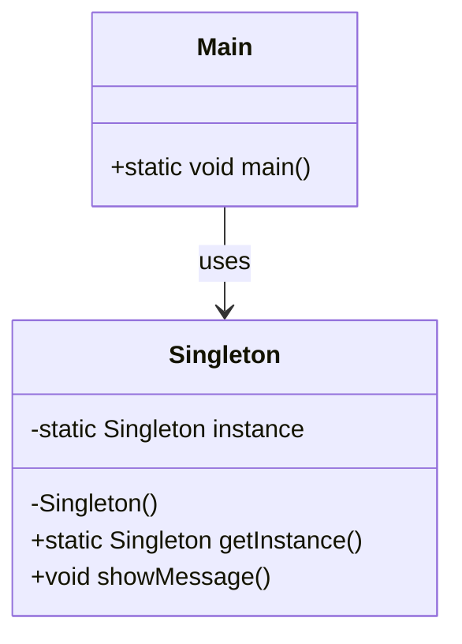

## 21.1 Recap of Key Concepts

As we reach the conclusion of "Mastering Haxe Design Patterns," it's essential to reflect on the journey we've undertaken. This guide has been a comprehensive exploration of design patterns, principles, and Haxe's unique capabilities, all aimed at empowering you to become an expert in cross-platform software engineering and architecture. Let's delve into the key concepts we've covered, emphasizing their significance and how they interconnect to form a robust foundation for software development in Haxe.

### Summary of Design Patterns

Design patterns are the cornerstone of effective software design, providing time-tested solutions to common problems. Throughout this guide, we've explored a wide array of patterns, each serving a distinct purpose in the software development lifecycle. Here's a brief recap of the major categories and some key patterns:

#### Creational Patterns

Creational patterns focus on object creation mechanisms, enhancing flexibility and reuse. In Haxe, these patterns are particularly powerful due to the language's static typing and macro capabilities.

- **Singleton Pattern:** Ensures a class has only one instance and provides a global point of access to it. This pattern is crucial for managing shared resources or configurations.
  
- **Factory Method Pattern:** Defines an interface for creating objects but allows subclasses to alter the type of objects that will be created. This pattern is essential for promoting loose coupling.

- **Builder Pattern:** Separates the construction of a complex object from its representation, allowing the same construction process to create different representations. This pattern is beneficial for constructing objects with numerous optional parameters.

#### Structural Patterns

Structural patterns deal with object composition, ensuring that if one part changes, the entire structure doesn't need to be modified.

- **Adapter Pattern:** Allows incompatible interfaces to work together. This pattern is vital for integrating Haxe with various platform-specific APIs.

- **Decorator Pattern:** Adds behavior to individual objects dynamically without affecting the behavior of other objects from the same class. This pattern is perfect for extending functionalities in a flexible manner.

- **Facade Pattern:** Provides a simplified interface to a complex subsystem. This pattern is useful for reducing dependencies and simplifying interactions with complex libraries.

#### Behavioral Patterns

Behavioral patterns focus on communication between objects, ensuring that the system is flexible and extensible.

- **Observer Pattern:** Defines a one-to-many dependency between objects so that when one object changes state, all its dependents are notified. This pattern is crucial for implementing event-driven systems.

- **Strategy Pattern:** Defines a family of algorithms, encapsulates each one, and makes them interchangeable. This pattern is ideal for implementing interchangeable behaviors.

- **Command Pattern:** Encapsulates a request as an object, thereby allowing for parameterization of clients with queues, requests, and operations. This pattern is essential for implementing undoable operations.

### Haxe's Unique Capabilities

Haxe stands out in the programming landscape due to its cross-platform capabilities, static typing, and powerful macro system. These features significantly enhance the application of design patterns:

- **Cross-Platform Compilation:** Haxe's ability to compile to multiple targets (JavaScript, C++, C#, Java, Python, etc.) allows developers to write code once and deploy it across various platforms. This capability is crucial for implementing design patterns that need to work seamlessly across different environments.

- **Static Typing:** Haxe's static typing system ensures type safety and reduces runtime errors, making it easier to implement and maintain complex design patterns.

- **Macros and Meta-Programming:** Haxe's macro system allows for compile-time code generation and transformation, enabling developers to create more expressive and efficient design patterns. Macros can automate repetitive tasks and enforce design constraints, leading to cleaner and more maintainable code.

### Integration of Principles

Throughout this guide, we've emphasized the integration of key software design principles with design patterns to enhance code quality and maintainability:

- **SOLID Principles:** These principles (Single Responsibility, Open/Closed, Liskov Substitution, Interface Segregation, and Dependency Inversion) are fundamental to creating robust and scalable software. By applying SOLID principles, we've ensured that our design patterns promote loose coupling and high cohesion.

- **DRY (Don't Repeat Yourself):** This principle encourages the reduction of code duplication, which is crucial for maintaining consistency and reducing errors. Design patterns like the Factory Method and Singleton help achieve DRY by centralizing object creation and management.

- **KISS (Keep It Simple, Stupid):** Simplicity is key to maintainability. By using design patterns, we've been able to simplify complex systems, making them easier to understand and modify.

- **YAGNI (You Aren't Gonna Need It):** This principle discourages adding functionality until it is necessary. By focusing on essential design patterns, we've avoided over-engineering and kept our solutions lean and efficient.

### Lessons Learned

As we conclude, let's summarize the critical takeaways from this guide:

- **Best Practices:** We've explored best practices for applying design patterns in Haxe, emphasizing the importance of understanding the problem domain and selecting the appropriate pattern.

- **Common Pitfalls:** We've identified common pitfalls, such as overusing patterns or applying them inappropriately, and provided strategies to avoid these issues.

- **Effective Software Design:** We've demonstrated how to leverage Haxe's unique features to create clean, maintainable, and efficient code. By integrating design patterns with software design principles, we've laid the groundwork for building scalable and robust applications.

### Try It Yourself

To solidify your understanding, try modifying the following code example to implement a new feature or optimize its performance. Experimentation is key to mastering design patterns in Haxe.

```haxe
class Singleton {
    private static var instance:Singleton;
    
    private function new() {
        // Private constructor to prevent instantiation
    }
    
    public static function getInstance():Singleton {
        if (instance == null) {
            instance = new Singleton();
        }
        return instance;
    }
    
    public function showMessage():Void {
        trace("Hello, Singleton Pattern!");
    }
}

class Main {
    static function main() {
        var singleton = Singleton.getInstance();
        singleton.showMessage();
    }
}
```

**Challenge:** Modify the `Singleton` class to include a counter that tracks how many times the `showMessage` method is called. This exercise will help you understand how to extend existing patterns to meet new requirements.

### Visualizing Haxe's Design Patterns

To further enhance your understanding, let's visualize some of the key concepts using Mermaid.js diagrams.

#### Visualizing the Singleton Pattern



**Diagram Description:** This class diagram illustrates the Singleton pattern, highlighting the private constructor and the static `getInstance` method that ensures only one instance of the class is created.

### References and Links

For further reading and deeper dives into the topics covered in this guide, consider exploring the following resources:

- [Design Patterns: Elements of Reusable Object-Oriented Software](https://en.wikipedia.org/wiki/Design_Patterns) - The seminal book on design patterns.
- [Haxe Language Reference](https://haxe.org/manual/) - Official documentation for Haxe.
- [MDN Web Docs](https://developer.mozilla.org/en-US/) - Comprehensive resource for web technologies and programming concepts.

### Knowledge Check

To reinforce your learning, let's pose some questions and challenges:

- **Question:** What are the key differences between the Factory Method and Abstract Factory patterns?
- **Challenge:** Implement a simple Observer pattern in Haxe to notify multiple listeners of a change in state.

### Embrace the Journey

Remember, this is just the beginning. As you continue your journey in mastering Haxe design patterns, keep experimenting, stay curious, and enjoy the process. The skills and knowledge you've gained from this guide will serve as a solid foundation for tackling complex software design challenges in the future.

## Quiz Time!



### What is the primary purpose of the Singleton pattern?

- [x] To ensure a class has only one instance and provide a global point of access to it.
- [ ] To create a family of related objects without specifying their concrete classes.
- [ ] To define a one-to-many dependency between objects.
- [ ] To encapsulate a request as an object.

> **Explanation:** The Singleton pattern ensures that a class has only one instance and provides a global point of access to it, which is crucial for managing shared resources or configurations.

### Which Haxe feature enhances the application of design patterns by allowing compile-time code generation?

- [ ] Cross-platform compilation
- [x] Macros and meta-programming
- [ ] Static typing
- [ ] Null safety

> **Explanation:** Haxe's macro system allows for compile-time code generation and transformation, enabling more expressive and efficient design patterns.

### What principle encourages the reduction of code duplication?

- [ ] SOLID
- [x] DRY
- [ ] KISS
- [ ] YAGNI

> **Explanation:** The DRY (Don't Repeat Yourself) principle encourages the reduction of code duplication, which is crucial for maintaining consistency and reducing errors.

### Which pattern provides a simplified interface to a complex subsystem?

- [ ] Adapter Pattern
- [ ] Decorator Pattern
- [x] Facade Pattern
- [ ] Strategy Pattern

> **Explanation:** The Facade pattern provides a simplified interface to a complex subsystem, reducing dependencies and simplifying interactions with complex libraries.

### What is the key benefit of Haxe's static typing?

- [ ] It allows for dynamic code execution.
- [x] It ensures type safety and reduces runtime errors.
- [ ] It enables cross-platform compilation.
- [ ] It supports meta-programming.

> **Explanation:** Haxe's static typing ensures type safety and reduces runtime errors, making it easier to implement and maintain complex design patterns.

### Which design pattern is ideal for implementing interchangeable behaviors?

- [ ] Observer Pattern
- [x] Strategy Pattern
- [ ] Command Pattern
- [ ] Singleton Pattern

> **Explanation:** The Strategy pattern defines a family of algorithms, encapsulates each one, and makes them interchangeable, making it ideal for implementing interchangeable behaviors.

### What does the KISS principle stand for?

- [ ] Keep It Safe and Secure
- [x] Keep It Simple, Stupid
- [ ] Keep It Short and Sweet
- [ ] Keep It Synchronized and Stable

> **Explanation:** The KISS (Keep It Simple, Stupid) principle emphasizes simplicity as key to maintainability, encouraging developers to avoid unnecessary complexity.

### Which pattern is crucial for implementing event-driven systems?

- [x] Observer Pattern
- [ ] Factory Method Pattern
- [ ] Builder Pattern
- [ ] Prototype Pattern

> **Explanation:** The Observer pattern defines a one-to-many dependency between objects so that when one object changes state, all its dependents are notified, making it crucial for event-driven systems.

### What is a common pitfall when applying design patterns?

- [ ] Using patterns to solve specific problems
- [ ] Integrating patterns with software design principles
- [x] Overusing patterns or applying them inappropriately
- [ ] Leveraging Haxe's unique features

> **Explanation:** A common pitfall is overusing patterns or applying them inappropriately, which can lead to unnecessary complexity and reduced maintainability.

### True or False: The Builder pattern is beneficial for constructing objects with numerous optional parameters.

- [x] True
- [ ] False

> **Explanation:** True. The Builder pattern separates the construction of a complex object from its representation, allowing the same construction process to create different representations, making it beneficial for constructing objects with numerous optional parameters.



By reflecting on these key concepts, you're well-equipped to apply design patterns effectively in Haxe, leveraging its unique capabilities to build robust, scalable, and maintainable software solutions. Keep exploring, learning, and pushing the boundaries of what's possible with Haxe!
