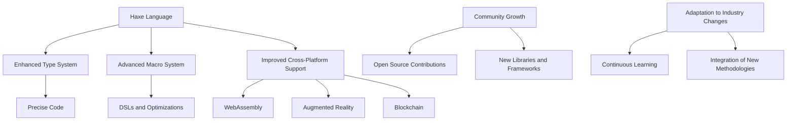

## 21.2 The Future of Haxe and Emerging Technologies

As we look towards the future of Haxe, it's essential to consider the evolving landscape of software development and how Haxe, as a versatile cross-platform language, is poised to adapt and thrive. This section delves into the upcoming features in the Haxe language, explores emerging technologies that may intersect with Haxe development, highlights the importance of community growth, and emphasizes the need for adaptability in the face of industry changes.

### Evolving Language Features

Haxe has always been at the forefront of innovation, offering a unique blend of features that cater to both object-oriented and functional programming paradigms. As the language continues to evolve, several upcoming features are set to influence design patterns and application architectures significantly.

#### 1. Enhanced Type System

The Haxe type system is already robust, with support for static typing, type inference, and generics. Future enhancements aim to introduce more powerful type constructs, such as dependent types and refined type inference algorithms. These improvements will allow developers to write even more precise and error-free code, facilitating the creation of complex systems with greater ease.

```haxe
// Example of a refined type inference in Haxe
class Example {
    static function main() {
        var numbers = [1, 2, 3, 4];
        var sum = numbers.reduce((a, b) -> a + b, 0);
        trace(sum); // Output: 10
    }
}
```

#### 2. Advanced Macro System

Haxe's macro system is one of its most powerful features, enabling compile-time code generation and transformation. Future updates are expected to enhance macro capabilities, making it easier to build domain-specific languages (DSLs) and perform complex code manipulations. This will open up new possibilities for creating highly optimized and tailored solutions.

```haxe
// Example of a simple macro in Haxe
import haxe.macro.Context;
import haxe.macro.Expr;

class MacroExample {
    public static macro function logExpression(e:Expr):Expr {
        return macro trace($e);
    }
}
```

#### 3. Improved Cross-Platform Support

Haxe's ability to compile to multiple targets, including JavaScript, C++, C#, Java, and Python, is one of its defining features. The future roadmap includes enhancements to the compiler backend, improving performance and compatibility across all supported platforms. This will ensure that Haxe remains a top choice for cross-platform development.

### Trends in Software Development

The software development landscape is constantly evolving, with new technologies and paradigms emerging regularly. Haxe, with its flexibility and adaptability, is well-positioned to intersect with several of these trends.

#### 1. WebAssembly

WebAssembly (Wasm) is revolutionizing web development by enabling near-native performance for web applications. Haxe's ability to compile to WebAssembly opens up new opportunities for building high-performance web applications that leverage Haxe's strong typing and cross-platform capabilities.

```haxe
// Example of compiling Haxe to WebAssembly
class WasmExample {
    static function main() {
        trace("Hello, WebAssembly!");
    }
}
```

#### 2. Augmented Reality (AR)

Augmented Reality is becoming increasingly popular in various industries, from gaming to education. Haxe's cross-platform nature makes it an excellent choice for developing AR applications that need to run on multiple devices and platforms seamlessly.

#### 3. Blockchain

Blockchain technology is transforming industries by providing decentralized and secure systems. Haxe's strong typing and compile-time checks make it suitable for developing blockchain applications where security and reliability are paramount.

### Community Growth

The Haxe community plays a crucial role in the language's evolution. Community contributions, including new libraries, frameworks, and tools, are vital for keeping Haxe relevant and competitive.

#### 1. Open Source Contributions

Encourage developers to contribute to open source Haxe projects. This not only helps improve the ecosystem but also fosters a sense of community and collaboration.

#### 2. New Libraries and Frameworks

The development of new libraries and frameworks can significantly enhance Haxe's capabilities. Community-driven projects like HaxeFlixel and Heaps have already made a substantial impact, and future contributions will continue to expand Haxe's reach.

### Adaptation to Industry Changes

In the fast-paced world of software development, adaptability is key. As new technologies and methodologies emerge, it's essential for developers to stay informed and integrate these advancements into their practices.

#### 1. Continuous Learning

Encourage developers to engage in continuous learning through online courses, workshops, and conferences. Staying updated with the latest trends and technologies ensures that developers can leverage Haxe's full potential.

#### 2. Integration of New Methodologies

Adopt new development methodologies, such as DevOps and Agile, to improve efficiency and collaboration. These practices can help teams deliver high-quality software faster and more reliably.

### Visualizing the Future of Haxe

To better understand the future of Haxe and its intersection with emerging technologies, let's visualize the potential interactions and growth areas using a Mermaid.js diagram.



### Conclusion

The future of Haxe is bright, with numerous opportunities for growth and innovation. By embracing new language features, exploring emerging technologies, fostering community growth, and adapting to industry changes, Haxe developers can continue to build powerful, cross-platform applications that meet the demands of tomorrow's software landscape. Remember, this is just the beginning. As you progress, you'll discover more ways to leverage Haxe's unique capabilities. Keep experimenting, stay curious, and enjoy the journey!

## Quiz Time!



### What is one of the upcoming features in the Haxe language that will enhance its type system?

- [x] Dependent types
- [ ] Dynamic typing
- [ ] Weak typing
- [ ] Loose typing

> **Explanation:** Dependent types are an advanced feature that allows for more precise type definitions, enhancing the robustness of the Haxe type system.

### How does Haxe's macro system benefit developers?

- [x] Enables compile-time code generation
- [ ] Simplifies runtime debugging
- [ ] Enhances dynamic typing
- [ ] Reduces code readability

> **Explanation:** Haxe's macro system allows developers to perform compile-time code generation and transformation, enabling the creation of domain-specific languages and optimized code.

### Which emerging technology is Haxe well-suited for due to its cross-platform capabilities?

- [x] WebAssembly
- [ ] Assembly Language
- [ ] Machine Code
- [ ] Binary Code

> **Explanation:** Haxe's ability to compile to WebAssembly makes it well-suited for building high-performance web applications that run across different platforms.

### What role does the Haxe community play in the language's evolution?

- [x] Contributes new libraries and frameworks
- [ ] Limits language features
- [ ] Discourages open source contributions
- [ ] Focuses solely on commercial projects

> **Explanation:** The Haxe community contributes new libraries, frameworks, and tools, which are vital for keeping the language relevant and competitive.

### How can developers stay adaptable in the face of industry changes?

- [x] Engage in continuous learning
- [ ] Avoid new technologies
- [ ] Stick to outdated methodologies
- [ ] Ignore industry trends

> **Explanation:** Continuous learning helps developers stay informed about the latest trends and technologies, ensuring they can integrate advancements into their practices.

### What is a potential benefit of Haxe's improved cross-platform support?

- [x] Better performance across all supported platforms
- [ ] Increased code complexity
- [ ] Limited target platforms
- [ ] Reduced language features

> **Explanation:** Improved cross-platform support enhances performance and compatibility, making Haxe a top choice for cross-platform development.

### How does Haxe's strong typing benefit blockchain development?

- [x] Ensures security and reliability
- [ ] Increases code verbosity
- [ ] Limits flexibility
- [ ] Reduces compile-time checks

> **Explanation:** Haxe's strong typing and compile-time checks make it suitable for developing secure and reliable blockchain applications.

### What is one way developers can contribute to the Haxe ecosystem?

- [x] Participate in open source projects
- [ ] Focus only on proprietary software
- [ ] Avoid community interactions
- [ ] Limit contributions to documentation

> **Explanation:** Participating in open source projects helps improve the Haxe ecosystem and fosters a sense of community and collaboration.

### Which development methodology can improve efficiency and collaboration?

- [x] Agile
- [ ] Waterfall
- [ ] Ad-hoc
- [ ] Sequential

> **Explanation:** Agile methodologies promote iterative development, improving efficiency and collaboration among teams.

### True or False: Haxe is limited to a single programming paradigm.

- [x] False
- [ ] True

> **Explanation:** Haxe supports multiple programming paradigms, including object-oriented and functional programming, making it versatile for various development needs.


