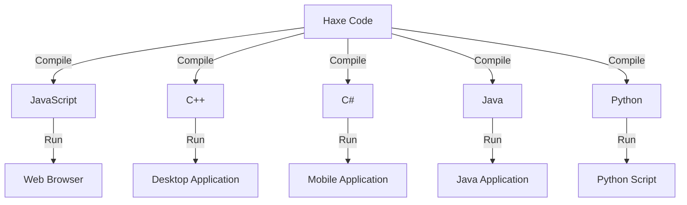

## 22.10 Additional Tools and Libraries

In the realm of cross-platform development, leveraging the right tools and libraries can significantly enhance productivity, streamline workflows, and ensure robust application performance. Haxe, with its versatile capabilities, offers a plethora of libraries and tools that cater to various aspects of software development. This section delves into some of the most essential Haxe libraries and tools that complement design patterns, boost productivity, and facilitate cross-platform development.

### Recommended Libraries

#### 1. Serialization Libraries

Serialization is a crucial aspect of software development, enabling the conversion of complex data structures into a format that can be easily stored or transmitted. In Haxe, several libraries facilitate serialization:

- **haxe.Serializer and haxe.Unserializer**: These are built-in Haxe classes that provide basic serialization and deserialization capabilities. They are suitable for simple use cases where you need to convert objects to strings and vice versa.

- **hxSerial**: A more advanced serialization library that supports complex data structures and offers customizable serialization formats. It is particularly useful when dealing with nested objects or when you need to serialize data for network transmission.

```haxe
import haxe.Serializer;
import haxe.Unserializer;

class SerializationExample {
    static function main() {
        var data = {name: "Haxe", version: 4.2};
        var serializedData = Serializer.run(data);
        trace("Serialized: " + serializedData);

        var unserializedData = Unserializer.run(serializedData);
        trace("Unserialized: " + unserializedData);
    }
}
```

#### 2. GUI Frameworks

Creating user interfaces that are both functional and aesthetically pleasing is a challenge in cross-platform development. Haxe provides several GUI frameworks that simplify this process:

- **HaxeUI**: A comprehensive UI framework that supports multiple backends, including HTML5, OpenFL, and Kha. It allows developers to create rich, interactive user interfaces with ease.

- **NME (Neko Media Engine)**: A cross-platform framework that supports native applications on Windows, macOS, Linux, iOS, and Android. It is particularly useful for game development and applications requiring high-performance graphics.

```haxe
import haxe.ui.Toolkit;
import haxe.ui.components.Button;
import haxe.ui.core.Screen;

class GUIExample {
    static function main() {
        Toolkit.init();
        var button = new Button();
        button.text = "Click Me!";
        button.onClick = function() {
            trace("Button clicked!");
        };
        Screen.instance.addComponent(button);
    }
}
```

#### 3. Network Tools

Networking is an integral part of modern applications, enabling communication between different systems. Haxe offers several libraries that facilitate network programming:

- **haxe.Http**: A built-in class that provides simple HTTP request capabilities. It is ideal for making RESTful API calls or fetching data from web services.

- **WebSocket**: A library that implements the WebSocket protocol, allowing for real-time communication between clients and servers. It is particularly useful for applications requiring low-latency data exchange.

```haxe
import haxe.Http;

class NetworkExample {
    static function main() {
        var http = new Http("https://api.example.com/data");
        http.onData = function(response) {
            trace("Response: " + response);
        };
        http.onError = function(error) {
            trace("Error: " + error);
        };
        http.request();
    }
}
```

### Productivity Tools

#### 1. Code Linters and Formatters

Maintaining code quality is essential for any development project. Code linters and formatters help ensure that your code adheres to best practices and is easy to read:

- **Haxe Checkstyle**: A static code analysis tool that checks Haxe code against a set of coding standards. It helps identify potential issues and enforces consistency across your codebase.

- **Haxe Formatter**: An automatic code formatter that ensures your code is consistently styled. It can be integrated into your development workflow to format code on save or as part of a build process.

#### 2. Testing Utilities

Testing is a critical part of software development, ensuring that your code behaves as expected. Haxe provides several testing frameworks and utilities:

- **MUnit**: A unit testing framework for Haxe that supports test-driven development (TDD). It provides a simple API for writing and running tests, making it easy to integrate into your development process.

- **Buddy**: Another testing framework that focuses on behavior-driven development (BDD). It allows you to write tests in a more human-readable format, making it easier to understand the behavior of your code.

```haxe
import munit.TestCase;

class ExampleTest extends TestCase {
    public function new() {
        super();
    }

    public function testAddition() {
        var result = 2 + 2;
        assertEquals(4, result);
    }
}
```

### Cross-Platform Utilities

#### 1. Build Automation Tools

Automating the build process is crucial for efficient cross-platform development. Haxe offers several tools that simplify build automation:

- **Haxe Compiler (haxe)**: The core tool for compiling Haxe code to various target platforms. It supports conditional compilation and can be integrated into build scripts for automated builds.

- **Lix**: A package manager and build tool for Haxe that simplifies dependency management and project setup. It allows you to easily switch between different Haxe versions and manage libraries.

#### 2. Asset Management Systems

Managing assets such as images, sounds, and other resources is an important aspect of cross-platform development. Haxe provides tools that facilitate asset management:

- **OpenFL**: A framework that provides a Flash-like API for creating cross-platform applications. It includes tools for managing assets and supports a wide range of media formats.

- **Kha**: A low-level framework that provides high-performance graphics and audio capabilities. It includes a powerful asset management system that supports various file formats and platforms.

### Try It Yourself

To get hands-on experience with these tools and libraries, try modifying the code examples provided in this section. Experiment with different serialization formats, create a simple GUI application using HaxeUI, or make HTTP requests to different APIs. This will help reinforce your understanding of how these tools can be used in real-world scenarios.

### Visualizing Haxe's Cross-Platform Capabilities

To better understand the cross-platform capabilities of Haxe and how these tools and libraries fit into the development process, consider the following diagram:



**Diagram Description:** This diagram illustrates how Haxe code can be compiled into various target languages, enabling cross-platform development. Each target language can then be executed in its respective environment, such as a web browser, desktop application, or mobile application.

### References and Links

For further reading and exploration of Haxe tools and libraries, consider the following resources:

- [Haxe Official Documentation](https://haxe.org/documentation/)
- [HaxeUI GitHub Repository](https://github.com/haxeui/haxeui-core)
- [OpenFL Official Website](https://www.openfl.org/)
- [Kha GitHub Repository](https://github.com/Kode/Kha)
- [MUnit GitHub Repository](https://github.com/massiveinteractive/MassiveUnit)

### Knowledge Check

To reinforce your understanding of the tools and libraries discussed in this section, consider the following questions and challenges:

- What are the advantages of using Haxe's built-in serialization classes compared to third-party libraries?
- How can HaxeUI be used to create cross-platform user interfaces?
- What are the benefits of using a testing framework like MUnit in your development process?
- How does the Haxe Compiler facilitate cross-platform development?

### Embrace the Journey

Remember, mastering these tools and libraries is just the beginning. As you continue to explore Haxe's capabilities, you'll discover new ways to enhance your development workflow and create powerful cross-platform applications. Stay curious, keep experimenting, and enjoy the journey!

## Quiz Time!



### Which Haxe library is used for serialization and deserialization of data?

- [x] haxe.Serializer
- [ ] HaxeUI
- [ ] OpenFL
- [ ] WebSocket

> **Explanation:** The `haxe.Serializer` and `haxe.Unserializer` classes are used for serialization and deserialization of data in Haxe.

### What is the primary purpose of HaxeUI?

- [x] To create cross-platform user interfaces
- [ ] To manage network requests
- [ ] To serialize data
- [ ] To automate builds

> **Explanation:** HaxeUI is a framework designed to create cross-platform user interfaces.

### Which tool is used for real-time communication in Haxe applications?

- [ ] haxe.Http
- [x] WebSocket
- [ ] HaxeUI
- [ ] OpenFL

> **Explanation:** The WebSocket library in Haxe is used for real-time communication between clients and servers.

### What is the role of Haxe Checkstyle?

- [x] To enforce coding standards
- [ ] To format code
- [ ] To serialize data
- [ ] To create GUIs

> **Explanation:** Haxe Checkstyle is a static code analysis tool that checks Haxe code against coding standards.

### Which testing framework focuses on behavior-driven development (BDD)?

- [ ] MUnit
- [x] Buddy
- [ ] HaxeUI
- [ ] OpenFL

> **Explanation:** Buddy is a testing framework that focuses on behavior-driven development (BDD).

### What is the primary function of the Haxe Compiler?

- [x] To compile Haxe code to various target platforms
- [ ] To manage assets
- [ ] To create GUIs
- [ ] To format code

> **Explanation:** The Haxe Compiler is used to compile Haxe code to various target platforms, facilitating cross-platform development.

### Which framework provides a Flash-like API for cross-platform applications?

- [x] OpenFL
- [ ] HaxeUI
- [ ] WebSocket
- [ ] MUnit

> **Explanation:** OpenFL provides a Flash-like API for creating cross-platform applications.

### What is the benefit of using Lix in Haxe development?

- [x] Simplifies dependency management and project setup
- [ ] Provides real-time communication
- [ ] Enforces coding standards
- [ ] Formats code

> **Explanation:** Lix is a package manager and build tool that simplifies dependency management and project setup in Haxe development.

### Which library is used for high-performance graphics and audio capabilities in Haxe?

- [ ] HaxeUI
- [ ] WebSocket
- [x] Kha
- [ ] MUnit

> **Explanation:** Kha is a low-level framework that provides high-performance graphics and audio capabilities.

### True or False: Haxe can only compile to JavaScript.

- [ ] True
- [x] False

> **Explanation:** Haxe can compile to multiple target languages, including JavaScript, C++, C#, Java, and Python.


