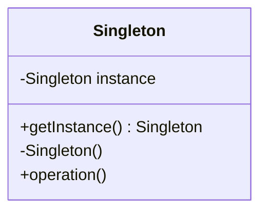

## 22.2 Bibliography and Recommended Reading

In this section, we provide a comprehensive list of resources that will enhance your understanding of Haxe design patterns and cross-platform software architecture. This bibliography includes influential books, seminal academic papers, and authoritative online resources. These materials are invaluable for expert software engineers and architects seeking to master the application of design patterns in Haxe.

### Books and Publications

#### 1. **"Design Patterns: Elements of Reusable Object-Oriented Software" by Erich Gamma, Richard Helm, Ralph Johnson, and John Vlissides**
This seminal book, often referred to as the "Gang of Four" book, is a must-read for understanding the foundational design patterns in software engineering. It provides a catalog of 23 classic design patterns and explains their applicability, structure, and implementation.

#### 2. **"Patterns of Enterprise Application Architecture" by Martin Fowler**
Martin Fowler's book is essential for understanding architectural patterns and their application in enterprise software development. It covers patterns that are crucial for building scalable and maintainable applications.

#### 3. **"Refactoring: Improving the Design of Existing Code" by Martin Fowler**
This book introduces the concept of refactoring and provides a catalog of techniques to improve code structure. It is particularly useful for developers looking to apply design patterns to enhance existing codebases.

#### 4. **"Domain-Driven Design: Tackling Complexity in the Heart of Software" by Eric Evans**
Eric Evans' book is a comprehensive guide to domain-driven design, which is a critical approach for managing complexity in software systems. It emphasizes the importance of aligning software design with business needs.

#### 5. **"Haxe 2 Beginner's Guide" by Benjamin Dasnois**
This book is a practical introduction to Haxe, covering the basics of the language and its cross-platform capabilities. It is an excellent starting point for developers new to Haxe.

#### 6. **"Learning Haxe Programming" by Nicolas Cannasse**
Authored by the creator of Haxe, this book provides an in-depth look at the language's features and its application in cross-platform development. It is an invaluable resource for understanding Haxe's unique capabilities.

#### 7. **"Pro Haxe Game Development" by Jeremy McCurdy**
This book focuses on using Haxe for game development, covering popular frameworks like HaxeFlixel and Heaps. It provides practical examples and insights into building cross-platform games.

### Academic Papers

#### 1. **"Design Patterns: Abstraction and Reuse of Object-Oriented Design" by Erich Gamma et al.**
This paper is the original work that introduced design patterns to the software engineering community. It discusses the abstraction and reuse of object-oriented design, laying the groundwork for the "Gang of Four" book.

#### 2. **"A Pattern Language: Towns, Buildings, Construction" by Christopher Alexander et al.**
Although not directly related to software, this book inspired the concept of design patterns in software engineering. It explores patterns in architecture and urban planning, providing insights into pattern-based design.

#### 3. **"The Cathedral and the Bazaar" by Eric S. Raymond**
This essay explores the open-source development model and its implications for software design. It provides valuable insights into collaborative development and the use of design patterns in open-source projects.

#### 4. **"Reflections on Trusting Trust" by Ken Thompson**
This classic paper discusses the importance of trust in software systems and the implications of trusting compilers and tools. It highlights the need for secure design patterns in software development.

#### 5. **"Microservices: A Definition of This New Architectural Term" by James Lewis and Martin Fowler**
This paper provides a comprehensive overview of microservices architecture, a modern approach to building scalable and maintainable systems. It discusses the use of design patterns in microservices and their benefits.

### Online Resources

#### 1. **Haxe Official Documentation**
The [Haxe official documentation](https://haxe.org/documentation/) is the primary resource for learning about the language's features, syntax, and libraries. It includes tutorials, API references, and guides for cross-platform development.

#### 2. **HaxeFlixel Documentation**
For game developers, the [HaxeFlixel documentation](https://haxeflixel.com/documentation/) provides detailed information on using the HaxeFlixel framework. It includes tutorials, examples, and API references for building 2D games.

#### 3. **Design Patterns on SourceMaking**
The [SourceMaking website](https://sourcemaking.com/design_patterns) offers a comprehensive guide to design patterns, including explanations, examples, and UML diagrams. It is an excellent resource for understanding the application of design patterns in software development.

#### 4. **Refactoring Guru**
The [Refactoring Guru website](https://refactoring.guru/) provides detailed explanations of design patterns and refactoring techniques. It includes code examples and visualizations to aid understanding.

#### 5. **Haxe Community Forums**
The [Haxe community forums](https://community.haxe.org/) are a valuable resource for connecting with other Haxe developers, sharing knowledge, and seeking advice on design patterns and cross-platform development.

#### 6. **GitHub Repositories**
Explore [GitHub repositories](https://github.com/search?q=haxe) for open-source Haxe projects and libraries. These repositories provide practical examples of design patterns in action and offer opportunities for collaboration and contribution.

#### 7. **Stack Overflow**
The [Haxe tag on Stack Overflow](https://stackoverflow.com/questions/tagged/haxe) is a great place to find answers to common questions and challenges related to Haxe programming and design patterns.

### Try It Yourself

To deepen your understanding of the resources listed above, try the following exercises:

1. **Implement a Design Pattern:** Choose a design pattern from the "Gang of Four" book and implement it in Haxe. Experiment with different use cases and variations.

2. **Refactor Existing Code:** Select a piece of code from an open-source Haxe project and refactor it using techniques from Martin Fowler's "Refactoring" book. Document the improvements and challenges encountered.

3. **Contribute to a Haxe Project:** Find a Haxe project on GitHub that interests you and contribute to it. Apply design patterns and best practices to enhance the project's codebase.

4. **Explore HaxeFlixel:** Build a simple game using the HaxeFlixel framework. Experiment with different game mechanics and design patterns to improve the game's architecture.

### Visualizing Design Patterns

To aid your understanding of design patterns, we provide visual representations using Mermaid.js diagrams. These diagrams illustrate the structure and relationships of key design patterns.

#### Example: Singleton Pattern

**Description:** This diagram illustrates the Singleton pattern, where a class has a single instance accessible through a static method.

### Knowledge Check

To reinforce your understanding of the resources and concepts covered in this section, consider the following questions:

- What are the key benefits of using design patterns in software development?
- How can refactoring improve the maintainability of a codebase?
- What are the unique features of Haxe that make it suitable for cross-platform development?
- How do architectural patterns differ from design patterns?

### Embrace the Journey

Remember, mastering design patterns and Haxe programming is a journey. As you explore the resources and exercises provided, you'll gain deeper insights into software architecture and cross-platform development. Keep experimenting, stay curious, and enjoy the process of learning and growth.

## Quiz Time!



### Which book is often referred to as the "Gang of Four" book?

- [x] "Design Patterns: Elements of Reusable Object-Oriented Software"
- [ ] "Patterns of Enterprise Application Architecture"
- [ ] "Refactoring: Improving the Design of Existing Code"
- [ ] "Domain-Driven Design: Tackling Complexity in the Heart of Software"

> **Explanation:** The "Gang of Four" book is "Design Patterns: Elements of Reusable Object-Oriented Software" by Erich Gamma and others.

### What is the primary focus of Martin Fowler's book "Refactoring"?

- [x] Improving the design of existing code
- [ ] Introducing new design patterns
- [ ] Exploring domain-driven design
- [ ] Discussing microservices architecture

> **Explanation:** Martin Fowler's book "Refactoring" focuses on techniques to improve the design of existing code.

### Which book provides a comprehensive guide to domain-driven design?

- [ ] "Design Patterns: Elements of Reusable Object-Oriented Software"
- [ ] "Patterns of Enterprise Application Architecture"
- [x] "Domain-Driven Design: Tackling Complexity in the Heart of Software"
- [ ] "Haxe 2 Beginner's Guide"

> **Explanation:** "Domain-Driven Design: Tackling Complexity in the Heart of Software" by Eric Evans is a comprehensive guide to domain-driven design.

### What is the main subject of the paper "Reflections on Trusting Trust"?

- [ ] Design patterns in software engineering
- [ ] Open-source development models
- [x] Trust in software systems and compilers
- [ ] Microservices architecture

> **Explanation:** "Reflections on Trusting Trust" by Ken Thompson discusses the importance of trust in software systems and compilers.

### Which online resource provides a comprehensive guide to design patterns with examples and UML diagrams?

- [ ] Haxe Official Documentation
- [x] SourceMaking website
- [ ] HaxeFlixel Documentation
- [ ] Refactoring Guru

> **Explanation:** The SourceMaking website offers a comprehensive guide to design patterns with examples and UML diagrams.

### What is the primary focus of the "Haxe 2 Beginner's Guide"?

- [x] Introduction to Haxe and its cross-platform capabilities
- [ ] Advanced Haxe programming techniques
- [ ] Game development with Haxe
- [ ] Domain-driven design

> **Explanation:** The "Haxe 2 Beginner's Guide" is a practical introduction to Haxe and its cross-platform capabilities.

### Which book is authored by the creator of Haxe?

- [ ] "Design Patterns: Elements of Reusable Object-Oriented Software"
- [ ] "Patterns of Enterprise Application Architecture"
- [ ] "Refactoring: Improving the Design of Existing Code"
- [x] "Learning Haxe Programming"

> **Explanation:** "Learning Haxe Programming" is authored by Nicolas Cannasse, the creator of Haxe.

### What is the focus of the "Pro Haxe Game Development" book?

- [ ] Introduction to Haxe programming
- [x] Using Haxe for game development
- [ ] Refactoring techniques
- [ ] Domain-driven design

> **Explanation:** "Pro Haxe Game Development" focuses on using Haxe for game development.

### Which academic paper introduced design patterns to the software engineering community?

- [x] "Design Patterns: Abstraction and Reuse of Object-Oriented Design"
- [ ] "A Pattern Language: Towns, Buildings, Construction"
- [ ] "The Cathedral and the Bazaar"
- [ ] "Reflections on Trusting Trust"

> **Explanation:** "Design Patterns: Abstraction and Reuse of Object-Oriented Design" by Erich Gamma et al. introduced design patterns to the software engineering community.

### True or False: The Haxe community forums are a valuable resource for connecting with other Haxe developers.

- [x] True
- [ ] False

> **Explanation:** The Haxe community forums are indeed a valuable resource for connecting with other Haxe developers, sharing knowledge, and seeking advice.


