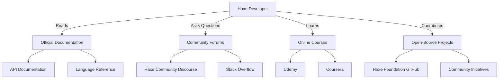

## 22.5 Online Resources and Community Links

In the ever-evolving world of software development, staying connected with the right resources and communities is crucial for mastering any technology. For Haxe developers, this means having access to comprehensive documentation, engaging with vibrant communities, and continuously learning through various platforms. This section provides a detailed guide to the most valuable online resources and community links that can help you excel in Haxe design patterns and cross-platform development.

### Official Documentation

The official documentation is the cornerstone for understanding any programming language, and Haxe is no exception. It offers a wealth of information ranging from language syntax to advanced features like macros and cross-platform capabilities.

#### Haxe Language Reference

The [Haxe Language Reference](https://haxe.org/manual/introduction.html) is your go-to resource for understanding the core syntax and semantics of the Haxe language. It covers everything from basic data types to complex constructs like generics and abstract types.

#### API Documentation

The [Haxe API Documentation](https://api.haxe.org/) provides detailed information about the standard library and core APIs. This is essential for understanding how to leverage built-in functions and classes to build robust applications.

#### Official Tutorials

The [Haxe Tutorials](https://haxe.org/documentation/introduction.html) section offers a series of step-by-step guides designed to help you get started with Haxe. These tutorials cover a wide range of topics, from setting up your development environment to building cross-platform applications.

### Community Forums and Groups

Engaging with the community is an excellent way to learn from others, share your knowledge, and stay updated with the latest trends and best practices in Haxe development.

#### Haxe Community Discourse

The [Haxe Community Discourse](https://community.haxe.org/) is a vibrant forum where developers discuss various topics related to Haxe. It's a great place to ask questions, share your projects, and connect with other Haxe enthusiasts.

#### Stack Overflow

The [Haxe tag on Stack Overflow](https://stackoverflow.com/questions/tagged/haxe) is another valuable resource for getting help with specific coding issues. Here, you can find a wealth of questions and answers from experienced developers.

#### Social Media Groups

Platforms like [Twitter](https://twitter.com/haxe) and [Reddit](https://www.reddit.com/r/haxe/) host active communities where you can follow the latest news, updates, and discussions about Haxe. These platforms are also great for networking with other developers.

### Learning Platforms

Continuous learning is key to mastering Haxe design patterns. Several online platforms offer courses, webinars, and video tutorials to help you deepen your understanding of Haxe.

#### Online Courses

Platforms like [Udemy](https://www.udemy.com/) and [Coursera](https://www.coursera.org/) offer courses on Haxe and related technologies. These courses often cover both beginner and advanced topics, making them suitable for developers at any level.

#### Webinars and Workshops

Keep an eye out for webinars and workshops hosted by the Haxe Foundation and other organizations. These events provide opportunities to learn from experts and gain insights into the latest developments in Haxe.

#### Video Tutorials

YouTube channels like [HaxeFlixel](https://www.youtube.com/user/HaxeFlixel) offer a variety of video tutorials that cover different aspects of Haxe development. These videos are a great way to see Haxe in action and learn new techniques.

### Contribution Opportunities

Contributing to open-source projects is a fantastic way to improve your skills, collaborate with other developers, and give back to the community.

#### Open-Source Projects

The [Haxe Foundation GitHub](https://github.com/HaxeFoundation) hosts a variety of open-source projects that welcome contributions. Whether you're interested in improving the Haxe compiler or working on libraries, there's a project for you.

#### Community Initiatives

Participate in community initiatives like [Hacktoberfest](https://hacktoberfest.digitalocean.com/) to contribute to Haxe projects and earn recognition for your efforts. These events are a great way to get involved and make a difference.

#### Collaboration Platforms

Platforms like [GitHub](https://github.com/) and [GitLab](https://gitlab.com/) are essential for collaborating on Haxe projects. They provide tools for version control, issue tracking, and code review, making it easier to work with others.

### Try It Yourself

To make the most of these resources, try experimenting with the following:

- **Explore the Haxe Language Reference**: Pick a topic you're unfamiliar with and implement a small project using the concepts you learn.
- **Engage with the Community**: Join a discussion on the Haxe Community Discourse or answer a question on Stack Overflow.
- **Take an Online Course**: Enroll in a Haxe course on Udemy or Coursera and complete the exercises.
- **Contribute to an Open-Source Project**: Find a project on the Haxe Foundation GitHub and submit a pull request.

### Visualizing Community Engagement

To better understand how these resources and communities interact, let's visualize the ecosystem using a Mermaid.js diagram.

**Diagram Description:** This diagram illustrates the interactions between a Haxe developer and various resources. It shows how developers read official documentation, engage with community forums, learn through online courses, and contribute to open-source projects.

### Knowledge Check

To reinforce your understanding of these resources, consider the following questions:

- How can you use the Haxe Language Reference to improve your coding skills?
- What are the benefits of participating in community forums like the Haxe Community Discourse?
- How can online courses help you master Haxe design patterns?
- What are some ways to contribute to open-source projects in the Haxe ecosystem?

### Embrace the Journey

Remember, mastering Haxe design patterns is a journey, not a destination. By leveraging these resources and engaging with the community, you'll continuously improve your skills and stay at the forefront of cross-platform development. Keep exploring, stay curious, and enjoy the journey!

## Quiz Time!



### Which resource provides detailed information about Haxe's standard library and core APIs?

- [ ] Haxe Language Reference
- [x] Haxe API Documentation
- [ ] Haxe Tutorials
- [ ] Haxe Community Discourse

> **Explanation:** The Haxe API Documentation provides detailed information about the standard library and core APIs.

### Where can you find step-by-step guides to get started with Haxe?

- [ ] Haxe API Documentation
- [x] Haxe Tutorials
- [ ] Stack Overflow
- [ ] GitHub

> **Explanation:** The Haxe Tutorials section offers step-by-step guides to help you get started with Haxe.

### Which platform hosts a vibrant forum for discussing Haxe-related topics?

- [ ] Reddit
- [ ] Twitter
- [x] Haxe Community Discourse
- [ ] Coursera

> **Explanation:** The Haxe Community Discourse is a vibrant forum for discussing Haxe-related topics.

### What is a benefit of participating in community initiatives like Hacktoberfest?

- [ ] Earning money
- [x] Contributing to open-source projects
- [ ] Learning a new language
- [ ] Attending conferences

> **Explanation:** Participating in community initiatives like Hacktoberfest allows you to contribute to open-source projects.

### Which platform is NOT mentioned as a place to find online courses on Haxe?

- [ ] Udemy
- [ ] Coursera
- [x] LinkedIn Learning
- [ ] YouTube

> **Explanation:** LinkedIn Learning is not mentioned as a platform for finding online courses on Haxe.

### What is the primary purpose of the Haxe Language Reference?

- [x] Understanding core syntax and semantics
- [ ] Providing API documentation
- [ ] Offering video tutorials
- [ ] Hosting community discussions

> **Explanation:** The Haxe Language Reference is used for understanding the core syntax and semantics of the Haxe language.

### Which social media platform is mentioned for following Haxe news and updates?

- [x] Twitter
- [ ] Facebook
- [ ] Instagram
- [ ] LinkedIn

> **Explanation:** Twitter is mentioned as a platform for following Haxe news and updates.

### What is the main advantage of using GitHub for Haxe projects?

- [ ] Free hosting
- [x] Collaboration tools
- [ ] Code obfuscation
- [ ] Language translation

> **Explanation:** GitHub provides collaboration tools essential for working on Haxe projects.

### Which resource is best for getting help with specific coding issues in Haxe?

- [ ] Haxe Tutorials
- [ ] Haxe API Documentation
- [x] Stack Overflow
- [ ] Haxe Foundation GitHub

> **Explanation:** Stack Overflow is a valuable resource for getting help with specific coding issues in Haxe.

### True or False: The Haxe Foundation GitHub hosts a variety of open-source projects that welcome contributions.

- [x] True
- [ ] False

> **Explanation:** The Haxe Foundation GitHub does host a variety of open-source projects that welcome contributions.


