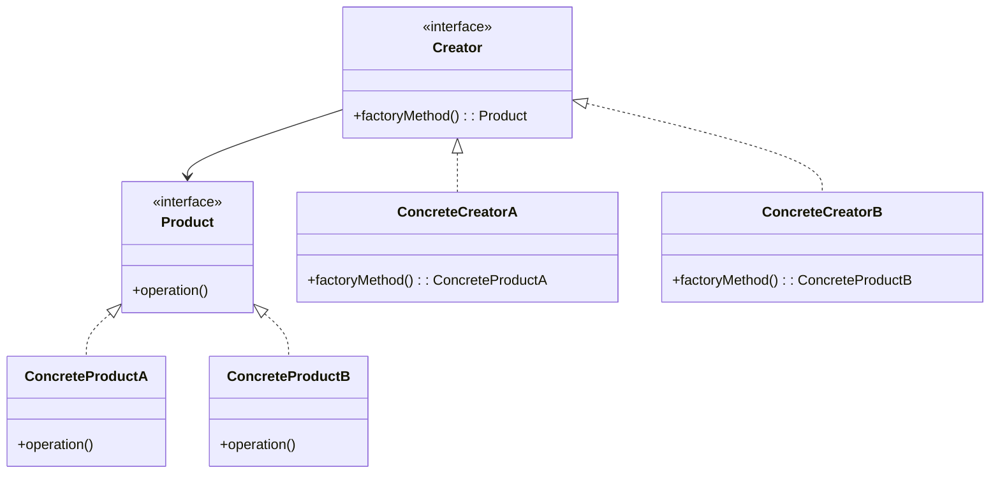

## 22.6 Frequently Asked Questions (FAQ)

Welcome to the Frequently Asked Questions (FAQ) section of "Mastering Haxe Design Patterns: The Ultimate Guide for Expert Cross-Platform Software Engineers and Architects." This section is designed to address common inquiries, provide clarifications on complex topics, and offer troubleshooting tips for challenges you might encounter while implementing design patterns in Haxe. Whether you're an experienced developer or new to Haxe, this FAQ aims to enhance your understanding and application of design patterns in cross-platform development.

### Common Inquiries

#### What are the key benefits of using design patterns in Haxe?

Design patterns provide a proven solution to common software design problems, promoting code reuse and maintainability. In Haxe, they leverage the language's cross-platform capabilities, allowing you to write code that can be compiled to multiple targets such as JavaScript, C++, and Python. This ensures consistency and efficiency across different platforms.

#### How do Haxe's unique features enhance design pattern implementation?

Haxe's powerful macro system, static typing, and multi-paradigm support enhance design pattern implementation by allowing for compile-time code generation, type safety, and flexibility in choosing programming paradigms. These features enable developers to write more robust and efficient code.

#### Can you explain the difference between the Factory Method and Abstract Factory patterns in Haxe?

The Factory Method pattern defines an interface for creating an object but lets subclasses alter the type of objects that will be created. In contrast, the Abstract Factory pattern provides an interface for creating families of related or dependent objects without specifying their concrete classes. In Haxe, both patterns can be implemented using interfaces and classes, but the Abstract Factory pattern often involves creating a set of factory methods.

### Clarifications

#### How does Haxe's static typing influence the implementation of the Singleton pattern?

Haxe's static typing ensures that the Singleton pattern is implemented with type safety. You can define a private static variable to hold the single instance and a public static method to provide access to it. This ensures that only one instance of the class is created and accessed throughout the application.

```haxe
class Singleton {
    private static var instance:Singleton;

    private function new() {
        // Private constructor to prevent instantiation
    }

    public static function getInstance():Singleton {
        if (instance == null) {
            instance = new Singleton();
        }
        return instance;
    }
}
```

#### What are some common pitfalls when using the Observer pattern in Haxe?

One common pitfall is not properly managing the list of observers, which can lead to memory leaks if observers are not removed when they are no longer needed. Another issue is not handling exceptions within observer methods, which can disrupt the notification process. It's crucial to implement robust error handling and ensure observers are correctly added and removed.

### Troubleshooting Tips

#### How can I resolve issues with cross-platform compatibility in Haxe?

To resolve cross-platform compatibility issues, use Haxe's conditional compilation feature to include platform-specific code. This allows you to write code that adapts to different target platforms. Additionally, thoroughly test your application on all target platforms to identify and address any discrepancies.

```haxe
#if js
    // JavaScript-specific code
#elseif cpp
    // C++-specific code
#end
```

#### What should I do if I encounter performance issues with design patterns in Haxe?

If you encounter performance issues, consider optimizing your code by using Haxe's macro system for compile-time optimizations. Additionally, profile your application to identify bottlenecks and refactor your code to improve efficiency. Use caching and memoization strategies to reduce redundant computations.

### Visualizing Design Patterns

To better understand the relationships and interactions between different design patterns, let's visualize the Factory Method and Abstract Factory patterns using Mermaid.js diagrams.



**Diagram Description:** This class diagram illustrates the Factory Method pattern, showing the relationship between the `Creator` interface and its concrete implementations, as well as the `Product` interface and its concrete products.

### References and Links

For further reading on design patterns and Haxe, consider exploring the following resources:

- [Haxe Manual](https://haxe.org/manual/)
- [Design Patterns: Elements of Reusable Object-Oriented Software](https://en.wikipedia.org/wiki/Design_Patterns)
- [MDN Web Docs on Design Patterns](https://developer.mozilla.org/en-US/docs/Web/JavaScript/Guide/Design_Patterns)

### Knowledge Check

Let's reinforce your understanding with a few questions:

- What are the advantages of using design patterns in Haxe?
- How does Haxe's macro system enhance design pattern implementation?
- What is the primary difference between the Factory Method and Abstract Factory patterns?

### Embrace the Journey

Remember, mastering design patterns in Haxe is a journey. As you continue to explore and implement these patterns, you'll gain deeper insights and develop more efficient and maintainable code. Stay curious, keep experimenting, and enjoy the process!

## Quiz Time!



### What is a key benefit of using design patterns in Haxe?

- [x] Promotes code reuse and maintainability
- [ ] Increases code complexity
- [ ] Limits cross-platform capabilities
- [ ] Reduces code readability

> **Explanation:** Design patterns promote code reuse and maintainability by providing proven solutions to common design problems.

### How does Haxe's static typing influence the Singleton pattern?

- [x] Ensures type safety
- [ ] Increases memory usage
- [ ] Limits cross-platform capabilities
- [ ] Reduces code readability

> **Explanation:** Haxe's static typing ensures type safety by allowing only one instance of the Singleton class to be created and accessed.

### What is a common pitfall when using the Observer pattern in Haxe?

- [x] Memory leaks due to unmanaged observers
- [ ] Increased code complexity
- [ ] Reduced cross-platform capabilities
- [ ] Decreased performance

> **Explanation:** A common pitfall is memory leaks due to unmanaged observers, which can occur if observers are not removed when no longer needed.

### How can you resolve cross-platform compatibility issues in Haxe?

- [x] Use conditional compilation
- [ ] Increase code complexity
- [ ] Limit target platforms
- [ ] Reduce code readability

> **Explanation:** Conditional compilation allows you to write platform-specific code, resolving cross-platform compatibility issues.

### What should you do if you encounter performance issues with design patterns in Haxe?

- [x] Optimize code using macros
- [ ] Increase code complexity
- [ ] Limit target platforms
- [ ] Reduce code readability

> **Explanation:** Using Haxe's macro system for compile-time optimizations can help resolve performance issues.

### What is the primary difference between the Factory Method and Abstract Factory patterns?

- [x] Factory Method creates a single object; Abstract Factory creates families of objects
- [ ] Factory Method is more complex
- [ ] Abstract Factory is less flexible
- [ ] Factory Method is less efficient

> **Explanation:** The Factory Method pattern creates a single object, while the Abstract Factory pattern creates families of related or dependent objects.

### How can Haxe's macro system enhance design pattern implementation?

- [x] Allows compile-time code generation
- [ ] Increases memory usage
- [ ] Limits cross-platform capabilities
- [ ] Reduces code readability

> **Explanation:** Haxe's macro system allows for compile-time code generation, enhancing design pattern implementation.

### What is a benefit of using Haxe's multi-paradigm support in design patterns?

- [x] Flexibility in choosing programming paradigms
- [ ] Increased code complexity
- [ ] Limited cross-platform capabilities
- [ ] Reduced code readability

> **Explanation:** Haxe's multi-paradigm support provides flexibility in choosing programming paradigms, enhancing design pattern implementation.

### How does Haxe's macro system improve performance?

- [x] Enables compile-time optimizations
- [ ] Increases memory usage
- [ ] Limits cross-platform capabilities
- [ ] Reduces code readability

> **Explanation:** Haxe's macro system enables compile-time optimizations, improving performance.

### True or False: Haxe's static typing reduces code readability.

- [ ] True
- [x] False

> **Explanation:** Haxe's static typing enhances code readability by ensuring type safety and reducing errors.



Remember, this is just the beginning. As you progress, you'll build more complex and interactive applications using Haxe design patterns. Keep experimenting, stay curious, and enjoy the journey!
