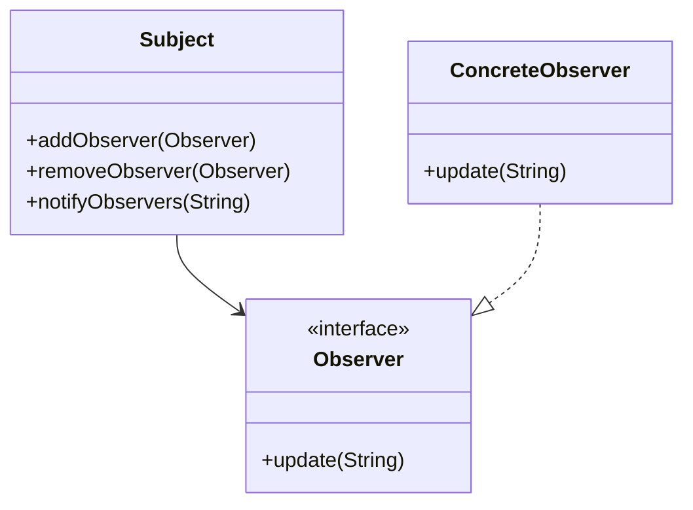

## 22.7 Sample Projects and Code Repositories

In this section, we delve into practical applications of design patterns in Haxe through a curated selection of sample projects and code repositories. These resources are designed to provide hands-on experience, allowing you to explore, run, and modify the code to deepen your understanding of Haxe's cross-platform capabilities. By engaging with these examples, you'll gain insights into how design patterns can be effectively implemented in real-world scenarios, enhancing your skills as a software engineer or architect.

### Practical Examples

**Practical Examples** are essential for bridging the gap between theoretical knowledge and real-world application. By examining and interacting with sample projects, you can see how design patterns are applied in various contexts, providing a clearer understanding of their utility and versatility.

#### Project 1: Haxe Singleton Pattern

**Overview:** This project demonstrates the Singleton pattern, ensuring a class has only one instance and providing a global point of access to it. This pattern is particularly useful in scenarios where a single object is needed to coordinate actions across the system.

**Repository Link:** [Haxe Singleton Pattern Example](https://github.com/example/haxe-singleton-pattern)

**Key Features:**
- Implementation of a Singleton class in Haxe.
- Demonstrates thread safety and lazy initialization.
- Includes unit tests to verify the Singleton behavior.

**Code Snippet:**

```haxe
class Singleton {
    private static var instance:Singleton;
    
    private function new() {
        // Private constructor to prevent instantiation
    }
    
    public static function getInstance():Singleton {
        if (instance == null) {
            instance = new Singleton();
        }
        return instance;
    }
    
    public function showMessage():Void {
        trace("Hello from Singleton!");
    }
}

// Usage
class Main {
    static function main() {
        var singleton = Singleton.getInstance();
        singleton.showMessage();
    }
}
```

**Try It Yourself:** Modify the `showMessage` function to display a different message or add additional methods to the Singleton class to explore its capabilities.

#### Project 2: Haxe Factory Method Pattern

**Overview:** This project illustrates the Factory Method pattern, which defines an interface for creating an object but lets subclasses alter the type of objects that will be created. This pattern is useful for creating objects in a way that is decoupled from the specific classes that implement them.

**Repository Link:** [Haxe Factory Method Pattern Example](https://github.com/example/haxe-factory-method-pattern)

**Key Features:**
- Demonstrates the use of interfaces and inheritance in Haxe.
- Provides examples of different product implementations.
- Includes a client code that interacts with the factory.

**Code Snippet:**

```haxe
interface Product {
    function use():Void;
}

class ConcreteProductA implements Product {
    public function new() {}
    public function use():Void {
        trace("Using Product A");
    }
}

class ConcreteProductB implements Product {
    public function new() {}
    public function use():Void {
        trace("Using Product B");
    }
}

class Creator {
    public function createProduct(type:String):Product {
        switch (type) {
            case "A": return new ConcreteProductA();
            case "B": return new ConcreteProductB();
            default: throw "Unknown product type";
        }
    }
}

// Usage
class Main {
    static function main() {
        var creator = new Creator();
        var product = creator.createProduct("A");
        product.use();
    }
}
```

**Try It Yourself:** Extend the project by adding a new product type and modifying the `Creator` class to support it.

### Learning by Doing

**Learning by Doing** is a powerful approach to mastering design patterns in Haxe. By actively engaging with code, you can experiment with different implementations, observe the effects of changes, and develop a deeper understanding of the underlying principles.

#### Project 3: Haxe Observer Pattern

**Overview:** This project showcases the Observer pattern, which defines a one-to-many dependency between objects so that when one object changes state, all its dependents are notified and updated automatically. This pattern is commonly used in event-driven systems.

**Repository Link:** [Haxe Observer Pattern Example](https://github.com/example/haxe-observer-pattern)

**Key Features:**
- Implements a simple event system using the Observer pattern.
- Demonstrates how observers can subscribe and unsubscribe to events.
- Includes a test suite to validate the observer notifications.

**Code Snippet:**

```haxe
interface Observer {
    function update(data:String):Void;
}

class ConcreteObserver implements Observer {
    public function new() {}
    public function update(data:String):Void {
        trace("Observer received update: " + data);
    }
}

class Subject {
    private var observers:Array<Observer> = [];
    
    public function new() {}
    
    public function addObserver(observer:Observer):Void {
        observers.push(observer);
    }
    
    public function removeObserver(observer:Observer):Void {
        observers.remove(observer);
    }
    
    public function notifyObservers(data:String):Void {
        for (observer in observers) {
            observer.update(data);
        }
    }
}

// Usage
class Main {
    static function main() {
        var subject = new Subject();
        var observer = new ConcreteObserver();
        
        subject.addObserver(observer);
        subject.notifyObservers("Hello Observers!");
    }
}
```

**Try It Yourself:** Implement additional observers and test how the system handles multiple notifications.

### Git Repositories

**Git Repositories** serve as a valuable resource for accessing and managing code samples. By exploring these repositories, you can gain insights into the structure and organization of Haxe projects, as well as collaborate with others in the community.

#### Repository Organization

To facilitate ease of use, the repositories are organized per chapter or pattern. This structure allows you to quickly locate the examples relevant to the specific design patterns you are studying.

**Example Repository Structure:**

```
haxe-design-patterns/
├── creational/
│   ├── singleton/
│   ├── factory-method/
│   └── builder/
├── structural/
│   ├── adapter/
│   ├── bridge/
│   └── composite/
└── behavioral/
    ├── observer/
    ├── strategy/
    └── command/
```

**Accessing Repositories:** You can access the repositories through the following links:

- [Creational Patterns Repository](https://github.com/example/haxe-creational-patterns)
- [Structural Patterns Repository](https://github.com/example/haxe-structural-patterns)
- [Behavioral Patterns Repository](https://github.com/example/haxe-behavioral-patterns)

### Visualizing Design Patterns

To enhance understanding, we use **Mermaid.js diagrams** to visualize the relationships and interactions within design patterns. These diagrams provide a clear representation of complex concepts, making it easier to grasp the intricacies of each pattern.

#### Example: Observer Pattern Diagram



**Diagram Description:** The diagram illustrates the Observer pattern, showing the relationship between the `Subject`, `Observer`, and `ConcreteObserver` classes. The `Subject` maintains a list of observers and notifies them of any state changes.

### References and Links

For further reading and exploration, consider the following resources:

- [Haxe Manual](https://haxe.org/manual/)
- [Design Patterns: Elements of Reusable Object-Oriented Software](https://en.wikipedia.org/wiki/Design_Patterns)
- [GitHub Haxe Projects](https://github.com/search?q=haxe)

### Knowledge Check

To reinforce your understanding, consider the following questions and challenges:

1. How does the Singleton pattern ensure only one instance of a class is created?
2. What are the benefits of using the Factory Method pattern in Haxe?
3. How can the Observer pattern be applied in a real-world application?
4. Modify the Observer pattern example to include a new type of observer.
5. Explore the Git repositories and identify a pattern you haven't used before. Implement it in a small project.

### Embrace the Journey

Remember, this is just the beginning. As you progress through these examples and repositories, you'll build more complex and interactive applications. Keep experimenting, stay curious, and enjoy the journey!

## Quiz Time!



### What is the primary purpose of the Singleton pattern?

- [x] To ensure a class has only one instance and provide a global point of access to it.
- [ ] To create multiple instances of a class.
- [ ] To define a family of algorithms.
- [ ] To separate the construction of a complex object from its representation.

> **Explanation:** The Singleton pattern ensures a class has only one instance and provides a global point of access to it, making it useful for managing shared resources or configurations.

### Which pattern defines an interface for creating an object but lets subclasses alter the type of objects that will be created?

- [ ] Singleton
- [x] Factory Method
- [ ] Observer
- [ ] Strategy

> **Explanation:** The Factory Method pattern defines an interface for creating an object but lets subclasses alter the type of objects that will be created, promoting flexibility and reusability.

### In the Observer pattern, what role does the Subject class play?

- [x] It maintains a list of observers and notifies them of any state changes.
- [ ] It acts as an observer that receives updates.
- [ ] It defines the interface for observers.
- [ ] It creates new observers.

> **Explanation:** The Subject class in the Observer pattern maintains a list of observers and notifies them of any state changes, facilitating communication between objects.

### What is a key benefit of using Git repositories for sample projects?

- [x] They allow for version control and collaboration.
- [ ] They make code execution faster.
- [ ] They automatically optimize code.
- [ ] They provide built-in testing frameworks.

> **Explanation:** Git repositories allow for version control and collaboration, making it easier to manage and share code across teams and projects.

### How can you modify the Singleton pattern example to include a new method?

- [x] Add the method to the Singleton class and call it through the getInstance method.
- [ ] Create a new instance of the Singleton class.
- [ ] Modify the main function to include the method.
- [ ] Add the method to the Main class.

> **Explanation:** To include a new method in the Singleton pattern example, add the method to the Singleton class and call it through the `getInstance` method to ensure it is accessed through the single instance.

### What is the main advantage of using design patterns in software development?

- [x] They provide proven solutions to common problems.
- [ ] They increase the complexity of the code.
- [ ] They make code execution slower.
- [ ] They eliminate the need for testing.

> **Explanation:** Design patterns provide proven solutions to common problems, promoting code reusability, maintainability, and scalability.

### Which of the following is a structural design pattern?

- [ ] Singleton
- [ ] Observer
- [x] Adapter
- [ ] Strategy

> **Explanation:** The Adapter pattern is a structural design pattern that allows incompatible interfaces to work together, facilitating integration and interoperability.

### What is the purpose of using Mermaid.js diagrams in the guide?

- [x] To visually represent relationships and interactions within design patterns.
- [ ] To execute code examples.
- [ ] To replace code comments.
- [ ] To generate random code snippets.

> **Explanation:** Mermaid.js diagrams are used to visually represent relationships and interactions within design patterns, enhancing understanding and clarity.

### How does the Factory Method pattern promote flexibility in object creation?

- [x] By allowing subclasses to alter the type of objects that will be created.
- [ ] By creating multiple instances of the same object.
- [ ] By defining a single algorithm for object creation.
- [ ] By eliminating the need for constructors.

> **Explanation:** The Factory Method pattern promotes flexibility by allowing subclasses to alter the type of objects that will be created, enabling customization and extension.

### True or False: The Observer pattern is commonly used in event-driven systems.

- [x] True
- [ ] False

> **Explanation:** True. The Observer pattern is commonly used in event-driven systems to facilitate communication between objects and ensure that changes in one object are reflected in others.


