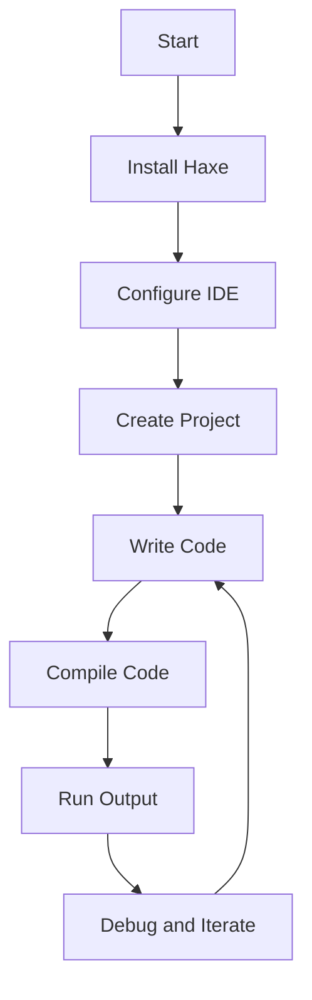

## 22.8 Development Environment Setup Guides

Welcome to the comprehensive guide on setting up your Haxe development environment. This guide is designed to help you configure your system for Haxe development across various platforms, ensuring you have the tools and knowledge to create cross-platform applications efficiently. Whether you're a seasoned developer or new to Haxe, this guide will walk you through the essential steps to get started.

### Getting Started: Setting Up Haxe on Various Operating Systems

#### Windows

1. **Install Haxe:**
   - Visit the [Haxe Downloads Page](https://haxe.org/download/) and download the Windows installer.
   - Run the installer and follow the on-screen instructions to complete the installation.
   - Verify the installation by opening a command prompt and typing `haxe -version`. You should see the installed version number.

2. **Install Haxelib:**
   - Haxelib is the package manager for Haxe. It is included with the Haxe installation.
   - To verify, type `haxelib version` in the command prompt.

3. **Set Environment Variables:**
   - Ensure that the Haxe and Haxelib paths are added to your system's PATH environment variable. This allows you to run Haxe commands from any command prompt.

#### macOS

1. **Install Homebrew:**
   - Open Terminal and install Homebrew by running:
     ```bash
     /bin/bash -c "$(curl -fsSL https://raw.githubusercontent.com/Homebrew/install/HEAD/install.sh)"
     ```

2. **Install Haxe:**
   - Use Homebrew to install Haxe:
     ```bash
     brew install haxe
     ```
   - Verify the installation with `haxe -version`.

3. **Install Haxelib:**
   - Haxelib is installed alongside Haxe. Verify with `haxelib version`.

#### Linux

1. **Add Haxe Repository:**
   - For Ubuntu/Debian-based systems, add the Haxe repository:
     ```bash
     sudo add-apt-repository ppa:haxe/releases
     sudo apt-get update
     ```

2. **Install Haxe:**
   - Install Haxe using the package manager:
     ```bash
     sudo apt-get install haxe
     ```
   - Verify with `haxe -version`.

3. **Install Haxelib:**
   - Haxelib is included with Haxe. Verify with `haxelib version`.

### IDE and Editor Configuration

#### Visual Studio Code

1. **Install Visual Studio Code:**
   - Download and install Visual Studio Code from [here](https://code.visualstudio.com/).

2. **Install Haxe Extension:**
   - Open Visual Studio Code and go to the Extensions view (`Ctrl+Shift+X`).
   - Search for "Haxe" and install the Haxe extension by Haxe Foundation.

3. **Configure Haxe:**
   - Create a `settings.json` file in your project’s `.vscode` directory.
   - Add the following configuration:
     ```json
     {
       "haxe.executable": "haxe",
       "haxe.displayConfigurations": [
         {
           "name": "default",
           "buildFile": "build.hxml"
         }
       ]
     }
     ```

#### IntelliJ IDEA

1. **Install IntelliJ IDEA:**
   - Download and install IntelliJ IDEA from [here](https://www.jetbrains.com/idea/).

2. **Install Haxe Plugin:**
   - Open IntelliJ IDEA and go to `File > Settings > Plugins`.
   - Search for "Haxe" and install the plugin.

3. **Configure Haxe SDK:**
   - Go to `File > Project Structure > SDKs`.
   - Click `+` and select `Haxe SDK`.
   - Set the path to your Haxe installation directory.

#### FlashDevelop

1. **Install FlashDevelop:**
   - Download and install FlashDevelop from [here](https://www.flashdevelop.org/).

2. **Configure Haxe:**
   - Open FlashDevelop and go to `Tools > Program Settings`.
   - Under `HaxeContext`, set the `Haxe Path` to your Haxe installation directory.

### Toolchain Installation

#### Compilers and Build Tools

1. **Haxe Compiler:**
   - The Haxe compiler is included with the Haxe installation. It compiles Haxe code into target languages like JavaScript, C++, and more.

2. **Neko VM:**
   - Neko is a lightweight virtual machine that allows you to run Haxe code. It is included with the Haxe installation.

3. **Additional Compilers:**
   - Depending on your target platform, you may need additional compilers (e.g., GCC for C++, JDK for Java).

#### Package Managers

1. **Haxelib:**
   - Haxelib is the package manager for Haxe libraries. Use it to install and manage Haxe libraries.
   - Example command to install a library:
     ```bash
     haxelib install openfl
     ```

2. **NPM (Node Package Manager):**
   - For JavaScript projects, you may need NPM to manage JavaScript dependencies.
   - Install NPM from [here](https://nodejs.org/).

### Try It Yourself

Now that your development environment is set up, let's create a simple Haxe project to test everything.

1. **Create a New Project:**
   - Create a new directory for your project and navigate into it:
     ```bash
     mkdir MyHaxeProject
     cd MyHaxeProject
     ```

2. **Create a Haxe File:**
   - Create a file named `Main.hx` with the following content:
     ```haxe
     class Main {
         static public function main() {
             trace("Hello, Haxe!");
         }
     }
     ```

3. **Create a Build File:**
   - Create a file named `build.hxml` with the following content:
     ```hxml
     -main Main
     -js out.js
     ```

4. **Compile the Project:**
   - Run the following command to compile your project:
     ```bash
     haxe build.hxml
     ```

5. **Run the Output:**
   - Open the generated `out.js` file in a browser or use Node.js to run it:
     ```bash
     node out.js
     ```

### Visualizing the Haxe Development Workflow



**Figure 1:** Visualizing the Haxe Development Workflow

### References and Links

- [Haxe Official Website](https://haxe.org/)
- [Visual Studio Code](https://code.visualstudio.com/)
- [IntelliJ IDEA](https://www.jetbrains.com/idea/)
- [FlashDevelop](https://www.flashdevelop.org/)
- [Homebrew](https://brew.sh/)
- [Node.js](https://nodejs.org/)

### Knowledge Check

- What are the steps to verify the Haxe installation on your system?
- How do you configure Visual Studio Code for Haxe development?
- What is the purpose of the `build.hxml` file in a Haxe project?

### Embrace the Journey

Remember, setting up your development environment is just the beginning. As you progress, you'll explore more complex projects and leverage Haxe's cross-platform capabilities. Keep experimenting, stay curious, and enjoy the journey!

## Quiz Time!



### What is the first step in setting up a Haxe development environment on Windows?

- [x] Install Haxe
- [ ] Install Visual Studio Code
- [ ] Configure Haxelib
- [ ] Set Environment Variables

> **Explanation:** The first step is to install Haxe, which is the core component needed for development.

### Which package manager is used for managing Haxe libraries?

- [ ] NPM
- [x] Haxelib
- [ ] Homebrew
- [ ] Apt-get

> **Explanation:** Haxelib is the package manager specifically designed for managing Haxe libraries.

### How do you verify the Haxe installation on macOS?

- [ ] By running `brew install haxe`
- [x] By running `haxe -version`
- [ ] By checking the Haxe website
- [ ] By opening Visual Studio Code

> **Explanation:** Running `haxe -version` in the terminal will display the installed version of Haxe, confirming the installation.

### What file extension is used for Haxe source files?

- [ ] .hx
- [x] .hxml
- [ ] .haxe
- [ ] .js

> **Explanation:** Haxe source files use the `.hx` extension.

### Which IDE requires a plugin installation for Haxe development?

- [ ] Visual Studio Code
- [x] IntelliJ IDEA
- [ ] FlashDevelop
- [ ] Sublime Text

> **Explanation:** IntelliJ IDEA requires a plugin installation to support Haxe development.

### What command is used to compile a Haxe project?

- [ ] `haxe run`
- [x] `haxe build.hxml`
- [ ] `haxe compile`
- [ ] `haxe execute`

> **Explanation:** The command `haxe build.hxml` is used to compile a Haxe project using the specified build file.

### What is the purpose of the `build.hxml` file?

- [ ] To store project dependencies
- [x] To define the build configuration
- [ ] To manage Haxe libraries
- [ ] To execute Haxe scripts

> **Explanation:** The `build.hxml` file defines the build configuration, including the main class and target output.

### Which tool is used for managing JavaScript dependencies in Haxe projects?

- [x] NPM
- [ ] Haxelib
- [ ] Homebrew
- [ ] Apt-get

> **Explanation:** NPM (Node Package Manager) is used for managing JavaScript dependencies.

### What is the role of the Neko VM in Haxe development?

- [ ] To compile Haxe code
- [x] To run Haxe code
- [ ] To manage Haxe libraries
- [ ] To configure IDEs

> **Explanation:** Neko VM is a lightweight virtual machine that allows you to run Haxe code.

### True or False: FlashDevelop is available for macOS.

- [ ] True
- [x] False

> **Explanation:** FlashDevelop is a Windows-only IDE and is not available for macOS.


