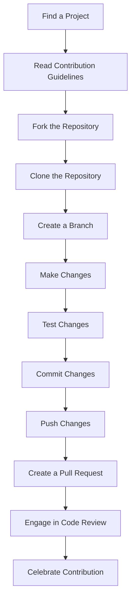

## 22.9 Contributing to Haxe Open Source Projects

Contributing to open source projects is a rewarding way to enhance your skills, collaborate with other developers, and give back to the community. In this section, we will explore how to effectively contribute to Haxe open source projects. We'll cover how to find projects in need of contributions, the general process for contributing, tips on using Git effectively, and how to engage with the Haxe community.

### Contribution Guidelines

#### Finding Projects in Need of Contributions

To begin contributing to Haxe open source projects, you first need to find projects that align with your interests and expertise. Here are some strategies to help you discover suitable projects:

1. **Explore GitHub and GitLab**: These platforms host numerous Haxe projects. Use search filters to find projects by language, stars, forks, or recent activity. Look for repositories with labels like "good first issue" or "help wanted."

2. **Visit HaxeLib**: HaxeLib is the official package manager for Haxe, and it lists a variety of libraries and tools. Browse through the available packages to find projects that interest you.

3. **Join Haxe Forums and Communities**: Engage with the Haxe community through forums, Discord channels, and mailing lists. Community members often share projects in need of contributors.

4. **Follow Haxe Developers on Social Media**: Many developers share their projects and call for contributions on platforms like Twitter and LinkedIn.

5. **Attend Haxe Conferences and Meetups**: These events are excellent opportunities to network with other developers and learn about ongoing projects.

#### General Process for Contributing

Once you've identified a project you'd like to contribute to, follow these steps to ensure a smooth contribution process:

1. **Read the Contribution Guidelines**: Most projects have a `CONTRIBUTING.md` file that outlines how to contribute. This document may include coding standards, branch naming conventions, and testing requirements.

2. **Fork the Repository**: Create a personal copy of the repository on your GitHub or GitLab account. This allows you to make changes without affecting the original project.

3. **Clone the Repository**: Use Git to clone the forked repository to your local machine.

   ```bash
   git clone https://github.com/your-username/project-name.git
   ```

4. **Create a Branch**: Create a new branch for your changes. Use descriptive names that reflect the purpose of the branch.

   ```bash
   git checkout -b feature/your-feature-name
   ```

5. **Make Changes**: Implement your changes, ensuring they adhere to the project's coding standards. Include comments and documentation as needed.

6. **Test Your Changes**: Run tests to verify that your changes work as intended and do not introduce new issues.

7. **Commit Your Changes**: Write clear and concise commit messages that describe the changes made.

   ```bash
   git commit -m "Add feature: description of feature"
   ```

8. **Push Your Changes**: Push your branch to your forked repository.

   ```bash
   git push origin feature/your-feature-name
   ```

9. **Create a Pull Request**: Navigate to the original repository and create a pull request. Provide a detailed description of your changes and any relevant information.

10. **Engage in Code Review**: Be open to feedback from maintainers and other contributors. Make any necessary revisions and update your pull request.

11. **Celebrate Your Contribution**: Once your pull request is merged, take pride in your contribution to the project!

### Git and Version Control

Effective use of Git is crucial when collaborating on open-source projects. Here are some tips to help you use Git efficiently:

#### Understanding Git Basics

- **Repositories**: A repository is a directory or storage space where your project resides. It can be local to your computer or hosted on a platform like GitHub.

- **Commits**: A commit is a snapshot of your repository at a specific point in time. Each commit has a unique identifier and a message describing the changes.

- **Branches**: Branches allow you to work on different features or fixes simultaneously without affecting the main codebase. The `main` or `master` branch is typically the default branch.

- **Merging**: Merging combines changes from different branches. It's essential to resolve any conflicts that arise during this process.

#### Advanced Git Techniques

- **Rebasing**: Rebasing allows you to integrate changes from one branch into another. It creates a linear history, making it easier to understand the project's evolution.

  ```bash
  git checkout feature/your-feature-name
  git rebase main
  ```

- **Squashing Commits**: Squashing combines multiple commits into a single commit. This is useful for cleaning up your commit history before merging.

  ```bash
  git rebase -i HEAD~n
  ```

- **Cherry-Picking**: Cherry-picking allows you to apply a specific commit from one branch to another.

  ```bash
  git cherry-pick commit-hash
  ```

- **Stashing**: Stashing temporarily saves your changes without committing them. This is useful when you need to switch branches without losing your work.

  ```bash
  git stash
  git stash apply
  ```

### Community Participation

Engaging with the Haxe community is an integral part of contributing to open-source projects. Here are some ways to get involved:

#### Participate in Discussions

- **Join Forums and Mailing Lists**: Participate in discussions on Haxe forums and mailing lists. Share your knowledge, ask questions, and learn from others.

- **Engage on Social Media**: Follow Haxe-related accounts on social media platforms. Engage with posts, share your insights, and connect with other developers.

- **Attend Conferences and Meetups**: Attend Haxe conferences and meetups to network with other developers and learn about the latest developments in the Haxe ecosystem.

#### Contribute to Issue Tracking

- **Report Bugs**: If you encounter a bug, report it to the project's issue tracker. Provide detailed information to help maintainers reproduce and fix the issue.

- **Suggest Features**: If you have an idea for a new feature, propose it to the project's maintainers. Be prepared to discuss its potential benefits and implementation.

- **Help Triage Issues**: Assist in triaging issues by verifying bug reports, reproducing issues, and providing additional information.

#### Participate in Code Reviews

- **Review Pull Requests**: Review pull requests submitted by other contributors. Provide constructive feedback and suggest improvements.

- **Learn from Feedback**: Use feedback from code reviews to improve your coding skills and understanding of the project.

### Visualizing the Contribution Process

To better understand the contribution process, let's visualize it using a flowchart:



**Figure 1: Visualizing the Contribution Process**

### Try It Yourself

Now that we've covered the basics of contributing to Haxe open source projects, it's time to put your knowledge into practice. Here are some exercises to help you get started:

1. **Find a Haxe Project**: Use the strategies outlined above to find a Haxe project that interests you. Explore the project's repository and familiarize yourself with its structure.

2. **Create a Simple Contribution**: Identify a small issue or feature request and create a pull request to address it. Follow the contribution process and engage in code review.

3. **Engage with the Community**: Join a Haxe forum or Discord channel and participate in discussions. Share your experiences and learn from others.

4. **Experiment with Git**: Practice using advanced Git techniques like rebasing, squashing commits, and cherry-picking. Experiment with different workflows to find what works best for you.

### References and Links

- [GitHub](https://github.com) - A platform for hosting and collaborating on open-source projects.
- [GitLab](https://gitlab.com) - Another platform for hosting and collaborating on open-source projects.
- [HaxeLib](https://lib.haxe.org) - The official package manager for Haxe.
- [Haxe Forums](https://community.haxe.org) - A place to discuss Haxe-related topics with other developers.
- [Haxe Discord](https://discord.gg/0uEuWH3sC6N2zxgF) - A community chat for Haxe developers.

### Knowledge Check

Before we conclude, let's reinforce what we've learned with some questions and exercises:

- **What are some strategies for finding Haxe projects in need of contributions?**
- **Describe the general process for contributing to an open-source project.**
- **What are some advanced Git techniques that can improve your workflow?**
- **How can you engage with the Haxe community and contribute to issue tracking?**

### Embrace the Journey

Remember, contributing to open-source projects is a journey of continuous learning and growth. As you contribute to Haxe projects, you'll gain valuable experience, improve your skills, and make meaningful connections within the community. Keep experimenting, stay curious, and enjoy the journey!

## Quiz Time!



### What is the first step in contributing to a Haxe open source project?

- [x] Find a project that aligns with your interests and expertise.
- [ ] Create a pull request.
- [ ] Fork the repository.
- [ ] Clone the repository.

> **Explanation:** The first step is to find a project that aligns with your interests and expertise, as this will ensure you are motivated and capable of contributing effectively.

### What file typically outlines how to contribute to a project?

- [x] CONTRIBUTING.md
- [ ] README.md
- [ ] LICENSE
- [ ] CHANGELOG.md

> **Explanation:** The CONTRIBUTING.md file typically outlines the guidelines and process for contributing to a project.

### Which Git command is used to create a personal copy of a repository?

- [x] Fork
- [ ] Clone
- [ ] Commit
- [ ] Merge

> **Explanation:** Forking a repository creates a personal copy of it on your GitHub or GitLab account.

### What is the purpose of creating a new branch for your changes?

- [x] To work on different features or fixes without affecting the main codebase.
- [ ] To delete the main branch.
- [ ] To merge changes into the main branch.
- [ ] To create a backup of the repository.

> **Explanation:** Creating a new branch allows you to work on different features or fixes simultaneously without affecting the main codebase.

### Which Git command is used to combine changes from different branches?

- [x] Merge
- [ ] Commit
- [ ] Rebase
- [ ] Stash

> **Explanation:** Merging combines changes from different branches into a single branch.

### What is the benefit of rebasing in Git?

- [x] It creates a linear history, making it easier to understand the project's evolution.
- [ ] It deletes all branches except the main branch.
- [ ] It creates a backup of the repository.
- [ ] It automatically resolves merge conflicts.

> **Explanation:** Rebasing creates a linear history, which makes it easier to understand the project's evolution and simplifies the commit history.

### How can you temporarily save your changes without committing them in Git?

- [x] Stash
- [ ] Commit
- [ ] Merge
- [ ] Rebase

> **Explanation:** Stashing temporarily saves your changes without committing them, allowing you to switch branches without losing your work.

### What is the role of code reviews in open source contributions?

- [x] To provide feedback and suggest improvements to submitted code.
- [ ] To delete unnecessary code.
- [ ] To automatically merge pull requests.
- [ ] To create new branches for contributors.

> **Explanation:** Code reviews provide feedback and suggest improvements to submitted code, ensuring quality and consistency in the project.

### How can you engage with the Haxe community?

- [x] Join forums, participate in discussions, and attend conferences.
- [ ] Only work on personal projects.
- [ ] Avoid social media and online communities.
- [ ] Focus solely on coding without interaction.

> **Explanation:** Engaging with the Haxe community involves joining forums, participating in discussions, and attending conferences to network and learn from others.

### True or False: Contributing to open source projects is a journey of continuous learning and growth.

- [x] True
- [ ] False

> **Explanation:** Contributing to open source projects is indeed a journey of continuous learning and growth, as it provides opportunities to enhance skills, collaborate with others, and gain valuable experience.


