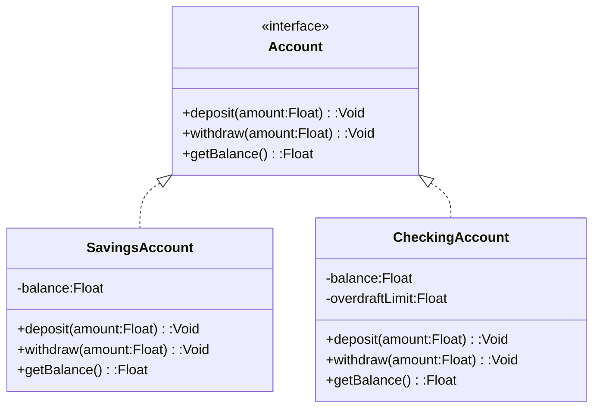

## 3.1 Object-Oriented Programming in Haxe

Object-Oriented Programming (OOP) is a paradigm that has shaped modern software development by organizing code into objects that combine data and behavior. Haxe, with its multi-paradigm capabilities, supports OOP principles, making it a powerful tool for cross-platform development. In this section, we will delve into the core OOP principles—encapsulation, abstraction, and polymorphism—and demonstrate how they can be effectively applied in Haxe.

### Understanding Object-Oriented Programming

Before we dive into Haxe-specific implementations, let's briefly revisit the fundamental concepts of OOP:

- **Encapsulation:** This principle involves bundling the data (attributes) and methods (functions) that operate on the data into a single unit, or class. Encapsulation helps protect the internal state of an object from unintended interference and misuse.

- **Abstraction:** Abstraction focuses on hiding the complex implementation details of a system and exposing only the necessary parts through a simple interface. This allows developers to work with higher-level concepts without worrying about the underlying complexity.

- **Polymorphism:** Polymorphism allows objects of different classes to be treated as objects of a common superclass. It enables a single interface to represent different underlying forms (data types).

### Encapsulation in Haxe

Encapsulation is a cornerstone of OOP, ensuring that an object's internal state is shielded from external modification. In Haxe, encapsulation is achieved through the use of classes and access modifiers.

#### Defining Classes and Access Modifiers

In Haxe, classes are defined using the `class` keyword. Access modifiers such as `public` and `private` control the visibility of class members.

```haxe
class Person {
    private var name:String;
    private var age:Int;

    public function new(name:String, age:Int) {
        this.name = name;
        this.age = age;
    }

    public function getName():String {
        return name;
    }

    public function setName(name:String):Void {
        this.name = name;
    }

    public function getAge():Int {
        return age;
    }

    public function setAge(age:Int):Void {
        if (age > 0) {
            this.age = age;
        }
    }
}
```

In this example, the `Person` class encapsulates the `name` and `age` attributes. The `private` access modifier ensures that these attributes cannot be accessed directly from outside the class. Instead, public methods `getName`, `setName`, `getAge`, and `setAge` are provided to interact with the attributes.

#### Benefits of Encapsulation

- **Data Protection:** By restricting direct access to an object's data, encapsulation protects the integrity of the data.
- **Modularity:** Encapsulation promotes modularity by allowing changes to the internal implementation without affecting external code.
- **Maintainability:** Encapsulated code is easier to maintain and understand, as it provides a clear interface for interaction.

### Abstraction in Haxe

Abstraction in Haxe is achieved through the use of interfaces and abstract classes. These constructs allow developers to define a blueprint for classes without specifying the exact implementation.

#### Using Interfaces

Interfaces in Haxe are defined using the `interface` keyword. They declare methods that implementing classes must define.

```haxe
interface Animal {
    function makeSound():Void;
}

class Dog implements Animal {
    public function new() {}

    public function makeSound():Void {
        trace("Woof!");
    }
}

class Cat implements Animal {
    public function new() {}

    public function makeSound():Void {
        trace("Meow!");
    }
}
```

In this example, the `Animal` interface declares a `makeSound` method. The `Dog` and `Cat` classes implement this interface, providing their own versions of `makeSound`.

#### Abstract Classes

Abstract classes in Haxe are defined using the `abstract` keyword. They can include both implemented and abstract methods.

```haxe
abstract class Vehicle {
    public function startEngine():Void {
        trace("Engine started.");
    }

    public function stopEngine():Void {
        trace("Engine stopped.");
    }

    public abstract function drive():Void;
}

class Car extends Vehicle {
    public function new() {}

    public override function drive():Void {
        trace("Driving a car.");
    }
}
```

Here, `Vehicle` is an abstract class with implemented methods `startEngine` and `stopEngine`, and an abstract method `drive`. The `Car` class extends `Vehicle` and provides an implementation for `drive`.

#### Benefits of Abstraction

- **Simplified Interfaces:** Abstraction allows developers to work with simplified interfaces, focusing on what an object does rather than how it does it.
- **Code Reusability:** By defining common interfaces, abstraction promotes code reusability across different implementations.
- **Flexibility:** Abstraction provides flexibility to change implementations without affecting the code that uses the interface.

### Polymorphism in Haxe

Polymorphism in Haxe allows objects of different classes to be treated as objects of a common superclass. This is achieved through inheritance and interfaces.

#### Inheritance

Inheritance in Haxe is implemented using the `extends` keyword. It allows a class to inherit properties and methods from another class.

```haxe
class Animal {
    public function makeSound():Void {
        trace("Some sound");
    }
}

class Dog extends Animal {
    public override function makeSound():Void {
        trace("Woof!");
    }
}

class Cat extends Animal {
    public override function makeSound():Void {
        trace("Meow!");
    }
}

class Main {
    static function main() {
        var animals:Array<Animal> = [new Dog(), new Cat()];
        for (animal in animals) {
            animal.makeSound();
        }
    }
}
```

In this example, `Dog` and `Cat` classes inherit from the `Animal` class and override the `makeSound` method. The `Main` class demonstrates polymorphism by treating `Dog` and `Cat` objects as `Animal` objects.

#### Interfaces and Polymorphism

Interfaces also enable polymorphism by allowing different classes to implement the same interface.

```haxe
interface Shape {
    function draw():Void;
}

class Circle implements Shape {
    public function draw():Void {
        trace("Drawing a circle.");
    }
}

class Square implements Shape {
    public function draw():Void {
        trace("Drawing a square.");
    }
}

class Main {
    static function main() {
        var shapes:Array<Shape> = [new Circle(), new Square()];
        for (shape in shapes) {
            shape.draw();
        }
    }
}
```

Here, `Circle` and `Square` classes implement the `Shape` interface. The `Main` class demonstrates polymorphism by treating `Circle` and `Square` objects as `Shape` objects.

#### Benefits of Polymorphism

- **Code Flexibility:** Polymorphism allows for flexible code that can work with objects of different types through a common interface.
- **Extensibility:** New classes can be added with minimal changes to existing code, as long as they adhere to the common interface.
- **Simplified Code:** Polymorphism simplifies code by allowing the same operation to be performed on different types of objects.

### Examples in Haxe: Applying OOP Principles

Let's explore a practical example that combines encapsulation, abstraction, and polymorphism in a Haxe codebase.

#### Example: A Simple Banking System

We'll create a simple banking system with different types of accounts, demonstrating OOP principles.

```haxe
interface Account {
    function deposit(amount:Float):Void;
    function withdraw(amount:Float):Void;
    function getBalance():Float;
}

class SavingsAccount implements Account {
    private var balance:Float;

    public function new(initialBalance:Float) {
        this.balance = initialBalance;
    }

    public function deposit(amount:Float):Void {
        balance += amount;
    }

    public function withdraw(amount:Float):Void {
        if (amount <= balance) {
            balance -= amount;
        } else {
            trace("Insufficient funds.");
        }
    }

    public function getBalance():Float {
        return balance;
    }
}

class CheckingAccount implements Account {
    private var balance:Float;
    private var overdraftLimit:Float;

    public function new(initialBalance:Float, overdraftLimit:Float) {
        this.balance = initialBalance;
        this.overdraftLimit = overdraftLimit;
    }

    public function deposit(amount:Float):Void {
        balance += amount;
    }

    public function withdraw(amount:Float):Void {
        if (amount <= balance + overdraftLimit) {
            balance -= amount;
        } else {
            trace("Overdraft limit exceeded.");
        }
    }

    public function getBalance():Float {
        return balance;
    }
}

class Main {
    static function main() {
        var accounts:Array<Account> = [
            new SavingsAccount(1000),
            new CheckingAccount(500, 200)
        ];

        for (account in accounts) {
            account.deposit(100);
            trace("Balance after deposit: " + account.getBalance());
            account.withdraw(150);
            trace("Balance after withdrawal: " + account.getBalance());
        }
    }
}
```

In this example, the `Account` interface defines the common operations for accounts. `SavingsAccount` and `CheckingAccount` classes implement this interface, each with their own specific behavior. The `Main` class demonstrates polymorphism by treating both account types as `Account` objects.

### Visualizing OOP Concepts in Haxe

To better understand the relationships between classes and interfaces in our examples, let's visualize them using a class diagram.



This diagram illustrates the `Account` interface and its implementing classes, `SavingsAccount` and `CheckingAccount`, highlighting the use of encapsulation, abstraction, and polymorphism.

### Try It Yourself

To deepen your understanding, try modifying the code examples:

- **Add a new account type:** Implement a `BusinessAccount` class with its own unique behavior.
- **Enhance encapsulation:** Add validation to ensure that negative balances are not allowed.
- **Experiment with polymorphism:** Create a function that processes an array of `Account` objects and performs operations based on account type.

### References and Further Reading

- [Haxe Manual: Classes](https://haxe.org/manual/types-class-instance.html)
- [Haxe Manual: Interfaces](https://haxe.org/manual/types-interfaces.html)
- [Haxe Manual: Abstract Types](https://haxe.org/manual/types-abstract.html)

### Knowledge Check

Let's reinforce what we've learned with some questions and exercises.

1. **What is encapsulation, and why is it important in OOP?**
2. **How does abstraction simplify code development?**
3. **Explain how polymorphism enhances code flexibility.**
4. **Modify the banking system example to include a `BusinessAccount` class.**
5. **Create a diagram illustrating the relationships between classes and interfaces in your modified example.**

### Embrace the Journey

Remember, mastering OOP in Haxe is a journey. As you continue to explore and apply these principles, you'll gain deeper insights into building robust, scalable applications. Keep experimenting, stay curious, and enjoy the process!

## Quiz Time!



### What is encapsulation in OOP?

- [x] Bundling data and methods into a single unit
- [ ] Hiding complex implementation details
- [ ] Allowing objects to be treated as instances of their superclass
- [ ] Defining a blueprint for classes

> **Explanation:** Encapsulation involves bundling data and methods into a single unit, typically a class, to protect the internal state of an object.

### How does abstraction benefit software development?

- [x] By hiding complex implementation details
- [ ] By allowing multiple inheritance
- [ ] By enabling direct access to object data
- [ ] By enforcing strict type checking

> **Explanation:** Abstraction hides complex implementation details, allowing developers to work with simplified interfaces.

### What is polymorphism?

- [x] The ability to treat objects of different classes as objects of a common superclass
- [ ] The process of defining a class
- [ ] The use of access modifiers to control visibility
- [ ] The creation of abstract classes

> **Explanation:** Polymorphism allows objects of different classes to be treated as objects of a common superclass, enabling flexible code.

### Which keyword is used to define an interface in Haxe?

- [x] `interface`
- [ ] `class`
- [ ] `abstract`
- [ ] `extends`

> **Explanation:** The `interface` keyword is used to define an interface in Haxe.

### What is the purpose of the `extends` keyword in Haxe?

- [x] To implement inheritance
- [ ] To define an interface
- [ ] To create an abstract class
- [ ] To declare a variable

> **Explanation:** The `extends` keyword is used to implement inheritance, allowing a class to inherit properties and methods from another class.

### How can encapsulation improve code maintainability?

- [x] By providing a clear interface for interaction
- [ ] By allowing direct access to object data
- [ ] By enforcing strict type checking
- [ ] By enabling multiple inheritance

> **Explanation:** Encapsulation improves code maintainability by providing a clear interface for interaction, making it easier to understand and modify.

### What is the role of an abstract class in Haxe?

- [x] To define a class with both implemented and abstract methods
- [ ] To enforce strict type checking
- [ ] To allow multiple inheritance
- [ ] To provide direct access to object data

> **Explanation:** An abstract class in Haxe can define both implemented and abstract methods, serving as a blueprint for subclasses.

### How does polymorphism enhance code extensibility?

- [x] By allowing new classes to be added with minimal changes
- [ ] By enforcing strict type checking
- [ ] By providing direct access to object data
- [ ] By allowing multiple inheritance

> **Explanation:** Polymorphism enhances code extensibility by allowing new classes to be added with minimal changes, as long as they adhere to a common interface.

### Which of the following is a benefit of using interfaces in Haxe?

- [x] Promoting code reusability
- [ ] Allowing direct access to object data
- [ ] Enforcing strict type checking
- [ ] Enabling multiple inheritance

> **Explanation:** Interfaces promote code reusability by defining common operations that can be implemented by different classes.

### True or False: Polymorphism allows the same operation to be performed on different types of objects.

- [x] True
- [ ] False

> **Explanation:** True. Polymorphism allows the same operation to be performed on different types of objects through a common interface.




