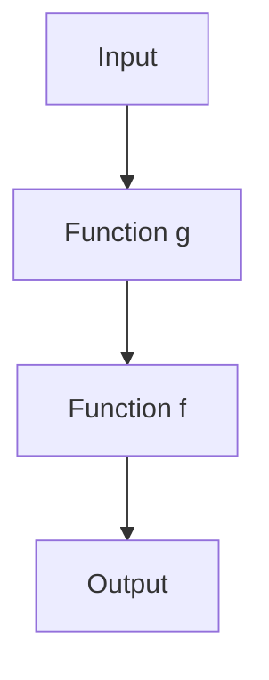

## 3.2 Functional Programming Paradigms

Functional programming (FP) is a paradigm that treats computation as the evaluation of mathematical functions and avoids changing state or mutable data. In Haxe, a multi-paradigm language, functional programming paradigms can be seamlessly integrated with object-oriented and imperative styles, offering a powerful toolkit for developers. This section will delve into the core concepts of functional programming in Haxe, including first-class functions, immutable data structures, and function composition, and demonstrate how these can be leveraged to write concise, predictable, and maintainable code.

### Understanding Functional Programming

Functional programming emphasizes the use of functions as the primary building blocks of computation. It promotes immutability, statelessness, and the use of higher-order functions. Let's explore these concepts in detail.

#### First-Class Functions

In Haxe, functions are first-class citizens, meaning they can be passed as arguments to other functions, returned as values from functions, and assigned to variables. This capability allows for higher-order functions, which are functions that take other functions as parameters or return them as results.

**Example:**

```haxe
class Main {
    static function main() {
        // Define a simple function
        var add = (a:Int, b:Int) -> a + b;
        
        // Higher-order function that takes a function as an argument
        function applyOperation(a:Int, b:Int, operation:(Int, Int) -> Int):Int {
            return operation(a, b);
        }
        
        // Use the higher-order function
        var result = applyOperation(5, 3, add);
        trace(result); // Output: 8
    }
}
```

In this example, `applyOperation` is a higher-order function that takes a function `operation` as a parameter and applies it to the integers `a` and `b`.

#### Immutable Data Structures

Immutability is a core principle of functional programming. It involves creating data structures that cannot be modified after they are created. This approach helps avoid side effects, making code more predictable and easier to debug.

**Example:**

```haxe
class Main {
    static function main() {
        // Immutable list
        var numbers = [1, 2, 3, 4, 5];
        
        // Function to add an element to the list without modifying the original
        function addElement(list:Array<Int>, element:Int):Array<Int> {
            return list.concat([element]);
        }
        
        var newNumbers = addElement(numbers, 6);
        trace(numbers); // Output: [1, 2, 3, 4, 5]
        trace(newNumbers); // Output: [1, 2, 3, 4, 5, 6]
    }
}
```

Here, `addElement` returns a new list with the added element, leaving the original list unchanged.

#### Function Composition

Function composition is the process of combining simple functions to build more complex ones. This technique allows for modular and reusable code.

**Example:**

```haxe
class Main {
    static function main() {
        // Simple functions
        var double = (x:Int) -> x * 2;
        var increment = (x:Int) -> x + 1;
        
        // Compose functions
        function compose(f:(Int) -> Int, g:(Int) -> Int):Int -> Int {
            return (x:Int) -> f(g(x));
        }
        
        var doubleThenIncrement = compose(increment, double);
        trace(doubleThenIncrement(3)); // Output: 7
    }
}
```

In this example, `compose` creates a new function by combining `increment` and `double`, demonstrating how complex operations can be built from simpler ones.

### Uses in Haxe

Functional programming techniques in Haxe can lead to concise and predictable code. By leveraging first-class functions, immutability, and function composition, developers can create robust applications that are easier to maintain and extend.

#### Writing Concise Code

Functional programming encourages the use of concise and expressive code. By using higher-order functions and function composition, complex logic can be expressed succinctly.

**Example:**

```haxe
class Main {
    static function main() {
        var numbers = [1, 2, 3, 4, 5];
        
        // Use map to apply a function to each element
        var doubled = numbers.map((x) -> x * 2);
        trace(doubled); // Output: [2, 4, 6, 8, 10]
    }
}
```

Here, the `map` function applies a lambda expression to each element of the list, doubling the numbers in a concise manner.

#### Predictable Code with Immutability

Immutability ensures that data structures remain unchanged, reducing the likelihood of bugs caused by unexpected state changes.

**Example:**

```haxe
class Main {
    static function main() {
        var original = {name: "Alice", age: 30};
        
        // Function to update age without modifying the original object
        function updateAge(person:{name:String, age:Int}, newAge:Int):{name:String, age:Int} {
            return {name: person.name, age: newAge};
        }
        
        var updated = updateAge(original, 31);
        trace(original); // Output: { name => Alice, age => 30 }
        trace(updated); // Output: { name => Alice, age => 31 }
    }
}
```

By returning a new object with the updated age, the original object remains unchanged, ensuring predictable behavior.

### Visualizing Functional Programming Concepts

To further understand these concepts, let's visualize function composition using a flowchart.



**Caption:** This diagram illustrates the flow of data through composed functions, where the output of function `g` becomes the input of function `f`.

### Try It Yourself

Experiment with the code examples provided. Try modifying the functions to perform different operations or add new functionality. For instance, create a new higher-order function that applies multiple operations to a list of numbers.

### Further Reading

For more information on functional programming, consider exploring the following resources:

- [MDN Web Docs on Functional Programming](https://developer.mozilla.org/en-US/docs/Glossary/Functional_programming)
- [Haxe Manual on Functions](https://haxe.org/manual/types-function.html)

### Knowledge Check

Before moving on, let's reinforce what we've learned with a few questions:

1. What are first-class functions, and how do they benefit functional programming in Haxe?
2. How does immutability contribute to predictable code?
3. Describe function composition and its advantages in software design.

### Embrace the Journey

Remember, mastering functional programming in Haxe is a journey. As you continue to explore these paradigms, you'll discover new ways to write efficient and elegant code. Keep experimenting, stay curious, and enjoy the process!

## Quiz Time!



### What is a first-class function in Haxe?

- [x] A function that can be passed as an argument, returned from another function, and assigned to a variable.
- [ ] A function that is defined at the top level of a program.
- [ ] A function that is only used within a class.
- [ ] A function that cannot be modified.

> **Explanation:** First-class functions in Haxe can be passed as arguments, returned from other functions, and assigned to variables, allowing for flexible and dynamic code structures.

### How does immutability benefit functional programming?

- [x] It prevents side effects by ensuring data structures cannot be modified.
- [ ] It allows functions to change global state.
- [ ] It makes code more complex and harder to understand.
- [ ] It requires more memory usage.

> **Explanation:** Immutability prevents side effects by ensuring data structures remain unchanged, leading to more predictable and reliable code.

### What is function composition?

- [x] Combining simple functions to build more complex ones.
- [ ] Writing functions that do not return any value.
- [ ] Using functions only within classes.
- [ ] Creating functions that modify global variables.

> **Explanation:** Function composition involves combining simple functions to create more complex operations, promoting modular and reusable code.

### Which of the following is an example of a higher-order function?

- [x] A function that takes another function as an argument.
- [ ] A function that only performs arithmetic operations.
- [ ] A function that does not return any value.
- [ ] A function that is defined within a class.

> **Explanation:** A higher-order function is one that takes another function as an argument or returns a function as its result.

### What is the primary advantage of using immutable data structures?

- [x] They prevent unintended side effects and make code more predictable.
- [ ] They allow for faster execution of code.
- [ ] They reduce the need for error handling.
- [ ] They increase the complexity of data management.

> **Explanation:** Immutable data structures prevent unintended side effects, making code more predictable and easier to debug.

### In Haxe, how can functions be composed?

- [x] By creating a new function that applies one function to the result of another.
- [ ] By defining functions within a class.
- [ ] By using global variables to store intermediate results.
- [ ] By modifying the input data directly.

> **Explanation:** Functions in Haxe can be composed by creating a new function that applies one function to the result of another, allowing for complex operations to be built from simpler ones.

### What is a key characteristic of functional programming?

- [x] Emphasis on immutability and statelessness.
- [ ] Focus on modifying global state.
- [ ] Use of classes and inheritance.
- [ ] Reliance on side effects.

> **Explanation:** Functional programming emphasizes immutability and statelessness, avoiding side effects and promoting predictable code.

### How does Haxe support functional programming paradigms?

- [x] By allowing functions to be first-class citizens and supporting immutability.
- [ ] By enforcing the use of classes and inheritance.
- [ ] By requiring all data to be mutable.
- [ ] By limiting the use of functions to specific contexts.

> **Explanation:** Haxe supports functional programming paradigms by allowing functions to be first-class citizens and promoting immutability, enabling developers to write concise and predictable code.

### What is a benefit of using higher-order functions?

- [x] They enable more abstract and flexible code.
- [ ] They make code more difficult to read.
- [ ] They require more memory usage.
- [ ] They limit the use of functions to specific contexts.

> **Explanation:** Higher-order functions enable more abstract and flexible code by allowing functions to be passed as arguments and returned as results, facilitating dynamic and reusable code structures.

### True or False: In functional programming, functions can modify global state.

- [ ] True
- [x] False

> **Explanation:** In functional programming, functions do not modify global state. Instead, they focus on immutability and statelessness, avoiding side effects and promoting predictable behavior.


