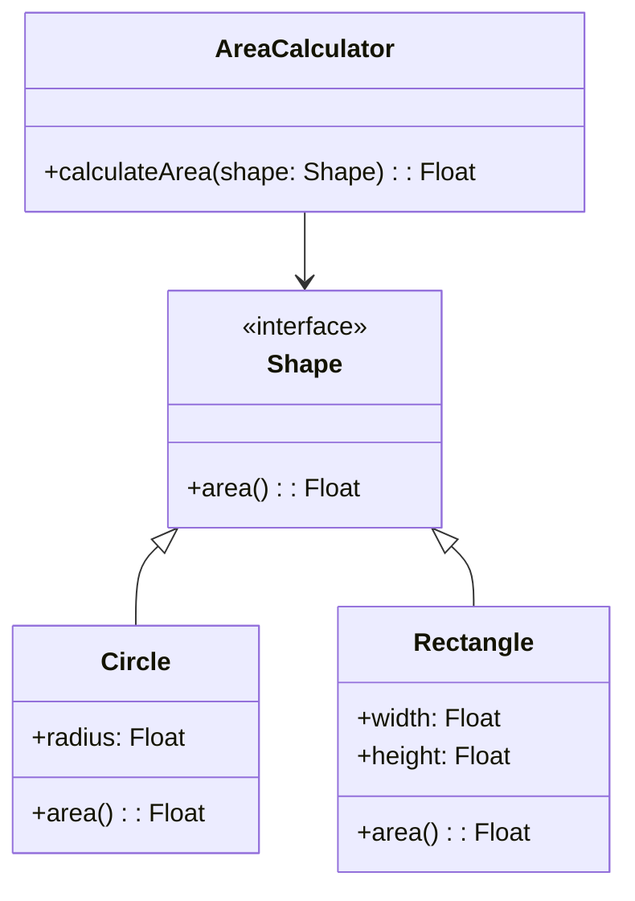

## 3.3 SOLID Principles Applied to Haxe

The SOLID principles are a set of design guidelines that help software engineers create more understandable, flexible, and maintainable systems. These principles are particularly beneficial when working with Haxe, a language known for its cross-platform capabilities. In this section, we will explore each of the SOLID principles and demonstrate how they can be effectively applied in Haxe.

### Single Responsibility Principle (SRP)

**Definition:** A class should have only one reason to change, meaning it should have only one job or responsibility.

**Explanation:** The Single Responsibility Principle (SRP) emphasizes that a class should only have one responsibility or reason to change. This principle helps in reducing the complexity of a class and makes it easier to understand, test, and maintain.

**Example in Haxe:**

Let's consider a simple example of a class that handles both user data and logging. This violates the SRP because it has more than one responsibility.

```haxe
class UserManager {
    public function saveUser(user: User): Void {
        // Save user to database
        log("User saved: " + user.name);
    }

    private function log(message: String): Void {
        trace(message);
    }
}
```

**Refactored Code:**

To adhere to SRP, we can separate the logging functionality into its own class.

```haxe
class UserManager {
    private var logger: Logger;

    public function new(logger: Logger) {
        this.logger = logger;
    }

    public function saveUser(user: User): Void {
        // Save user to database
        logger.log("User saved: " + user.name);
    }
}

class Logger {
    public function log(message: String): Void {
        trace(message);
    }
}
```

**Key Takeaway:** By separating concerns, we make each class easier to manage and understand. The `UserManager` class is now focused solely on user management, while the `Logger` class handles logging.

### Open/Closed Principle (OCP)

**Definition:** Software entities (classes, modules, functions, etc.) should be open for extension but closed for modification.

**Explanation:** The Open/Closed Principle (OCP) suggests that you should be able to add new functionality to a class without altering its existing code. This is typically achieved through inheritance or interfaces.

**Example in Haxe:**

Consider a class that calculates the area of different shapes.

```haxe
class AreaCalculator {
    public function calculateArea(shape: Shape): Float {
        if (Std.is(shape, Circle)) {
            var circle = cast(shape, Circle);
            return Math.PI * circle.radius * circle.radius;
        } else if (Std.is(shape, Rectangle)) {
            var rectangle = cast(shape, Rectangle);
            return rectangle.width * rectangle.height;
        }
        return 0;
    }
}
```

**Refactored Code:**

To adhere to OCP, we can use polymorphism.

```haxe
interface Shape {
    function area(): Float;
}

class Circle implements Shape {
    public var radius: Float;

    public function new(radius: Float) {
        this.radius = radius;
    }

    public function area(): Float {
        return Math.PI * radius * radius;
    }
}

class Rectangle implements Shape {
    public var width: Float;
    public var height: Float;

    public function new(width: Float, height: Float) {
        this.width = width;
        this.height = height;
    }

    public function area(): Float {
        return width * height;
    }
}

class AreaCalculator {
    public function calculateArea(shape: Shape): Float {
        return shape.area();
    }
}
```

**Key Takeaway:** By using interfaces, we can add new shapes without modifying the `AreaCalculator` class.

### Liskov Substitution Principle (LSP)

**Definition:** Objects of a superclass should be replaceable with objects of a subclass without affecting the correctness of the program.

**Explanation:** The Liskov Substitution Principle (LSP) ensures that a subclass can stand in for its superclass without causing errors or unexpected behavior.

**Example in Haxe:**

Consider a base class `Bird` and a subclass `Penguin`.

```haxe
class Bird {
    public function fly(): Void {
        trace("Flying");
    }
}

class Penguin extends Bird {
    override public function fly(): Void {
        throw "Penguins can't fly!";
    }
}
```

**Refactored Code:**

To adhere to LSP, we should not force subclasses to implement methods that they cannot logically perform.

```haxe
interface Flyable {
    function fly(): Void;
}

class Bird implements Flyable {
    public function fly(): Void {
        trace("Flying");
    }
}

class Penguin {
    public function swim(): Void {
        trace("Swimming");
    }
}
```

**Key Takeaway:** By using interfaces, we ensure that only classes that can logically perform the action implement the method.

### Interface Segregation Principle (ISP)

**Definition:** Clients should not be forced to depend on interfaces they do not use.

**Explanation:** The Interface Segregation Principle (ISP) suggests that a class should not be forced to implement interfaces it does not use. This can be achieved by creating smaller, more specific interfaces.

**Example in Haxe:**

Consider an interface with multiple methods.

```haxe
interface Worker {
    function work(): Void;
    function eat(): Void;
}
```

**Refactored Code:**

To adhere to ISP, we can split the interface into smaller, more specific interfaces.

```haxe
interface Workable {
    function work(): Void;
}

interface Eatable {
    function eat(): Void;
}

class Human implements Workable, Eatable {
    public function work(): Void {
        trace("Working");
    }

    public function eat(): Void {
        trace("Eating");
    }
}

class Robot implements Workable {
    public function work(): Void {
        trace("Working");
    }
}
```

**Key Takeaway:** By splitting interfaces, we ensure that classes only implement what they need.

### Dependency Inversion Principle (DIP)

**Definition:** High-level modules should not depend on low-level modules. Both should depend on abstractions. Abstractions should not depend on details. Details should depend on abstractions.

**Explanation:** The Dependency Inversion Principle (DIP) suggests that high-level modules should not depend on low-level modules but rather on abstractions. This principle helps in reducing the coupling between classes.

**Example in Haxe:**

Consider a class that directly depends on another class.

```haxe
class Light {
    public function turnOn(): Void {
        trace("Light on");
    }
}

class Switch {
    private var light: Light;

    public function new(light: Light) {
        this.light = light;
    }

    public function operate(): Void {
        light.turnOn();
    }
}
```

**Refactored Code:**

To adhere to DIP, we can introduce an interface.

```haxe
interface Switchable {
    function turnOn(): Void;
}

class Light implements Switchable {
    public function turnOn(): Void {
        trace("Light on");
    }
}

class Switch {
    private var device: Switchable;

    public function new(device: Switchable) {
        this.device = device;
    }

    public function operate(): Void {
        device.turnOn();
    }
}
```

**Key Takeaway:** By depending on abstractions, we make our code more flexible and easier to extend.

### Applying SOLID in Haxe

**Concrete Examples and Best Practices:**

1. **Use Interfaces and Abstract Classes:** Leverage Haxe's support for interfaces and abstract classes to implement SOLID principles effectively.
2. **Embrace Type Safety:** Haxe's static typing helps in enforcing SOLID principles by catching errors at compile time.
3. **Utilize Haxe's Cross-Platform Capabilities:** Ensure that your SOLID-compliant code works seamlessly across different platforms by using Haxe's conditional compilation and platform-specific APIs.
4. **Refactor Regularly:** Continuously refactor your code to adhere to SOLID principles, improving maintainability and scalability.
5. **Test Extensively:** Write unit tests to ensure that your SOLID-compliant code behaves as expected.

**Try It Yourself:**

Experiment with the provided code examples by modifying them to add new features or refactor existing code to better adhere to SOLID principles. For instance, try adding a new shape to the `AreaCalculator` example or implement a new `Switchable` device.

### Visualizing SOLID Principles in Haxe

To better understand the relationships and dependencies in SOLID-compliant code, let's visualize the `AreaCalculator` example using a class diagram.



**Diagram Description:** This diagram illustrates how the `AreaCalculator` class depends on the `Shape` interface, allowing for easy extension with new shapes like `Circle` and `Rectangle`.

### References and Links

- [SOLID Principles on Wikipedia](https://en.wikipedia.org/wiki/SOLID)
- [Haxe Language Reference](https://haxe.org/manual/)
- [Design Patterns in Haxe](https://haxe.org/documentation/)

### Knowledge Check

- **Question:** What is the primary goal of the Single Responsibility Principle?
- **Exercise:** Refactor a class in your current project to adhere to the Open/Closed Principle.

### Embrace the Journey

Remember, mastering SOLID principles is a continuous journey. As you apply these principles in Haxe, you'll find your code becoming more robust, flexible, and easier to maintain. Keep experimenting, stay curious, and enjoy the process of refining your software design skills!

## Quiz Time!



### What does the Single Responsibility Principle (SRP) emphasize?

- [x] A class should have only one reason to change.
- [ ] A class should be open for extension but closed for modification.
- [ ] A class should depend on abstractions rather than concrete implementations.
- [ ] A class should implement all methods of an interface.

> **Explanation:** SRP emphasizes that a class should have only one responsibility or reason to change, making it easier to manage and understand.

### How can the Open/Closed Principle (OCP) be achieved in Haxe?

- [x] By using interfaces and inheritance.
- [ ] By modifying existing code to add new functionality.
- [ ] By forcing subclasses to implement all methods of a superclass.
- [ ] By using only concrete classes.

> **Explanation:** OCP can be achieved by using interfaces and inheritance, allowing new functionality to be added without modifying existing code.

### What is the key idea behind the Liskov Substitution Principle (LSP)?

- [x] Subtypes should be substitutable for their base types.
- [ ] A class should have only one reason to change.
- [ ] Clients should not be forced to depend on interfaces they do not use.
- [ ] High-level modules should not depend on low-level modules.

> **Explanation:** LSP ensures that objects of a superclass can be replaced with objects of a subclass without affecting the program's correctness.

### What does the Interface Segregation Principle (ISP) suggest?

- [x] Clients should not be forced to depend on interfaces they do not use.
- [ ] A class should be open for extension but closed for modification.
- [ ] Subtypes should be substitutable for their base types.
- [ ] High-level modules should not depend on low-level modules.

> **Explanation:** ISP suggests creating smaller, more specific interfaces so that clients only depend on the methods they use.

### How can the Dependency Inversion Principle (DIP) be applied in Haxe?

- [x] By depending on abstractions rather than concrete implementations.
- [ ] By modifying existing code to add new functionality.
- [ ] By forcing subclasses to implement all methods of a superclass.
- [ ] By using only concrete classes.

> **Explanation:** DIP can be applied by relying on abstractions, reducing the coupling between high-level and low-level modules.

### Which principle is violated if a class has multiple responsibilities?

- [x] Single Responsibility Principle (SRP)
- [ ] Open/Closed Principle (OCP)
- [ ] Liskov Substitution Principle (LSP)
- [ ] Interface Segregation Principle (ISP)

> **Explanation:** SRP is violated when a class has more than one responsibility, leading to increased complexity and reduced maintainability.

### What is a benefit of adhering to the Open/Closed Principle (OCP)?

- [x] It allows new functionality to be added without modifying existing code.
- [ ] It ensures that a class has only one reason to change.
- [ ] It reduces the coupling between high-level and low-level modules.
- [ ] It creates smaller, more specific interfaces.

> **Explanation:** OCP allows for the extension of functionality without altering existing code, promoting flexibility and maintainability.

### Which principle focuses on creating smaller, more specific interfaces?

- [x] Interface Segregation Principle (ISP)
- [ ] Single Responsibility Principle (SRP)
- [ ] Open/Closed Principle (OCP)
- [ ] Dependency Inversion Principle (DIP)

> **Explanation:** ISP focuses on creating smaller, more specific interfaces to ensure that clients only depend on the methods they use.

### What is the main goal of the Dependency Inversion Principle (DIP)?

- [x] To reduce the coupling between high-level and low-level modules.
- [ ] To ensure that a class has only one reason to change.
- [ ] To allow new functionality to be added without modifying existing code.
- [ ] To create smaller, more specific interfaces.

> **Explanation:** DIP aims to reduce the coupling between high-level and low-level modules by relying on abstractions.

### True or False: The Liskov Substitution Principle (LSP) allows subclasses to override methods with different behavior.

- [ ] True
- [x] False

> **Explanation:** LSP requires that subclasses can replace their base classes without altering the expected behavior, ensuring consistency and correctness.


