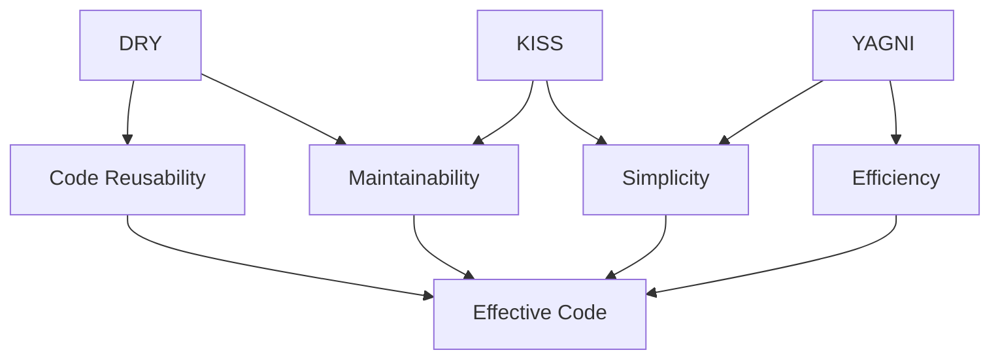

## 3.4 DRY, KISS, and YAGNI Principles

In the realm of software design, especially when working with a versatile language like Haxe, adhering to fundamental principles can significantly enhance code quality and maintainability. In this section, we delve into three pivotal principles: **Don't Repeat Yourself (DRY)**, **Keep It Simple, Stupid (KISS)**, and **You Aren't Gonna Need It (YAGNI)**. These principles are not just theoretical concepts but practical guidelines that can transform your approach to cross-platform software development.

### Don't Repeat Yourself (DRY)

The DRY principle emphasizes the importance of reducing repetition within codebases. By eliminating duplicate code, developers can create more maintainable, scalable, and error-free applications. Let's explore how DRY can be effectively applied in Haxe.

#### Understanding DRY

DRY stands for "Don't Repeat Yourself." The core idea is that every piece of knowledge must have a single, unambiguous, authoritative representation within a system. This principle helps in minimizing redundancy and ensuring that changes in one part of the system do not necessitate changes in multiple places.

#### Implementing DRY in Haxe

In Haxe, you can implement the DRY principle through various techniques such as using functions, classes, and macros. Let's look at a simple example:

```haxe
// Without DRY: Repeated code
class User {
    public var name:String;
    public var email:String;

    public function new(name:String, email:String) {
        this.name = name;
        this.email = email;
    }

    public function displayInfo():Void {
        trace("Name: " + name);
        trace("Email: " + email);
    }
}

class Admin {
    public var name:String;
    public var email:String;

    public function new(name:String, email:String) {
        this.name = name;
        this.email = email;
    }

    public function displayInfo():Void {
        trace("Name: " + name);
        trace("Email: " + email);
    }
}

// With DRY: Using inheritance
class Person {
    public var name:String;
    public var email:String;

    public function new(name:String, email:String) {
        this.name = name;
        this.email = email;
    }

    public function displayInfo():Void {
        trace("Name: " + name);
        trace("Email: " + email);
    }
}

class User extends Person {
    public function new(name:String, email:String) {
        super(name, email);
    }
}

class Admin extends Person {
    public function new(name:String, email:String) {
        super(name, email);
    }
}
```

In the above example, we refactor the code to use a base class `Person`, which eliminates the repetition of properties and methods in `User` and `Admin` classes.

#### Benefits of DRY

- **Maintainability:** Changes need to be made in only one place.
- **Readability:** Code is easier to read and understand.
- **Scalability:** Easier to extend and modify the system.

#### Challenges with DRY

While DRY is beneficial, overzealous application can lead to overly abstract code, making it difficult to understand. It's crucial to strike a balance between eliminating redundancy and maintaining clarity.

### Keep It Simple, Stupid (KISS)

The KISS principle advocates for simplicity in design. It suggests that systems work best when they are kept simple rather than made complex. Let's explore how KISS can be applied in Haxe development.

#### Understanding KISS

KISS stands for "Keep It Simple, Stupid." The principle encourages developers to avoid unnecessary complexity and strive for simplicity. Simple systems are easier to understand, maintain, and extend.

#### Implementing KISS in Haxe

In Haxe, you can apply KISS by focusing on straightforward solutions and avoiding over-engineering. Consider the following example:

```haxe
// Complex solution
class ComplexCalculator {
    public function calculate(operation:String, a:Float, b:Float):Float {
        switch(operation) {
            case "add": return a + b;
            case "subtract": return a - b;
            case "multiply": return a * b;
            case "divide": return a / b;
            default: throw "Unsupported operation";
        }
    }
}

// Simple solution
class SimpleCalculator {
    public function add(a:Float, b:Float):Float {
        return a + b;
    }

    public function subtract(a:Float, b:Float):Float {
        return a - b;
    }

    public function multiply(a:Float, b:Float):Float {
        return a * b;
    }

    public function divide(a:Float, b:Float):Float {
        return a / b;
    }
}
```

In the above example, the `SimpleCalculator` class provides a more straightforward and clear approach compared to the `ComplexCalculator` class, which uses a switch statement to handle different operations.

#### Benefits of KISS

- **Ease of Understanding:** Simple code is easier to read and understand.
- **Reduced Bugs:** Less complexity often leads to fewer bugs.
- **Faster Development:** Simplicity speeds up the development process.

#### Challenges with KISS

While simplicity is desirable, oversimplification can lead to inadequate solutions. It's essential to find a balance between simplicity and functionality.

### You Aren't Gonna Need It (YAGNI)

The YAGNI principle advises against adding functionality until it is necessary. It helps in avoiding wasted effort and keeping the codebase lean. Let's explore how YAGNI can be applied in Haxe.

#### Understanding YAGNI

YAGNI stands for "You Aren't Gonna Need It." The principle suggests that developers should not add features or functionality until they are actually required. This approach helps in avoiding unnecessary complexity and focusing on current requirements.

#### Implementing YAGNI in Haxe

In Haxe, you can apply YAGNI by focusing on the current requirements and avoiding speculative features. Consider the following example:

```haxe
// Without YAGNI: Adding unnecessary features
class FeatureRichClass {
    public function featureA():Void {
        trace("Feature A");
    }

    public function featureB():Void {
        trace("Feature B");
    }

    public function featureC():Void {
        trace("Feature C");
    }
}

// With YAGNI: Only necessary features
class NecessaryFeaturesClass {
    public function featureA():Void {
        trace("Feature A");
    }
}
```

In the above example, `FeatureRichClass` includes features that may not be needed, while `NecessaryFeaturesClass` focuses on the essential functionality.

#### Benefits of YAGNI

- **Reduced Complexity:** Avoids unnecessary complexity in the codebase.
- **Focused Development:** Encourages focusing on current requirements.
- **Efficient Resource Use:** Saves time and resources by avoiding unnecessary work.

#### Challenges with YAGNI

While YAGNI helps in maintaining a lean codebase, it requires careful consideration of future requirements. It's essential to balance current needs with potential future expansions.

### Balancing Act: Applying DRY, KISS, and YAGNI Effectively

Applying DRY, KISS, and YAGNI principles effectively requires a balance between eliminating redundancy, maintaining simplicity, and avoiding unnecessary features. Here are some tips for achieving this balance:

- **Evaluate Redundancy:** Regularly review your codebase to identify and eliminate redundancy without compromising clarity.
- **Strive for Simplicity:** Aim for simple solutions that meet current requirements without over-engineering.
- **Focus on Current Needs:** Prioritize current requirements and avoid speculative features unless they are clearly justified.

### Visualizing the Principles

To better understand the interplay between these principles, let's visualize them using a Venn diagram:



**Diagram Description:** This Venn diagram illustrates the relationships between DRY, KISS, and YAGNI principles, highlighting how they contribute to effective code through reusability, maintainability, simplicity, and efficiency.

### Try It Yourself

To deepen your understanding, try modifying the code examples provided. Experiment with refactoring code to apply DRY, simplifying complex logic to adhere to KISS, and removing unnecessary features to embrace YAGNI.

### References and Links

For further reading on these principles, consider exploring the following resources:

- [DRY Principle on Wikipedia](https://en.wikipedia.org/wiki/Don%27t_repeat_yourself)
- [KISS Principle on Wikipedia](https://en.wikipedia.org/wiki/KISS_principle)
- [YAGNI Principle on Wikipedia](https://en.wikipedia.org/wiki/You_aren%27t_gonna_need_it)

### Knowledge Check

To reinforce your understanding, consider the following questions:

- How can you identify redundancy in your codebase?
- What are some strategies for simplifying complex logic?
- How do you determine whether a feature is necessary?

### Embrace the Journey

Remember, mastering these principles is a journey. As you progress, you'll develop a deeper understanding of how to apply them effectively in your projects. Keep experimenting, stay curious, and enjoy the process of refining your code.

## Quiz Time!



### What does the DRY principle stand for?

- [x] Don't Repeat Yourself
- [ ] Do Repeat Yourself
- [ ] Don't Reuse Yourself
- [ ] Do Reuse Yourself

> **Explanation:** DRY stands for "Don't Repeat Yourself," emphasizing the elimination of code duplication.

### What is the main goal of the KISS principle?

- [x] Simplicity
- [ ] Complexity
- [ ] Redundancy
- [ ] Efficiency

> **Explanation:** The KISS principle aims for simplicity in design, avoiding unnecessary complexity.

### Which principle advises against adding features until necessary?

- [x] YAGNI
- [ ] DRY
- [ ] KISS
- [ ] SOLID

> **Explanation:** YAGNI stands for "You Aren't Gonna Need It," advising against adding unnecessary features.

### How can DRY improve code maintainability?

- [x] By reducing redundancy
- [ ] By increasing complexity
- [ ] By adding more features
- [ ] By simplifying logic

> **Explanation:** DRY improves maintainability by reducing redundancy, making code easier to manage.

### What is a potential downside of over-applying DRY?

- [x] Overly abstract code
- [ ] Increased redundancy
- [ ] Simplified logic
- [ ] Reduced complexity

> **Explanation:** Over-applying DRY can lead to overly abstract code, making it difficult to understand.

### How does KISS help in reducing bugs?

- [x] By avoiding complexity
- [ ] By adding more features
- [ ] By increasing redundancy
- [ ] By simplifying logic

> **Explanation:** KISS helps reduce bugs by avoiding unnecessary complexity, leading to clearer code.

### What is a challenge when applying YAGNI?

- [x] Balancing current and future needs
- [ ] Increasing redundancy
- [ ] Simplifying logic
- [ ] Adding more features

> **Explanation:** A challenge with YAGNI is balancing current needs with potential future requirements.

### Which principle focuses on current requirements?

- [x] YAGNI
- [ ] DRY
- [ ] KISS
- [ ] SOLID

> **Explanation:** YAGNI focuses on current requirements, avoiding speculative features.

### How can KISS speed up development?

- [x] By simplifying solutions
- [ ] By adding more features
- [ ] By increasing redundancy
- [ ] By avoiding complexity

> **Explanation:** KISS speeds up development by simplifying solutions, making them easier to implement.

### True or False: DRY, KISS, and YAGNI principles are mutually exclusive.

- [ ] True
- [x] False

> **Explanation:** DRY, KISS, and YAGNI principles are not mutually exclusive; they can be applied together to enhance code quality.


