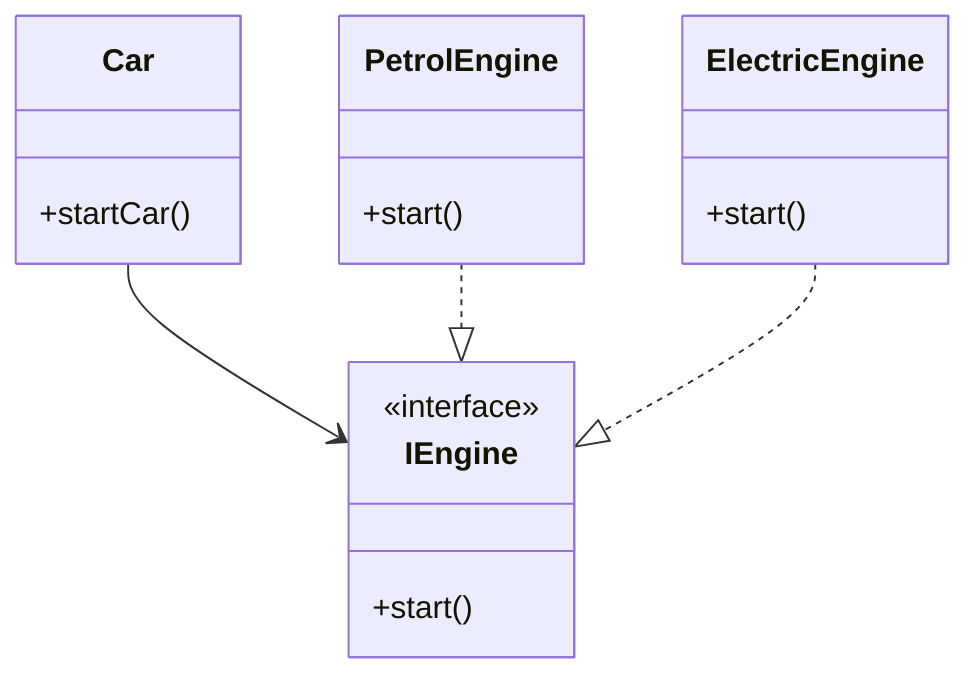

## 3.5 Law of Demeter and Loose Coupling

In the realm of software design, the Law of Demeter (LoD) and the principle of Loose Coupling are pivotal in creating robust, maintainable, and scalable applications. These principles are particularly relevant in Haxe, a language celebrated for its cross-platform capabilities. By understanding and applying these principles, developers can harness Haxe's features to build software that is not only efficient but also adaptable to change.

### Understanding the Law of Demeter (LoD)

The Law of Demeter, also known as the principle of least knowledge, is a design guideline for developing software, particularly object-oriented programs. It suggests that a unit should have limited knowledge about other units and should only communicate with its immediate friends. This principle aims to reduce dependencies between components, thereby enhancing modularity and reducing the risk of changes in one part of the system affecting others.

#### Key Concepts of the Law of Demeter

1. **Limited Knowledge:** A method should only call methods of:
   - The object itself.
   - Objects passed as arguments.
   - Objects it creates.
   - Its direct component objects.

2. **Avoiding Chain Calls:** Avoid chaining method calls on objects returned by other methods. This reduces the dependency on the internal structure of other objects.

3. **Encapsulation:** By adhering to LoD, you enhance encapsulation, making your code more resilient to changes.

#### Example of the Law of Demeter in Haxe

Let's consider a simple example in Haxe to illustrate the Law of Demeter:

```haxe
class Engine {
    public function new() {}
    public function start():Void {
        trace("Engine started");
    }
}

class Car {
    private var engine:Engine;

    public function new() {
        engine = new Engine();
    }

    public function startCar():Void {
        engine.start(); // Directly interacting with the engine
    }
}

class Main {
    static public function main() {
        var car = new Car();
        car.startCar(); // Complies with LoD
    }
}
```

In this example, the `Car` class directly interacts with its `Engine` component, adhering to the Law of Demeter. The `Main` class does not need to know about the `Engine` class, thus maintaining limited knowledge.

### Loose Coupling: Designing Independent Modules

Loose coupling refers to designing software components that are independent of each other. This independence allows components to be modified, replaced, or reused without affecting other parts of the system. Loose coupling is essential for creating flexible and maintainable software architectures.

#### Benefits of Loose Coupling

- **Flexibility:** Components can be easily replaced or updated.
- **Reusability:** Independent components can be reused across different projects.
- **Maintainability:** Changes in one component have minimal impact on others.

#### Techniques for Achieving Loose Coupling in Haxe

1. **Interfaces:** Use interfaces to define contracts for components. This allows different implementations to be swapped without affecting the rest of the system.

2. **Dependency Injection:** Inject dependencies into components rather than hardcoding them. This promotes flexibility and testability.

3. **Event-Driven Architecture:** Use events to decouple components. Components can communicate through events without needing to know about each other.

#### Example of Loose Coupling in Haxe

Let's explore how to achieve loose coupling using interfaces and dependency injection in Haxe:

```haxe
interface IEngine {
    function start():Void;
}

class PetrolEngine implements IEngine {
    public function new() {}
    public function start():Void {
        trace("Petrol engine started");
    }
}

class ElectricEngine implements IEngine {
    public function new() {}
    public function start():Void {
        trace("Electric engine started");
    }
}

class Car {
    private var engine:IEngine;

    public function new(engine:IEngine) {
        this.engine = engine;
    }

    public function startCar():Void {
        engine.start();
    }
}

class Main {
    static public function main() {
        var petrolCar = new Car(new PetrolEngine());
        petrolCar.startCar();

        var electricCar = new Car(new ElectricEngine());
        electricCar.startCar();
    }
}
```

In this example, the `Car` class depends on the `IEngine` interface rather than a specific engine implementation. This allows us to inject different engine types into the `Car` class, achieving loose coupling.

### Visualizing the Law of Demeter and Loose Coupling

To better understand these concepts, let's visualize the relationships between objects using a class diagram:



This diagram illustrates how the `Car` class interacts with the `IEngine` interface, allowing for different engine implementations without altering the `Car` class.

### Design Considerations

When applying the Law of Demeter and loose coupling in Haxe, consider the following:

- **Balance:** While minimizing dependencies is crucial, over-application can lead to excessive abstraction, making the code harder to understand.
- **Performance:** Ensure that the design does not negatively impact performance, especially in performance-critical applications.
- **Testing:** Loose coupling facilitates testing by allowing components to be tested in isolation.

### Differences and Similarities

The Law of Demeter and loose coupling are often confused due to their focus on reducing dependencies. However, they differ in scope:

- **Law of Demeter:** Focuses on minimizing knowledge about other components.
- **Loose Coupling:** Emphasizes designing independent modules.

Both principles complement each other and are essential for creating maintainable software architectures.

### Try It Yourself

To deepen your understanding, try modifying the code examples:

- Implement a new engine type, such as a `HybridEngine`, and integrate it into the `Car` class.
- Experiment with adding new methods to the `IEngine` interface and observe how it affects the `Car` class.

### References and Links

For further reading on the Law of Demeter and loose coupling, consider the following resources:

- [Law of Demeter on Wikipedia](https://en.wikipedia.org/wiki/Law_of_Demeter)
- [Loose Coupling on Wikipedia](https://en.wikipedia.org/wiki/Loose_coupling)
- [Haxe Programming Language Documentation](https://haxe.org/documentation/)

### Knowledge Check

To reinforce your understanding, consider the following questions:

1. What is the primary goal of the Law of Demeter?
2. How does loose coupling benefit software design?
3. What techniques can be used in Haxe to achieve loose coupling?
4. How does the use of interfaces promote loose coupling?
5. What are the potential pitfalls of over-applying the Law of Demeter?

### Embrace the Journey

Remember, mastering these principles is a journey. As you continue to explore Haxe and its design patterns, you'll discover new ways to apply these concepts to create efficient and maintainable software. Keep experimenting, stay curious, and enjoy the process!

## Quiz Time!



### What is the primary goal of the Law of Demeter?

- [x] To minimize dependencies between components
- [ ] To maximize performance
- [ ] To increase code complexity
- [ ] To enforce strict type checking

> **Explanation:** The Law of Demeter aims to minimize dependencies between components, enhancing modularity and reducing the impact of changes.

### How does loose coupling benefit software design?

- [x] It allows components to be easily replaced or updated
- [ ] It increases the complexity of the code
- [ ] It makes testing more difficult
- [ ] It reduces the flexibility of the system

> **Explanation:** Loose coupling allows components to be easily replaced or updated, enhancing flexibility and maintainability.

### Which technique can be used in Haxe to achieve loose coupling?

- [x] Dependency Injection
- [ ] Hardcoding dependencies
- [ ] Using global variables
- [ ] Ignoring interfaces

> **Explanation:** Dependency injection is a technique used to achieve loose coupling by injecting dependencies rather than hardcoding them.

### How does the use of interfaces promote loose coupling?

- [x] By defining contracts that allow different implementations to be swapped
- [ ] By enforcing a single implementation
- [ ] By increasing the number of dependencies
- [ ] By making the code less flexible

> **Explanation:** Interfaces define contracts that allow different implementations to be swapped, promoting loose coupling.

### What are the potential pitfalls of over-applying the Law of Demeter?

- [x] Excessive abstraction making the code harder to understand
- [ ] Improved performance
- [ ] Increased code readability
- [ ] Enhanced flexibility

> **Explanation:** Over-applying the Law of Demeter can lead to excessive abstraction, making the code harder to understand.

### What is a key benefit of using event-driven architecture for loose coupling?

- [x] Components can communicate without needing to know about each other
- [ ] It increases the dependency between components
- [ ] It reduces the flexibility of the system
- [ ] It makes testing more difficult

> **Explanation:** Event-driven architecture allows components to communicate without needing to know about each other, promoting loose coupling.

### What is an example of a tightly coupled system?

- [ ] A system where components are independent
- [x] A system where components are highly dependent on each other
- [ ] A system using interfaces for communication
- [ ] A system using dependency injection

> **Explanation:** A tightly coupled system is one where components are highly dependent on each other, making changes more difficult.

### How can dependency injection improve testability?

- [x] By allowing components to be tested in isolation
- [ ] By increasing the number of dependencies
- [ ] By making the code less flexible
- [ ] By enforcing a single implementation

> **Explanation:** Dependency injection improves testability by allowing components to be tested in isolation, without relying on other components.

### What is a potential downside of using too many interfaces?

- [x] Increased complexity and potential confusion
- [ ] Improved performance
- [ ] Enhanced code readability
- [ ] Greater flexibility

> **Explanation:** Using too many interfaces can increase complexity and potential confusion, making the code harder to manage.

### True or False: The Law of Demeter and loose coupling are the same concept.

- [ ] True
- [x] False

> **Explanation:** The Law of Demeter and loose coupling are related but distinct concepts. The Law of Demeter focuses on minimizing knowledge about other components, while loose coupling emphasizes designing independent modules.


