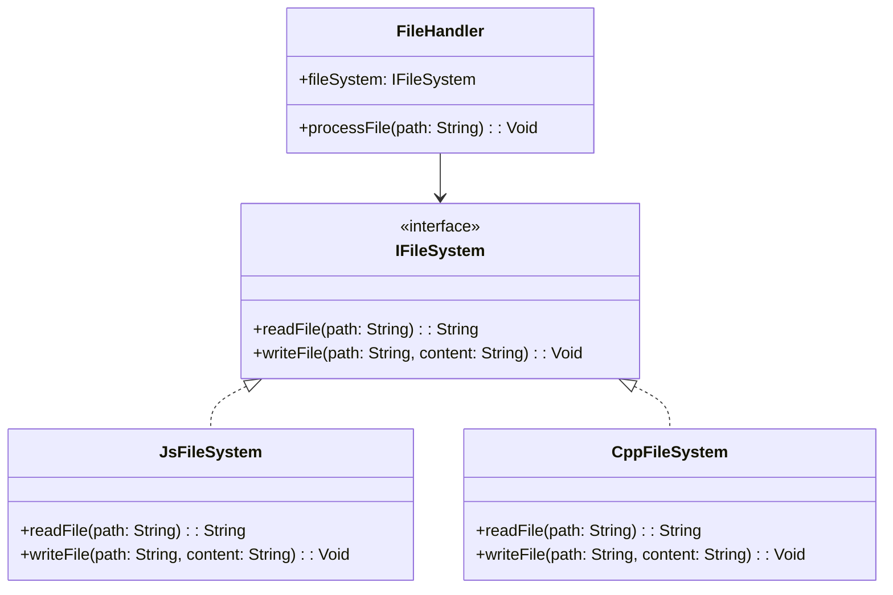

## 3.6 Design Principles for Cross-Platform Code

In the realm of software development, creating applications that run seamlessly across multiple platforms is both a challenge and a necessity. Haxe, with its ability to compile to various target languages, offers a unique advantage in this domain. However, to harness its full potential, developers must adhere to specific design principles that ensure code is both maintainable and efficient across different environments. In this section, we will delve into the core principles of cross-platform code design, focusing on abstraction over platform-specific details, code organization, and testing strategies.

### Abstraction Over Platform-Specific Details

One of the fundamental principles in cross-platform development is abstraction. By abstracting platform-specific details, we can create a unified codebase that minimizes duplication and enhances maintainability.

#### Creating Generic Interfaces

The key to abstraction is defining generic interfaces that encapsulate platform-specific implementations. This allows us to write code that interacts with these interfaces without worrying about the underlying platform details.

**Example: Abstracting File System Operations**

Let's consider a scenario where we need to perform file system operations. Different platforms may have different APIs for file handling. By defining a generic interface, we can abstract these differences.

```haxe
// Define a generic interface for file operations
interface IFileSystem {
    function readFile(path: String): String;
    function writeFile(path: String, content: String): Void;
}

// Platform-specific implementation for JavaScript
#if js
class JsFileSystem implements IFileSystem {
    public function new() {}

    public function readFile(path: String): String {
        // JavaScript-specific file reading logic
        return "File content from JS";
    }

    public function writeFile(path: String, content: String): Void {
        // JavaScript-specific file writing logic
    }
}
#end

// Platform-specific implementation for C++
#if cpp
class CppFileSystem implements IFileSystem {
    public function new() {}

    public function readFile(path: String): String {
        // C++-specific file reading logic
        return "File content from C++";
    }

    public function writeFile(path: String, content: String): Void {
        // C++-specific file writing logic
    }
}
#end

// Usage
class FileHandler {
    var fileSystem: IFileSystem;

    public function new(fileSystem: IFileSystem) {
        this.fileSystem = fileSystem;
    }

    public function processFile(path: String): Void {
        var content = fileSystem.readFile(path);
        // Process the file content
        fileSystem.writeFile(path, content);
    }
}
```

In this example, we define an `IFileSystem` interface with methods for reading and writing files. We then provide platform-specific implementations for JavaScript and C++. The `FileHandler` class uses the `IFileSystem` interface, allowing it to work with any platform-specific implementation.

#### Benefits of Abstraction

- **Maintainability:** Changes to platform-specific logic are isolated to their respective implementations.
- **Reusability:** The same code can be reused across different platforms without modification.
- **Testability:** Interfaces can be easily mocked for unit testing.

### Code Organization

Organizing code effectively is crucial for maintaining a cross-platform project. A well-structured codebase not only improves readability but also simplifies the process of adding new features or platforms.

#### Structuring Projects for Maintainability

When structuring a cross-platform project, consider the following guidelines:

1. **Modular Design:** Break down the application into modules or packages that encapsulate specific functionality. This promotes separation of concerns and makes it easier to manage dependencies.

2. **Platform-Specific Directories:** Use separate directories for platform-specific code. This helps in isolating platform-dependent logic and makes it easier to navigate the codebase.

3. **Shared Codebase:** Keep the shared codebase separate from platform-specific code. This ensures that the core logic remains consistent across platforms.

**Example: Project Structure**

```
/project-root
    /src
        /common
            /utils
            /models
        /platform
            /js
                /fileSystem
            /cpp
                /fileSystem
    /tests
        /unit
        /integration
```

In this structure, the `common` directory contains shared code, while the `platform` directory contains platform-specific implementations. The `tests` directory is organized into unit and integration tests.

#### Code Organization Best Practices

- **Consistent Naming Conventions:** Use consistent naming conventions for files, classes, and methods to enhance readability.
- **Documentation:** Provide clear documentation for each module, explaining its purpose and usage.
- **Version Control:** Use version control systems like Git to track changes and collaborate with other developers.

### Testing Strategies

Testing is a critical aspect of cross-platform development. It ensures that the application behaves consistently across different environments.

#### Ensuring Code Works Correctly on All Supported Platforms

To achieve reliable cross-platform testing, consider the following strategies:

1. **Automated Testing:** Use automated testing frameworks to run tests across multiple platforms. This reduces the risk of human error and ensures consistent test coverage.

2. **Continuous Integration (CI):** Implement a CI pipeline that automatically builds and tests the application on all supported platforms. This helps in identifying platform-specific issues early in the development process.

3. **Platform-Specific Tests:** Write tests that target platform-specific functionality. This ensures that platform-dependent code behaves as expected.

**Example: Cross-Platform Testing with Haxe**

```haxe
// Define a test case for file operations
class FileSystemTest {
    public static function main() {
        var fileSystem: IFileSystem;
        
        #if js
        fileSystem = new JsFileSystem();
        #elseif cpp
        fileSystem = new CppFileSystem();
        #end

        var content = fileSystem.readFile("test.txt");
        assert(content == "Expected content", "File content mismatch");

        fileSystem.writeFile("test.txt", "New content");
        assert(fileSystem.readFile("test.txt") == "New content", "File write failed");
    }
}
```

In this example, we define a test case for file operations. The test case uses conditional compilation to select the appropriate platform-specific implementation. This ensures that the test runs correctly on both JavaScript and C++ targets.

#### Testing Best Practices

- **Test Coverage:** Aim for high test coverage to catch potential issues early.
- **Mocking and Stubbing:** Use mocking and stubbing techniques to isolate tests from external dependencies.
- **Performance Testing:** Conduct performance tests to ensure the application meets performance requirements on all platforms.

### Visualizing Cross-Platform Code Design

To better understand the flow of cross-platform code design, let's visualize the interaction between different components using a class diagram.



**Diagram Description:** This class diagram illustrates the relationship between the `IFileSystem` interface and its platform-specific implementations (`JsFileSystem` and `CppFileSystem`). The `FileHandler` class interacts with the `IFileSystem` interface, demonstrating the abstraction principle.

### Try It Yourself

To solidify your understanding, try modifying the code examples provided:

- **Add a New Platform:** Implement a new platform-specific file system class (e.g., for Python) and integrate it with the existing code.
- **Enhance Testing:** Write additional test cases to cover edge cases and error handling scenarios.
- **Refactor Code:** Refactor the codebase to improve modularity and separation of concerns.

### References and Links

For further reading on cross-platform development and design principles, consider the following resources:

- [MDN Web Docs: Cross-Browser Testing](https://developer.mozilla.org/en-US/docs/Learn/Tools_and_testing/Cross_browser_testing)
- [W3Schools: Software Design Patterns](https://www.w3schools.com/software/software_design_patterns.asp)
- [Haxe Manual: Conditional Compilation](https://haxe.org/manual/lf-condition-compilation.html)

### Knowledge Check

Before moving on, take a moment to reflect on the key concepts covered in this section:

- **Abstraction:** How can abstraction help in managing platform-specific code?
- **Code Organization:** What are the benefits of a well-structured codebase?
- **Testing Strategies:** Why is automated testing important in cross-platform development?

### Embrace the Journey

Remember, mastering cross-platform development is a journey. As you continue to explore and experiment with Haxe, you'll discover new techniques and strategies to enhance your applications. Stay curious, keep learning, and enjoy the process!

## Quiz Time!



### What is the primary benefit of using abstraction in cross-platform code?

- [x] It isolates platform-specific logic, enhancing maintainability.
- [ ] It increases the complexity of the codebase.
- [ ] It reduces the need for testing.
- [ ] It eliminates the need for platform-specific implementations.

> **Explanation:** Abstraction helps isolate platform-specific logic, making the codebase more maintainable and easier to manage.

### Which of the following is a best practice for organizing cross-platform projects?

- [x] Use separate directories for platform-specific code.
- [ ] Mix platform-specific and shared code in the same directory.
- [ ] Avoid using version control systems.
- [ ] Write all code in a single file.

> **Explanation:** Using separate directories for platform-specific code helps in isolating platform-dependent logic and enhances codebase navigation.

### Why is automated testing important in cross-platform development?

- [x] It ensures consistent test coverage across platforms.
- [ ] It eliminates the need for manual testing.
- [ ] It reduces the overall development time.
- [ ] It increases the complexity of the testing process.

> **Explanation:** Automated testing ensures consistent test coverage across platforms, reducing the risk of human error and catching issues early.

### What is the role of the `IFileSystem` interface in the provided code example?

- [x] It defines a contract for platform-specific file system operations.
- [ ] It implements platform-specific file system logic.
- [ ] It handles file system errors.
- [ ] It provides a user interface for file operations.

> **Explanation:** The `IFileSystem` interface defines a contract for platform-specific file system operations, allowing different implementations to adhere to the same interface.

### Which testing strategy involves running tests automatically across multiple platforms?

- [x] Continuous Integration (CI)
- [ ] Manual Testing
- [ ] Code Review
- [ ] Debugging

> **Explanation:** Continuous Integration (CI) involves running tests automatically across multiple platforms, helping identify platform-specific issues early.

### What is the purpose of using mocking and stubbing in testing?

- [x] To isolate tests from external dependencies.
- [ ] To increase the complexity of tests.
- [ ] To reduce test coverage.
- [ ] To eliminate the need for unit tests.

> **Explanation:** Mocking and stubbing are used to isolate tests from external dependencies, ensuring that tests focus on the code being tested.

### How does modular design benefit cross-platform projects?

- [x] It promotes separation of concerns and simplifies dependency management.
- [ ] It increases the complexity of the codebase.
- [ ] It reduces code reusability.
- [ ] It eliminates the need for documentation.

> **Explanation:** Modular design promotes separation of concerns and simplifies dependency management, making the codebase easier to maintain and extend.

### What is the advantage of using a shared codebase in cross-platform development?

- [x] It ensures consistency across platforms.
- [ ] It increases the need for platform-specific code.
- [ ] It reduces code maintainability.
- [ ] It complicates the testing process.

> **Explanation:** A shared codebase ensures consistency across platforms, reducing duplication and enhancing maintainability.

### Which of the following is a benefit of using version control systems in cross-platform projects?

- [x] They help track changes and facilitate collaboration.
- [ ] They increase the complexity of the development process.
- [ ] They eliminate the need for documentation.
- [ ] They reduce code reusability.

> **Explanation:** Version control systems help track changes and facilitate collaboration, making it easier to manage the development process.

### True or False: Abstraction eliminates the need for platform-specific implementations.

- [ ] True
- [x] False

> **Explanation:** Abstraction does not eliminate the need for platform-specific implementations; it provides a way to manage them effectively by defining generic interfaces.


