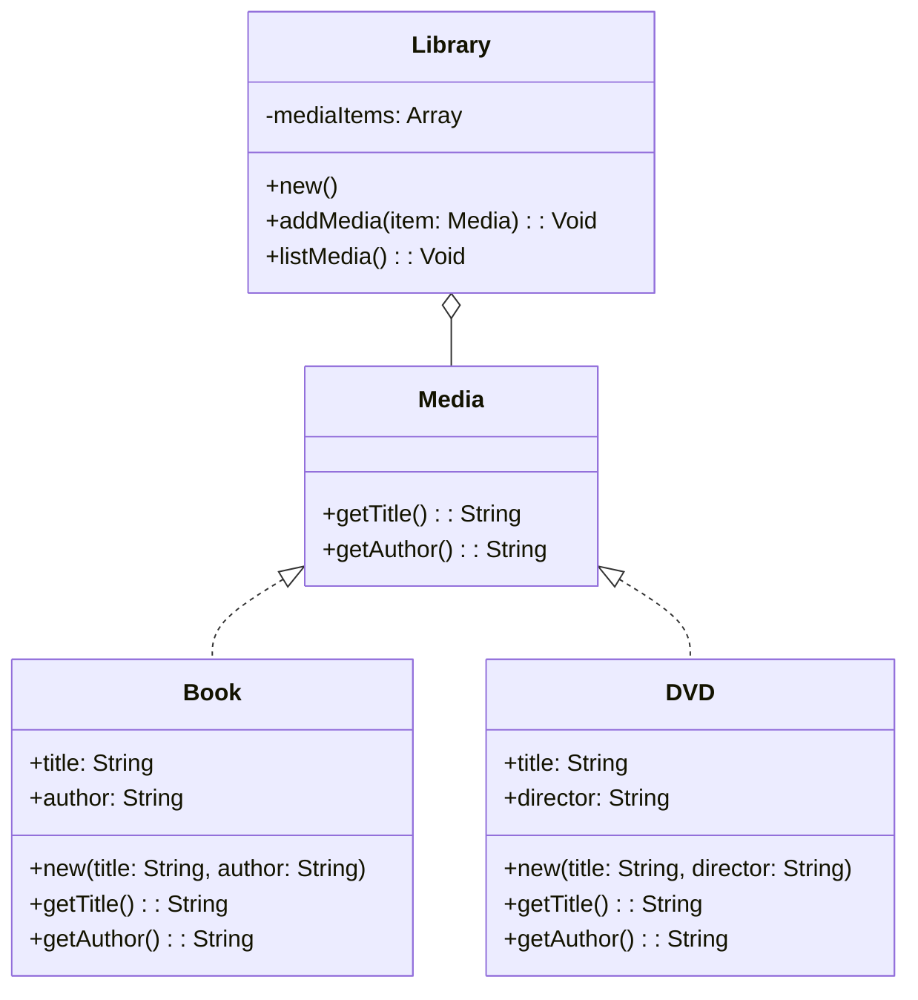

## 3.7 GRASP Principles in Haxe Design

The GRASP (General Responsibility Assignment Software Patterns) principles are a set of guidelines that help software engineers and architects assign responsibilities to classes and objects in object-oriented design. These principles are crucial for creating maintainable, scalable, and robust software systems. In this section, we will explore how to apply these principles using the Haxe programming language, which is known for its cross-platform capabilities and powerful features.

### Understanding GRASP Principles

GRASP principles provide a framework for thinking about object-oriented design and responsibility assignment. They help in making decisions about which class should be responsible for what, thus ensuring a well-structured and efficient codebase. The key GRASP principles include:

1. **Information Expert**
2. **Creator**
3. **Controller**
4. **Low Coupling and High Cohesion**
5. **Polymorphism**

Let's delve into each of these principles and see how they can be applied in Haxe.

### Information Expert

**Information Expert** is a principle that suggests assigning responsibilities to the class that has the necessary information to fulfill them. This principle helps in distributing responsibilities across classes in a way that minimizes the need for data sharing and maximizes encapsulation.

#### Applying Information Expert in Haxe

In Haxe, you can leverage the language's static typing and type inference to implement the Information Expert principle effectively. Let's consider an example where we have a `Book` class that needs to calculate its price based on various factors.

```haxe
class Book {
    public var title:String;
    public var author:String;
    public var basePrice:Float;
    public var discount:Float;

    public function new(title:String, author:String, basePrice:Float, discount:Float) {
        this.title = title;
        this.author = author;
        this.basePrice = basePrice;
        this.discount = discount;
    }

    // Information Expert: The Book class has the necessary information to calculate its price.
    public function calculatePrice():Float {
        return basePrice - (basePrice * discount);
    }
}

// Usage
var book = new Book("Haxe Programming", "John Doe", 50.0, 0.1);
trace("Price: " + book.calculatePrice());
```

In this example, the `Book` class is the Information Expert because it has all the necessary data to calculate its price. By assigning this responsibility to the `Book` class, we ensure that the logic is encapsulated within the class that holds the relevant data.

### Creator

The **Creator** principle guides us in deciding which class should be responsible for creating instances of another class. According to this principle, a class should create an instance of another class if it aggregates, contains, or closely uses the created object.

#### Applying Creator in Haxe

Let's consider a scenario where we have a `Library` class that manages a collection of `Book` objects. The `Library` class should be responsible for creating `Book` instances because it aggregates them.

```haxe
class Library {
    private var books:Array<Book>;

    public function new() {
        books = new Array<Book>();
    }

    // Creator: The Library class creates Book instances because it aggregates them.
    public function addBook(title:String, author:String, basePrice:Float, discount:Float):Void {
        var book = new Book(title, author, basePrice, discount);
        books.push(book);
    }

    public function listBooks():Void {
        for (book in books) {
            trace("Title: " + book.title + ", Author: " + book.author);
        }
    }
}

// Usage
var library = new Library();
library.addBook("Haxe Programming", "John Doe", 50.0, 0.1);
library.listBooks();
```

In this example, the `Library` class is the Creator of `Book` instances because it aggregates them. This design ensures that the responsibility of managing the collection of books is centralized within the `Library` class.

### Controller

The **Controller** principle defines the objects that handle system events. A controller is responsible for delegating work to other objects and coordinating the overall flow of the application.

#### Applying Controller in Haxe

Consider a simple application where a `LibraryController` class handles user actions related to managing a library.

```haxe
class LibraryController {
    private var library:Library;

    public function new() {
        library = new Library();
    }

    // Controller: The LibraryController handles user actions and coordinates the flow.
    public function addBookToLibrary(title:String, author:String, basePrice:Float, discount:Float):Void {
        library.addBook(title, author, basePrice, discount);
        trace("Book added to library.");
    }

    public function displayLibraryBooks():Void {
        library.listBooks();
    }
}

// Usage
var controller = new LibraryController();
controller.addBookToLibrary("Haxe Programming", "John Doe", 50.0, 0.1);
controller.displayLibraryBooks();
```

In this example, the `LibraryController` class acts as the Controller by handling user actions and coordinating the interaction between the user and the `Library` class.

### Low Coupling and High Cohesion

**Low Coupling** and **High Cohesion** are principles that aim to design classes that are focused and have few dependencies. Low coupling ensures that changes in one class have minimal impact on others, while high cohesion ensures that a class has a single, well-defined purpose.

#### Applying Low Coupling and High Cohesion in Haxe

Let's revisit our `Library` and `Book` example to see how we can achieve low coupling and high cohesion.

```haxe
class Book {
    public var title:String;
    public var author:String;
    public var basePrice:Float;
    public var discount:Float;

    public function new(title:String, author:String, basePrice:Float, discount:Float) {
        this.title = title;
        this.author = author;
        this.basePrice = basePrice;
        this.discount = discount;
    }

    public function calculatePrice():Float {
        return basePrice - (basePrice * discount);
    }
}

class Library {
    private var books:Array<Book>;

    public function new() {
        books = new Array<Book>();
    }

    public function addBook(book:Book):Void {
        books.push(book);
    }

    public function listBooks():Void {
        for (book in books) {
            trace("Title: " + book.title + ", Author: " + book.author);
        }
    }
}

// Usage
var library = new Library();
var book = new Book("Haxe Programming", "John Doe", 50.0, 0.1);
library.addBook(book);
library.listBooks();
```

In this example, the `Book` class is highly cohesive because it focuses solely on book-related data and operations. The `Library` class is loosely coupled with the `Book` class because it interacts with `Book` objects through well-defined interfaces.

### Polymorphism

**Polymorphism** is a principle that allows objects to be treated as instances of their parent class. It enables the use of polymorphic methods to handle variations in behavior.

#### Applying Polymorphism in Haxe

Let's consider a scenario where we have different types of `Media` items in a library, such as `Book` and `DVD`. We can use polymorphism to handle these variations.

```haxe
interface Media {
    function getTitle():String;
    function getAuthor():String;
}

class Book implements Media {
    public var title:String;
    public var author:String;

    public function new(title:String, author:String) {
        this.title = title;
        this.author = author;
    }

    public function getTitle():String {
        return title;
    }

    public function getAuthor():String {
        return author;
    }
}

class DVD implements Media {
    public var title:String;
    public var director:String;

    public function new(title:String, director:String) {
        this.title = title;
        this.director = director;
    }

    public function getTitle():String {
        return title;
    }

    public function getAuthor():String {
        return director;
    }
}

class Library {
    private var mediaItems:Array<Media>;

    public function new() {
        mediaItems = new Array<Media>();
    }

    public function addMedia(item:Media):Void {
        mediaItems.push(item);
    }

    public function listMedia():Void {
        for (item in mediaItems) {
            trace("Title: " + item.getTitle() + ", Author/Director: " + item.getAuthor());
        }
    }
}

// Usage
var library = new Library();
var book = new Book("Haxe Programming", "John Doe");
var dvd = new DVD("Haxe Documentary", "Jane Smith");
library.addMedia(book);
library.addMedia(dvd);
library.listMedia();
```

In this example, both `Book` and `DVD` implement the `Media` interface, allowing them to be treated polymorphically. The `Library` class can handle different types of media items without knowing their specific types.

### Visualizing GRASP Principles

To better understand how these principles interact, let's visualize the relationships between the classes using a class diagram.



**Diagram Description:** This class diagram illustrates the relationships between the `Media`, `Book`, `DVD`, and `Library` classes. The `Media` interface is implemented by both `Book` and `DVD`, allowing for polymorphic behavior. The `Library` class aggregates `Media` items, demonstrating low coupling and high cohesion.

### Try It Yourself

Experiment with the code examples provided by modifying them to add new features or handle additional scenarios. For instance, try adding a new type of media, such as `Magazine`, and see how the existing system accommodates it. This exercise will help reinforce your understanding of GRASP principles in Haxe.

### Key Takeaways

- **Information Expert**: Assign responsibilities to the class with the necessary information.
- **Creator**: Decide which class should create instances of another class based on aggregation or usage.
- **Controller**: Define objects that handle system events and coordinate the flow.
- **Low Coupling and High Cohesion**: Design classes that are focused and have minimal dependencies.
- **Polymorphism**: Use polymorphic methods to handle variations in behavior.

By applying these GRASP principles in Haxe, you can design software systems that are robust, maintainable, and scalable. Remember, mastering these principles is a journey, and continuous practice will enhance your skills as a software architect.

## Quiz Time!



### Which GRASP principle suggests assigning responsibilities to the class with the necessary information?

- [x] Information Expert
- [ ] Creator
- [ ] Controller
- [ ] Low Coupling

> **Explanation:** The Information Expert principle suggests assigning responsibilities to the class that has the necessary information to fulfill them.

### What is the primary role of a Controller in GRASP principles?

- [ ] To create instances of other classes
- [x] To handle system events and coordinate the flow
- [ ] To minimize dependencies between classes
- [ ] To encapsulate data

> **Explanation:** The Controller principle defines objects that handle system events and coordinate the overall flow of the application.

### In the context of GRASP, which principle focuses on minimizing dependencies between classes?

- [ ] Information Expert
- [ ] Creator
- [x] Low Coupling
- [ ] Polymorphism

> **Explanation:** Low Coupling focuses on designing classes that have minimal dependencies on other classes.

### Which principle would you apply to decide which class should create instances of another class?

- [ ] Information Expert
- [x] Creator
- [ ] Controller
- [ ] High Cohesion

> **Explanation:** The Creator principle guides us in deciding which class should be responsible for creating instances of another class.

### How does polymorphism benefit object-oriented design according to GRASP principles?

- [x] It allows objects to be treated as instances of their parent class
- [ ] It reduces the need for data sharing
- [ ] It ensures a single, well-defined purpose for each class
- [ ] It handles system events

> **Explanation:** Polymorphism allows objects to be treated as instances of their parent class, enabling the use of polymorphic methods to handle variations in behavior.

### What is the relationship between Low Coupling and High Cohesion?

- [x] They both aim to create focused classes with minimal dependencies
- [ ] They both focus on responsibility assignment
- [ ] They both handle system events
- [ ] They both create instances of other classes

> **Explanation:** Low Coupling and High Cohesion both aim to design classes that are focused and have minimal dependencies, ensuring a well-structured codebase.

### Which GRASP principle is demonstrated by a class that aggregates instances of another class?

- [ ] Information Expert
- [x] Creator
- [ ] Controller
- [ ] Polymorphism

> **Explanation:** The Creator principle is demonstrated when a class aggregates instances of another class, as it is responsible for creating those instances.

### What is the benefit of using the Information Expert principle?

- [x] It maximizes encapsulation and minimizes the need for data sharing
- [ ] It handles system events
- [ ] It reduces the number of classes in a system
- [ ] It allows for polymorphic behavior

> **Explanation:** The Information Expert principle maximizes encapsulation by assigning responsibilities to the class with the necessary information, thus minimizing the need for data sharing.

### How does the Controller principle contribute to software design?

- [x] It coordinates the flow of the application by handling system events
- [ ] It reduces the number of dependencies between classes
- [ ] It ensures each class has a single, well-defined purpose
- [ ] It allows for polymorphic behavior

> **Explanation:** The Controller principle contributes to software design by coordinating the flow of the application and handling system events.

### True or False: High Cohesion ensures that a class has multiple responsibilities.

- [ ] True
- [x] False

> **Explanation:** False. High Cohesion ensures that a class has a single, well-defined purpose, not multiple responsibilities.


