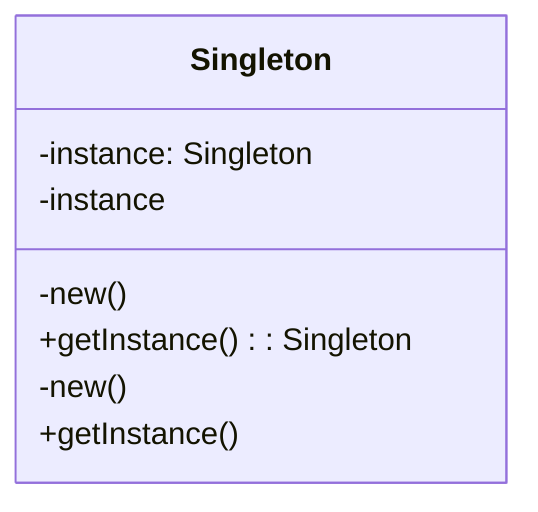

## 4.1 Singleton Pattern

In the realm of software design patterns, the Singleton Pattern stands out as a fundamental creational pattern. Its primary intent is to ensure that a class has only one instance while providing a global point of access to that instance. This pattern is particularly useful in scenarios where a single object is required to coordinate actions across the system, such as in managing configurations or shared resources.

### Intent

The Singleton Pattern is designed to:

- **Ensure a single instance** of a class exists throughout the application lifecycle.
- **Provide a global access point** to this instance.
- **Control concurrent access** to the instance in multi-threaded environments.

### Key Participants

- **Singleton Class:** The class that is restricted to a single instance.
- **Static Instance:** A static member that holds the single instance of the class.
- **Private Constructor:** A constructor that prevents external instantiation.
- **Static Accessor Method:** A method that provides access to the instance.

### Implementing Singleton in Haxe

Haxe, with its cross-platform capabilities, offers unique features that can be leveraged to implement the Singleton Pattern effectively. Let's explore how to implement a Singleton in Haxe, focusing on private constructors, static accessors, lazy initialization, and thread safety.

#### Private Constructor and Static Accessor

To implement a Singleton in Haxe, we start by defining a class with a private constructor and a static method to access the instance.

```haxe
class Singleton {
    // Static variable to hold the single instance
    private static var instance:Singleton;

    // Private constructor to prevent instantiation
    private function new() {
        trace("Singleton instance created.");
    }

    // Static method to provide access to the instance
    public static function getInstance():Singleton {
        if (instance == null) {
            instance = new Singleton();
        }
        return instance;
    }
}
```

In this example, the `Singleton` class has a private constructor, ensuring that it cannot be instantiated from outside the class. The `getInstance` method checks if the `instance` is `null` and creates a new instance if necessary, ensuring that only one instance exists.

#### Lazy Initialization

Lazy initialization is a technique where the creation of the instance is deferred until it is needed. This can be particularly useful in scenarios where the Singleton instance is resource-intensive to create.

The `getInstance` method in the above code snippet demonstrates lazy initialization by creating the instance only when it is first requested.

#### Thread Safety Considerations

In multi-threaded environments, it is crucial to ensure that the Singleton instance is created safely without race conditions. Haxe's concurrency model varies across platforms, so thread safety considerations may differ.

For platforms that support multi-threading, you can use synchronization mechanisms to ensure thread safety. Here's an example using a simple lock mechanism:

```haxe
class ThreadSafeSingleton {
    private static var instance:ThreadSafeSingleton;
    private static var lock:Mutex = new Mutex();

    private function new() {
        trace("Thread-safe Singleton instance created.");
    }

    public static function getInstance():ThreadSafeSingleton {
        lock.lock();
        try {
            if (instance == null) {
                instance = new ThreadSafeSingleton();
            }
        } finally {
            lock.unlock();
        }
        return instance;
    }
}
```

In this example, a `Mutex` is used to synchronize access to the `getInstance` method, ensuring that only one thread can create the instance at a time.

### Use Cases and Examples

The Singleton Pattern is widely used in software design for various purposes. Let's explore some common use cases and examples.

#### Global Configuration Objects

In many applications, configuration settings need to be accessed globally. The Singleton Pattern provides a convenient way to manage these settings.

```haxe
class ConfigurationManager {
    private static var instance:ConfigurationManager;
    private var settings:Map<String, String>;

    private function new() {
        settings = new Map<String, String>();
        // Load settings from a file or environment
    }

    public static function getInstance():ConfigurationManager {
        if (instance == null) {
            instance = new ConfigurationManager();
        }
        return instance;
    }

    public function getSetting(key:String):String {
        return settings.get(key);
    }

    public function setSetting(key:String, value:String):Void {
        settings.set(key, value);
    }
}
```

In this example, `ConfigurationManager` is a Singleton that manages application settings. It provides methods to get and set configuration values, ensuring that all parts of the application access the same configuration data.

#### Resource Managers

Singletons are also useful for managing shared resources, such as database connections or file handles.

```haxe
class DatabaseConnectionManager {
    private static var instance:DatabaseConnectionManager;
    private var connection:DatabaseConnection;

    private function new() {
        connection = new DatabaseConnection();
        // Initialize the connection
    }

    public static function getInstance():DatabaseConnectionManager {
        if (instance == null) {
            instance = new DatabaseConnectionManager();
        }
        return instance;
    }

    public function getConnection():DatabaseConnection {
        return connection;
    }
}
```

In this example, `DatabaseConnectionManager` is a Singleton that provides access to a single database connection, ensuring efficient use of resources.

### Design Considerations

When implementing the Singleton Pattern, consider the following:

- **Lazy vs. Eager Initialization:** Decide whether to create the instance at startup (eager) or when needed (lazy).
- **Thread Safety:** Ensure that the Singleton is thread-safe if your application is multi-threaded.
- **Serialization:** Consider how the Singleton should behave when serialized and deserialized.
- **Testing:** Singleton can make testing difficult due to its global state. Consider using dependency injection or other techniques to facilitate testing.

### Differences and Similarities

The Singleton Pattern is often compared to other patterns, such as:

- **Factory Pattern:** While both manage object creation, the Factory Pattern creates multiple instances, whereas Singleton ensures a single instance.
- **Monostate Pattern:** Similar to Singleton, but allows multiple instances that share the same state.

### Visualizing the Singleton Pattern

To better understand the Singleton Pattern, let's visualize its structure using a class diagram.



This diagram illustrates the Singleton class with a private instance and constructor, and a public static method to access the instance.

### Try It Yourself

To deepen your understanding, try modifying the code examples:

- Implement a Singleton for a logging service that writes logs to a file.
- Experiment with different initialization strategies (lazy vs. eager).
- Add thread safety mechanisms for platforms that support concurrency.

### References and Links

For further reading on the Singleton Pattern and its applications, consider the following resources:

- [Design Patterns: Elements of Reusable Object-Oriented Software](https://en.wikipedia.org/wiki/Design_Patterns) - The classic book by the "Gang of Four" that introduced design patterns.
- [Haxe Manual](https://haxe.org/manual/) - Official Haxe documentation for language features and concurrency models.

### Knowledge Check

To reinforce your understanding of the Singleton Pattern, consider the following questions:

- What are the key components of the Singleton Pattern?
- How does lazy initialization differ from eager initialization?
- What are some common use cases for the Singleton Pattern?
- How can you ensure thread safety in a Singleton implementation?

### Embrace the Journey

Remember, mastering design patterns is a journey. As you explore the Singleton Pattern, consider how it can be applied to your projects. Keep experimenting, stay curious, and enjoy the process of learning and applying design patterns in Haxe.

## Quiz Time!



### What is the primary intent of the Singleton Pattern?

- [x] Ensure a single instance of a class exists
- [ ] Provide multiple instances of a class
- [ ] Simplify object creation
- [ ] Enhance object inheritance

> **Explanation:** The Singleton Pattern is designed to ensure that only one instance of a class exists throughout the application lifecycle.

### Which method is used to access the Singleton instance in Haxe?

- [x] Static Accessor Method
- [ ] Public Constructor
- [ ] Instance Variable
- [ ] Private Method

> **Explanation:** The Singleton instance is accessed through a static accessor method, which provides a global point of access.

### What is lazy initialization in the context of the Singleton Pattern?

- [x] Deferring object creation until it is needed
- [ ] Creating the instance at application startup
- [ ] Initializing all class variables at once
- [ ] Using a separate thread for initialization

> **Explanation:** Lazy initialization defers the creation of the Singleton instance until it is first requested, optimizing resource usage.

### How can thread safety be ensured in a Singleton implementation?

- [x] Using synchronization mechanisms like Mutex
- [ ] Avoiding static methods
- [ ] Using multiple instances
- [ ] Disabling multi-threading

> **Explanation:** Synchronization mechanisms like Mutex can be used to ensure that only one thread can create the Singleton instance at a time.

### What is a common use case for the Singleton Pattern?

- [x] Global Configuration Objects
- [ ] Creating multiple database connections
- [ ] Implementing complex algorithms
- [ ] Enhancing object inheritance

> **Explanation:** The Singleton Pattern is often used for global configuration objects, providing a centralized access point for configuration settings.

### What is a potential drawback of the Singleton Pattern?

- [x] Difficulty in testing due to global state
- [ ] Increased memory usage
- [ ] Complexity in object creation
- [ ] Lack of flexibility in object inheritance

> **Explanation:** The global state of a Singleton can make testing difficult, as it introduces dependencies on a single instance.

### How does the Singleton Pattern differ from the Factory Pattern?

- [x] Singleton ensures a single instance, while Factory creates multiple instances
- [ ] Singleton uses inheritance, while Factory does not
- [ ] Singleton is used for object creation, while Factory is not
- [ ] Singleton is a structural pattern, while Factory is not

> **Explanation:** The Singleton Pattern ensures a single instance of a class, whereas the Factory Pattern is used to create multiple instances.

### What is the purpose of a private constructor in a Singleton class?

- [x] To prevent external instantiation
- [ ] To allow multiple instances
- [ ] To simplify object creation
- [ ] To enhance object inheritance

> **Explanation:** A private constructor prevents external instantiation, ensuring that the Singleton class can only be instantiated internally.

### Can the Singleton Pattern be used for managing shared resources?

- [x] True
- [ ] False

> **Explanation:** The Singleton Pattern is commonly used for managing shared resources, such as database connections or file handles.

### What is a Monostate Pattern?

- [x] A pattern where multiple instances share the same state
- [ ] A pattern that ensures a single instance
- [ ] A pattern for creating multiple instances
- [ ] A pattern for enhancing object inheritance

> **Explanation:** The Monostate Pattern allows multiple instances of a class to share the same state, differing from the Singleton Pattern which ensures a single instance.


