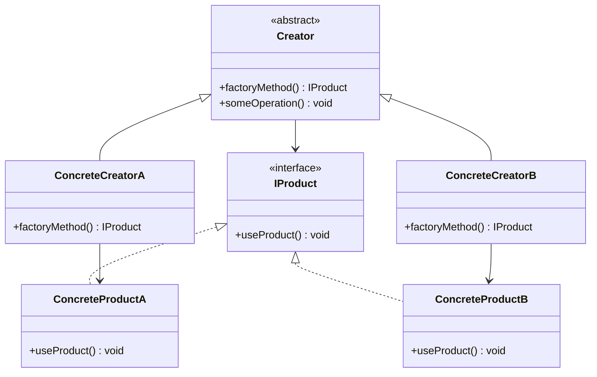

## 4.2 Factory Method Pattern

The Factory Method Pattern is a creational design pattern that provides an interface for creating objects in a superclass but allows subclasses to alter the type of objects that will be created. This pattern is particularly useful in scenarios where a class cannot anticipate the class of objects it must create or when a class wants its subclasses to specify the objects it creates.

### Intent

The primary intent of the Factory Method Pattern is to define an interface for creating an object, but let subclasses decide which class to instantiate. This pattern lets a class defer instantiation to subclasses, promoting loose coupling and enhancing flexibility in code.

### Key Participants

1. **Product**: Defines the interface of objects the factory method creates.
2. **ConcreteProduct**: Implements the Product interface.
3. **Creator**: Declares the factory method, which returns an object of type Product.
4. **ConcreteCreator**: Overrides the factory method to return an instance of a ConcreteProduct.

### Implementing Factory Method in Haxe

#### Using Abstract Classes and Interfaces

In Haxe, we can leverage abstract classes and interfaces to implement the Factory Method Pattern. Abstract classes provide a base for concrete factories, while interfaces define the contract for the products.

```haxe
// Define the Product interface
interface IProduct {
    public function useProduct():Void;
}

// Implement ConcreteProductA
class ConcreteProductA implements IProduct {
    public function new() {}
    public function useProduct():Void {
        trace("Using ConcreteProductA");
    }
}

// Implement ConcreteProductB
class ConcreteProductB implements IProduct {
    public function new() {}
    public function useProduct():Void {
        trace("Using ConcreteProductB");
    }
}

// Define the Creator abstract class
abstract class Creator {
    public function new() {}
    public function factoryMethod():IProduct;
    public function someOperation():Void {
        var product:IProduct = factoryMethod();
        product.useProduct();
    }
}

// Implement ConcreteCreatorA
class ConcreteCreatorA extends Creator {
    public function new() { super(); }
    override public function factoryMethod():IProduct {
        return new ConcreteProductA();
    }
}

// Implement ConcreteCreatorB
class ConcreteCreatorB extends Creator {
    public function new() { super(); }
    override public function factoryMethod():IProduct {
        return new ConcreteProductB();
    }
}
```

In this example, `IProduct` is the interface for products, `ConcreteProductA` and `ConcreteProductB` are concrete implementations, `Creator` is the abstract class with a factory method, and `ConcreteCreatorA` and `ConcreteCreatorB` are concrete creators that instantiate specific products.

#### Creating Flexibility in Code

The Factory Method Pattern allows for flexibility in code by enabling the addition of new product types without altering existing code. This is achieved by creating new subclasses of the creator and product classes.

### Use Cases and Examples

#### UI Elements Creation

One of the common use cases for the Factory Method Pattern is in the creation of platform-specific UI components. By using this pattern, we can generate UI elements that are tailored to different platforms without changing the core logic of the application.

```haxe
// Define the UIElement interface
interface IUIElement {
    public function render():Void;
}

// Implement WindowsButton
class WindowsButton implements IUIElement {
    public function new() {}
    public function render():Void {
        trace("Rendering Windows Button");
    }
}

// Implement MacButton
class MacButton implements IUIElement {
    public function new() {}
    public function render():Void {
        trace("Rendering Mac Button");
    }
}

// Define the UIFactory abstract class
abstract class UIFactory {
    public function new() {}
    public function createButton():IUIElement;
}

// Implement WindowsFactory
class WindowsFactory extends UIFactory {
    public function new() { super(); }
    override public function createButton():IUIElement {
        return new WindowsButton();
    }
}

// Implement MacFactory
class MacFactory extends UIFactory {
    public function new() { super(); }
    override public function createButton():IUIElement {
        return new MacButton();
    }
}
```

In this example, `IUIElement` is the interface for UI elements, `WindowsButton` and `MacButton` are concrete implementations, `UIFactory` is the abstract class with a factory method, and `WindowsFactory` and `MacFactory` are concrete factories that create platform-specific buttons.

#### Parsing Different Data Formats

Another practical application of the Factory Method Pattern is in parsing different data formats. By using this pattern, we can instantiate parsers based on file types, allowing for easy extension and maintenance.

```haxe
// Define the Parser interface
interface IParser {
    public function parse(data:String):Void;
}

// Implement JSONParser
class JSONParser implements IParser {
    public function new() {}
    public function parse(data:String):Void {
        trace("Parsing JSON data: " + data);
    }
}

// Implement XMLParser
class XMLParser implements IParser {
    public function new() {}
    public function parse(data:String):Void {
        trace("Parsing XML data: " + data);
    }
}

// Define the ParserFactory abstract class
abstract class ParserFactory {
    public function new() {}
    public function createParser():IParser;
}

// Implement JSONParserFactory
class JSONParserFactory extends ParserFactory {
    public function new() { super(); }
    override public function createParser():IParser {
        return new JSONParser();
    }
}

// Implement XMLParserFactory
class XMLParserFactory extends ParserFactory {
    public function new() { super(); }
    override public function createParser():IParser {
        return new XMLParser();
    }
}
```

In this example, `IParser` is the interface for parsers, `JSONParser` and `XMLParser` are concrete implementations, `ParserFactory` is the abstract class with a factory method, and `JSONParserFactory` and `XMLParserFactory` are concrete factories that create specific parsers.

### Design Considerations

When implementing the Factory Method Pattern in Haxe, consider the following:

- **Use Abstract Classes and Interfaces**: Define clear interfaces and abstract classes to ensure that the pattern is flexible and easy to extend.
- **Promote Loose Coupling**: By deferring instantiation to subclasses, you can reduce dependencies between classes and promote loose coupling.
- **Enhance Code Flexibility**: The pattern allows for the addition of new product types without altering existing code, making it easier to maintain and extend.

### Differences and Similarities

The Factory Method Pattern is often confused with the Abstract Factory Pattern. While both patterns deal with object creation, the Factory Method Pattern focuses on creating a single product, whereas the Abstract Factory Pattern is concerned with creating families of related products.

### Try It Yourself

To deepen your understanding of the Factory Method Pattern, try modifying the code examples provided. For instance, add a new product type or create a new concrete factory. Experiment with different scenarios to see how the pattern can be applied in various contexts.

### Visualizing the Factory Method Pattern

To better understand the Factory Method Pattern, let's visualize it using a class diagram:



This diagram illustrates the relationships between the creator, concrete creators, product interface, and concrete products.

### Knowledge Check

Before we conclude, let's review some key points:

- The Factory Method Pattern defines an interface for creating objects but lets subclasses decide which class to instantiate.
- It promotes loose coupling and enhances flexibility in code.
- It is commonly used in scenarios where a class cannot anticipate the class of objects it must create.

### Embrace the Journey

Remember, mastering design patterns is a journey. As you continue to explore and apply these patterns, you'll gain a deeper understanding of their benefits and how they can improve your software design. Keep experimenting, stay curious, and enjoy the process!

## Quiz Time!



### What is the primary intent of the Factory Method Pattern?

- [x] To define an interface for creating an object, but let subclasses decide which class to instantiate.
- [ ] To create families of related products.
- [ ] To provide a single interface to a set of interfaces in a subsystem.
- [ ] To separate the construction of a complex object from its representation.

> **Explanation:** The Factory Method Pattern's primary intent is to define an interface for creating an object, but let subclasses decide which class to instantiate.

### Which of the following is a key participant in the Factory Method Pattern?

- [x] Creator
- [ ] Adapter
- [ ] Facade
- [ ] Singleton

> **Explanation:** The Creator is a key participant in the Factory Method Pattern, responsible for declaring the factory method.

### How does the Factory Method Pattern promote loose coupling?

- [x] By deferring instantiation to subclasses.
- [ ] By using a single instance of a class.
- [ ] By providing a unified interface to a set of interfaces.
- [ ] By encapsulating a request as an object.

> **Explanation:** The Factory Method Pattern promotes loose coupling by deferring instantiation to subclasses, reducing dependencies between classes.

### What is a common use case for the Factory Method Pattern?

- [x] Creating platform-specific UI components.
- [ ] Implementing a single instance of a class.
- [ ] Providing a simplified interface to a complex subsystem.
- [ ] Separating the construction of a complex object from its representation.

> **Explanation:** A common use case for the Factory Method Pattern is creating platform-specific UI components.

### How does the Factory Method Pattern enhance code flexibility?

- [x] By allowing the addition of new product types without altering existing code.
- [ ] By ensuring a class has only one instance.
- [ ] By providing a single interface to a set of interfaces.
- [ ] By encapsulating a request as an object.

> **Explanation:** The Factory Method Pattern enhances code flexibility by allowing the addition of new product types without altering existing code.

### What is the difference between the Factory Method Pattern and the Abstract Factory Pattern?

- [x] The Factory Method Pattern focuses on creating a single product, whereas the Abstract Factory Pattern is concerned with creating families of related products.
- [ ] The Factory Method Pattern provides a single interface to a set of interfaces, whereas the Abstract Factory Pattern defines an interface for creating an object.
- [ ] The Factory Method Pattern ensures a class has only one instance, whereas the Abstract Factory Pattern separates the construction of a complex object from its representation.
- [ ] The Factory Method Pattern encapsulates a request as an object, whereas the Abstract Factory Pattern provides a simplified interface to a complex subsystem.

> **Explanation:** The Factory Method Pattern focuses on creating a single product, whereas the Abstract Factory Pattern is concerned with creating families of related products.

### Which of the following is a concrete implementation in the Factory Method Pattern?

- [x] ConcreteProductA
- [ ] Adapter
- [ ] Facade
- [ ] Singleton

> **Explanation:** ConcreteProductA is a concrete implementation in the Factory Method Pattern, implementing the Product interface.

### What is the role of the ConcreteCreator in the Factory Method Pattern?

- [x] To override the factory method to return an instance of a ConcreteProduct.
- [ ] To provide a single interface to a set of interfaces.
- [ ] To ensure a class has only one instance.
- [ ] To encapsulate a request as an object.

> **Explanation:** The role of the ConcreteCreator in the Factory Method Pattern is to override the factory method to return an instance of a ConcreteProduct.

### Which of the following is NOT a benefit of the Factory Method Pattern?

- [ ] Promotes loose coupling.
- [ ] Enhances code flexibility.
- [ ] Allows for easy extension and maintenance.
- [x] Ensures a class has only one instance.

> **Explanation:** Ensuring a class has only one instance is a benefit of the Singleton Pattern, not the Factory Method Pattern.

### True or False: The Factory Method Pattern can be used to instantiate parsers based on file types.

- [x] True
- [ ] False

> **Explanation:** True. The Factory Method Pattern can be used to instantiate parsers based on file types, allowing for easy extension and maintenance.


