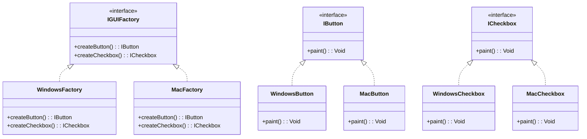

## 4.3 Abstract Factory Pattern

The Abstract Factory Pattern is a creational design pattern that provides an interface for creating families of related or dependent objects without specifying their concrete classes. This pattern is particularly useful in Haxe for developing cross-platform applications where the same codebase needs to produce different outputs depending on the target platform.

### Intent

The primary intent of the Abstract Factory Pattern is to encapsulate a group of individual factories that have a common theme. It separates the creation of objects from their usage, allowing for more flexible and scalable code. This pattern is ideal for scenarios where a system needs to be independent of how its objects are created, composed, and represented.

### Key Participants

1. **AbstractFactory**: Declares an interface for operations that create abstract product objects.
2. **ConcreteFactory**: Implements the operations to create concrete product objects.
3. **AbstractProduct**: Declares an interface for a type of product object.
4. **ConcreteProduct**: Defines a product object to be created by the corresponding concrete factory and implements the AbstractProduct interface.
5. **Client**: Uses only interfaces declared by AbstractFactory and AbstractProduct classes.

### Implementing Abstract Factory in Haxe

#### Defining Abstract Factory Interface

In Haxe, we define an abstract factory interface that outlines methods for creating products. This interface will be implemented by concrete factories to produce platform-specific or variant-specific objects.

```haxe
interface IGUIFactory {
    public function createButton(): IButton;
    public function createCheckbox(): ICheckbox;
}

interface IButton {
    public function paint(): Void;
}

interface ICheckbox {
    public function paint(): Void;
}
```

#### Concrete Factories

Concrete factories implement the abstract factory interface to create concrete products. Each factory corresponds to a specific platform or variant.

```haxe
class WindowsFactory implements IGUIFactory {
    public function createButton(): IButton {
        return new WindowsButton();
    }

    public function createCheckbox(): ICheckbox {
        return new WindowsCheckbox();
    }
}

class MacFactory implements IGUIFactory {
    public function createButton(): IButton {
        return new MacButton();
    }

    public function createCheckbox(): ICheckbox {
        return new MacCheckbox();
    }
}
```

#### Concrete Products

Concrete products implement the abstract product interfaces. Each product is tailored to a specific platform or variant.

```haxe
class WindowsButton implements IButton {
    public function paint(): Void {
        trace("Rendering a button in Windows style.");
    }
}

class WindowsCheckbox implements ICheckbox {
    public function paint(): Void {
        trace("Rendering a checkbox in Windows style.");
    }
}

class MacButton implements IButton {
    public function paint(): Void {
        trace("Rendering a button in Mac style.");
    }
}

class MacCheckbox implements ICheckbox {
    public function paint(): Void {
        trace("Rendering a checkbox in Mac style.");
    }
}
```

#### Client Code

The client code works with factories and products through their abstract interfaces. This allows the client to remain independent of the concrete classes it uses.

```haxe
class Application {
    private var factory: IGUIFactory;

    public function new(factory: IGUIFactory) {
        this.factory = factory;
    }

    public function createUI(): Void {
        var button: IButton = factory.createButton();
        var checkbox: ICheckbox = factory.createCheckbox();
        button.paint();
        checkbox.paint();
    }
}

// Usage
class Main {
    static public function main() {
        var factory: IGUIFactory = new WindowsFactory();
        var app: Application = new Application(factory);
        app.createUI();
    }
}
```

### Visualizing the Abstract Factory Pattern



### Use Cases and Examples

#### Cross-Platform Libraries

The Abstract Factory Pattern is particularly useful in creating UI controls for different platforms. For instance, a cross-platform library can use this pattern to generate platform-specific UI components like buttons and checkboxes, ensuring that the application maintains a native look and feel across different operating systems.

#### Theming Engines

In theming engines, the Abstract Factory Pattern can be used to generate styled components based on themes. By defining a factory for each theme, the application can dynamically switch between different visual styles without altering the underlying logic.

### Design Considerations

- **When to Use**: Use the Abstract Factory Pattern when you need to create families of related objects without specifying their concrete classes. It's particularly useful when the system needs to be independent of how its objects are created.
- **Haxe-Specific Features**: Haxe's cross-platform capabilities make it an ideal candidate for implementing the Abstract Factory Pattern. By leveraging Haxe's static typing and interface support, developers can create robust and flexible abstract factories.
- **Pitfalls**: One potential downside of the Abstract Factory Pattern is that it can lead to a proliferation of classes, making the system more complex. It's important to balance the benefits of flexibility with the cost of increased complexity.

### Differences and Similarities

- **Factory Method vs. Abstract Factory**: While both patterns deal with object creation, the Factory Method Pattern focuses on creating a single product, whereas the Abstract Factory Pattern deals with creating families of related products.
- **Builder Pattern**: The Builder Pattern is used for constructing complex objects step by step, whereas the Abstract Factory Pattern is used for creating families of related objects.

### Try It Yourself

Experiment with the provided code examples by creating additional concrete factories and products. For instance, try implementing a `LinuxFactory` with `LinuxButton` and `LinuxCheckbox` classes. Observe how the client code remains unchanged, demonstrating the flexibility of the Abstract Factory Pattern.

### Knowledge Check

- What is the primary intent of the Abstract Factory Pattern?
- How does the Abstract Factory Pattern promote flexibility in software design?
- What are the key participants in the Abstract Factory Pattern?
- How does the Abstract Factory Pattern differ from the Factory Method Pattern?
- What are some potential pitfalls of using the Abstract Factory Pattern?

### Embrace the Journey

Remember, mastering design patterns is a journey. As you continue to explore and implement these patterns, you'll gain a deeper understanding of software architecture and design. Keep experimenting, stay curious, and enjoy the process of becoming a more proficient software engineer!

## Quiz Time!



### What is the primary intent of the Abstract Factory Pattern?

- [x] To provide an interface for creating families of related objects without specifying their concrete classes.
- [ ] To create a single object without specifying its concrete class.
- [ ] To define a skeleton of an algorithm in a method.
- [ ] To separate the construction of a complex object from its representation.

> **Explanation:** The Abstract Factory Pattern provides an interface for creating families of related objects without specifying their concrete classes.

### Which of the following is a key participant in the Abstract Factory Pattern?

- [x] AbstractFactory
- [ ] Singleton
- [ ] Observer
- [ ] Adapter

> **Explanation:** AbstractFactory is a key participant in the Abstract Factory Pattern, responsible for declaring an interface for creating abstract product objects.

### How does the Abstract Factory Pattern differ from the Factory Method Pattern?

- [x] Abstract Factory deals with families of related objects, while Factory Method deals with a single product.
- [ ] Abstract Factory is used for creating a single object, while Factory Method is used for creating families of objects.
- [ ] Abstract Factory is a behavioral pattern, while Factory Method is a structural pattern.
- [ ] Abstract Factory is used for creating complex objects step by step.

> **Explanation:** The Abstract Factory Pattern deals with creating families of related objects, whereas the Factory Method Pattern focuses on creating a single product.

### What is a potential pitfall of the Abstract Factory Pattern?

- [x] It can lead to a proliferation of classes, increasing system complexity.
- [ ] It makes the system dependent on concrete classes.
- [ ] It does not support cross-platform development.
- [ ] It is not suitable for creating families of related objects.

> **Explanation:** One potential downside of the Abstract Factory Pattern is that it can lead to a proliferation of classes, making the system more complex.

### In Haxe, what feature makes it ideal for implementing the Abstract Factory Pattern?

- [x] Cross-platform capabilities and static typing.
- [ ] Dynamic typing and lack of interfaces.
- [ ] Lack of cross-platform support.
- [ ] Absence of static typing.

> **Explanation:** Haxe's cross-platform capabilities and static typing make it ideal for implementing the Abstract Factory Pattern.

### Which pattern is used for constructing complex objects step by step?

- [ ] Abstract Factory Pattern
- [ ] Factory Method Pattern
- [x] Builder Pattern
- [ ] Singleton Pattern

> **Explanation:** The Builder Pattern is used for constructing complex objects step by step.

### What is the role of the Client in the Abstract Factory Pattern?

- [x] It uses interfaces declared by AbstractFactory and AbstractProduct classes.
- [ ] It implements the operations to create concrete product objects.
- [ ] It declares an interface for a type of product object.
- [ ] It defines a product object to be created by the corresponding concrete factory.

> **Explanation:** The Client uses only interfaces declared by AbstractFactory and AbstractProduct classes.

### Which of the following is NOT a concrete product in the provided Haxe example?

- [ ] WindowsButton
- [ ] MacCheckbox
- [x] IButton
- [ ] WindowsCheckbox

> **Explanation:** IButton is an interface, not a concrete product.

### What does the Abstract Factory Pattern encapsulate?

- [x] A group of individual factories with a common theme.
- [ ] A single factory for creating a specific product.
- [ ] A method for creating a single object.
- [ ] A process for constructing complex objects.

> **Explanation:** The Abstract Factory Pattern encapsulates a group of individual factories that have a common theme.

### True or False: The Abstract Factory Pattern is ideal for scenarios where a system needs to be dependent on how its objects are created.

- [ ] True
- [x] False

> **Explanation:** The Abstract Factory Pattern is ideal for scenarios where a system needs to be independent of how its objects are created.


