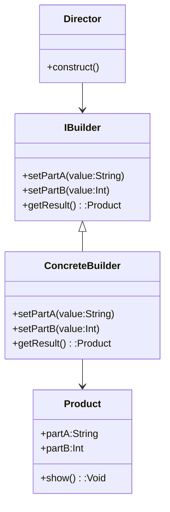

## 4.4 Builder Pattern

The Builder Pattern is a creational design pattern that provides a flexible solution to various object creation problems in object-oriented programming. It separates the construction of a complex object from its representation, allowing the same construction process to create different representations. This pattern is particularly useful in Haxe, given its cross-platform capabilities and the need to manage complex object creation across different environments.

### Intent

The primary intent of the Builder Pattern is to construct a complex object step by step. Unlike other creational patterns, the Builder Pattern does not require products to have a common interface, which allows for more flexibility in the types of objects that can be created.

### Key Participants

- **Builder Interface**: Defines the steps required to create a product.
- **Concrete Builders**: Implement the steps defined in the Builder interface to construct and assemble parts of the product.
- **Director**: Constructs an object using the Builder interface.
- **Product**: The complex object that is being constructed.

### Implementing Builder in Haxe

Let's explore how to implement the Builder Pattern in Haxe, focusing on the Builder Interface, Concrete Builders, and the Director class.

#### Builder Interface and Concrete Builders

The Builder interface defines the steps for constructing the product. Concrete Builders implement these steps to create specific representations of the product.

```haxe
// Builder Interface
interface IBuilder {
    function setPartA(value:String):Void;
    function setPartB(value:Int):Void;
    function getResult():Product;
}

// Concrete Builder
class ConcreteBuilder implements IBuilder {
    private var product:Product = new Product();

    public function new() {}

    public function setPartA(value:String):Void {
        product.partA = value;
    }

    public function setPartB(value:Int):Void {
        product.partB = value;
    }

    public function getResult():Product {
        return product;
    }
}

// Product Class
class Product {
    public var partA:String;
    public var partB:Int;

    public function new() {}

    public function show():Void {
        trace("Part A: " + partA + ", Part B: " + partB);
    }
}
```

#### Director Class

The Director class is responsible for orchestrating the building process. It uses the Builder interface to construct a product.

```haxe
// Director Class
class Director {
    private var builder:IBuilder;

    public function new(builder:IBuilder) {
        this.builder = builder;
    }

    public function construct():Void {
        builder.setPartA("Example Part A");
        builder.setPartB(42);
    }
}
```

#### Fluent Interfaces

Fluent interfaces enhance the readability of the Builder Pattern by using method chaining. This approach allows for more intuitive and readable code.

```haxe
// Fluent Builder
class FluentBuilder {
    private var product:Product = new Product();

    public function new() {}

    public function withPartA(value:String):FluentBuilder {
        product.partA = value;
        return this;
    }

    public function withPartB(value:Int):FluentBuilder {
        product.partB = value;
        return this;
    }

    public function build():Product {
        return product;
    }
}
```

### Use Cases and Examples

The Builder Pattern is particularly useful in scenarios where complex objects need to be created, such as documents, configurations, or reports. It also supports dynamic object creation based on user input or configurations.

#### Creating Complex Objects

Consider a scenario where we need to create a complex configuration object for a software application. The Builder Pattern allows us to construct this object step by step, ensuring that all necessary components are included.

```haxe
// Configuration Builder Example
class Configuration {
    public var database:String;
    public var server:String;
    public var port:Int;

    public function new() {}

    public function showConfig():Void {
        trace("Database: " + database + ", Server: " + server + ", Port: " + port);
    }
}

interface IConfigurationBuilder {
    function setDatabase(db:String):Void;
    function setServer(server:String):Void;
    function setPort(port:Int):Void;
    function getConfig():Configuration;
}

class ConfigurationBuilder implements IConfigurationBuilder {
    private var config:Configuration = new Configuration();

    public function new() {}

    public function setDatabase(db:String):Void {
        config.database = db;
    }

    public function setServer(server:String):Void {
        config.server = server;
    }

    public function setPort(port:Int):Void {
        config.port = port;
    }

    public function getConfig():Configuration {
        return config;
    }
}
```

#### Dynamic Object Creation

The Builder Pattern can be used to tailor objects based on user input or configurations, making it ideal for applications that require dynamic object creation.

```haxe
// Dynamic Object Creation Example
class User {
    public var name:String;
    public var age:Int;
    public var email:String;

    public function new() {}

    public function showUser():Void {
        trace("Name: " + name + ", Age: " + age + ", Email: " + email);
    }
}

interface IUserBuilder {
    function setName(name:String):Void;
    function setAge(age:Int):Void;
    function setEmail(email:String):Void;
    function getUser():User;
}

class UserBuilder implements IUserBuilder {
    private var user:User = new User();

    public function new() {}

    public function setName(name:String):Void {
        user.name = name;
    }

    public function setAge(age:Int):Void {
        user.age = age;
    }

    public function setEmail(email:String):Void {
        user.email = email;
    }

    public function getUser():User {
        return user;
    }
}
```

### Design Considerations

When using the Builder Pattern in Haxe, consider the following:

- **Flexibility**: The Builder Pattern provides flexibility in object creation, allowing for different representations of the same object.
- **Complexity**: While the pattern simplifies the construction of complex objects, it can introduce additional complexity in the codebase.
- **Haxe Features**: Utilize Haxe's static typing and type inference to ensure type safety and reduce errors during the building process.

### Differences and Similarities

The Builder Pattern is often confused with the Factory Method Pattern. While both patterns deal with object creation, the Builder Pattern focuses on constructing a complex object step by step, whereas the Factory Method Pattern deals with creating objects without specifying the exact class of object that will be created.

### Visualizing the Builder Pattern

To better understand the Builder Pattern, let's visualize the relationships between the key participants using a class diagram.



### Try It Yourself

Experiment with the Builder Pattern by modifying the code examples provided. Try creating different types of products or adding new methods to the Builder interface. This hands-on approach will deepen your understanding of the pattern and its applications.

### Knowledge Check

Before we conclude, let's reinforce your understanding with a few questions:

- What is the primary intent of the Builder Pattern?
- How does the Builder Pattern differ from the Factory Method Pattern?
- What are some use cases for the Builder Pattern in Haxe?

### Embrace the Journey

Remember, mastering design patterns is a journey. As you continue to explore and apply these patterns, you'll become more adept at creating flexible and maintainable software solutions. Keep experimenting, stay curious, and enjoy the process!

## Quiz Time!



### What is the primary intent of the Builder Pattern?

- [x] To separate the construction of a complex object from its representation.
- [ ] To create a single instance of a class.
- [ ] To define an interface for creating an object, but let subclasses alter the type of objects that will be created.
- [ ] To provide a way to access the elements of an aggregate object sequentially without exposing its underlying representation.

> **Explanation:** The Builder Pattern's main intent is to separate the construction of a complex object from its representation, allowing the same construction process to create different representations.

### Which of the following is a key participant in the Builder Pattern?

- [x] Builder Interface
- [ ] Singleton
- [ ] Observer
- [ ] Adapter

> **Explanation:** The Builder Interface is a key participant in the Builder Pattern, defining the steps required to create a product.

### How does the Builder Pattern differ from the Factory Method Pattern?

- [x] The Builder Pattern focuses on constructing a complex object step by step.
- [ ] The Builder Pattern creates a single instance of a class.
- [ ] The Builder Pattern defines an interface for creating an object, but lets subclasses alter the type of objects that will be created.
- [ ] The Builder Pattern provides a way to access the elements of an aggregate object sequentially without exposing its underlying representation.

> **Explanation:** The Builder Pattern focuses on constructing a complex object step by step, whereas the Factory Method Pattern deals with creating objects without specifying the exact class of object that will be created.

### What is a benefit of using fluent interfaces in the Builder Pattern?

- [x] Enhanced readability through method chaining.
- [ ] Reduced memory usage.
- [ ] Increased execution speed.
- [ ] Simplified error handling.

> **Explanation:** Fluent interfaces enhance readability by using method chaining, making the code more intuitive and easier to read.

### Which Haxe feature can be utilized to ensure type safety in the Builder Pattern?

- [x] Static typing
- [ ] Dynamic typing
- [ ] Reflection
- [ ] Macros

> **Explanation:** Haxe's static typing feature can be utilized to ensure type safety and reduce errors during the building process.

### What is the role of the Director class in the Builder Pattern?

- [x] To orchestrate the building process using the Builder interface.
- [ ] To define the steps required to create a product.
- [ ] To implement the steps defined in the Builder interface.
- [ ] To represent the complex object being constructed.

> **Explanation:** The Director class is responsible for orchestrating the building process using the Builder interface.

### In which scenario is the Builder Pattern particularly useful?

- [x] When creating complex objects such as documents, configurations, or reports.
- [ ] When creating a single instance of a class.
- [ ] When defining an interface for creating an object, but letting subclasses alter the type of objects that will be created.
- [ ] When accessing the elements of an aggregate object sequentially without exposing its underlying representation.

> **Explanation:** The Builder Pattern is particularly useful when creating complex objects such as documents, configurations, or reports.

### What is a potential drawback of using the Builder Pattern?

- [x] It can introduce additional complexity in the codebase.
- [ ] It reduces flexibility in object creation.
- [ ] It limits the types of objects that can be created.
- [ ] It requires all products to have a common interface.

> **Explanation:** While the Builder Pattern simplifies the construction of complex objects, it can introduce additional complexity in the codebase.

### What is the purpose of the `getResult()` method in the Builder Pattern?

- [x] To return the constructed product.
- [ ] To set a part of the product.
- [ ] To orchestrate the building process.
- [ ] To define the steps required to create a product.

> **Explanation:** The `getResult()` method is used to return the constructed product in the Builder Pattern.

### True or False: The Builder Pattern requires all products to have a common interface.

- [x] False
- [ ] True

> **Explanation:** The Builder Pattern does not require all products to have a common interface, allowing for more flexibility in the types of objects that can be created.




