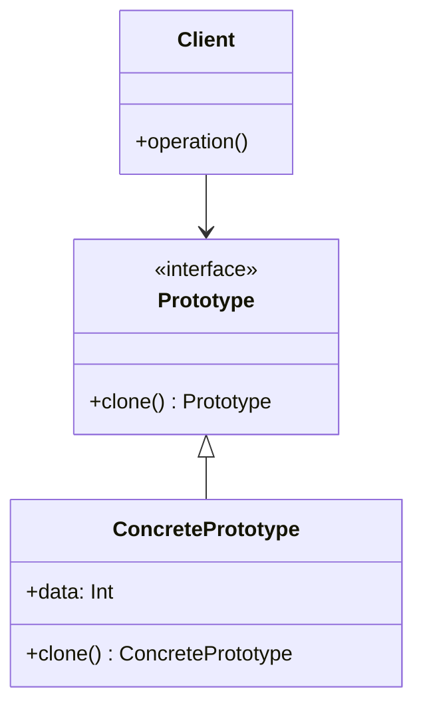

## 4.5 Prototype Pattern

The Prototype Pattern is a creational design pattern that allows you to create new objects by copying an existing one, rather than instantiating a new object from scratch. This approach can be particularly useful in scenarios where object creation is resource-intensive or when you need to maintain a dynamic object structure that can evolve at runtime.

### Intent

The primary intent of the Prototype Pattern is to:

- **Reduce the cost of creating objects** by cloning existing instances.
- **Allow dynamic object structures** that can be modified at runtime.
- **Simplify the creation of complex objects** by reusing existing instances as prototypes.

### Key Participants

1. **Prototype Interface**: Declares the `clone()` method for cloning objects.
2. **Concrete Prototype**: Implements the `clone()` method to create a copy of itself.
3. **Client**: Uses the `clone()` method to create new objects.

### Applicability

Use the Prototype Pattern when:

- Object creation is expensive or complex.
- You need to create objects dynamically at runtime.
- You want to avoid subclassing for object creation.
- You need to maintain a registry of objects that can be cloned.

### Implementing Prototype in Haxe

#### Cloning Methods

In Haxe, implementing the Prototype Pattern involves creating a `clone()` method that returns a copy of the object. This method can be implemented to perform either shallow or deep copies, depending on the requirements.

```haxe
interface Prototype<T> {
    public function clone():T;
}

class ConcretePrototype implements Prototype<ConcretePrototype> {
    public var data:Int;
    
    public function new(data:Int) {
        this.data = data;
    }
    
    public function clone():ConcretePrototype {
        // Create a new instance with the same data
        return new ConcretePrototype(this.data);
    }
}

// Usage
var original = new ConcretePrototype(42);
var copy = original.clone();
trace(copy.data); // Output: 42
```

In this example, the `ConcretePrototype` class implements the `Prototype` interface, providing a `clone()` method that creates a new instance with the same data.

#### Prototype Registries

A prototype registry can be used to store and manage prototypes for cloning. This approach allows you to maintain a collection of prototypes that can be cloned on demand.

```haxe
class PrototypeRegistry {
    private var prototypes:Map<String, Prototype<Dynamic>>;

    public function new() {
        prototypes = new Map<String, Prototype<Dynamic>>();
    }

    public function registerPrototype(key:String, prototype:Prototype<Dynamic>):Void {
        prototypes.set(key, prototype);
    }

    public function getPrototype(key:String):Prototype<Dynamic> {
        return prototypes.get(key);
    }
}

// Usage
var registry = new PrototypeRegistry();
var prototype = new ConcretePrototype(100);
registry.registerPrototype("example", prototype);

var clonedPrototype = registry.getPrototype("example").clone();
trace(clonedPrototype.data); // Output: 100
```

The `PrototypeRegistry` class manages a collection of prototypes, allowing you to register and retrieve prototypes by key.

### Use Cases and Examples

#### Performance Optimization

The Prototype Pattern can significantly reduce the cost of object creation, especially when dealing with complex objects that require significant resources to instantiate.

```haxe
class ExpensiveObject implements Prototype<ExpensiveObject> {
    public var data:Array<Int>;

    public function new() {
        // Simulate expensive initialization
        data = [];
        for (i in 0...1000000) {
            data.push(i);
        }
    }

    public function clone():ExpensiveObject {
        // Perform a shallow copy of the data array
        var newObj = new ExpensiveObject();
        newObj.data = this.data.copy();
        return newObj;
    }
}

// Usage
var original = new ExpensiveObject();
var copy = original.clone();
trace(copy.data.length); // Output: 1000000
```

In this example, the `ExpensiveObject` class simulates an expensive initialization process. By using the `clone()` method, we can create a new instance without repeating the costly initialization.

#### Dynamic Object Structures

The Prototype Pattern allows objects to evolve at runtime, enabling dynamic changes to object structures without the need for subclassing.

```haxe
class DynamicObject implements Prototype<DynamicObject> {
    public var properties:Map<String, Dynamic>;

    public function new() {
        properties = new Map<String, Dynamic>();
    }

    public function clone():DynamicObject {
        var newObj = new DynamicObject();
        for (key in properties.keys()) {
            newObj.properties.set(key, properties.get(key));
        }
        return newObj;
    }
}

// Usage
var dynamicObj = new DynamicObject();
dynamicObj.properties.set("name", "Prototype");
dynamicObj.properties.set("version", 1.0);

var clonedObj = dynamicObj.clone();
clonedObj.properties.set("version", 2.0);

trace(dynamicObj.properties.get("version")); // Output: 1.0
trace(clonedObj.properties.get("version")); // Output: 2.0
```

In this example, the `DynamicObject` class uses a map to store properties, allowing the object structure to change dynamically. The `clone()` method creates a new instance with the same properties.

### Design Considerations

- **Shallow vs. Deep Copy**: Decide whether to perform a shallow or deep copy based on the object structure and requirements. A shallow copy duplicates the top-level structure, while a deep copy duplicates all nested objects.
- **Prototype Registry**: Consider using a prototype registry to manage and organize prototypes, especially in large systems with many prototypes.
- **Performance**: The Prototype Pattern can improve performance by reducing the cost of object creation, but be mindful of the overhead associated with cloning complex objects.

### Differences and Similarities

The Prototype Pattern is often compared to the Factory Method and Abstract Factory patterns. While all three patterns deal with object creation, the Prototype Pattern focuses on cloning existing objects, whereas the Factory Method and Abstract Factory patterns involve creating new instances through factory methods.

### Visualizing the Prototype Pattern

To better understand the Prototype Pattern, let's visualize the process of cloning an object using a class diagram.



In this diagram, the `Prototype` interface defines the `clone()` method, which is implemented by the `ConcretePrototype` class. The `Client` class interacts with the `Prototype` interface to create new objects by cloning.

### Try It Yourself

Experiment with the Prototype Pattern by modifying the code examples:

- **Change the data type** in the `ConcretePrototype` class and observe how the `clone()` method handles different types.
- **Implement a deep copy** in the `ExpensiveObject` class by duplicating nested objects.
- **Add new properties** to the `DynamicObject` class and see how the `clone()` method adapts to changes.

### References and Links

For further reading on the Prototype Pattern and related concepts, consider the following resources:

- [Design Patterns: Elements of Reusable Object-Oriented Software](https://en.wikipedia.org/wiki/Design_Patterns) by Erich Gamma, Richard Helm, Ralph Johnson, and John Vlissides.
- [Haxe Programming Language](https://haxe.org/) - Official Haxe website.
- [Haxe Manual](https://haxe.org/manual/) - Comprehensive guide to Haxe features and syntax.

### Knowledge Check

To reinforce your understanding of the Prototype Pattern, consider the following questions:

- What are the key benefits of using the Prototype Pattern?
- How does the Prototype Pattern differ from the Factory Method pattern?
- When would you choose to use a shallow copy over a deep copy?

Remember, mastering the Prototype Pattern is just one step in your journey to becoming an expert in Haxe design patterns. Keep experimenting, stay curious, and enjoy the process of learning and applying new concepts!

## Quiz Time!



### What is the primary intent of the Prototype Pattern?

- [x] To create new objects by copying existing ones
- [ ] To create new objects using factory methods
- [ ] To define a family of algorithms
- [ ] To separate the construction of a complex object from its representation

> **Explanation:** The Prototype Pattern is designed to create new objects by copying existing ones, reducing the cost of object creation.

### Which method is essential in implementing the Prototype Pattern?

- [x] clone()
- [ ] create()
- [ ] build()
- [ ] initialize()

> **Explanation:** The `clone()` method is essential for creating copies of objects in the Prototype Pattern.

### What is a key advantage of using the Prototype Pattern?

- [x] Reducing the cost of object creation
- [ ] Simplifying the interface of a subsystem
- [ ] Allowing subclasses to redefine parts of an algorithm
- [ ] Providing a way to access the elements of an aggregate object

> **Explanation:** The Prototype Pattern reduces the cost of object creation by reusing existing instances.

### When should you consider using a deep copy in the Prototype Pattern?

- [x] When objects have nested structures
- [ ] When objects are simple and flat
- [ ] When performance is not a concern
- [ ] When objects are immutable

> **Explanation:** A deep copy is necessary when objects have nested structures that need to be duplicated.

### How does the Prototype Pattern differ from the Factory Method pattern?

- [x] Prototype clones existing objects, Factory Method creates new instances
- [ ] Prototype uses factory methods, Factory Method clones objects
- [ ] Prototype defines a family of algorithms, Factory Method separates construction
- [ ] Prototype is used for complex object construction, Factory Method for simple objects

> **Explanation:** The Prototype Pattern clones existing objects, while the Factory Method pattern creates new instances through factory methods.

### What is a prototype registry used for?

- [x] Managing and organizing prototypes for cloning
- [ ] Storing factory methods for object creation
- [ ] Defining a family of related algorithms
- [ ] Separating the construction of a complex object from its representation

> **Explanation:** A prototype registry is used to manage and organize prototypes for cloning.

### Which of the following is a key participant in the Prototype Pattern?

- [x] Concrete Prototype
- [ ] Abstract Factory
- [ ] Strategy
- [ ] Observer

> **Explanation:** The Concrete Prototype is a key participant that implements the `clone()` method.

### What is the role of the Client in the Prototype Pattern?

- [x] To use the `clone()` method to create new objects
- [ ] To define a family of related algorithms
- [ ] To separate the construction of a complex object from its representation
- [ ] To provide a way to access the elements of an aggregate object

> **Explanation:** The Client uses the `clone()` method to create new objects in the Prototype Pattern.

### True or False: The Prototype Pattern is useful for creating objects with dynamic structures.

- [x] True
- [ ] False

> **Explanation:** The Prototype Pattern is useful for creating objects with dynamic structures that can evolve at runtime.

### True or False: The Prototype Pattern is only applicable to immutable objects.

- [ ] True
- [x] False

> **Explanation:** The Prototype Pattern is applicable to both mutable and immutable objects, allowing for dynamic changes.


