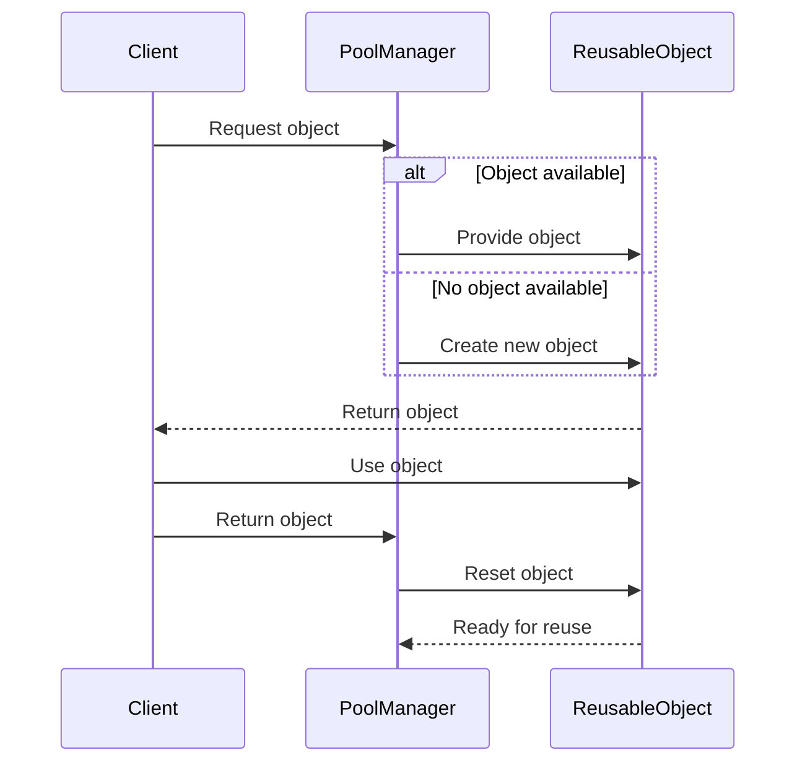

## 4.6 Object Pool Pattern

In the realm of software design, especially when dealing with resource-intensive applications, the Object Pool Pattern emerges as a powerful tool. This pattern is particularly useful in scenarios where the cost of initializing a class instance is high, the rate of instantiation is high, or the number of instances in use at any one time is low. By reusing objects instead of creating new ones, we can significantly improve performance and resource management.

### **Intent**

The primary intent of the Object Pool Pattern is to manage a pool of reusable objects, thereby reducing the overhead associated with creating and destroying objects. This pattern is particularly beneficial in environments where object creation is costly in terms of time or resources.

### **Key Participants**

- **Pool Manager:** Responsible for maintaining the pool of objects, tracking which objects are in use and which are available.
- **Reusable Object:** The object that is being managed by the pool. It should be resettable to a clean state before being reused.
- **Client:** The code that requests objects from the pool and returns them when done.

### **Applicability**

Use the Object Pool Pattern when:

- Object creation is expensive or time-consuming.
- You need a large number of short-lived objects.
- You want to limit the number of instances of a class.
- You need to manage resources like database connections, threads, or network connections.

### **Implementing Object Pool in Haxe**

#### **Pool Management**

In Haxe, implementing an object pool involves creating a class that manages the lifecycle of objects. This includes tracking which objects are in use and which are available for reuse.

```haxe
class ObjectPool<T> {
    private var available:Array<T>;
    private var inUse:Array<T>;

    public function new() {
        available = new Array<T>();
        inUse = new Array<T>();
    }

    public function acquire(createFunc:Void -> T):T {
        var obj:T;
        if (available.length > 0) {
            obj = available.pop();
        } else {
            obj = createFunc();
        }
        inUse.push(obj);
        return obj;
    }

    public function release(obj:T):Void {
        if (inUse.remove(obj)) {
            available.push(obj);
        }
    }
}
```

In this example, we define a generic `ObjectPool` class that can manage any type of object. The `acquire` method retrieves an object from the pool, creating a new one if necessary, while the `release` method returns an object to the pool for future reuse.

#### **Resource Allocation**

Managing the lifecycle of objects in the pool involves ensuring that objects are properly initialized before use and cleaned up after use. This can be achieved by defining a protocol for object initialization and cleanup.

```haxe
interface Poolable {
    public function reset():Void;
}

class Bullet implements Poolable {
    public var x:Float;
    public var y:Float;

    public function new() {
        reset();
    }

    public function reset():Void {
        x = 0;
        y = 0;
    }
}

// Usage
var bulletPool = new ObjectPool<Bullet>();
var bullet = bulletPool.acquire(() -> new Bullet());
bullet.x = 100;
bullet.y = 200;
// Use the bullet...
bulletPool.release(bullet);
```

In this example, the `Bullet` class implements a `Poolable` interface with a `reset` method. This method is called to reset the object's state before it is reused.

### **Use Cases and Examples**

#### **Game Development**

In game development, the Object Pool Pattern is often used to manage objects like particles, bullets, or enemies. These objects are frequently created and destroyed, making them ideal candidates for pooling.

```haxe
class Particle implements Poolable {
    public var active:Bool;
    public var position:Vector2;

    public function new() {
        reset();
    }

    public function reset():Void {
        active = false;
        position = new Vector2(0, 0);
    }
}

// Particle system using object pool
class ParticleSystem {
    private var particlePool:ObjectPool<Particle>;

    public function new() {
        particlePool = new ObjectPool<Particle>();
    }

    public function emitParticle(x:Float, y:Float):Void {
        var particle = particlePool.acquire(() -> new Particle());
        particle.active = true;
        particle.position.set(x, y);
        // Add particle to the scene...
    }

    public function update():Void {
        // Update particles...
        for (particle in particlePool.inUse) {
            if (!particle.active) {
                particlePool.release(particle);
            }
        }
    }
}
```

In this particle system, particles are acquired from the pool when emitted and returned to the pool when they become inactive.

#### **Connection Pools**

Another common use case for the Object Pool Pattern is managing database or network connections. These resources are expensive to create and destroy, making pooling an effective strategy.

```haxe
class Connection implements Poolable {
    public var connected:Bool;

    public function new() {
        reset();
    }

    public function reset():Void {
        connected = false;
    }

    public function connect():Void {
        // Establish connection...
        connected = true;
    }

    public function disconnect():Void {
        // Close connection...
        connected = false;
    }
}

// Connection pool
class ConnectionPool {
    private var connectionPool:ObjectPool<Connection>;

    public function new() {
        connectionPool = new ObjectPool<Connection>();
    }

    public function getConnection():Connection {
        var connection = connectionPool.acquire(() -> new Connection());
        if (!connection.connected) {
            connection.connect();
        }
        return connection;
    }

    public function releaseConnection(connection:Connection):Void {
        connection.disconnect();
        connectionPool.release(connection);
    }
}
```

In this example, the `Connection` class represents a database or network connection. The `ConnectionPool` class manages these connections, ensuring they are properly connected and disconnected as needed.

### **Design Considerations**

When implementing the Object Pool Pattern, consider the following:

- **Thread Safety:** Ensure that the pool is thread-safe if it will be accessed by multiple threads.
- **Object Initialization:** Objects should be properly initialized before being returned to the client.
- **Object Cleanup:** Objects should be cleaned up before being returned to the pool.
- **Pool Size:** Determine an appropriate pool size to balance memory usage and performance.

### **Differences and Similarities**

The Object Pool Pattern is often confused with the Flyweight Pattern. While both patterns aim to reduce memory usage, the Flyweight Pattern focuses on sharing immutable data, whereas the Object Pool Pattern focuses on reusing mutable objects.

### **Visualizing the Object Pool Pattern**

To better understand the Object Pool Pattern, let's visualize the interaction between the pool manager, reusable objects, and clients.



This sequence diagram illustrates the process of acquiring and releasing objects in the pool, highlighting the role of the pool manager in managing object lifecycle.

### **Try It Yourself**

Experiment with the object pool implementation by modifying the code examples:

- **Change the pool size:** Adjust the number of objects in the pool to see how it affects performance.
- **Add logging:** Include logging statements to track when objects are created, acquired, and released.
- **Implement a different object type:** Create a pool for a different type of object, such as a network socket or a thread.

### **References and Links**

For further reading on the Object Pool Pattern and its applications, consider the following resources:

- [Design Patterns: Elements of Reusable Object-Oriented Software](https://en.wikipedia.org/wiki/Design_Patterns) by Erich Gamma et al.
- [Haxe Manual](https://haxe.org/manual/) for detailed information on Haxe language features.
- [MDN Web Docs](https://developer.mozilla.org/) for general programming concepts and best practices.

### **Knowledge Check**

Before moving on, let's reinforce what we've learned about the Object Pool Pattern with a few questions and exercises.

## Quiz Time!



### What is the primary intent of the Object Pool Pattern?

- [x] To manage a pool of reusable objects to reduce the overhead of object creation and destruction.
- [ ] To create a new object for each request to ensure data integrity.
- [ ] To share immutable data among multiple clients.
- [ ] To simplify the interface of a complex subsystem.

> **Explanation:** The Object Pool Pattern is designed to manage reusable objects, reducing the cost associated with creating and destroying objects.

### Which of the following is a key participant in the Object Pool Pattern?

- [x] Pool Manager
- [ ] Singleton
- [ ] Adapter
- [ ] Decorator

> **Explanation:** The Pool Manager is responsible for maintaining the pool of objects and tracking their usage.

### When is the Object Pool Pattern most applicable?

- [x] When object creation is expensive or time-consuming.
- [ ] When objects are immutable and shared among clients.
- [ ] When you need to simplify a complex interface.
- [ ] When you need to add new functionality to existing objects.

> **Explanation:** The Object Pool Pattern is ideal for scenarios where object creation is costly and objects are frequently reused.

### What should be done to an object before it is returned to the pool?

- [x] It should be reset to a clean state.
- [ ] It should be destroyed.
- [ ] It should be converted to a different type.
- [ ] It should be serialized.

> **Explanation:** Objects should be reset to a clean state to ensure they are ready for reuse.

### How does the Object Pool Pattern differ from the Flyweight Pattern?

- [x] The Object Pool Pattern focuses on reusing mutable objects, while the Flyweight Pattern focuses on sharing immutable data.
- [ ] The Object Pool Pattern is used for creating new objects, while the Flyweight Pattern is used for reusing objects.
- [ ] The Object Pool Pattern is only applicable to database connections, while the Flyweight Pattern is applicable to all objects.
- [ ] The Object Pool Pattern is a structural pattern, while the Flyweight Pattern is a creational pattern.

> **Explanation:** The Object Pool Pattern reuses mutable objects, whereas the Flyweight Pattern shares immutable data among clients.

### What is a common use case for the Object Pool Pattern in game development?

- [x] Reusing particles, bullets, or enemies.
- [ ] Sharing textures among multiple sprites.
- [ ] Simplifying the game loop.
- [ ] Adding new features to existing game objects.

> **Explanation:** In game development, the Object Pool Pattern is often used to manage frequently created and destroyed objects like particles and bullets.

### What is a potential drawback of using the Object Pool Pattern?

- [x] Increased memory usage if the pool size is too large.
- [ ] Decreased performance due to object creation overhead.
- [ ] Difficulty in implementing thread safety.
- [ ] Inability to manage resource allocation.

> **Explanation:** If the pool size is too large, it can lead to increased memory usage, which is a potential drawback.

### What should be considered when implementing an object pool?

- [x] Thread safety, object initialization, and cleanup.
- [ ] Only the size of the pool.
- [ ] The type of objects being pooled.
- [ ] The programming language being used.

> **Explanation:** Thread safety, object initialization, and cleanup are important considerations when implementing an object pool.

### True or False: The Object Pool Pattern is only applicable to database connections.

- [ ] True
- [x] False

> **Explanation:** The Object Pool Pattern is applicable to any scenario where object creation is costly and objects can be reused, not just database connections.

### Which method is used to return an object to the pool in the provided Haxe example?

- [x] release
- [ ] acquire
- [ ] reset
- [ ] connect

> **Explanation:** The `release` method is used to return an object to the pool for future reuse.



Remember, mastering design patterns like the Object Pool Pattern is a journey. As you continue to explore and experiment with these patterns, you'll gain deeper insights into their applications and benefits. Keep experimenting, stay curious, and enjoy the journey!
