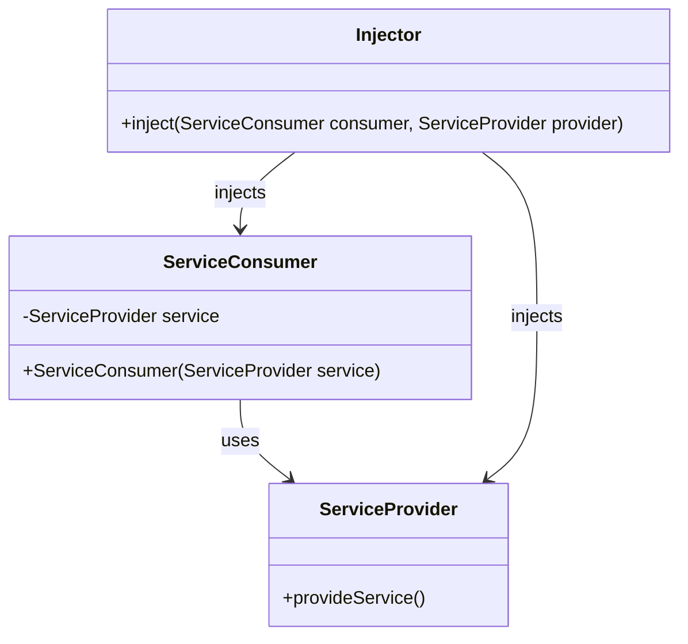

## 4.7 Dependency Injection Pattern

In the realm of software design, the Dependency Injection (DI) pattern stands as a pivotal technique for achieving loose coupling and enhancing code maintainability. By decoupling object creation from its usage, DI allows for greater flexibility and testability in software systems. In this section, we will delve into the intricacies of implementing the Dependency Injection pattern in Haxe, exploring various injection methods, use cases, and practical examples.

### Intent

The primary intent of the Dependency Injection pattern is to separate the concerns of object creation and object usage. This separation allows for more modular, testable, and maintainable code. By injecting dependencies rather than hard-coding them, we can easily swap out implementations, facilitate testing, and adhere to the principle of programming to an interface rather than an implementation.

### Key Participants

- **Service Consumer (Client):** The object that requires certain services or dependencies.
- **Service Provider:** The object that provides the required services or dependencies.
- **Injector:** The mechanism or framework responsible for injecting the dependencies into the client.

### Implementing Dependency Injection in Haxe

Haxe, with its robust type system and cross-platform capabilities, provides a conducive environment for implementing Dependency Injection. Let's explore the three primary methods of DI: Constructor Injection, Setter Injection, and Interface-Based Injection.

#### Constructor Injection

Constructor Injection involves passing dependencies to the client through its constructor. This method ensures that the client is always in a valid state with all necessary dependencies provided at the time of instantiation.

```haxe
class Database {
    public function new() {}
    public function connect():Void {
        trace("Connected to database");
    }
}

class UserService {
    private var database:Database;

    public function new(database:Database) {
        this.database = database;
    }

    public function performAction():Void {
        database.connect();
        trace("Performing user service action");
    }
}

class Main {
    static function main() {
        var db = new Database();
        var userService = new UserService(db);
        userService.performAction();
    }
}
```

**Key Points:**
- The `UserService` class depends on the `Database` class.
- The `Database` instance is injected into `UserService` via its constructor.

#### Setter Injection

Setter Injection uses property setters to inject dependencies after the client has been instantiated. This method provides flexibility in changing dependencies at runtime.

```haxe
class Logger {
    public function new() {}
    public function log(message:String):Void {
        trace("Log: " + message);
    }
}

class Application {
    private var logger:Logger;

    public function new() {}

    public function setLogger(logger:Logger):Void {
        this.logger = logger;
    }

    public function run():Void {
        if (logger != null) {
            logger.log("Application is running");
        } else {
            trace("Logger not set");
        }
    }
}

class Main {
    static function main() {
        var app = new Application();
        var logger = new Logger();
        app.setLogger(logger);
        app.run();
    }
}
```

**Key Points:**
- The `Application` class has a `Logger` dependency.
- The `Logger` is injected via the `setLogger` method.

#### Interface-Based Injection

Interface-Based Injection involves programming to an interface rather than a concrete implementation. This method allows for greater flexibility and interchangeability of components.

```haxe
interface IStorage {
    function save(data:String):Void;
}

class FileStorage implements IStorage {
    public function new() {}
    public function save(data:String):Void {
        trace("Saving data to file: " + data);
    }
}

class CloudStorage implements IStorage {
    public function new() {}
    public function save(data:String):Void {
        trace("Saving data to cloud: " + data);
    }
}

class DataManager {
    private var storage:IStorage;

    public function new(storage:IStorage) {
        this.storage = storage;
    }

    public function saveData(data:String):Void {
        storage.save(data);
    }
}

class Main {
    static function main() {
        var fileStorage = new FileStorage();
        var dataManager = new DataManager(fileStorage);
        dataManager.saveData("Important data");

        var cloudStorage = new CloudStorage();
        dataManager = new DataManager(cloudStorage);
        dataManager.saveData("Important data");
    }
}
```

**Key Points:**
- The `DataManager` class depends on the `IStorage` interface.
- Different implementations (`FileStorage`, `CloudStorage`) can be injected into `DataManager`.

### Use Cases and Examples

#### Testing and Mocking

Dependency Injection facilitates unit testing by allowing mock dependencies to be injected into the client. This enables testing of the client in isolation from its dependencies.

```haxe
class MockDatabase implements IStorage {
    public function new() {}
    public function save(data:String):Void {
        trace("Mock save: " + data);
    }
}

class Test {
    static function main() {
        var mockStorage = new MockDatabase();
        var dataManager = new DataManager(mockStorage);
        dataManager.saveData("Test data");
    }
}
```

**Key Points:**
- The `MockDatabase` class implements the `IStorage` interface.
- The `DataManager` can be tested with `MockDatabase` without affecting the actual storage.

#### Plugin Architectures

In plugin architectures, Dependency Injection allows for interchangeable components, enabling the dynamic addition or replacement of plugins without modifying the core application logic.

```haxe
interface Plugin {
    function execute():Void;
}

class PluginA implements Plugin {
    public function new() {}
    public function execute():Void {
        trace("Executing Plugin A");
    }
}

class PluginB implements Plugin {
    public function new() {}
    public function execute():Void {
        trace("Executing Plugin B");
    }
}

class PluginManager {
    private var plugin:Plugin;

    public function new(plugin:Plugin) {
        this.plugin = plugin;
    }

    public function runPlugin():Void {
        plugin.execute();
    }
}

class Main {
    static function main() {
        var pluginA = new PluginA();
        var manager = new PluginManager(pluginA);
        manager.runPlugin();

        var pluginB = new PluginB();
        manager = new PluginManager(pluginB);
        manager.runPlugin();
    }
}
```

**Key Points:**
- The `PluginManager` class depends on the `Plugin` interface.
- Different plugins (`PluginA`, `PluginB`) can be injected and executed dynamically.

### Design Considerations

When implementing Dependency Injection in Haxe, consider the following:

- **When to Use:** Use DI when you need to decouple object creation from usage, facilitate testing, or allow for interchangeable components.
- **Haxe-Specific Features:** Leverage Haxe's static typing and interface capabilities to enforce type safety and flexibility in DI implementations.
- **Pitfalls:** Avoid overusing DI, which can lead to complex configurations and reduced code readability.

### Differences and Similarities

Dependency Injection is often confused with other patterns like Service Locator. While both aim to decouple dependencies, DI explicitly injects dependencies, whereas Service Locator provides a centralized registry for retrieving them.

### Visualizing Dependency Injection

To better understand the flow of Dependency Injection, let's visualize the process using a class diagram.



**Diagram Description:** This diagram illustrates the relationship between the `ServiceConsumer`, `ServiceProvider`, and `Injector`. The `Injector` is responsible for injecting the `ServiceProvider` into the `ServiceConsumer`.

### Try It Yourself

Experiment with the provided code examples by:

- Modifying the `Database` class to simulate different database connections.
- Creating additional plugins and injecting them into the `PluginManager`.
- Implementing a new storage mechanism and testing it with `DataManager`.

### References and Links

- [Haxe Manual: Interfaces](https://haxe.org/manual/types-interfaces.html)
- [Martin Fowler's Inversion of Control Containers and the Dependency Injection pattern](https://martinfowler.com/articles/injection.html)
- [Wikipedia: Dependency Injection](https://en.wikipedia.org/wiki/Dependency_injection)

### Knowledge Check

- What are the three primary methods of Dependency Injection?
- How does Dependency Injection facilitate unit testing?
- What is the difference between Dependency Injection and Service Locator?

### Embrace the Journey

Remember, mastering Dependency Injection is a journey. As you continue to explore and implement DI in your projects, you'll discover new ways to enhance your code's flexibility and maintainability. Keep experimenting, stay curious, and enjoy the journey!

## Quiz Time!



### What is the primary intent of the Dependency Injection pattern?

- [x] To separate object creation from its usage
- [ ] To enhance object-oriented programming
- [ ] To provide a centralized registry for dependencies
- [ ] To improve performance

> **Explanation:** The primary intent of Dependency Injection is to decouple object creation from its usage, allowing for more flexible and maintainable code.

### Which method of Dependency Injection involves passing dependencies through the constructor?

- [x] Constructor Injection
- [ ] Setter Injection
- [ ] Interface-Based Injection
- [ ] Service Locator

> **Explanation:** Constructor Injection involves passing dependencies to the client through its constructor.

### How does Dependency Injection facilitate unit testing?

- [x] By allowing mock dependencies to be injected
- [ ] By providing a centralized registry for dependencies
- [ ] By enhancing object-oriented programming
- [ ] By improving performance

> **Explanation:** Dependency Injection facilitates unit testing by allowing mock dependencies to be injected, enabling testing of the client in isolation.

### What is a potential pitfall of overusing Dependency Injection?

- [x] Complex configurations and reduced code readability
- [ ] Improved performance
- [ ] Enhanced object-oriented programming
- [ ] Centralized registry for dependencies

> **Explanation:** Overusing Dependency Injection can lead to complex configurations and reduced code readability.

### Which of the following is NOT a method of Dependency Injection?

- [ ] Constructor Injection
- [ ] Setter Injection
- [ ] Interface-Based Injection
- [x] Service Locator

> **Explanation:** Service Locator is not a method of Dependency Injection; it provides a centralized registry for retrieving dependencies.

### What is the role of the Injector in Dependency Injection?

- [x] To inject dependencies into the client
- [ ] To provide a centralized registry for dependencies
- [ ] To enhance object-oriented programming
- [ ] To improve performance

> **Explanation:** The Injector is responsible for injecting dependencies into the client.

### Which method of Dependency Injection allows for changing dependencies at runtime?

- [ ] Constructor Injection
- [x] Setter Injection
- [ ] Interface-Based Injection
- [ ] Service Locator

> **Explanation:** Setter Injection allows for changing dependencies at runtime by using property setters.

### What is the benefit of programming to an interface in Dependency Injection?

- [x] Greater flexibility and interchangeability of components
- [ ] Improved performance
- [ ] Centralized registry for dependencies
- [ ] Enhanced object-oriented programming

> **Explanation:** Programming to an interface allows for greater flexibility and interchangeability of components.

### How does Dependency Injection relate to the principle of programming to an interface?

- [x] It encourages programming to an interface rather than a concrete implementation
- [ ] It provides a centralized registry for dependencies
- [ ] It enhances object-oriented programming
- [ ] It improves performance

> **Explanation:** Dependency Injection encourages programming to an interface rather than a concrete implementation, allowing for more flexible and maintainable code.

### True or False: Dependency Injection and Service Locator are the same pattern.

- [ ] True
- [x] False

> **Explanation:** Dependency Injection and Service Locator are different patterns. DI explicitly injects dependencies, while Service Locator provides a centralized registry for retrieving them.




