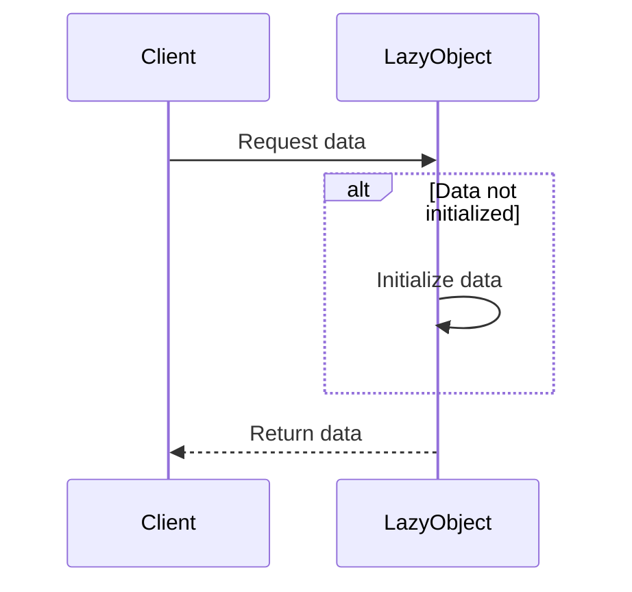

## 4.8 Lazy Initialization Pattern

In the world of software development, efficient resource management is crucial, especially when dealing with large-scale applications. The Lazy Initialization Pattern is a creational design pattern that helps optimize resource usage by delaying the creation of an object until it is absolutely necessary. This pattern is particularly useful in scenarios where the cost of creating an object is high, and the object may not be needed immediately or at all.

### Intent

The primary intent of the Lazy Initialization Pattern is to improve performance and resource utilization by deferring the instantiation of objects until they are needed. This can lead to significant savings in terms of memory and processing time, especially in applications with complex or resource-intensive components.

### Key Participants

- **Lazy Object:** The object whose initialization is deferred.
- **Lazy Initializer:** The mechanism or method responsible for initializing the object when it is first accessed.
- **Client:** The code that accesses the object and triggers its initialization.

### Applicability

Use the Lazy Initialization Pattern when:

- You have objects that are expensive to create and may not be used in every execution path.
- You want to improve the startup time of your application by deferring the creation of certain objects.
- You need to manage resources efficiently, especially in environments with limited memory or processing power.

### Implementing Lazy Initialization in Haxe

Haxe, with its powerful features like static typing and multi-paradigm support, provides several ways to implement lazy initialization. Let's explore some of these methods.

#### Lazy Variables

One of the simplest ways to implement lazy initialization in Haxe is through the use of lazy variables. This can be achieved using closures or properties to defer the initialization of a variable until it is accessed.

```haxe
class LazyExample {
    private var _heavyData: Array<Int> = null;

    public function new() {}

    public function get heavyData(): Array<Int> {
        if (_heavyData == null) {
            trace("Initializing heavy data...");
            _heavyData = loadHeavyData();
        }
        return _heavyData;
    }

    private function loadHeavyData(): Array<Int> {
        // Simulate loading a large data structure
        return [1, 2, 3, 4, 5];
    }
}

class Main {
    static public function main() {
        var example = new LazyExample();
        trace("Before accessing heavyData");
        trace(example.heavyData);
        trace("After accessing heavyData");
    }
}
```

In this example, the `heavyData` property is initialized only when it is accessed for the first time. This approach ensures that the resource-intensive operation of loading the data is performed only when necessary.

#### Thread Safety Considerations

In a concurrent environment, ensuring thread safety during lazy initialization is crucial. Without proper synchronization, multiple threads might attempt to initialize the same object simultaneously, leading to inconsistent states or resource wastage.

To address this, you can use synchronization mechanisms provided by Haxe, such as mutexes or locks, to ensure that only one thread can initialize the object at a time.

```haxe
class ThreadSafeLazyExample {
    private var _heavyData: Array<Int> = null;
    private var _lock: Mutex = new Mutex();

    public function new() {}

    public function get heavyData(): Array<Int> {
        _lock.lock();
        try {
            if (_heavyData == null) {
                trace("Thread-safe initialization of heavy data...");
                _heavyData = loadHeavyData();
            }
        } finally {
            _lock.unlock();
        }
        return _heavyData;
    }

    private function loadHeavyData(): Array<Int> {
        // Simulate loading a large data structure
        return [1, 2, 3, 4, 5];
    }
}
```

In this example, the `Mutex` class is used to ensure that the initialization of `heavyData` is thread-safe. The `lock()` and `unlock()` methods are used to control access to the critical section where the initialization occurs.

### Use Cases and Examples

The Lazy Initialization Pattern is applicable in various scenarios. Let's explore some common use cases.

#### Large Data Structures

In applications that deal with large data sets, such as databases or file systems, loading all data at once can be inefficient and resource-intensive. By using lazy initialization, you can load only the data that is needed at any given time.

```haxe
class LargeDataExample {
    private var _data: Map<String, String> = null;

    public function new() {}

    public function getData(key: String): String {
        if (_data == null) {
            trace("Loading data...");
            _data = loadData();
        }
        return _data.get(key);
    }

    private function loadData(): Map<String, String> {
        // Simulate loading data from a database
        return ["key1" => "value1", "key2" => "value2"];
    }
}
```

In this example, the data is loaded only when it is accessed for the first time, reducing the initial load time and memory usage.

#### Optional Services

In some applications, certain services or components may be optional and not required in every execution path. Lazy initialization allows you to defer the creation of these components until they are actually needed.

```haxe
class OptionalServiceExample {
    private var _service: OptionalService = null;

    public function new() {}

    public function useService() {
        if (_service == null) {
            trace("Initializing optional service...");
            _service = new OptionalService();
        }
        _service.performAction();
    }
}

class OptionalService {
    public function new() {}

    public function performAction() {
        trace("Service action performed.");
    }
}
```

In this example, the `OptionalService` is initialized only when the `useService()` method is called, allowing the application to run without the service if it is not needed.

### Design Considerations

When implementing the Lazy Initialization Pattern, consider the following:

- **Performance Trade-offs:** While lazy initialization can improve startup time and reduce memory usage, it may introduce latency when the object is accessed for the first time.
- **Thread Safety:** Ensure that your implementation is thread-safe if the object may be accessed by multiple threads concurrently.
- **Complexity:** Avoid overcomplicating your code with lazy initialization if the performance benefits are negligible.

### Differences and Similarities

The Lazy Initialization Pattern is often compared to other creational patterns like Singleton and Factory. While all these patterns deal with object creation, they serve different purposes:

- **Singleton Pattern:** Ensures a class has only one instance and provides a global point of access to it.
- **Factory Pattern:** Provides an interface for creating objects, allowing subclasses to alter the type of objects that will be created.
- **Lazy Initialization Pattern:** Delays the creation of an object until it is needed, optimizing resource usage.

### Try It Yourself

To get hands-on experience with the Lazy Initialization Pattern, try modifying the code examples provided. For instance, you can:

- Implement lazy initialization for a different type of object, such as a network connection or a file handle.
- Experiment with different synchronization mechanisms to ensure thread safety.
- Measure the performance impact of lazy initialization in a real-world application.

### Visualizing Lazy Initialization

To better understand the Lazy Initialization Pattern, let's visualize the process using a sequence diagram.



This diagram illustrates the sequence of interactions when a client requests data from a lazily initialized object. If the data is not yet initialized, the object initializes it before returning the data to the client.

### References and Links

For further reading on the Lazy Initialization Pattern and related concepts, consider the following resources:

- [Design Patterns: Elements of Reusable Object-Oriented Software](https://en.wikipedia.org/wiki/Design_Patterns) - A foundational book on design patterns.
- [Haxe Manual](https://haxe.org/manual/) - Official documentation for the Haxe programming language.
- [Concurrency in Haxe](https://haxe.org/manual/std-Thread.html) - Haxe documentation on threading and concurrency.

### Knowledge Check

To reinforce your understanding of the Lazy Initialization Pattern, consider the following questions:

- What are the primary benefits of using the Lazy Initialization Pattern?
- How can you ensure thread safety when implementing lazy initialization in a concurrent environment?
- In what scenarios is lazy initialization particularly useful?

### Embrace the Journey

Remember, mastering design patterns is a journey. As you continue to explore and apply these patterns in your projects, you'll gain a deeper understanding of their benefits and trade-offs. Keep experimenting, stay curious, and enjoy the process of becoming a more proficient software engineer.

## Quiz Time!



### What is the primary intent of the Lazy Initialization Pattern?

- [x] To improve performance and resource utilization by deferring object instantiation.
- [ ] To ensure a class has only one instance.
- [ ] To provide an interface for creating objects.
- [ ] To separate the construction of a complex object from its representation.

> **Explanation:** The Lazy Initialization Pattern aims to improve performance by delaying the creation of an object until it is needed.

### Which of the following is a key participant in the Lazy Initialization Pattern?

- [x] Lazy Initializer
- [ ] Singleton Instance
- [ ] Factory Method
- [ ] Abstract Factory

> **Explanation:** The Lazy Initializer is responsible for initializing the object when it is first accessed.

### When should you consider using the Lazy Initialization Pattern?

- [x] When objects are expensive to create and may not be used in every execution path.
- [ ] When you need to ensure a class has only one instance.
- [ ] When you want to provide an interface for creating objects.
- [ ] When you need to separate the construction of a complex object from its representation.

> **Explanation:** Lazy Initialization is useful when objects are costly to create and may not always be needed.

### How can you ensure thread safety during lazy initialization in Haxe?

- [x] Use synchronization mechanisms like mutexes or locks.
- [ ] Use a global variable to store the initialized object.
- [ ] Avoid using lazy initialization in concurrent environments.
- [ ] Use a static method to initialize the object.

> **Explanation:** Synchronization mechanisms like mutexes or locks ensure that only one thread can initialize the object at a time.

### What is a potential drawback of using the Lazy Initialization Pattern?

- [x] It may introduce latency when the object is accessed for the first time.
- [ ] It requires a global point of access to the object.
- [ ] It complicates the interface for creating objects.
- [ ] It separates the construction of a complex object from its representation.

> **Explanation:** Lazy Initialization can introduce latency during the first access as the object is created at that time.

### Which of the following is NOT a similarity between Lazy Initialization and Singleton Pattern?

- [x] Both ensure a class has only one instance.
- [ ] Both deal with object creation.
- [ ] Both can improve performance.
- [ ] Both can be implemented in Haxe.

> **Explanation:** The Singleton Pattern ensures a class has only one instance, while Lazy Initialization does not.

### What is a common use case for the Lazy Initialization Pattern?

- [x] Loading large data structures only when required.
- [ ] Ensuring a class has only one instance.
- [ ] Providing an interface for creating objects.
- [ ] Separating the construction of a complex object from its representation.

> **Explanation:** Lazy Initialization is often used to load large data structures only when they are needed.

### What is the role of the Client in the Lazy Initialization Pattern?

- [x] To access the object and trigger its initialization.
- [ ] To ensure a class has only one instance.
- [ ] To provide an interface for creating objects.
- [ ] To separate the construction of a complex object from its representation.

> **Explanation:** The Client accesses the object, triggering its initialization if it hasn't been initialized yet.

### Which Haxe feature is particularly useful for implementing lazy variables?

- [x] Closures or properties
- [ ] Static methods
- [ ] Global variables
- [ ] Abstract classes

> **Explanation:** Closures or properties can be used to defer the initialization of a variable until it is accessed.

### True or False: Lazy Initialization can be used to improve the startup time of an application.

- [x] True
- [ ] False

> **Explanation:** By deferring the creation of certain objects, Lazy Initialization can reduce the initial load time, improving startup performance.



Remember, this is just the beginning. As you progress, you'll build more complex and efficient applications using the Lazy Initialization Pattern. Keep experimenting, stay curious, and enjoy the journey!
