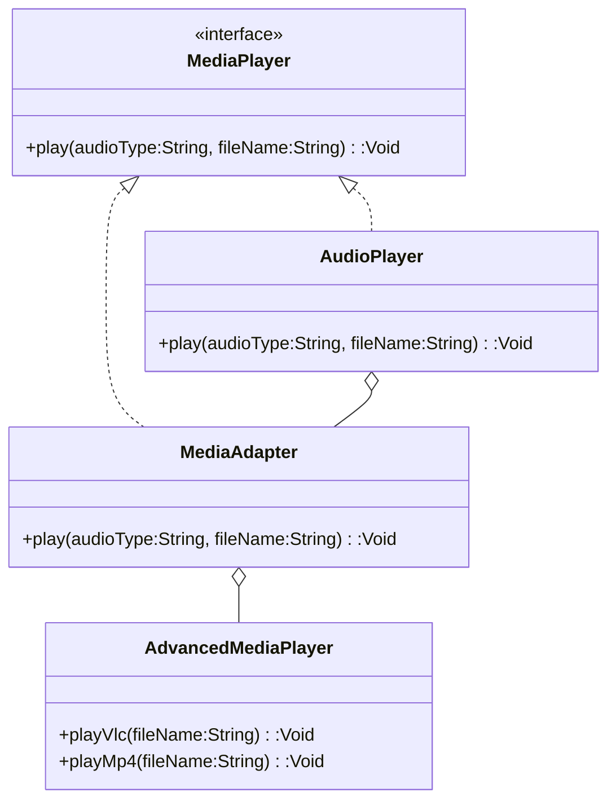

## 5.1 Adapter Pattern

In the realm of software design, the Adapter Pattern stands out as a crucial structural pattern that enables classes with incompatible interfaces to work together seamlessly. This pattern is particularly valuable in cross-platform development environments like Haxe, where integrating diverse components is often necessary. Let's delve into the intricacies of the Adapter Pattern, explore its implementation in Haxe, and examine practical use cases.

### Intent of the Adapter Pattern

The primary intent of the Adapter Pattern is to convert the interface of a class into another interface that clients expect. It allows classes with incompatible interfaces to collaborate without modifying their source code. This pattern is akin to a translator that enables communication between two parties speaking different languages.

### Key Participants

1. **Target Interface**: Defines the domain-specific interface that the client uses.
2. **Adaptee**: The existing interface that needs adapting.
3. **Adapter**: A class that bridges the gap between the Target and the Adaptee by implementing the Target interface and internally using an instance of the Adaptee.
4. **Client**: The class that interacts with the Target interface.

### Implementing Adapter in Haxe

Haxe, with its multi-paradigm support and cross-platform capabilities, provides a robust environment for implementing the Adapter Pattern. There are two primary ways to implement this pattern in Haxe: Class Adapter via Inheritance and Object Adapter via Composition.

#### Class Adapter via Inheritance

In this approach, the Adapter class inherits from the Adaptee and implements the Target interface. This method leverages inheritance to adapt the interface.

```haxe
// Target Interface
interface MediaPlayer {
    function play(audioType:String, fileName:String):Void;
}

// Adaptee Class
class AdvancedMediaPlayer {
    public function new() {}
    
    public function playVlc(fileName:String):Void {
        trace("Playing vlc file: " + fileName);
    }
    
    public function playMp4(fileName:String):Void {
        trace("Playing mp4 file: " + fileName);
    }
}

// Adapter Class
class MediaAdapter extends AdvancedMediaPlayer implements MediaPlayer {
    public function new() {
        super();
    }
    
    public function play(audioType:String, fileName:String):Void {
        if (audioType == "vlc") {
            playVlc(fileName);
        } else if (audioType == "mp4") {
            playMp4(fileName);
        }
    }
}

// Client Class
class AudioPlayer implements MediaPlayer {
    private var mediaAdapter:MediaAdapter;
    
    public function new() {
        mediaAdapter = new MediaAdapter();
    }
    
    public function play(audioType:String, fileName:String):Void {
        if (audioType == "mp3") {
            trace("Playing mp3 file: " + fileName);
        } else if (audioType == "vlc" || audioType == "mp4") {
            mediaAdapter.play(audioType, fileName);
        } else {
            trace("Invalid media. " + audioType + " format not supported");
        }
    }
}

// Usage
class Main {
    static public function main() {
        var audioPlayer = new AudioPlayer();
        audioPlayer.play("mp3", "song.mp3");
        audioPlayer.play("mp4", "video.mp4");
        audioPlayer.play("vlc", "movie.vlc");
        audioPlayer.play("avi", "clip.avi");
    }
}
```

In this example, `MediaAdapter` extends `AdvancedMediaPlayer` and implements the `MediaPlayer` interface, allowing it to adapt the `AdvancedMediaPlayer` methods to the `MediaPlayer` interface.

#### Object Adapter via Composition

This approach involves creating an Adapter class that contains an instance of the Adaptee. The Adapter implements the Target interface and delegates calls to the Adaptee.

```haxe
// Target Interface
interface MediaPlayer {
    function play(audioType:String, fileName:String):Void;
}

// Adaptee Class
class AdvancedMediaPlayer {
    public function new() {}
    
    public function playVlc(fileName:String):Void {
        trace("Playing vlc file: " + fileName);
    }
    
    public function playMp4(fileName:String):Void {
        trace("Playing mp4 file: " + fileName);
    }
}

// Adapter Class
class MediaAdapter implements MediaPlayer {
    private var advancedMediaPlayer:AdvancedMediaPlayer;
    
    public function new() {
        advancedMediaPlayer = new AdvancedMediaPlayer();
    }
    
    public function play(audioType:String, fileName:String):Void {
        if (audioType == "vlc") {
            advancedMediaPlayer.playVlc(fileName);
        } else if (audioType == "mp4") {
            advancedMediaPlayer.playMp4(fileName);
        }
    }
}

// Client Class
class AudioPlayer implements MediaPlayer {
    private var mediaAdapter:MediaAdapter;
    
    public function new() {
        mediaAdapter = new MediaAdapter();
    }
    
    public function play(audioType:String, fileName:String):Void {
        if (audioType == "mp3") {
            trace("Playing mp3 file: " + fileName);
        } else if (audioType == "vlc" || audioType == "mp4") {
            mediaAdapter.play(audioType, fileName);
        } else {
            trace("Invalid media. " + audioType + " format not supported");
        }
    }
}

// Usage
class Main {
    static public function main() {
        var audioPlayer = new AudioPlayer();
        audioPlayer.play("mp3", "song.mp3");
        audioPlayer.play("mp4", "video.mp4");
        audioPlayer.play("vlc", "movie.vlc");
        audioPlayer.play("avi", "clip.avi");
    }
}
```

In this example, `MediaAdapter` uses composition to hold an instance of `AdvancedMediaPlayer` and adapts its methods to the `MediaPlayer` interface.

### Visualizing the Adapter Pattern

To better understand the Adapter Pattern, let's visualize it using a class diagram.



**Diagram Description:** This class diagram illustrates the relationship between the `MediaPlayer` interface, `AdvancedMediaPlayer` class, `MediaAdapter` class, and `AudioPlayer` class. The `MediaAdapter` implements the `MediaPlayer` interface and uses an instance of `AdvancedMediaPlayer` to adapt its methods.

### Use Cases and Examples

The Adapter Pattern is widely used in software development to integrate legacy code and third-party libraries into modern applications. Here are some practical use cases:

#### Integrating Legacy Code

When working with legacy systems, you may encounter outdated components that need to be integrated into new applications. The Adapter Pattern allows you to wrap these components with a new interface, enabling seamless integration without altering the original code.

#### Third-Party Libraries

Third-party libraries often come with their own interfaces, which may not align with your application's architecture. By using the Adapter Pattern, you can create a wrapper that adapts the library's interface to match your application's requirements, facilitating smooth integration.

### Design Considerations

When implementing the Adapter Pattern in Haxe, consider the following:

- **Class Adapter vs. Object Adapter**: Choose between inheritance and composition based on your specific needs. Use class adapters when you need to extend the Adaptee's behavior, and object adapters when you want to use composition for greater flexibility.
- **Performance**: Be mindful of the performance implications of using adapters, especially in performance-critical applications. Adapters can introduce additional layers of abstraction, which may impact performance.
- **Maintainability**: Ensure that your adapters are well-documented and maintainable. Adapters can become complex, especially when dealing with multiple interfaces and components.

### Differences and Similarities

The Adapter Pattern is often confused with the Facade Pattern. While both patterns involve wrapping interfaces, they serve different purposes:

- **Adapter Pattern**: Focuses on converting one interface into another to enable compatibility between classes.
- **Facade Pattern**: Provides a simplified interface to a complex subsystem, making it easier to use.

### Try It Yourself

To deepen your understanding of the Adapter Pattern, try modifying the code examples provided. Experiment with different audio types and implement additional methods in the `AdvancedMediaPlayer` class. Observe how the `MediaAdapter` adapts these methods to the `MediaPlayer` interface.

### Knowledge Check

Before we wrap up, let's reinforce what we've learned with a few questions and exercises. Consider the following scenarios and think about how you would apply the Adapter Pattern to solve them.

## Quiz Time!



### What is the primary intent of the Adapter Pattern?

- [x] To convert the interface of a class into another interface that clients expect
- [ ] To provide a simplified interface to a complex subsystem
- [ ] To define a family of algorithms and make them interchangeable
- [ ] To ensure a class has only one instance

> **Explanation:** The Adapter Pattern is designed to convert the interface of a class into another interface that clients expect, enabling classes with incompatible interfaces to work together.

### Which approach does the Class Adapter use?

- [x] Inheritance
- [ ] Composition
- [ ] Aggregation
- [ ] Delegation

> **Explanation:** The Class Adapter approach uses inheritance to extend the Adaptee and implement the Target interface.

### Which approach does the Object Adapter use?

- [ ] Inheritance
- [x] Composition
- [ ] Aggregation
- [ ] Delegation

> **Explanation:** The Object Adapter approach uses composition to hold an instance of the Adaptee and adapt its methods to the Target interface.

### What is a key difference between the Adapter and Facade Patterns?

- [x] The Adapter Pattern converts one interface into another, while the Facade Pattern provides a simplified interface to a complex subsystem.
- [ ] The Adapter Pattern provides a simplified interface, while the Facade Pattern converts one interface into another.
- [ ] Both patterns serve the same purpose.
- [ ] The Adapter Pattern is used for performance optimization, while the Facade Pattern is not.

> **Explanation:** The Adapter Pattern focuses on converting interfaces for compatibility, whereas the Facade Pattern simplifies the interface to a complex subsystem.

### In which scenario is the Adapter Pattern particularly useful?

- [x] Integrating legacy code with new applications
- [ ] Simplifying complex subsystems
- [ ] Defining a family of algorithms
- [ ] Ensuring a class has only one instance

> **Explanation:** The Adapter Pattern is particularly useful for integrating legacy code with new applications by adapting old components to new interfaces.

### What is the role of the Adapter in the Adapter Pattern?

- [x] To bridge the gap between the Target and the Adaptee by implementing the Target interface and using an instance of the Adaptee
- [ ] To provide a simplified interface to a complex subsystem
- [ ] To define a family of algorithms and make them interchangeable
- [ ] To ensure a class has only one instance

> **Explanation:** The Adapter bridges the gap between the Target and the Adaptee by implementing the Target interface and using an instance of the Adaptee.

### Which of the following is a key participant in the Adapter Pattern?

- [x] Target Interface
- [ ] Singleton
- [ ] Facade
- [ ] Strategy

> **Explanation:** The Target Interface is a key participant in the Adapter Pattern, defining the domain-specific interface that the client uses.

### What is the benefit of using the Object Adapter approach?

- [x] Greater flexibility through composition
- [ ] Simplicity through inheritance
- [ ] Improved performance
- [ ] Reduced code complexity

> **Explanation:** The Object Adapter approach provides greater flexibility through composition, allowing the Adapter to hold an instance of the Adaptee.

### Which pattern is often confused with the Adapter Pattern?

- [x] Facade Pattern
- [ ] Singleton Pattern
- [ ] Strategy Pattern
- [ ] Observer Pattern

> **Explanation:** The Facade Pattern is often confused with the Adapter Pattern, as both involve wrapping interfaces, but they serve different purposes.

### True or False: The Adapter Pattern can be used to integrate third-party libraries into an application.

- [x] True
- [ ] False

> **Explanation:** True. The Adapter Pattern can be used to integrate third-party libraries into an application by adapting their interfaces to match the application's requirements.



Remember, mastering the Adapter Pattern is just one step in your journey to becoming an expert in Haxe design patterns. Keep experimenting, stay curious, and enjoy the process of learning and applying these powerful patterns in your cross-platform development projects!
