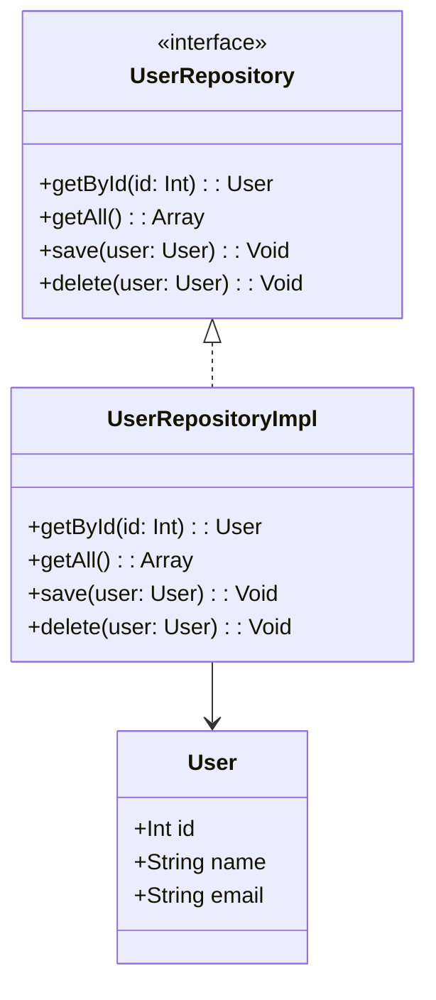

## 5.10 Data Access Patterns in Haxe

In the realm of software development, managing data persistence and retrieval is crucial for building robust applications. Haxe, with its cross-platform capabilities, provides a unique environment for implementing data access patterns that abstract over various data storage mechanisms. In this section, we will delve into three key data access patterns: the Repository Pattern, the Data Mapper Pattern, and the Active Record Pattern. We will explore their implementation in Haxe, discuss use cases, and provide examples to illustrate their application in real-world scenarios.

### Managing Data Persistence and Retrieval

Data access patterns are essential for abstracting the complexities of data storage and retrieval, allowing developers to focus on business logic rather than the intricacies of database interactions. These patterns provide a structured approach to managing data, ensuring that applications are maintainable, scalable, and adaptable to different storage backends.

#### Implementing Data Access in Haxe

Let's explore how we can implement these data access patterns in Haxe, leveraging its unique features to create efficient and maintainable code.

#### Repository Pattern

**Intent:** The Repository Pattern is designed to encapsulate data access logic, providing a clean separation between the domain and data mapping layers. It acts as an intermediary between the application and the data source, offering a collection-like interface for accessing domain objects.

**Key Participants:**

- **Repository Interface:** Defines the operations for accessing domain objects.
- **Concrete Repository:** Implements the repository interface, handling data access logic.
- **Domain Objects:** Represent the entities within the application.

**Applicability:** Use the Repository Pattern when you need to abstract data access logic, allowing for easy testing and maintenance of the application.

**Sample Code Snippet:**

```haxe
// Define a domain object
class User {
    public var id:Int;
    public var name:String;
    public var email:String;

    public function new(id:Int, name:String, email:String) {
        this.id = id;
        this.name = name;
        this.email = email;
    }
}

// Define a repository interface
interface UserRepository {
    function getById(id:Int):User;
    function getAll():Array<User>;
    function save(user:User):Void;
    function delete(user:User):Void;
}

// Implement the repository interface
class UserRepositoryImpl implements UserRepository {
    private var users:Array<User> = [];

    public function new() {}

    public function getById(id:Int):User {
        return users.find(user -> user.id == id);
    }

    public function getAll():Array<User> {
        return users;
    }

    public function save(user:User):Void {
        users.push(user);
    }

    public function delete(user:User):Void {
        users.remove(user);
    }
}
```

**Design Considerations:** The Repository Pattern is ideal for applications that require a clear separation between business logic and data access. It simplifies testing by allowing mock implementations of the repository interface.

**Try It Yourself:** Experiment with the code by adding methods to update user information or filter users based on specific criteria.

#### Data Mapper Pattern

**Intent:** The Data Mapper Pattern is used to translate between in-memory objects and database structures. It separates the domain logic from data access logic, ensuring that domain objects are not aware of the database.

**Key Participants:**

- **Data Mapper:** Handles the mapping between domain objects and database tables.
- **Domain Objects:** Represent the entities within the application.
- **Database Tables:** Store the data in a structured format.

**Applicability:** Use the Data Mapper Pattern when you need to maintain a strict separation between domain logic and data access logic, especially in complex applications.

**Sample Code Snippet:**

```haxe
// Define a domain object
class Product {
    public var id:Int;
    public var name:String;
    public var price:Float;

    public function new(id:Int, name:String, price:Float) {
        this.id = id;
        this.name = name;
        this.price = price;
    }
}

// Define a data mapper interface
interface ProductMapper {
    function find(id:Int):Product;
    function findAll():Array<Product>;
    function insert(product:Product):Void;
    function update(product:Product):Void;
    function delete(product:Product):Void;
}

// Implement the data mapper interface
class ProductMapperImpl implements ProductMapper {
    private var db:Database; // Assume a Database class is defined elsewhere

    public function new(db:Database) {
        this.db = db;
    }

    public function find(id:Int):Product {
        var result = db.query("SELECT * FROM products WHERE id = ?", [id]);
        return new Product(result.id, result.name, result.price);
    }

    public function findAll():Array<Product> {
        var results = db.query("SELECT * FROM products");
        return results.map(result -> new Product(result.id, result.name, result.price));
    }

    public function insert(product:Product):Void {
        db.execute("INSERT INTO products (name, price) VALUES (?, ?)", [product.name, product.price]);
    }

    public function update(product:Product):Void {
        db.execute("UPDATE products SET name = ?, price = ? WHERE id = ?", [product.name, product.price, product.id]);
    }

    public function delete(product:Product):Void {
        db.execute("DELETE FROM products WHERE id = ?", [product.id]);
    }
}
```

**Design Considerations:** The Data Mapper Pattern is suitable for applications with complex domain logic that should remain independent of data access concerns. It provides flexibility in changing the database schema without affecting the domain model.

**Try It Yourself:** Modify the code to include additional fields in the `Product` class and update the data mapper methods accordingly.

#### Active Record Pattern

**Intent:** The Active Record Pattern combines data access and domain logic within a single object. Each domain object is responsible for its own persistence, simplifying the interaction with the database.

**Key Participants:**

- **Active Record:** Represents a domain object that includes data access methods.
- **Database Tables:** Store the data in a structured format.

**Applicability:** Use the Active Record Pattern when you need a simple and straightforward approach to data access, especially in applications with a small number of domain objects.

**Sample Code Snippet:**

```haxe
// Define an active record class
class Order {
    public var id:Int;
    public var customerName:String;
    public var totalAmount:Float;

    public function new(id:Int, customerName:String, totalAmount:Float) {
        this.id = id;
        this.customerName = customerName;
        this.totalAmount = totalAmount;
    }

    public static function find(id:Int):Order {
        var result = Database.query("SELECT * FROM orders WHERE id = ?", [id]);
        return new Order(result.id, result.customerName, result.totalAmount);
    }

    public function save():Void {
        if (this.id == null) {
            Database.execute("INSERT INTO orders (customerName, totalAmount) VALUES (?, ?)", [this.customerName, this.totalAmount]);
        } else {
            Database.execute("UPDATE orders SET customerName = ?, totalAmount = ? WHERE id = ?", [this.customerName, this.totalAmount, this.id]);
        }
    }

    public function delete():Void {
        Database.execute("DELETE FROM orders WHERE id = ?", [this.id]);
    }
}
```

**Design Considerations:** The Active Record Pattern is best suited for applications with simple domain models. It can lead to tight coupling between domain logic and data access, making it less flexible for complex applications.

**Try It Yourself:** Extend the `Order` class to include methods for calculating discounts or taxes, and update the database interactions accordingly.

### Use Cases and Examples

Data access patterns are widely used in various applications, from database-driven systems to cross-platform storage solutions. Let's explore some common use cases and examples.

#### Database Applications

In database applications, data access patterns play a crucial role in managing interactions with SQL or NoSQL databases. By abstracting the data access logic, these patterns enable developers to focus on business requirements rather than database intricacies.

**Example:** Implementing a Repository Pattern for a SQL database allows developers to switch to a NoSQL database with minimal changes to the application code.

#### Cross-Platform Storage

Haxe's cross-platform capabilities make it an excellent choice for applications that require data storage across different platforms. Data access patterns provide a consistent interface for interacting with various storage backends, such as local files, cloud storage, or in-memory databases.

**Example:** Using the Data Mapper Pattern to abstract over different storage backends ensures that the application can easily adapt to changes in storage requirements.

### Visualizing Data Access Patterns

To better understand the relationships and interactions within data access patterns, let's visualize the Repository Pattern using a class diagram.



**Diagram Description:** This class diagram illustrates the structure of the Repository Pattern, showing the relationship between the `UserRepository` interface, its implementation `UserRepositoryImpl`, and the `User` domain object.

### References and Links

- [Repository Pattern on Wikipedia](https://en.wikipedia.org/wiki/Repository_pattern)
- [Data Mapper Pattern on Martin Fowler's Website](https://martinfowler.com/eaaCatalog/dataMapper.html)
- [Active Record Pattern on Wikipedia](https://en.wikipedia.org/wiki/Active_record_pattern)

### Knowledge Check

To reinforce your understanding of data access patterns in Haxe, consider the following questions:

- How does the Repository Pattern help in abstracting data access logic?
- What are the advantages of using the Data Mapper Pattern in complex applications?
- In what scenarios is the Active Record Pattern most effective?

### Embrace the Journey

Remember, mastering data access patterns is a journey that requires practice and experimentation. As you explore these patterns in Haxe, you'll gain valuable insights into managing data persistence and retrieval across platforms. Keep experimenting, stay curious, and enjoy the journey!

## Quiz Time!



### What is the primary intent of the Repository Pattern?

- [x] To encapsulate data access logic and provide a collection-like interface for domain objects.
- [ ] To combine data access and domain logic within a single object.
- [ ] To translate between in-memory objects and database structures.
- [ ] To manage transactions in distributed systems.

> **Explanation:** The Repository Pattern is designed to encapsulate data access logic, providing a clean separation between the domain and data mapping layers.

### Which pattern is best suited for applications with complex domain logic?

- [ ] Active Record Pattern
- [x] Data Mapper Pattern
- [ ] Repository Pattern
- [ ] Singleton Pattern

> **Explanation:** The Data Mapper Pattern is suitable for applications with complex domain logic that should remain independent of data access concerns.

### What is a key characteristic of the Active Record Pattern?

- [ ] It separates domain logic from data access logic.
- [x] It combines data access and domain logic within a single object.
- [ ] It provides a collection-like interface for domain objects.
- [ ] It abstracts over different storage backends.

> **Explanation:** The Active Record Pattern combines data access and domain logic within a single object, simplifying the interaction with the database.

### In the Repository Pattern, what is the role of the Concrete Repository?

- [x] To implement the repository interface and handle data access logic.
- [ ] To define the operations for accessing domain objects.
- [ ] To represent the entities within the application.
- [ ] To store data in a structured format.

> **Explanation:** The Concrete Repository implements the repository interface, handling data access logic.

### Which pattern is ideal for applications with a small number of domain objects?

- [x] Active Record Pattern
- [ ] Data Mapper Pattern
- [ ] Repository Pattern
- [ ] Observer Pattern

> **Explanation:** The Active Record Pattern is best suited for applications with simple domain models and a small number of domain objects.

### What is a common use case for data access patterns?

- [x] Interacting with SQL or NoSQL databases.
- [ ] Managing user interfaces.
- [ ] Handling concurrency in applications.
- [ ] Implementing security protocols.

> **Explanation:** Data access patterns are widely used in database applications to manage interactions with SQL or NoSQL databases.

### How does the Data Mapper Pattern benefit applications?

- [x] By maintaining a strict separation between domain logic and data access logic.
- [ ] By combining data access and domain logic within a single object.
- [ ] By providing a collection-like interface for domain objects.
- [ ] By managing transactions in distributed systems.

> **Explanation:** The Data Mapper Pattern maintains a strict separation between domain logic and data access logic, providing flexibility in changing the database schema without affecting the domain model.

### What is the primary advantage of using the Repository Pattern?

- [x] It abstracts data access logic, allowing for easy testing and maintenance.
- [ ] It combines data access and domain logic within a single object.
- [ ] It translates between in-memory objects and database structures.
- [ ] It manages transactions in distributed systems.

> **Explanation:** The Repository Pattern abstracts data access logic, providing a clean separation between business logic and data access, which simplifies testing and maintenance.

### Which pattern is most effective for cross-platform storage solutions?

- [ ] Active Record Pattern
- [x] Data Mapper Pattern
- [ ] Repository Pattern
- [ ] Singleton Pattern

> **Explanation:** The Data Mapper Pattern provides a consistent interface for interacting with various storage backends, making it effective for cross-platform storage solutions.

### True or False: The Active Record Pattern is suitable for applications with complex domain models.

- [ ] True
- [x] False

> **Explanation:** The Active Record Pattern is best suited for applications with simple domain models, as it can lead to tight coupling between domain logic and data access.


