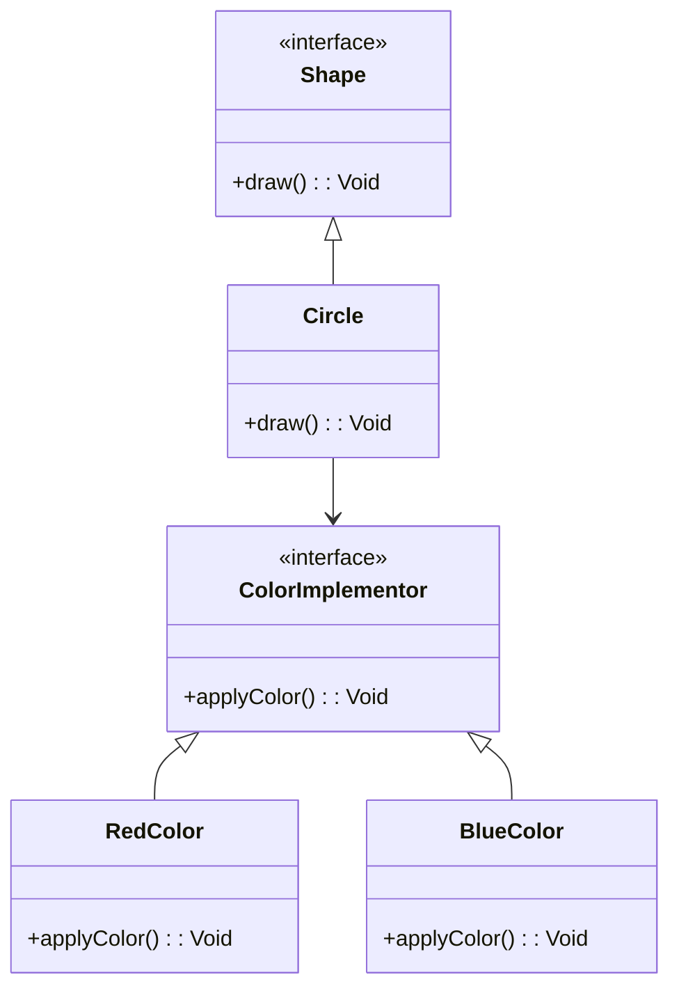

## 5.2 Bridge Pattern

The Bridge Pattern is a structural design pattern that plays a crucial role in software engineering by decoupling abstraction from implementation, allowing both to vary independently. This pattern is particularly useful in cross-platform development, where you need to separate the high-level logic from platform-specific details. In this section, we will explore how to implement the Bridge Pattern in Haxe, a language known for its cross-platform capabilities, and examine practical use cases and examples.

### Intent of the Bridge Pattern

The primary intent of the Bridge Pattern is to separate an abstraction from its implementation so that both can evolve independently. This separation is achieved by creating two distinct hierarchies: one for the abstraction and another for the implementation. By doing so, you can change the abstraction or the implementation without affecting the other, providing greater flexibility and scalability.

### Key Participants

- **Abstraction**: Defines the abstraction's interface and maintains a reference to an object of type Implementor.
- **Refined Abstraction**: Extends the interface defined by Abstraction.
- **Implementor**: Defines the interface for implementation classes.
- **Concrete Implementor**: Implements the Implementor interface and provides concrete implementations.

### Implementing Bridge in Haxe

Let's delve into how we can implement the Bridge Pattern in Haxe by defining the abstraction and implementor hierarchies and connecting them.

#### Abstraction Hierarchy

The abstraction hierarchy involves defining an interface or abstract class that represents the abstraction. This interface will include methods that the client will use.

```haxe
// Abstraction
interface Shape {
    function draw():Void;
}

// Refined Abstraction
class Circle implements Shape {
    private var color: ColorImplementor;
    private var radius: Int;

    public function new(color: ColorImplementor, radius: Int) {
        this.color = color;
        this.radius = radius;
    }

    public function draw():Void {
        color.applyColor();
        trace("Drawing Circle with radius: " + radius);
    }
}
```

In this example, `Shape` is the abstraction interface, and `Circle` is a refined abstraction that implements the `Shape` interface. The `Circle` class uses a `ColorImplementor` to apply color, demonstrating the separation of abstraction from implementation.

#### Implementor Hierarchy

The implementor hierarchy involves defining an interface for the implementation classes. These classes provide concrete implementations of the methods defined in the implementor interface.

```haxe
// Implementor
interface ColorImplementor {
    function applyColor():Void;
}

// Concrete Implementor
class RedColor implements ColorImplementor {
    public function new() {}

    public function applyColor():Void {
        trace("Applying Red Color");
    }
}

// Another Concrete Implementor
class BlueColor implements ColorImplementor {
    public function new() {}

    public function applyColor():Void {
        trace("Applying Blue Color");
    }
}
```

Here, `ColorImplementor` is the implementor interface, and `RedColor` and `BlueColor` are concrete implementors that provide specific implementations for applying colors.

#### Connecting the Two Hierarchies

The connection between the abstraction and implementor hierarchies is established through composition. The abstraction holds a reference to the implementor, allowing it to delegate the implementation-specific behavior to the implementor.

```haxe
class Main {
    static public function main() {
        var redCircle: Shape = new Circle(new RedColor(), 10);
        redCircle.draw();

        var blueCircle: Shape = new Circle(new BlueColor(), 15);
        blueCircle.draw();
    }
}
```

In the `Main` class, we create instances of `Circle` with different color implementors (`RedColor` and `BlueColor`). This demonstrates how the abstraction (`Circle`) can vary independently from the implementation (`ColorImplementor`).

### Use Cases and Examples

The Bridge Pattern is particularly useful in scenarios where you need to separate high-level logic from platform-specific details. Let's explore some practical use cases.

#### Cross-Platform GUIs

In cross-platform GUI development, the Bridge Pattern can be used to separate the GUI logic from platform-specific rendering. This allows the GUI logic to remain consistent across platforms while the rendering details can vary.

```haxe
// GUI Abstraction
interface GUIElement {
    function render():Void;
}

// Platform-Specific Implementor
interface Renderer {
    function renderElement():Void;
}

// Concrete Implementor for Windows
class WindowsRenderer implements Renderer {
    public function new() {}

    public function renderElement():Void {
        trace("Rendering on Windows");
    }
}

// Concrete Implementor for Mac
class MacRenderer implements Renderer {
    public function new() {}

    public function renderElement():Void {
        trace("Rendering on Mac");
    }
}

// Refined Abstraction
class Button implements GUIElement {
    private var renderer: Renderer;

    public function new(renderer: Renderer) {
        this.renderer = renderer;
    }

    public function render():Void {
        renderer.renderElement();
        trace("Rendering Button");
    }
}

// Main Application
class Main {
    static public function main() {
        var windowsButton: GUIElement = new Button(new WindowsRenderer());
        windowsButton.render();

        var macButton: GUIElement = new Button(new MacRenderer());
        macButton.render();
    }
}
```

In this example, `GUIElement` is the abstraction interface, and `Button` is a refined abstraction. `Renderer` is the implementor interface, with `WindowsRenderer` and `MacRenderer` as concrete implementors. This setup allows the button rendering logic to remain consistent while the rendering details vary based on the platform.

#### Device Drivers

The Bridge Pattern can also be applied to abstract hardware interfaces in device drivers. This allows the driver logic to remain consistent while the hardware-specific details can vary.

```haxe
// Device Abstraction
interface Device {
    function operate():Void;
}

// Hardware Implementor
interface HardwareInterface {
    function execute():Void;
}

// Concrete Implementor for Printer
class PrinterInterface implements HardwareInterface {
    public function new() {}

    public function execute():Void {
        trace("Executing Printer Commands");
    }
}

// Concrete Implementor for Scanner
class ScannerInterface implements HardwareInterface {
    public function new() {}

    public function execute():Void {
        trace("Executing Scanner Commands");
    }
}

// Refined Abstraction
class Printer implements Device {
    private var hardware: HardwareInterface;

    public function new(hardware: HardwareInterface) {
        this.hardware = hardware;
    }

    public function operate():Void {
        hardware.execute();
        trace("Operating Printer");
    }
}

// Main Application
class Main {
    static public function main() {
        var printer: Device = new Printer(new PrinterInterface());
        printer.operate();

        var scanner: Device = new Printer(new ScannerInterface());
        scanner.operate();
    }
}
```

In this example, `Device` is the abstraction interface, and `Printer` is a refined abstraction. `HardwareInterface` is the implementor interface, with `PrinterInterface` and `ScannerInterface` as concrete implementors. This setup allows the device operation logic to remain consistent while the hardware-specific details vary.

### Design Considerations

When implementing the Bridge Pattern, consider the following:

- **When to Use**: Use the Bridge Pattern when you need to separate abstraction from implementation, especially in cross-platform scenarios or when dealing with multiple implementations.
- **Flexibility**: The pattern provides flexibility by allowing both the abstraction and implementation to evolve independently.
- **Complexity**: The pattern can introduce complexity by adding additional layers of abstraction and implementation. Ensure that the benefits outweigh the complexity.

### Differences and Similarities

The Bridge Pattern is often confused with the Adapter Pattern. While both patterns involve interfaces and implementations, they serve different purposes:

- **Bridge Pattern**: Decouples abstraction from implementation, allowing both to vary independently.
- **Adapter Pattern**: Allows incompatible interfaces to work together by converting one interface into another.

### Visualizing the Bridge Pattern

To better understand the Bridge Pattern, let's visualize the relationship between the abstraction and implementor hierarchies using a class diagram.



In this diagram, `Shape` is the abstraction interface, and `Circle` is a refined abstraction. `ColorImplementor` is the implementor interface, with `RedColor` and `BlueColor` as concrete implementors. The arrow from `Circle` to `ColorImplementor` represents the composition relationship, where `Circle` holds a reference to `ColorImplementor`.

### Try It Yourself

To deepen your understanding of the Bridge Pattern, try modifying the code examples:

- Add a new shape, such as `Rectangle`, and implement the `Shape` interface.
- Create a new color implementor, such as `GreenColor`, and implement the `ColorImplementor` interface.
- Experiment with different combinations of shapes and colors to see how the Bridge Pattern allows for flexibility and scalability.

### References and Links

For further reading on the Bridge Pattern and design patterns in general, consider the following resources:

- [Design Patterns: Elements of Reusable Object-Oriented Software](https://en.wikipedia.org/wiki/Design_Patterns) by Erich Gamma, Richard Helm, Ralph Johnson, and John Vlissides.
- [Refactoring Guru: Bridge Pattern](https://refactoring.guru/design-patterns/bridge)
- [Haxe Language Reference](https://haxe.org/manual/)

### Knowledge Check

To reinforce your understanding of the Bridge Pattern, consider the following questions:

- What is the primary intent of the Bridge Pattern?
- How does the Bridge Pattern differ from the Adapter Pattern?
- What are some practical use cases for the Bridge Pattern?

### Embrace the Journey

Remember, mastering design patterns is a journey. As you progress, you'll gain a deeper understanding of how to apply these patterns to create flexible, scalable, and maintainable software. Keep experimenting, stay curious, and enjoy the journey!

## Quiz Time!



### What is the primary intent of the Bridge Pattern?

- [x] To decouple abstraction from implementation, allowing them to vary independently.
- [ ] To convert one interface into another.
- [ ] To provide a simplified interface to a complex system.
- [ ] To ensure a class has only one instance.

> **Explanation:** The Bridge Pattern aims to decouple abstraction from implementation, allowing both to vary independently.

### Which of the following is a key participant in the Bridge Pattern?

- [x] Abstraction
- [ ] Adapter
- [ ] Singleton
- [ ] Facade

> **Explanation:** The key participants in the Bridge Pattern include Abstraction, Refined Abstraction, Implementor, and Concrete Implementor.

### How does the Bridge Pattern differ from the Adapter Pattern?

- [x] The Bridge Pattern decouples abstraction from implementation, while the Adapter Pattern allows incompatible interfaces to work together.
- [ ] The Bridge Pattern ensures a class has only one instance, while the Adapter Pattern provides a simplified interface.
- [ ] The Bridge Pattern provides a simplified interface, while the Adapter Pattern decouples abstraction from implementation.
- [ ] The Bridge Pattern allows incompatible interfaces to work together, while the Adapter Pattern ensures a class has only one instance.

> **Explanation:** The Bridge Pattern decouples abstraction from implementation, while the Adapter Pattern allows incompatible interfaces to work together.

### In the Bridge Pattern, what is the role of the Implementor?

- [x] To define the interface for implementation classes.
- [ ] To convert one interface into another.
- [ ] To provide a simplified interface to a complex system.
- [ ] To ensure a class has only one instance.

> **Explanation:** The Implementor defines the interface for implementation classes in the Bridge Pattern.

### Which of the following is a practical use case for the Bridge Pattern?

- [x] Cross-platform GUIs
- [ ] Singleton management
- [ ] Simplifying complex systems
- [ ] Ensuring a class has only one instance

> **Explanation:** The Bridge Pattern is useful for cross-platform GUIs, where you need to separate GUI logic from platform-specific rendering.

### What is the benefit of using the Bridge Pattern?

- [x] It provides flexibility by allowing both the abstraction and implementation to evolve independently.
- [ ] It ensures a class has only one instance.
- [ ] It provides a simplified interface to a complex system.
- [ ] It allows incompatible interfaces to work together.

> **Explanation:** The Bridge Pattern provides flexibility by allowing both the abstraction and implementation to evolve independently.

### What is a potential drawback of the Bridge Pattern?

- [x] It can introduce complexity by adding additional layers of abstraction and implementation.
- [ ] It ensures a class has only one instance.
- [ ] It provides a simplified interface to a complex system.
- [ ] It allows incompatible interfaces to work together.

> **Explanation:** The Bridge Pattern can introduce complexity by adding additional layers of abstraction and implementation.

### In the Bridge Pattern, what is the role of the Refined Abstraction?

- [x] To extend the interface defined by Abstraction.
- [ ] To convert one interface into another.
- [ ] To provide a simplified interface to a complex system.
- [ ] To ensure a class has only one instance.

> **Explanation:** The Refined Abstraction extends the interface defined by Abstraction in the Bridge Pattern.

### Which of the following is a concrete implementor in the provided code example?

- [x] RedColor
- [ ] Shape
- [ ] Circle
- [ ] GUIElement

> **Explanation:** `RedColor` is a concrete implementor in the provided code example, implementing the `ColorImplementor` interface.

### True or False: The Bridge Pattern is often confused with the Adapter Pattern because both involve interfaces and implementations.

- [x] True
- [ ] False

> **Explanation:** True. The Bridge Pattern is often confused with the Adapter Pattern because both involve interfaces and implementations, but they serve different purposes.


