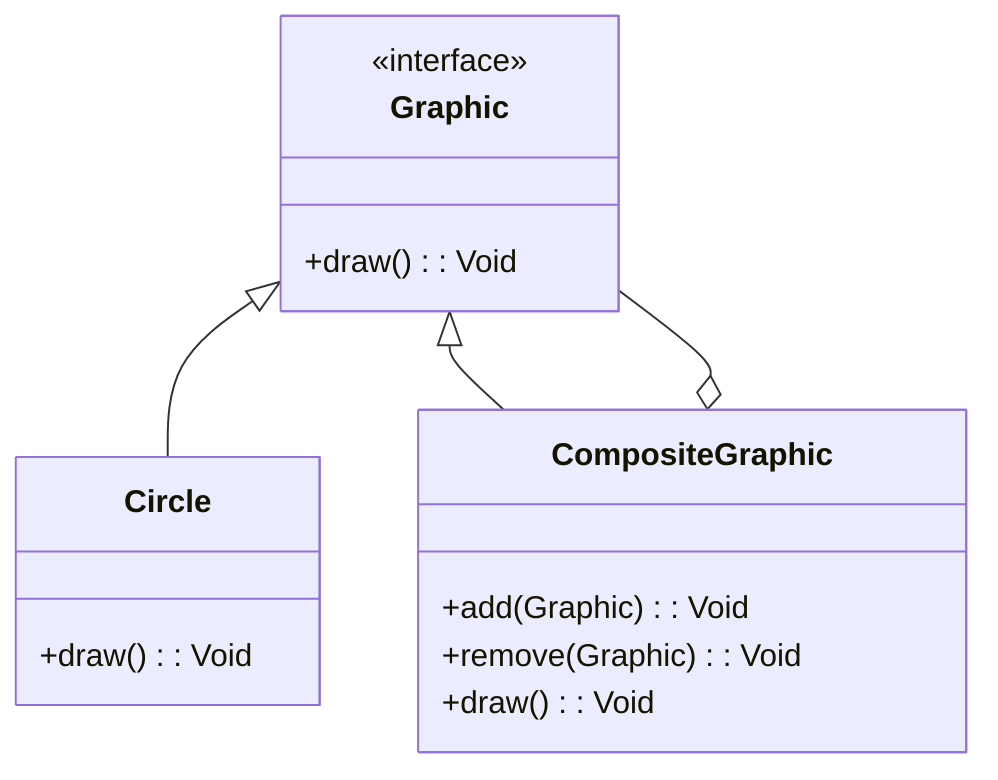

## 5.3 Composite Pattern

The Composite Pattern is a structural design pattern that allows you to compose objects into tree structures to represent part-whole hierarchies. This pattern lets clients treat individual objects and compositions of objects uniformly. In this section, we will delve into the Composite Pattern, its implementation in Haxe, and explore practical use cases and examples.

### Intent

The primary intent of the Composite Pattern is to allow clients to treat individual objects and compositions of objects uniformly. This is particularly useful when you want to represent part-whole hierarchies, such as UI component trees or file system structures.

### Key Participants

1. **Component Interface**: Defines the interface for all objects in the composition, both leaf and composite nodes.
2. **Leaf Nodes**: Implements the component interface and represents objects without children.
3. **Composite Nodes**: Implements the component interface, holds child components, and implements operations on child components.

### Applicability

Use the Composite Pattern when:
- You want to represent part-whole hierarchies of objects.
- You want clients to be able to ignore the difference between compositions of objects and individual objects.
- You need to create a tree structure of objects and allow clients to interact with these objects uniformly.

### Implementing Composite in Haxe

Let's explore how to implement the Composite Pattern in Haxe by defining a component interface, leaf nodes, and composite nodes.

#### Component Interface

The component interface defines operations for both leaves and composites. In Haxe, we can define this interface using an abstract class or an interface.

```haxe
interface Graphic {
    public function draw():Void;
}
```

#### Leaf Nodes

Leaf nodes implement the component interface and represent objects without children. Here is an example of a leaf node in Haxe:

```haxe
class Circle implements Graphic {
    public function new() {}

    public function draw():Void {
        trace("Drawing a Circle");
    }
}
```

#### Composite Nodes

Composite nodes hold child components and implement operations on these children. Here's how you can define a composite node in Haxe:

```haxe
class CompositeGraphic implements Graphic {
    private var children:Array<Graphic>;

    public function new() {
        children = new Array<Graphic>();
    }

    public function add(graphic:Graphic):Void {
        children.push(graphic);
    }

    public function remove(graphic:Graphic):Void {
        children.remove(graphic);
    }

    public function draw():Void {
        for (child in children) {
            child.draw();
        }
    }
}
```

### Use Cases and Examples

The Composite Pattern is widely used in scenarios where you need to represent part-whole hierarchies. Let's explore some common use cases and examples.

#### UI Component Trees

One of the most common use cases for the Composite Pattern is building user interfaces with nested components. In a UI component tree, each component can be a leaf or a composite, allowing for complex UI structures.

```haxe
class Button implements Graphic {
    public function new() {}

    public function draw():Void {
        trace("Drawing a Button");
    }
}

class Window {
    private var content:CompositeGraphic;

    public function new() {
        content = new CompositeGraphic();
    }

    public function addComponent(component:Graphic):Void {
        content.add(component);
    }

    public function draw():Void {
        content.draw();
    }
}

class Main {
    static function main() {
        var window = new Window();
        window.addComponent(new Circle());
        window.addComponent(new Button());
        window.draw();
    }
}
```

#### File System Structures

Another common use case is representing file system structures, where files are leaf nodes and directories are composite nodes.

```haxe
class File implements Graphic {
    private var name:String;

    public function new(name:String) {
        this.name = name;
    }

    public function draw():Void {
        trace("File: " + name);
    }
}

class Directory implements Graphic {
    private var name:String;
    private var children:Array<Graphic>;

    public function new(name:String) {
        this.name = name;
        children = new Array<Graphic>();
    }

    public function add(graphic:Graphic):Void {
        children.push(graphic);
    }

    public function remove(graphic:Graphic):Void {
        children.remove(graphic);
    }

    public function draw():Void {
        trace("Directory: " + name);
        for (child in children) {
            child.draw();
        }
    }
}

class FileSystem {
    static function main() {
        var root = new Directory("root");
        var home = new Directory("home");
        var file1 = new File("file1.txt");
        var file2 = new File("file2.txt");

        root.add(home);
        home.add(file1);
        home.add(file2);

        root.draw();
    }
}
```

### Design Considerations

When implementing the Composite Pattern, consider the following:

- **Uniformity**: Ensure that the component interface is consistent across leaf and composite nodes.
- **Efficiency**: Be mindful of the performance implications of traversing large composite structures.
- **Flexibility**: Design the component interface to accommodate future extensions or modifications.

### Differences and Similarities

The Composite Pattern is often confused with the Decorator Pattern. While both involve tree structures, the Composite Pattern focuses on part-whole hierarchies, whereas the Decorator Pattern focuses on adding behavior to individual objects.

### Visualizing Composite Pattern

To better understand the Composite Pattern, let's visualize it using a class diagram.



This diagram illustrates the relationship between the component interface, leaf nodes, and composite nodes.

### Try It Yourself

Experiment with the Composite Pattern by modifying the code examples:

- Add more shapes, such as rectangles or triangles, to the UI component tree.
- Implement additional operations, such as resizing or moving components.
- Create a more complex file system structure with nested directories.

### References and Links

- [Design Patterns: Elements of Reusable Object-Oriented Software](https://en.wikipedia.org/wiki/Design_Patterns) - The classic book on design patterns.
- [Haxe Manual](https://haxe.org/manual/) - Official Haxe documentation.
- [MDN Web Docs](https://developer.mozilla.org/en-US/docs/Web/JavaScript/Guide/Details_of_the_Object_Model) - Detailed guide on object models.

### Knowledge Check

- What is the primary intent of the Composite Pattern?
- How does the Composite Pattern differ from the Decorator Pattern?
- What are some common use cases for the Composite Pattern?

### Embrace the Journey

Remember, mastering design patterns is a journey. As you continue to explore and implement these patterns, you'll gain a deeper understanding of software architecture and design. Keep experimenting, stay curious, and enjoy the journey!

## Quiz Time!



### What is the primary intent of the Composite Pattern?

- [x] To allow clients to treat individual objects and compositions of objects uniformly.
- [ ] To add behavior to individual objects dynamically.
- [ ] To encapsulate a request as an object.
- [ ] To define a family of algorithms.

> **Explanation:** The Composite Pattern allows clients to treat individual objects and compositions of objects uniformly, making it ideal for representing part-whole hierarchies.

### Which of the following is a key participant in the Composite Pattern?

- [x] Component Interface
- [x] Leaf Nodes
- [x] Composite Nodes
- [ ] Singleton

> **Explanation:** The key participants in the Composite Pattern are the Component Interface, Leaf Nodes, and Composite Nodes.

### In the Composite Pattern, what do leaf nodes represent?

- [x] Objects without children
- [ ] Objects with children
- [ ] The root of the tree
- [ ] The entire tree structure

> **Explanation:** Leaf nodes represent objects without children in the Composite Pattern.

### What is a common use case for the Composite Pattern?

- [x] UI Component Trees
- [x] File System Structures
- [ ] Singleton Management
- [ ] Algorithm Encapsulation

> **Explanation:** Common use cases for the Composite Pattern include UI component trees and file system structures.

### How does the Composite Pattern differ from the Decorator Pattern?

- [x] Composite focuses on part-whole hierarchies, while Decorator focuses on adding behavior.
- [ ] Composite adds behavior, while Decorator focuses on part-whole hierarchies.
- [ ] Both patterns are identical.
- [ ] Neither pattern involves tree structures.

> **Explanation:** The Composite Pattern focuses on part-whole hierarchies, whereas the Decorator Pattern focuses on adding behavior to individual objects.

### What is the role of the Composite Node in the Composite Pattern?

- [x] To hold child components and implement operations on them.
- [ ] To represent objects without children.
- [ ] To encapsulate a request as an object.
- [ ] To define a family of algorithms.

> **Explanation:** The Composite Node holds child components and implements operations on them in the Composite Pattern.

### What is a potential design consideration when implementing the Composite Pattern?

- [x] Uniformity across leaf and composite nodes
- [x] Efficiency in traversing large structures
- [ ] Singleton management
- [ ] Algorithm encapsulation

> **Explanation:** When implementing the Composite Pattern, consider uniformity across leaf and composite nodes and efficiency in traversing large structures.

### Which of the following is true about the Composite Pattern?

- [x] It allows for the creation of tree structures.
- [x] It is useful for representing part-whole hierarchies.
- [ ] It is primarily used for adding behavior to objects.
- [ ] It is identical to the Decorator Pattern.

> **Explanation:** The Composite Pattern allows for the creation of tree structures and is useful for representing part-whole hierarchies.

### What is the purpose of the Component Interface in the Composite Pattern?

- [x] To define operations for both leaves and composites
- [ ] To represent objects without children
- [ ] To encapsulate a request as an object
- [ ] To define a family of algorithms

> **Explanation:** The Component Interface defines operations for both leaves and composites in the Composite Pattern.

### True or False: The Composite Pattern is ideal for representing part-whole hierarchies.

- [x] True
- [ ] False

> **Explanation:** True. The Composite Pattern is ideal for representing part-whole hierarchies, allowing clients to treat individual objects and compositions uniformly.


